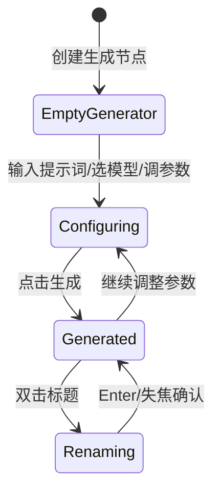

# Reelay Canvas 当前产品与实现说明

更新日期：2026-07-08

## 1. 产品定位

Reelay Canvas 是面向 AIGC 创作流程的无限画布原型。它不是传统表单式生成工具，而是把“生成节点、参考素材、媒体结果、Agent 协作”放在同一块可缩放画布中，让用户用空间关系组织创作。

当前阶段的目标不是完成真实生成能力，而是验证：

- 生成节点在画布中的形态是否足够清晰。
- 图片、视频、音频素材是否能作为输入对象被组织。
- 生成节点与素材节点的信息层级是否符合创作平台的使用习惯。
- Agent 对话栏是否能作为画布旁的辅助创作入口。
- 浅色/深色模式下的视觉基调是否稳定。

## 2. 当前状态边界

这是一个前端原型：

- 没有真实 AIGC API。
- 没有账号、项目存储、云端素材库。
- 没有打包、部署、路由和后端服务。
- 所有节点数据都存在浏览器当前运行内存中，刷新后会丢失。
- “生成”是模拟行为，用于验证生成后的媒体状态、标题和规格展示。

这意味着当前项目更接近“可交互产品样机”，不是生产应用。

## 3. 信息架构


## 4. 主画布设计

画布是产品的主工作区。当前实现包括：

- 初始空状态：中心显示轻量的“+”和创建引导。
- 双击画布：创建生成节点。
- 鼠标滚轮：在画布空白区平移画布；`Ctrl/Cmd + 滚轮` 以鼠标所在位置为缩放中心。
- 当鼠标位于模型列表、参数面板、素材菜单、Agent 面板等功能区时，滚轮只作用于该功能区，不触发画布平移或缩放。
- 当鼠标位于 Logo、节点输入区、模型列表、媒体工具栏等功能区时，`Ctrl/Cmd + 滚轮` 同时阻止画布缩放和浏览器页面缩放，避免误操作改变整个网页比例。
- 空格拖拽：平移画布。
- 中键拖拽：平移画布。
- 中键或空格平移优先级高于节点拖拽，即使鼠标起点在媒体节点上也应移动画布。
- 空白拖拽：框选多个节点。
- 单选或框选节点后，节点媒体框外侧显示中性色选择轮廓与轻量 halo；图片/视频/音频本身的边框颜色只表达媒体类型，生成节点输入面板不额外高亮。
- 缩放感知网格：近景可见，远景淡出，分别适配浅色和深色模式。
- 左下角画布工具组：包含快捷键、小地图、画布比例三个入口。
- 画布比例：实时显示当前缩放百分比，点击后可执行放大、缩小、缩放至 50%、100%、200%。
- 小地图：根据节点世界坐标生成缩略分布图，并显示当前视口矩形；拖动视口矩形或点击小地图区域可实时导航主画布。

设计意图：

- 网格是空间感辅助，不应该压过节点内容。
- 空状态是轻量引导，不作为品牌主视觉。
- 节点被点击时会提升层级，避免多个节点重叠时遮挡当前工作对象。
- 小地图是导航控件，不承担内容预览；它只表达空间位置、节点分布和当前可视区域。

## 5. 左下角工具区

左下角当前有两组同排工具：

- 资产与个人：资产库、个人。
- 画布工具：快捷键、小地图、画布比例。

生成节点不再设置常驻添加按钮；用户通过双击画布或空状态入口创建节点。资产库展开后，两组底部工具平移到面板右侧，保持入口与当前面板的空间关联。

设计原则：

- 删除不暴露为常驻按钮，保持画布工具简洁。
- 个人入口承担轻量账户信息与积分感知；外观是账号菜单中的子层。

## 6. 项目标题

左上角显示项目名，默认是 `Untitled`。

当前交互：

- 双击标题可改名。
- Enter 确认。
- Escape 取消。
- 空值会回退为 `Untitled`。

后续如果加入项目存储，这个字段应变成项目元数据的一部分。

## 7. 生成节点

用户描述中“图像节点/视频节点”在产品语言中统一称为“生成节点”。它根据选定模型的类型呈现为图片、视频或音频生成能力。

### 7.1 初始状态

生成节点初始不显示媒体标题。原因是此时它还没有生成结果，显示“未命名图片”会让用户误以为已经存在一个输出媒体。

初始状态包含：

- 媒体预览框。
- 提示词输入面板。
- 添加素材入口。
- 模型选择。
- 参数选择。
- 生成数量。
- 积分 + 生成按钮。

### 7.2 模型选择

当前示例模型：

| 类型 | 模型 |
| --- | --- |
| 图片 | GPT Image 2、Nano Banana Pro、Nano Banana 2、Midjourney V8.1/V7、Niji 7、Seedream 5.0 Lite |
| 视频 | Seedance 2.0/Fast/Mini、Kling Video 3.0/Omni、Veo 3.1 |
| 音频 | Suno v5.5、Eleven Music v2、Eleven Sound Effects v2、Stable Audio |

模型选择逻辑：

- 不是先选择“图片/视频/音频模式”，而是先选模型。
- 当用户确认某个模型后，节点类型随模型类型变化。
- 新建节点默认沿用上一次生成节点的模式和参数，减少重复切换。
- 图片、视频、音频模型位于同一个连续滚动列表中，并用分组标题区分。
- 顶部分类栏用于快速定位；滚动进入新分组时，分类指示器会平滑滑动到对应类别。

### 7.3 提示词输入区

- 点击右上角展开按钮只增加纵向空间，不改变输入区基础宽度，也不会推动媒体框横向位移。
- 长提示词自动换行并向下扩展；达到高度上限后，输入区内部滚动。
- 输入区打开时会根据画布比例做有限度的反向缩放补偿：画布缩小时输入区相对放大，画布放大时输入区相对收紧，保持文字可读性。
- 补偿比例有上下限，不会变成脱离节点的固定屏幕面板。

### 7.4 参数

参数不再按媒体类型写死，而由每个模型的能力表动态提供：

- GPT Image 2 使用官方固定尺寸，不显示虚构的 2K/4K。
- Nano Banana 系列支持 `1K / 2K / 4K`；Midjourney V8.1 支持原生 `1K / 2K`；V7 与 Niji 7 只显示原生 `1K`。
- Seedance Mini 不显示 1080p。
- Veo 3.1 的 `1080p / 4K` 只允许 8 秒，选择画质后时长会自动纠正。
- Veo 3.1 单次只允许生成 1 个结果；其他模型按能力提供 1x、2x 或 4x。
- 音乐与音效模型分别使用符合产品上限的秒/分钟时长档位。

完整能力表和来源见 `docs/model-catalog-notes.md`。

积分显示与生成按钮融合在同一个操作区，避免把不可点击的积分做成独立按钮。
头像下方保留轻量积分徽标，初始可用积分为 `3000`；个人菜单中显示可用积分和累计消耗。当前测试原型只在单次页面生命周期内扣减可用积分并增加累计消耗，刷新页面后重置为 `3000 / 0`。

### 7.5 添加素材

生成节点输入面板内有“素材”入口。

当前支持三类入口：

- 从本地上传。
- 从资产库添加。
- 从画布中选择。

当前实现中：

- 本地上传会把素材加入生成节点上方素材列。
- 从资产库添加会打开与左侧工具栏共用的项目素材面板；选择后加入当前生成节点的素材列。
- 从画布中选择当前仍是模拟素材，用于验证信息结构。
- 点击空白区域时，小菜单会收起。
- 点击生成节点媒体框时，输入面板可展开；点击其他区域可收回。

### 7.6 资产库

左下角资产库是画布媒体输入的统一入口，当前包含五个范围：

- 项目素材：单项目中沉淀的可复用资产。
- 画布文件：当前画布上的全部媒体文件。
- 个人：跨项目的用户全局资产。
- 官方公用库：当前提供公共音效样例。
- 组织空间：同一组织成员共享的资产。

通用能力：

- 支持上传图片、视频、音频。
- 支持全部、图片、视频、音频四种筛选。
- 双击素材或点击素材右下角操作按钮，可把素材加入当前视口中心。
- 素材可以直接从面板拖到画布指定位置；拖到生成节点上时会成为该节点的参考素材。
- 从本地直接拖入画布或生成节点的媒体，也会同步登记到当前项目资产。
- 资产库当前保存在页面运行内存中；本地文件使用浏览器对象地址，刷新页面后不会保留，后续需要由真实上传与项目存储服务替换。

### 7.7 生成后状态

点击生成后，节点进入真实媒体模拟生成流程：

- 提示词为空时，生成入口显示为不可用暗色状态，悬停提示“请输入提示词”，不弹出打断式提醒。
- 生成前检查可用积分是否足够。
- 开始生成时扣减可用积分，并增加累计消耗。
- 节点会短暂显示“生成中”状态。
- 图片结果显示真实在线图片。
- 视频结果显示真实在线视频。
- 音频结果显示真实在线音频，并使用波形播放器。
- 当前模拟素材来源：图片使用按节点 id 生成 seed 的在线图片，因此不同生成节点通常会得到不同图片且同一节点生成后保持稳定；视频和音频当前使用固定公开样例素材，用于验证播放与媒体展示形态。
- 图片结果默认名：`Generated image`。
- 视频结果默认名：`Generated video`。
- 音频结果默认名：`Generated audio`。
- 生成后才显示媒体标题。
- 标题可双击改名。
- 图片右上角显示生成分辨率，例如 `2048 x 1152`。
- 视频右上角显示画质，例如 `480p`。
- 音频右上角显示时长，例如 `0:04`。
- 单选已有内容的媒体节点时，在媒体框上方显示上下文编辑工具栏；空生成节点不显示。

### 7.8 媒体编辑工具栏

- 图片默认提供 HD 放大、裁剪、去背景、加入资产库；扩展菜单包含橡皮擦、调整和旋转。
- 视频默认提供画质增强、裁剪片段、提升帧率、加入资产库。
- 音频默认提供音质增强、裁剪片段、降噪、加入资产库。
- 下载始终位于工具栏右侧并使用图标表达。
- HD/画质/音质增强当前更新原型媒体状态；加入资产库和下载已具备实际交互，其余编辑项保留明确的服务接入入口。
- “自定义工具栏”支持固定或取消固定工具，并可选择是否显示工具名称；设置保存在浏览器本地。



## 8. 媒体素材节点

媒体素材节点代表用户拖入画布的输入对象。本身不显示提示词输入面板，避免和生成节点混淆。

当前支持：

- 图片。
- 视频。
- 音频。

### 8.1 命名规则

本地拖入或上传的文件：

- 左上角显示类型图标 + 文件名。
- 默认去掉文件扩展名作为显示名。
- 可双击改名。
- 改名只影响画布显示名，不改变原始文件名。

### 8.2 规格展示

图片素材：

- 按原始比例展示。
- 元数据加载后显示真实尺寸，例如 `1280 x 720`。

视频素材：

- 按视频原始比例展示。
- 显示视频封面/播放器。
- 元数据加载后显示真实尺寸。

音频素材：

- 不使用浏览器原生长条播放器作为主要视觉。
- 使用中心实时波形形式表达音频媒体。
- 播放时波形轨道会根据音频进度向左推进，固定播放头保持在中线。
- 底部中间提供播放/暂停按钮。
- 播放按钮下方提供类似视频播放器的进度条，便于长音频定位。
- 波形区域采用时间带拖拽：向左拖动波形表示跳过即将播放的内容，播放进度向右推进；向右拖动波形表示回退。
- 底部进度条采用播放器式定位：点击或拖动到某一位置时，直接跳转到对应播放进度。
- 播放时波形有轻微动态反馈。
- 元数据加载后可显示时长。

## 9. 多选与批量操作

当前支持：

- 点击节点选择。
- Shift 点击追加/移除选择。
- 空白拖拽框选多个节点。
- 多节点一起移动。
- Alt 拖拽复制节点，并保留内部参数。
- 多选后显示图标工具条：创建组、布局。
- 布局支持宫格布局、水平布局、垂直布局。
- 创建组后生成可视化组框，组框带标题、边界和组级工具条。
- 点击组内节点时仍选中节点；点击组框空白区域时选中组。
- 选中组框后可拖动整组、手动拉伸组框边界、解组、执行整组生成。
- 组框是独立容器，不再自动按成员节点收缩；节点拖入组框会加入组，拖出组框会移出组。
- 组工具栏不提前显示预计积分；点击整组执行后才检查提示词、计算积分并在确认框中展示，确认后模拟执行。
- Delete/Backspace 删除选中节点；如果选中的是组框，则删除语义为解组。
- 删除后出现撤销提示，可撤销最近一次删除。

后续建议：

- 组标题应支持重命名。
- 排序可继续扩展为等距、左/右/顶/底对齐和按类型排列。
- 撤销系统应从“删除撤销”升级成通用历史栈。

## 10. Agent 对话栏

Agent 对话栏是画布右侧辅助创作入口。

### 10.1 收起状态

默认收起为右下角 Agent logo，避开项目标题和画布主工作区；展开后仍形成右侧完整对话栏。

交互：

- 悬停显示 `Reelay Agent`。
- 点击展开完整侧栏。

### 10.2 展开状态

包含：

- 顶部对话名。
- 新建对话按钮。
- 历史会话下拉。
- 关闭按钮。
- 中间消息区域。
- 底部输入框。
- Agent 模式按钮。
- 模型偏好按钮。
- 发送按钮。
- 输入框支持 Enter 发送、Shift + Enter 换行；消息区可滚动查看历史消息并在发送后滚动到底部。

### 10.3 历史会话

历史下拉包含：

- 搜索框。
- 当前会话。
- 示例历史记录。

当前只是本地静态示例，不连接真实历史数据。

### 10.4 模型偏好

Agent 输入框右侧有模型偏好图标。

打开后：

- 显示 Image / Video 两个分组。
- 模型是偏好池，可多选，不是单选当前模型。
- 点击模型只切换勾选状态，面板不会立即关闭。
- 顶部“模型偏好”、自动开关和分组栏固定不滚动，滚动只发生在模型列表区域。
- 点击面板外部时收起模型偏好面板。
- 悬停按钮可通过 title/aria-label 提示当前已选模型。

## 11. 主题系统

当前支持：

- 深色模式。
- 浅色模式。
- 跟随系统。

主题数据存储在 `localStorage` 中。

设计要点：

- 画布背景不使用纯黑/纯白，而是轻微渐变。
- 网格点根据主题调整颜色。
- 节点、Agent 面板、浮层、按钮都使用 CSS 变量适配主题。

## 12. 当前实现结构

```text
index.html
  定义页面骨架、工具栏、画布层、Agent 对话栏、隐藏文件输入。

styles.css
  定义主题变量、画布视觉、节点样式、Agent 样式、响应式约束。

app.js
  维护应用状态，渲染节点，处理画布交互、文件拖拽、生成模拟、Agent 对话。
```

核心状态在 `state` 对象中：

- 画布：`tx`、`ty`、`scale`。
- 节点：`nodes`、`selectedIds`、`activeId`、`zCounter`。
- 生成默认值：`lastPreset`。
- 操作状态：`action`、`isSpaceDown`。
- 撤销：`undoStack`。
- Agent：`agentOpen`、`agentWidth`、`activeConversationId`、`agentModelId`。
- 主题：`themeMode`。

## 13. 工程质量评估

当前原型符合“快速可交互产品样机”的标准：

- 没有引入复杂依赖，打开成本低。
- 交互逻辑集中，方便快速迭代。
- 样式使用 CSS 变量，浅深模式可维护。
- 节点数据模型已经区分生成节点和素材节点。
- 媒体比例、元数据、命名、选择、撤销等关键体验已经有基础。

但它还不符合生产级前端工程标准：

- JS、CSS 都是单文件，继续扩大后会难以维护。
- 没有组件拆分和模块边界。
- 没有自动化测试。
- 没有构建流程、代码格式化配置、类型检查。
- 数据没有持久化。
- 没有真实服务接口抽象。
- 图标依赖使用 CDN，离线和稳定性需要后续处理。

## 14. 建议下一步

优先级建议：

1. 数据持久化：先做本地保存/恢复，再考虑云端项目。
2. 节点架构拆分：把生成节点、素材节点、Agent、画布操作拆为模块。
3. 引入基础工程化：格式化、lint、简单测试、静态检查。
4. 素材持久化：将当前项目素材面板接入真实上传、云端资产库和项目存储。
5. 通用撤销系统：覆盖移动、复制、参数修改、重命名。
6. 连线/引用关系：如果后续要表达上下文输入输出，再设计连接逻辑。
7. 真正生成接口：把模型列表、参数、积分计算、生成任务状态接入服务。

## 15. 当前产品一句话

Reelay Canvas 当前是一个用于验证 AIGC 创作平台核心交互的无限画布前端原型：用户可以在画布中创建生成节点、组织图片/视频/音频素材、模拟生成结果，并通过右侧 Agent 对话栏获得创作辅助。
