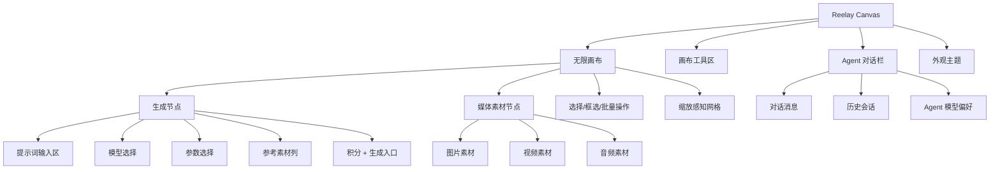
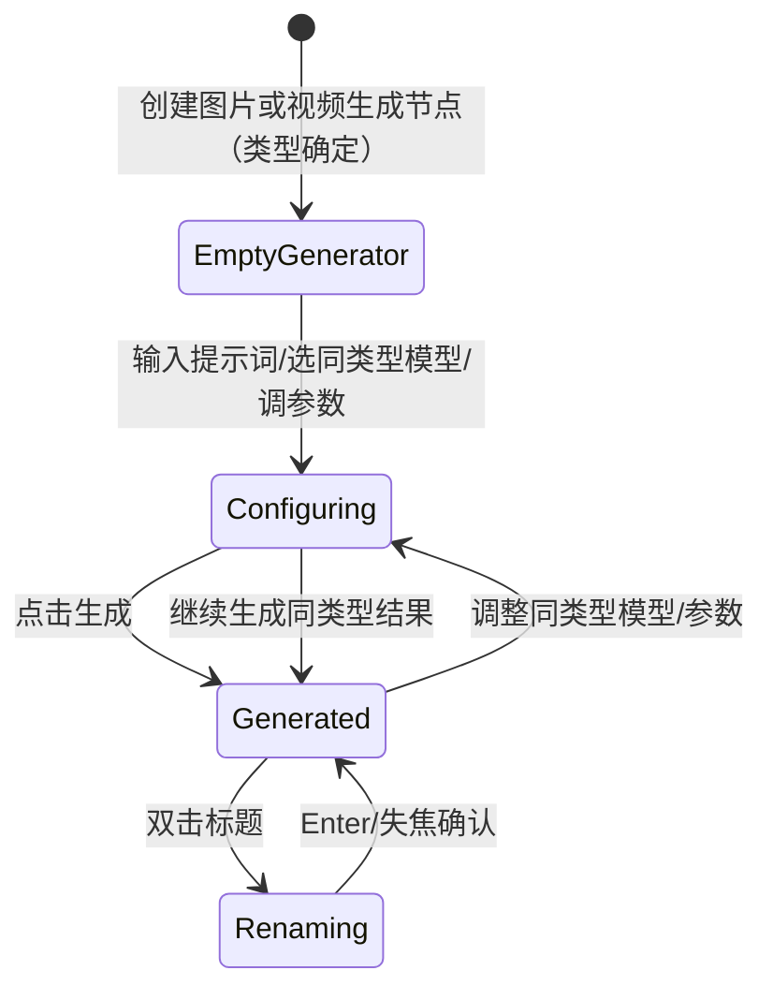

# Reelay Canvas 当前产品与实现说明

更新日期：2026-08-05

## 1. 产品定位

Reelay Canvas 是面向 AIGC 创作流程的无限画布原型。它不是传统表单式生成工具，而是把“生成节点、参考素材、媒体结果、Agent 协作”放在同一块可缩放画布中，让用户用空间关系组织创作。

当前阶段的目标不是完成真实生成能力，而是验证：

- 生成节点在画布中的形态是否足够清晰。
- 图片、视频、音频素材是否能作为输入对象被组织。
- 生成节点与素材节点的信息层级是否符合创作平台的使用习惯。
- Agent 对话栏是否能作为画布旁的辅助创作入口。
- 浅色/深色模式下的视觉基调是否稳定。

## 2. 当前状态边界

这是一个本地可运行的产品原型：

- 没有真实 AIGC API。
- 没有生产账号生命周期、云端素材库或积分账本；项目元数据、演示会话与路由画布文档已持久化到本地 PostgreSQL。公网原型已通过 Vercel 与 Supabase 部署用于评审，但不构成生产可用承诺。
- 本地主链路已经进入 React browser routes：`/app/login`、`/app/w/:workspaceId`、`/app/w/:workspaceId/projects` 和受保护的画布宿主路由。页面通过 HTTP adapters 消费本地共享 API；静态登录 / 主页双轨已经删除，`index.html` 只保留为迁移期旧画布 iframe。
- 十个固定 `.test` 演示账号由服务端校验并使用 HttpOnly Cookie 维持独立会话；这只验证登录、路由保护、单组织成员关系和项目级访问控制，不是正式账号系统。组织角色固定为 `1` 名主账户、`2` 名管理员和 `7` 名成员。
- 用户、会话、唯一组织 Workspace、Project、项目成员关系与 CanvasDocument 保存在本地 PostgreSQL，服务重启后保留；内存 adapter 只用于快速契约测试。
- 从受保护路由进入的旧画布会恢复多画布、节点、组、视口和模型参数；直接打开静态 `index.html` 仍是单次页面内存原型。
- “生成”是模拟行为，用于验证生成后的媒体状态、标题和规格展示。

这意味着当前项目更接近“可交互产品样机”，不是生产应用。

### 2.1 登录流程原型

`/app/login` 是当前本地主链路的账户密码登录页，但不是已完成的生产账号系统：

- 使用明显虚构的 `.test` 演示账号并默认填充；服务端校验固定演示密码并创建 HttpOnly 会话 Cookie。
- 未登录访问工作空间或项目深链时会进入登录页；登录后只恢复当前账号有权访问的 `/app/w/...` 目标，外部或越权返回地址会回退到所属组织主页。
- 注册、忘记密码、短信验证和第三方登录均未接入；当前页面为验证完整登录版式而展示忘记密码、Google 登录、协议和注册入口，点击后只出现会自动消失的未接入提示。
- 左侧使用用户确认的白色环形空间与 Reelay 机器人视觉，右缘通过页面层的浅色渐变和细颗粒带过渡到登录栏，Logo 仍由真实页面元素呈现；浅色 / 深色沿用 `reelay-theme-mode`。
- 右侧按账户密码主流程展示登录、忘记密码、Google 登录、协议与注册入口；除账户密码演示提交外，其余入口当前只给出会自动消失的原型提示，不伪装为已接入能力。
- 正式账号、密码重置、风控和成员管理不得直接在固定演示账号上扩写；后续账户能力只进入 React 路由和明确的服务边界。

### 2.2 登录后主页原型

`/app/w/:workspaceId` 已实现为登录后创作主页，不是公开营销落地页。它当前包含：

- Reelay 品牌字标与头像账户入口；工作台顶部不再单独暴露积分按钮，`3000 / 0` 模拟积分显示在头像展开的账户面板中。
- 三张创作主题卡：AI 分镜与脚本协作、视频创作工作流、项目素材统一组织。轮播每 4 秒自动切换，使用中间主卡聚焦、两侧卡片展开后退的空间层级；手动切换后重新计时，指针悬停、键盘焦点进入、页面不可见或系统启用减少动效时暂停，为后续用视频替换静态封面保留稳定交互边界。
- 创作意图输入框与按“策划 / 生成 / 制作”工作流分组的快捷能力导航；提交非空意图后进入画布，并通过单次 `sessionStorage` 交接在当前画布中心创建已填写提示词的生成节点。
- 最近项目区固定以“新建项目”作为首张卡，后接四张从当前账号可访问工作空间按更新时间混排的项目，不在该区域再次分栏；协作项目在最近项目和项目库中都以右下角多人图标标识。项目卡文字固定为项目名称和最近编辑时间两行。
- `/app/w/:workspaceId/projects` 是常规全部项目路由，个人 / 协作项目标签在同一组织内按项目访问类型筛选，不再切换 Workspace，并支持本地搜索。两个分类都固定以“新建项目”作为首张卡，并混合本地演示封面和无缩略图的轻量语义卡。
- 鼠标进入现有项目卡或键盘焦点进入卡片时，封面右上角显示三点菜单；同一时间只展开一个项目菜单，点击外部、焦点移出或按 `Esc` 都会收起。`admin/edit` 可见重命名与修改封面，个人项目对当前创建者开放删除；协作项目仅项目级 `admin` 可执行删除，`edit` 会看到禁用态及权限提示，`view` 只可打开。只有个人项目的 `admin` 可见转为协作项目。信息区对可编辑成员显示快捷编辑笔。新建、重命名和删除写入 PostgreSQL；删除前必须二次确认，删除后项目立即从相关成员的列表和画布入口隐藏，但保留项目、成员关系与 CanvasDocument，等待后续回收站恢复。修改封面和转为协作项目仍是明确的未接入提示。
- 十个账号都属于 `星海视觉工作室`。个人项目只对创建者可见；协作项目只对显式加入的组织成员可见，项目角色为 `admin/edit/view`。组织 Membership 只证明账号属于组织，不能替代项目权限。浅色 / 深色仍是设备级偏好。
- 工作台顶部账户入口以紧凑的“组织标识 + 可截断组织名 + 个人头像”组合显示；hover 展开后显示当前登录账号与 `星海视觉工作室`。组织归属和积分入口使用两条等高的扁平导航行，不再包装成带大面积灰底的摘要卡：左侧分别显示组织名称和“我的积分”，右侧分别显示账号角色与 `3,000` 余额，并以一致的层级箭头表达可进入；“我的积分”明确表示当前登录成员可消费的个人积分账户，不代表组织总余额，入口也不再重复展示累计消耗。两行整行可点击、共享轻量 hover 和键盘焦点反馈；点击组织行进入当前 Workspace 的独立组织中心路由，点击积分行直接打开账号设置中的“我的积分”。画布 iframe 也从宿主上下文读取同一账号、组织和角色，不再把所有成员硬编码为主账户。
- “账号设置”在 React 宿主中以桌面弹出面板打开，包含“个人主页 / 我的积分”两栏，不包含订阅和设备管理。个人主页使用统一信息面：上方左右展示个人身份与组织归属，下方并排展示邮箱和手机；不显示演示态标签或重复登录标识。可选邮箱与手机在格式有效后自动保存，不提供显式保存按钮；格式无效或请求失败时保留当前输入并给出提示。联系资料不改变登录标识，也不会自动订阅报表；后续报表发送必须另设显式开关。“我的积分”仅汇总当前账号，默认先展示覆盖全部时间的“积分流水”，统一呈现组织发放、任务消耗与任务退款等获得或消耗记录；类型与自定义起止日期合并在一个极简筛选面板中，选择后即时生效，入口以数量角标提示正在生效的条件。任务流水沿用组织账本的追溯颗粒度，拆分展示时间、类型、项目、任务类型、模型、生成规格与积分变化，组织发放等不适用字段显示为空值。“用量分析”独立使用近 7 天、近 30 天或本月周期，按“分析概览—趋势图/日明细—消耗构成—消耗来源”组织；消耗构成归并为视频生成、图片生成和媒体处理，消耗来源可按项目或模型切换。工作台账户概览中的积分摘要可直接打开“我的积分”。当前个人积分页沿用可整体替换的确定性演示数据，不等同于真实账本；持久化账本接入后必须以真实余额和流水替换。旧画布中的账号设置入口通过 bridge 打开同一面板。
- 组织中心使用 `/app/w/:workspaceId/organization`、`/organization/credits` 与 `/organization/usage` 三个地址，并由同一父级路由加载和共享组织上下文；主账户与管理员在左侧切换组织信息、积分管理和用量看板时不重复请求会话、工作区与成员数据，直接访问或刷新任一地址时仍会正常加载。普通成员左侧只显示“组织信息”，可查看成员名称、账号邮箱与组织角色，但不能操作成员账号或角色；直接访问积分管理或用量看板地址会回到组织信息。为减少重复上下文，这组三页使用 56px 紧凑品牌顶栏且不重复显示工作台账户入口；左侧栏不再重复展示“组织中心”名称，组织身份保持为独立完整区块，明确可见的“返回”工具项固定在侧栏底部。工作台和画布入口会记录进入组织中心前的应用地址，组织中心内部切换分栏使用替换式导航且持续携带该来源，因此“返回”直接退出组织中心并回到原工作台或原画布；直接打开组织中心且没有可信来源时回到当前组织主页。组织中心在普通笔记本上保持紧凑桌面排版，并在 `1680px`、`2200px` 以上的宽视口逐级扩展外层面板和内容区，避免大屏继续受笔记本宽度上限约束。
  - 组织信息把精简组织资料和成员目录放在同一页；组织卡显示成员数与组织 ID，主账户可在卡片内预览修改组织头像和名称。主账户与管理员看到的成员管理列表来自服务端 Workspace Membership 投影，显示真实演示成员、账号邮箱与组织角色，不读取项目权限；主账户和管理员可从角色列打开独立选择浮层，主账户角色不可变，管理员也不能修改自身角色。主账户和管理员可打开非主账户成员的账号三点入口；紧凑浮层用于演示重置登录密码和停用 / 恢复账号，但当前登录账号只提供密码重置，不允许停用自身，管理员也不能操作主账户。停用状态只在当前页面生命周期内降低该成员行的视觉权重，不额外显示状态文字，刷新后恢复。普通成员看到的是只读“组织成员”目录，显示成员身份、账号邮箱和组织角色，但不显示角色编辑或账号管理入口。组织资料、角色和成员账号操作均不会修改共享组织、演示账号、会话或 Membership；系统不展示任何成员的现有密码。
  - 积分页以“组织积分账户”承载当前积分状态：左侧“积分余量”展示当前尚未消耗的 `100000` 积分，右侧“余量构成”按“未分配积分 `67000`、成员账户积分 `33000`”展示比例与静态构成。余额数字和构成区只负责展示；唯一的“积分变动记录”入口作为积分余量下方左对齐的明确操作块，默认打开入账记录。成员行“记录”打开独立的成员账户视图：标题区展示成员、账号和可用余额，上方约三成空间展示可独立滚动的额度发放 / 回收记录，下方约七成空间展示可独立滚动的任务消耗明细；成员上下文已明确，因此记录表不重复成员列。成员账户表按“成员、账号、角色、可用余额、操作”展示：成员、账号、角色和余额使用稳定紧凑的桌面列宽，账号过长时省略，可用余额只显示当前数字且左对齐；剩余横向空间留在数据区与操作区之间，操作标题与“调整 / 记录”按钮组共同贴齐表格右边界，按钮的提示和打开后的界面继续使用完整名称。不混入缺少时间口径的“最近变动”或“已消费”信息。“调整”打开锚定当前成员的紧凑表单：顶部展示成员、账号与当前余额，发放 / 回收使用分段切换，数量必须是受组织未分配余额或成员余额约束的正整数；回收支持一键填入全部余额，零余额时不可切换到回收，提交按钮使用明确的“确认发放 / 确认回收”。点击外部、取消或按 `Esc` 关闭。组织级积分变动记录使用宽度随桌面视口在约 `960px` 至 `1360px` 间扩展的右侧抽屉，固定标题与“入账记录 / 分配记录 / 消耗记录”页签，表格内容独立滚动且不依赖横向滚动。入账页不另设单项概览卡，表格标题栏右侧直接显示“共 x 笔、累计入账 x 积分”，并列出时间、类型、来源说明和入账积分；分配页同样不设横向指标卡，标题栏右侧直接汇总记录数、已发放和已回收积分。分配与消耗页不再单列“全部成员账户”说明；分配页固定展示全部成员流水，成员级过滤由外部“成员积分账户”各行的“记录”入口承担，标题栏右侧只保留统计；消耗页只在标题栏保留紧凑统计块与统一“筛选”入口，展开后按“成员、任务类型、模型”三项筛选，不再用独立成员选择器占据标题栏。分配类型使用无箭头的高识别文字状态块；额度变动只展示本次增减值，不重复展示变动后余额；有效期支持“永久、截至某日、起止时间范围”三种结构化口径；表格将“操作信息”拆为独立的“操作人、备注”两列。消耗页不重复余额概览，组织级按“时间、成员、项目、任务类型、模型、生成规格、消耗积分”展示，成员账户级省略成员列，不显示重复的结算状态。任务类型首版固定为“图片生成、图生视频、参考生视频”；生成规格以不可变的任务执行快照分别保存清晰度（含部分模型支持的 `4K`）、画面比例、图片数量或视频时长，表格组合为如“4K · 9:16 · 2 张”的紧凑文本。成员账户级消耗记录仅保留任务类型与模型筛选。组织级记录抽屉在三个记录页签同一行右侧提供共享时间范围与紧凑的“导出流水”入口，使关闭按钮保持为标题栏唯一的窗口级操作；共享时间范围单击后直接列出“全部时间 / 本月 / 近 3 个月 / 自定义”，不再嵌套第二级选择器，自定义项再展开起止日期；切换入账、分配和消耗页签时范围保持不变，并同步更新各页表格与统计。导出不再维护第二套日期状态：Excel 下载包含当前时间范围内入账、分配与消耗三个工作表的完整组织账户流水，CSV 仅下载当前时间范围内的当前页签及当前筛选结果；成员账户抽屉暂不展示组织级时间与导出入口。发放和回收当前只给出前端反馈、不改写余额；抽屉不重复显示演示标签，但其中记录仍是可整体替换的确定性前端数据，不代表已经接入真实 `CreditLedger`。
  - 组织用量页仅对主账户与管理员开放，使用可整体替换的确定性前端演示数据。页面以“概览—用量分析—消耗来源”形成单一阅读路径：概览并列展示“可用积分 / 预计可用”和“今日已消耗 / 近 30 天日均”两组稳定指标；预计可用始终按近 30 天日均估算，不随下方统计范围跳变。页面保留更新时间、手动刷新与“导出报表”，不在界面重复强调演示数据身份。
  - 概览指标共用一体式卡片，卡片底部中央以叠在边界上的轻量箭头把手展开或收起“长期活动”，不为箭头额外增加一行高度；展开状态只属于当前一次用量页访问，切换到组织中心其他分栏后即重置为收起。长期活动固定观察近 365 天积分消耗，不跟随下方分析日期范围：每日视图使用日历热力图，每周视图使用按周聚合趋势线，累计视图使用累计消耗曲线并在悬停时同时显示当周新增与累计值；三种视图保持相同高度，展开区与概览共享外框，不再增加独立卡片层级，也不因悬停提示产生横向滚动条。
  - 用量分析默认使用近 7 天，可切换近 30 天或自定义日期范围。日期范围只在点击“应用”后生效，取消、点击外部或 Escape 不改变当前统计；自然日边界按组织时区 `Asia/Shanghai` 表达。近 7 天及不超过 7 天的自定义范围使用每日横向条形图并明确显示各日消耗；近 30 天使用每日堆叠柱形图、左侧纵轴和悬停明细，悬停时同时展示当日总消耗与三类构成，默认视口稳定展示最近约 15 天，其余日期横向浏览；自定义范围不超过 31 天按日、较长范围按周或月自适应聚合。
  - 消耗类型固定展示“视频生成 / 图片生成 / 媒体处理”三组。外层卡片只展示类型、积分与环形占比，不提前堆叠产出指标；点击卡片打开右侧明细抽屉，按模型及分辨率 / 质量等生成规格展示任务数、产出、积分与占比。当前演示层把 Agent 与增强处理归入“媒体处理”，这是展示口径，不等同于最终计费分类。确定性演示数据把常规工作日控制在每日约 `6500–9700` 积分、周日约 `5200–6400` 积分；周六以约 `2800–5200` 积分的低活跃为主，仅偶尔出现真实的无消耗日，不再机械地把每个周六归零。时间图纵轴按当前区间峰值生成带顶部余量的整洁上限，近 7 天与其他区间切换时保持分析面板高度稳定；不超过 31 天按日聚合，横轴以“月 / 日”显示并在数据较密时抽样标签，必要时提供轻量横向浏览而不压缩柱体；31–180 天按周聚合、更长范围按月聚合。时间图、类型统计、来源表与导出严格共用同一个已应用范围。
  - 消耗来源默认按项目展示，可切换按模型与按成员并搜索；项目表呈现项目、消耗积分、占比与产出规模，模型表呈现模型、类型、消耗积分、占比、调用次数与单次平均消耗，成员表呈现成员、消耗积分、占比、任务数与产出规模。完整来源项不被静默截断，列表过长时只在表格区域滚动。来源行可打开现有聚合详情抽屉，但任务级扣费、退款与成员流水仍统一由积分管理承接，不在用量页复制账本。
  - 在 `GenerationTask`、计费快照与不可变 `CreditLedger` 接入前，用量看板不得把演示记录描述为真实组织账本。生产形态下，余额、时间分布、类型与来源都应来自同一不可变流水的查询时刻聚合；内部积分分配不计入组织消耗，图表聚合可允许约 5 分钟延迟。组织中心左侧导航承担当前分区名称，内容区保留隐藏的可访问标题，并在笔记本与宽屏下自适应扩展。
- 组织中心锁定外层页面滚动，左侧栏中的组织身份、分区导航与底部返回工具项保持在视口内，右侧管理内容在面板内部独立滚动；成员或流水增多时不会把页面入口推到顶部遮挡区域。
- 当前只以桌面浏览器为产品目标，支持键盘焦点和 `prefers-reduced-motion`；已有窄屏降级样式可保留作防御性布局，但不作为移动端产品承诺。高度超过 `1050px` 的桌面视口会适度增加顶部留白、输入区高度和区块间距，普通笔记本高度保持紧凑节奏。

主页与画布的边界：

- 新主页和项目库位于 `src/pages`，共享项目卡、账户栏和主题位于 `src/shared`，数据只通过 `src/application` ports 与 `src/infrastructure/http` adapters 进入页面；不进入 `app.js` 或 `styles/app.css`。
- 主页创建项目后进入 `/app/w/:workspaceId/projects/:projectId/canvases/main`。宿主会先校验会话、工作空间和项目，再以 iframe 打开旧画布并通过一次 `canvas:ready` 握手发送版本化上下文与 CanvasDocument；旧画布按 `projectId + canvasId` 自动保存迁移快照。新项目尚无服务端文档时，纯浏览只把当前空画布登记为内存同步基线，不创建空的数据库记录；主页提示词形成的首个节点或后续真实用户修改才会写入 revision 1。
- 旧画布内部的“回到主页 / 全部项目 / 退出账号”入口通过 bridge 请求宿主导航；宿主在 dirty 与保存任务清空后进入 React 路由或提交退出 action，不再依赖静态页面。
- 模拟积分仍没有共享账本；React 页面和旧画布刷新后都显示当前阶段的 `3000 / 0` 测试基线。
- 素材、模板、组织管理和更多能力入口只给出明确原型反馈，不伪装为已实现页面。

路由画布保存边界：

- `admin/edit` 可以保存，`view` 只能读取；服务端每次请求仍按 ProjectMembership 校验，前端只读标识不是授权依据。旧画布的只读模式禁用拖动、删除、新增、生成、重命名和参数修改，保留选择、平移缩放、预览与下载；加载失败时不挂载 iframe，并提供重试入口。
- 保存内容是 `schemaVersion = 1` 的迁移快照，使用逐字段 allow-list 保存内部画布、节点、组、视口和最近模型参数。账号、选择态、撤销栈、生成任务、积分和 Agent 对话不会写入；行为测试会执行真实序列化与恢复，并验证未知 / 恶意字段和不可恢复 URL 不会穿透边界。
- 当前旧画布内部仍可管理多个画布；迁移阶段把它们作为一个 bundle 存在路由的 `main` CanvasDocument 中，并不宣称已经拆成多条正式 Canvas 实体。
- 本地文件的 `blob:` 地址不会被伪持久化；刷新后只保留可恢复的节点结构，素材二进制仍等待 Asset / Blob 存储。
- 保存使用乐观 revision；发现其他窗口已先保存时停止自动覆盖并提示重新进入项目，不做静默的最后写入覆盖。
- 已软删除项目的详情与 CanvasDocument HTTP 访问立即返回不可用；若项目在已打开画布保存期间被删除，宿主会卸载 iframe 并阻止后续写入，不让用户继续编辑一个无法保存的项目。

## 3. 信息架构



## 4. 主画布设计

画布是产品的主工作区。当前实现包括：

- 初始空状态：中心显示低权重提示标记和“开始自由创作”引导，不作为主视觉或强按钮。
- 双击画布：打开只含“图片 / 视频 / 上传”三项的紧凑菜单；选择后才创建对应生成节点或打开本地文件选择器。“上传”以轻量分隔线与生成项区分。首项默认只呈现预览反馈，不代表已经选中；悬停时图标保持固定，仅文字区平滑上移并显示简短说明。
- 鼠标滚轮：在画布空白区平移画布；`Ctrl/Cmd + 滚轮` 以鼠标所在位置为缩放中心。
- 当鼠标位于模型列表、参数面板、素材菜单、Agent 面板等功能区时，滚轮只作用于该功能区，不触发画布平移或缩放。
- 当鼠标位于 Logo、节点输入区、模型列表、媒体工具栏等功能区时，普通滚轮只作用于该功能区，不触发画布缩放或平移；`Ctrl/Cmd + 滚轮` 会被画布应用拦截，既不缩放画布，也不泄漏为浏览器页面缩放。`Ctrl/Cmd + +/-/0` 不被画布全局接管。
- 空格拖拽：平移画布。
- 中键拖拽：平移画布。
- 中键或空格平移优先级高于节点拖拽，即使鼠标起点在媒体节点上也应移动画布。
- 空白拖拽：框选多个节点。双击空白创建节点时，鼠标落点锚定新节点媒体框中心；Prompt 区只从媒体框下方展开，不参与初始落点居中，因此展开高度和画布缩放不会把媒体框推离双击位置。
- 图片、视频和音频节点的媒体框统一使用低对比中性边线和轻量投影，媒体类型由标题图标与内容表达；单选或框选后直接用单层、更清晰的中性边线替换默认边线，不再叠加外圈或 halo。生成节点输入面板不额外高亮。
- 缩放感知网格：近景可见，远景淡出，分别适配浅色和深色模式。
- 左下角画布工具组：资产库入口独立保留，旁边的画布工具按 `小地图 → 适应视图 → 画布比例` 排列；快捷键入口已移入右上角个人菜单的二级小层级。
- 适应视图：有选中内容时优先适应选中内容；未选中时先判断全量内容是否可读，若节点被远距离孤立点拉散，则聚焦主内容簇并保持最低可读缩放，小地图继续表达远处内容位置。
- 画布比例：使用常驻小滑条直接调节，范围为 20% 到 200%，滑条左侧不再显示额外图标；hover、拖动滑条或滚轮缩放时，滑条右侧临时展开显示当前百分比，平时收起。
- 小地图：根据节点世界坐标生成缩略分布图，并显示当前视口矩形；拖动视口矩形或点击小地图区域可实时导航主画布。

设计意图：

- 网格是空间感辅助，不应该压过节点内容。
- 空状态是轻量引导，不作为品牌主视觉。
- 节点被点击时会提升层级，避免多个节点重叠时遮挡当前工作对象。
- 小地图是导航控件，不承担内容预览；它只表达空间位置、节点分布和当前可视区域。

## 5. 左下角工具区

左下角当前有一组贴边画布工具：

- 资产库：打开当前项目资产库，展开后可进入全局资产库。
- 画布工具：小地图、适应视图、画布比例。

快捷键说明放在右上角个人菜单的“帮助中心”子层中；“帮助中心”使用 hover intent 展开：鼠标进入帮助中心行时自动展开缩进子层，向下滑动到子层或“退出账号”路径时保持展开，不让退出账号位置因子层收起而跳动；只有鼠标向上越过帮助中心行或关闭个人菜单时才收起。帮助中心父级也支持键盘 Enter / Space 展开或收起。帮助中心父级使用问号语义图标；父级右侧箭头在收起时向右，展开时旋转为向下，表达当前层级状态。子层包含“快捷键”、“使用教程”和“反馈问题”，视觉上从属于帮助中心而不与主菜单同级。子层不使用左侧竖线，也不显示右侧展开/外链提示图标，避免轻量菜单内信息噪声过高。hover 到“快捷键”时再展开窄高型快捷键清单；清单不重复显示标题，仅保留语义标签，并与个人菜单保持可见间距，避免遮挡主菜单。点击“使用教程”会打开线上手册，点击“反馈问题”会打开飞书反馈表。外观菜单项直接显示当前主题名称（浅色模式 / 深色模式），点击整行即可在两种模式间切换；右侧切换胶囊平时隐藏，hover 到整行时轻量显示，点击切换时短暂增强并播放滑动反馈动画。

右上角包含：

- 分享：调用系统分享能力，缺少支持时复制当前项目链接。
- 个人与积分：可用积分显示在头像左侧，并与头像保持在同一绑定容器；积分徽标全局使用青蓝双锥语义图标，不表达在线状态。当前积分只读展示，不响应点击或展开个人菜单；独立的积分明细与后续操作入口留待下一阶段设计。hover 头像仍预展开账户菜单。
- Agent：收起时固定显示在个人入口右侧，点击展开右侧对话栏。

Agent 对话栏展开或调整宽度时，右上角操作区按对话栏实际宽度平滑左移。生成节点不再设置常驻添加按钮；用户通过双击画布打开“添加节点”菜单，明确选择图片生成、视频生成或上传，空状态只提供视觉提示。资产库展开后，两组底部工具平移到面板右侧，保持入口与当前面板的空间关联。
资产库展开后的收起按钮位于面板左下角，数量统计位于右下角；当前按桌面视口验收，历史窄屏规则仅作为防御性降级保留。
当前产品以桌面端创作工作流为目标，后续功能设计、视觉验收与回归测试均以桌面视口为主；已有窄屏降级样式可保留，但不再作为当前阶段的主动适配范围。

设计原则：

- 删除不暴露为常驻按钮，保持画布工具简洁。
- 个人入口承担轻量账户信息与积分感知；外观是账号菜单中的子层。

## 6. 项目与画布导航

左上角显示紧凑项目导航，结构为：`Logo + 项目名 + 画布名`。

当前交互：

- React 工作台已经有真实 browser route identity；从主页或项目库打开项目时，会先验证当前会话能否访问对应 workspace / project，再进入 legacy canvas host。
- 该路由身份保护入口并传递上下文；旧画布会从当前项目的 CanvasDocument 恢复多画布 bundle，但其中的内部画布仍不是独立的服务端 Canvas 实体。
- 旧画布 Logo 按钮保留项目菜单：回到主页、全部项目和退出由宿主在保存收尾后执行 React 路由；创建 / 删除仍是画布内原型行为，不应描述为完整项目管理能力。
- 通用确认弹窗使用浏览器模态对话框：打开时焦点进入操作按钮，Tab 不会离开弹窗，Escape 可关闭，关闭后焦点返回原入口。
- 项目名默认是 `Untitled`，支持双击重命名。
- 画布名默认是 `画布 1`，支持双击重命名，也可在画布菜单中执行重命名。
- 画布菜单支持添加画布、切换画布、复制画布、删除画布。
- 复制画布会为画布、节点、组、节点内素材和生成结果重新分配标识并修正内部引用；副本不继承撤销历史，也不会复制仍在运行的生成任务。
- 删除画布需要确认；至少保留一个画布。
- 每个画布在当前页面生命周期内维护独立的节点、组、视口位移、缩放、层级计数和撤销历史。
- 模拟生成任务记录项目、画布和节点归属以及启动时的参数快照；生成期间锁定该节点的生成输入，包括资产库选择、本地文件选择和拖放等外部素材入口，切换画布后仍按启动快照把结果写回发起任务的画布。删除节点 / 画布或重置项目时会取消相应任务。
- 资产库展开时，画布自身左上角导航隐藏，只保留资产库面板顶部的同一套项目/画布导航，避免出现两个 Logo 和两组项目入口。

项目名重命名交互：

- 双击标题可改名。
- Enter 确认。
- Escape 取消。
- 空值会回退为 `Untitled`。

后续如果加入项目存储，项目名、画布名和多画布列表都应变成项目元数据的一部分。

### 6.1 资产库中的画布元素列表

资产库默认展开当前项目内容，不直接进入全局资产库。右侧书本图标切换到全局资产库；进入全局后，该按钮变为返回项目资产库。

当前交互：

- 面板右边缘可拖拽改变宽度，内部列表和卡片会根据宽度自适应列数与可读布局。
- 面板收起时使用 `inert` 和 `aria-hidden` 退出键盘与读屏访问；如果焦点仍在面板内，关闭后会返回资产库入口。
- 历史窄屏规则会在极窄视口把资产库切成全屏面板并隔离背景焦点；该规则保留用于避免界面失控，不代表当前阶段开发或验收移动端画布。桌面宽度下资产库和其他侧栏仍可并行操作。
- 顶部使用紧凑分段展示 `画布` 与 `资产` 两层，并显示各自数量。
- `画布` 标签展示当前画布中的节点和组，提供搜索和类型筛选。
- 组以树状层级显示，组内节点缩进显示；这比扁平列表更符合画布结构。
- 点击列表中的节点或组会定位主画布视图到对应位置，并同步选中目标。
- `资产` 标签展示当前项目沉淀资产，使用卡片网格展示，并按 `角色`、`场景`、`道具`、`素材` 四类筛选；该页不显示搜索入口，避免轻量项目侧栏变成完整资产管理页。
- 底部左侧以轻量文字显示当前数量统计。
- 全局资产库的 `个人空间`、`组织空间`、`官方空间` 三个入口显示在顶部同一分段区域，不再占用左侧竖向空间；内容区暂以空间说明和文件夹视图承载资产，文件夹内默认预览显示，并可切换为列表显示。

## 7. 生成节点

用户描述中“图像节点/视频节点”在产品语言中统一称为“生成节点”；需要区分时称为“图片生成节点 / 视频生成节点”。节点在创建时即写入非空且不可变的 `mediaKind`（`image / video`），之后只允许在同一媒体类型内切换模型；音频暂不作为独立生成节点类型，仍可作为上传、播放和编辑的画布素材，视频生成节点也可在综合参数中保存是否生成音频的开关状态。

### 7.1 初始状态

生成节点初始不显示媒体标题。原因是此时它还没有生成结果，显示“未命名图片”会让用户误以为已经存在一个输出媒体。

初始状态包含：

- 媒体预览框；空框中央使用清晰放大的媒体类型图标，图标视觉尺寸明显大于两侧连接端口并保持居中。
- 节点创建时确定的图片或视频类型。
- 选中媒体框并完成单击或拖动释放后显示的节点工作区；工作区包含参考素材、提示词输入区和底部参数栏。
- 视频节点参数栏包含模型、综合参数、提示词优化和高级设置；生成方式并入综合参数菜单的第一项。图片节点没有生成方式和提示词优化，保留模型、综合参数与高级设置的紧凑工具栏结构。
- 融合显示的积分 + 生成按钮。

### 7.2 模型选择

当前示例模型：

| 类型 | 模型 |
| --- | --- |
| 图片 | GPT Image 2、Seedream 5.0 Lite、NanoBanana Pro |
| 视频 | Seedance 2.5、Seedance 2.0、Seedance 2.0 Fast、Kling 3.0 |

模型选择逻辑：

- 双击画布或从连线末端创建节点时，用户先明确选择图片生成或视频生成；这个选择立即成为节点类型，不再等待首次生成结果后锁定，也不由上一次节点类型决定。
- 模型入口只展示与当前节点类型一致的模型，并严格使用上表的七项全局目录。图片节点只能在图片模型之间切换，视频节点只能在视频模型之间切换；跨类型创作必须新建对应类型的节点。已保存文档中的下线模型 ID 恢复时只会回退到相同媒体类型的新默认模型，不会跨图片 / 视频类型。
- 模型选择是底部参数栏中的独立弹层，触发器显示当前模型；弹层在原紧凑菜单基础上适度加宽以容纳说明，但模型字号、图标框和行高继续服从底部参数栏的密度体系。七个模型统一从全局目录读取 OpenAI、ByteDance、NanoBanana 或 Kling 的本地品牌 SVG，并以 `currentColor` 单色蒙版复用同一渲染规则：浅色主题使用克制的深灰，深色主题使用高对比浅色，不再依赖固定灰阶或亮度滤镜；具体版本继续由模型名称区分。底栏触发器使用无底色的紧凑品牌位，菜单使用略大的等宽图标列，名称从稳定的第二列起始线排版；说明只在内容列内以一行短句显示，不能推动图标或标题。当前模型的短句默认常显，并以轻底色和右侧勾选共同标识；其他模型仍在悬停或键盘聚焦时显示短句，便于快速比较且不增加行高。Agent 顶部用于打开多模型偏好的总入口仍使用线框立方体图标，因为它不代表某个已选模型。
- 模型弹层相对自身触发器进行锚定，不通过固定的画布坐标摆放；具体定位遵循 7.4 的锚点重力和碰撞规则。
- 音频暂不提供独立生成模型，只作为素材类型或视频生成节点的综合参数存在。

### 7.3 提示词输入区

- 选中生成节点媒体框并在指针释放后，节点下方显示参考素材、提示词输入区和参数栏；按下与拖动过程中不提前展开。点击其他区域可以收回节点工作区。提示词输入区默认提示为“描述你想生成的内容，或输入 @ 引用”。
- 节点内部文字使用统一层级：提示词正文为主要阅读层，媒体名称和面板标题为标题层，模型、参数和数量为控件层，素材信息为标签层，规格与辅助说明为弱提示层；各层统一字号、行高和字重，placeholder 不再使用接近标题的粗重表现。
- 节点工作区使用稳定的 `705px` 设计宽度、`260–291px` 编辑区内容自适应高度和 `12px` 圆角：默认宽高比例约 `2.71:1`，与参考输入栏的舒展感一致；左上参考素材入口为 `46 × 46px`，空内容与短提示词保留充足的输入空间，输入内容增加时编辑区逐行增高，主工具栏始终贴住编辑区底边。高级设置在同一卡片底部内联展开：图片节点增加 `118px`，视频节点增加 `154px`，不会压缩提示词或移动主工具栏在编辑区内的相对位置。节点视觉边界、多选、小地图和适应视图使用包含该扩展区的动态高度，组归属和连接端口仍只依据媒体框。
- 长提示词自动换行并驱动工作区增长；达到 `291px` 上限后只在输入区内部滚动。恢复或重新展开节点时由实际文本重新测量，不把可推导的输入高度写入画布文档。
- 输入区打开时会根据画布比例做有限度的反向缩放补偿：常用桌面缩放区间内以约 `705px` 的屏幕宽度保持稳定阅读和操作比例，画布缩小时相对放大，画布放大时相对收紧。
- 窄视口按画布可用宽度保留约 `20px` 总边距；极远景和极近景仍受补偿上下限约束，不会无限放大或缩成脱离节点的悬浮面板。

### 7.4 参数

参数不再按媒体类型写死，而由每个模型的能力表动态提供。节点工作区底部保持一条内容驱动宽度的主工具栏：模型名和综合参数摘要按实际内容紧凑排列，模型后保留细分隔；入口默认透明，仅在悬停、键盘聚焦或激活时显示轻底色，剩余空间由右侧操作区前的弹性间隔吸收。模型和综合参数分别打开独立弹层；视频节点的提示词优化是一级即时动作，图片节点不显示该能力；高级设置是同一卡片的内联展开入口，不再形成“更多”二级菜单。

- 模型弹层只提供当前节点类型可用的模型。视频节点的生成方式不是独立入口，而是综合参数弹层的第一项，用于承载文生视频、全能参考、首尾帧和图生视频等输入方式；图片节点不显示这一项。
- 综合参数弹层集中显示生成方式、比例、分辨率或画质、时长和音频等能力项；收拢状态使用一行摘要显示当前生成方式和综合参数。时长滑杆的视觉标尺从 `0` 开始，模型声明的最低秒数仍是实际交互下限：新节点及切换视频模型后默认停在当前模型最低时长的位置，拖拽、点击轨道或键盘操作都不能进入左侧不可用区间；模型能力仍保持 `1s` 步长。`5–30s` 长区间显示 `0 / 5 / 10 / 15 / 20 / 25 / 30`，最高 `15s` 的短区间显示 `0 / 模型最低时长 / 10 / 15`，并以低对比短刻线建立时间标尺，不把 `0` 误认为可生成时长。弹层从综合参数入口上方展开并覆盖提示词工作区，不再向下增加节点外部显示范围；左缘与综合参数入口对齐。弹层底部在最后一组控件与轮廓线之间保留独立留白，外轮廓与激活的参数入口之间保持稳定的 `8px` 屏幕间距，不让底色或阴影互相覆盖。弹层定位使用不受入场动画影响的布局尺寸；打开或切换参数只更新浮层，不重播整个提示词工作区或参数弹层的入场位移动画。默认视频模型 Seedance 2.5 的菜单按“生成方式 / 比例 / 分辨率 / 时长 / 音频”组织，不由 CSS 写死能力值。
- 在综合参数中切换画面比例时，节点内容一次性记录最终比例和位置，呈现层复用同一个节点 DOM 并做短促布局过渡。媒体框底边中心保持固定，尺寸只向左、右、上三侧展开或收缩；下方提示词输入区、已展开参数弹层和高级设置不随比例上下跳动。已有连线、多选边界和小地图在过渡期间读取同一帧呈现几何；快速连续选择比例会从当前画面继续前往新目标，不排队或闪回。系统减少动态效果时直接采用最终布局，开始拖拽、框选或连接等画布手势前也会先结算到最终几何。
- 视频节点底栏右侧依次是提示词优化、高级设置和“积分 + 生成”，图片节点省略提示词优化。提示词优化不是可保存的开关：空提示词时不可用；点击后锁定本次输入并以旋转进度反馈处理状态，完成后把优化结果回填到输入区，结果进入当前画布的撤销栈并触发文档保存。切换画布不会把结果写入同 ID 的其他节点，删除节点、删除画布或重置项目会取消对应任务。当前原型使用约 `900ms` 的本地模拟处理验证完整交互，不宣称已经接入后端提示词优化服务。高级设置按钮只负责展开或收起卡片内区域。积分和发送属于同一个带统一底色、圆角和焦点轮廓的复合按钮，发送只是复合按钮内四周内缩的动作块，不是第二个按钮。浅色主题下复合块使用 `#F4F4F4`，发送块为白色，空提示词时箭头为近灰色、可发送时转为黑色；深色主题使用对应的炭灰层级，空状态为低对比灰、可发送时转为近白。积分主区以青蓝双锥、较大的等宽数字和克制间距形成主信息组，保持正常可读亮度。发送图形使用粗笔画、圆角端点与轻微倒角的定制上箭头，不使用普通细线箭头；积分图标与工作台、账户和组织积分入口使用同一青蓝双锥资产。
- 图片节点高级设置只包含“智能引用 AutoLink”和“定时任务”；视频节点额外包含“自动校验素材”。AutoLink 默认开启，视频素材校验默认关闭，两项开关作为节点内容字段保存并进入撤销；目前只记录前端偏好，不宣称已经接入生成服务。定时任务仍未实现，日历入口显示为不可操作状态，不得表现为已经能够创建、保存或执行调度任务。对应名称旁都有可键盘聚焦的 `i` 提示，内容分别严格为“自动匹配参考素材名称，一键 AutoLink，省去手动@麻烦”“开启后自动校验素材合规性，提升真人视频生成成功率；非真人生成可关闭，跳过检测节省耗时。”“可定时设置生成任务，到点自动执行”。
- 模型和综合参数两类弹层从各自触发器上方覆盖工作区并左对齐触发器，分别使用约 `320px / 348px` 的协调列宽，并在交叉轴内平移以避开视口边缘。两者统一使用不透明的 Popover 表面；深色主题也不得透出下方提示词、节点边线或画布内容。综合参数比模型菜单略宽，以容纳多列比例和滑杆，但继续保持同一圆角、字号与密度体系。弹层保持屏幕空间可读尺寸，不随画布缩放变成固定在世界坐标中的大层或小层。
- 同一节点同一时间只保留一个配置焦点：模型、综合参数或素材弹层打开时收起高级设置，高级设置展开时关闭已有弹层；切换入口时原弹层收起，点击外部或按 `Esc` 关闭当前弹层。
- 参数面板不显示冗余的“参数”总标题；比例使用方向图形与比例值组合呈现，分辨率、画质和时长使用紧凑分段选择。
- GPT Image 2 支持满足官方边长、像素量和长宽比约束的灵活尺寸；原型提供常用比例、`1K / 2K / 4K` 与低/中/高生成质量。
- Seedream 5.0 Lite 提供 `2K / 4K`；NanoBanana Pro 提供 `1K / 2K / 4K`。
- Seedance 2.5 提供 `480p / 720p / 1080p` 与 `5–30s` 的逐秒时长；Seedance 2.0 提供同组三档分辨率，Seedance 2.0 Fast 提供 `480p / 720p`，两种 Seedance 2.0 模型的时长均为 `4–15s`、逐秒可调。
- Kling 3.0 只提供文生视频与图生视频两种生成方式，并提供 `720p / 1080p / 4K` 与 `3–15s` 的逐秒时长。
- 模型目录仍保留单次结果数量能力供参数归一化、计价和旧文档恢复使用；本轮精简后的底栏不再提供独立数量轮换按钮，节点使用当前模型归一化后的数量值。

完整能力表和来源见 `docs/model-catalog-notes.md`。

积分显示与生成按钮融合在同一个操作区，避免把不可点击的积分做成独立按钮。
右上角头像左侧保留轻量只读积分显示，初始可用积分为 `3000`；点击积分不会展开个人菜单，个人菜单也不重复显示积分。当前测试原型只在单次页面生命周期内扣减可用积分并增加累计消耗，刷新页面后重置为 `3000 / 0`。

### 7.5 添加素材

生成节点输入面板内有“素材”入口。

当前支持三类入口：

- 从本地上传。
- 从资产库添加。
- 从画布中选择。

当前实现中：

- 本地上传会把素材加入生成节点上方素材列。
- 从资产库添加会打开与左下角资产库入口共用的项目素材面板；选择后加入当前生成节点的素材列。
- 从画布中选择当前仍是模拟素材，用于验证信息结构。
- 添加素材菜单在提示词面板左侧外部展开，避免覆盖输入内容。
- 点击空白区域时，小菜单会收起。
- 点击生成节点媒体框时，按下与拖动过程中只更新选择和位置，不展开输入框或媒体工具栏；指针松开后再展开，因此普通单击和已完成的节点拖动都只在交互结束时显示对应面板。取消事件不展开，点击其他区域可收回。

### 7.6 资产库

左下角资产库是画布媒体输入与画布内容导航的统一入口。展开后默认是当前项目侧栏，而不是直接进入全局资产库。面板默认宽度加宽到更适合列表阅读的尺寸，并可通过右边缘拖拽调整。

当前项目侧栏包含：

- 画布：当前画布中的生成节点、素材节点和组框，提供搜索、类型筛选与点击定位，列表以组树表达层级。
- 资产：当前项目内沉淀的可复用素材，采用卡片网格并按角色、场景、道具、素材四类筛选；音频也作为可复用素材处理。

顶部右侧的书本图标是全局资产库入口。只有点击该图标时，面板才切换到全局资产库；进入全局后，该按钮变为返回当前项目资产库。

全局资产库空间说明：

- 个人资产：跨项目使用的个人全局资产。
- 官方公用库：当前提供公共音效样例。
- 组织空间：同一组织成员共享的资产。

通用能力：

- 支持在当前项目的画布与资产之间切换；打开生成节点的“从资产库添加”时默认进入当前项目资产。
- 只有点击书本图标才进入全局资产库；进入后可在顶部的个人空间、组织空间、官方空间之间切换。
- 支持搜索当前画布和当前全局资产空间；当前项目资产页保持轻量，不显示搜索入口。
- 资产库面板暂不提供上传素材按钮；素材进入仍通过画布本地拖入、生成节点素材入口或批量保存到项目资产完成。
- 画布页支持全部、生成、图片、视频、音频、组筛选；当前项目资产页支持角色、场景、道具、素材四类筛选；全局资产库暂不做类别筛选，改为按个人、组织、官方空间下的文件夹承载。
- 点击画布元素列表项会定位并选中对应节点或组框，用于在大画布中快速导航。
- 双击素材或点击素材右下角操作按钮，可把素材加入当前视口中心。
- 素材可以直接从面板拖到画布指定位置；拖到生成节点上时会成为该节点的参考素材。
- 从本地直接拖入画布或生成节点的媒体，也会同步登记到当前项目资产。
- 后续真实资产中心再接上传与全局空间保存；当前原型中的全局资产库只验证空间与文件夹浏览方式。
- 资产库当前保存在页面运行内存中；本地文件使用浏览器对象地址，刷新页面后不会保留，后续需要由真实上传与项目存储服务替换。

设计边界：

- 当前资产库是项目画布内的轻量投影，不承担完整资产中心的批量管理、详情检查器和引用关系管理。
- 当前界面中的“项目资产”仍是原型临时数组，不代表未来 Asset 的所有权。正式数据层采用 Workspace Asset + Project / Node AssetReference；GenerationResult 只有在用户或规则显式保存后才晋升为 Asset。
- 右侧空间继续保留给 Agent 对话栏；完整资产中心应在后续工作台页面中实现，当前书本图标只是原型中的全局库入口。

### 7.7 生成后状态

点击生成后，节点进入真实媒体模拟生成流程：

- 提示词为空时，生成入口显示为不可用暗色状态，悬停提示“请输入提示词”，不弹出打断式提醒。
- 生成前检查可用积分是否足够。
- 模型参数或价格配置不完整时禁止单个 / 整组生成，不以 `0` 积分或默认价格静默执行。
- 开始生成时扣减可用积分，并增加累计消耗。
- 节点会短暂显示“生成中”状态。
- 生成任务按 `projectId / canvasId / nodeId / taskId` 定位，切换画布不会使任务停滞或完成到同 ID 的副本节点。
- 生成任务沿用节点创建时已经确定的 `mediaKind`，并把同一个 `mediaKind`、当次模型、生成方式和综合参数作为启动快照；任务结果类型必须与节点和快照一致，成功结果不会再次改变或重新锁定节点类型。
- 成功生成是该节点生成参数的撤销提交边界：完成前积累的节点参数快照会被移除，避免 Ctrl+Z 用陈旧的空节点快照覆盖刚完成的结果或越过节点创建时确定的类型契约。当前这不是完整生成历史或结果版本撤销。
- 图片结果显示真实在线图片。
- 视频结果显示真实在线视频。
- 当前模拟素材来源：图片使用按节点 id 生成 seed 的在线图片，因此不同生成节点通常会得到不同图片且同一节点生成后保持稳定；视频当前使用固定公开样例素材，用于验证播放与媒体展示形态。
- 图片结果默认名：`Generated image`。
- 视频结果默认名：`Generated video`。
- 生成后才显示媒体标题。
- 标题可双击改名。
- 图片右上角显示生成分辨率，例如 `2048 x 1152`。
- 视频右上角显示画质，例如 `480p`。
- 单选已有内容的媒体节点时，在媒体框上方显示上下文编辑工具栏；空生成节点不显示。

### 7.8 媒体编辑工具栏

- 图片默认提供 HD 放大、裁剪、去背景、加入资产库；扩展菜单包含橡皮擦、调整和旋转。
- 视频默认提供画质增强、裁剪片段、提升帧率、加入资产库。
- 音频默认提供音质增强、裁剪片段、降噪、加入资产库。
- 下载始终位于工具栏右侧并使用图标表达。
- 工具栏使用独立缩放补偿，在远景和近景下保持接近一致的屏幕可读尺寸；靠近视口顶部时自动下压到可见区域。
- 工具栏只在单选并点击有内容的媒体框时出现；点击画布空白、其他面板或其他非媒体区域时收起。工具栏本身不使用投影，避免在素材节点上形成额外阴影层。
- HD/画质/音质增强当前更新原型媒体状态；加入资产库和下载已具备实际交互，其余编辑项保留明确的服务接入入口。
- “自定义工具栏”支持固定或取消固定工具，并可选择是否显示工具名称；设置保存在浏览器本地。



## 8. 媒体素材节点

媒体素材节点代表用户拖入画布的输入对象。本身不显示提示词输入面板，避免和生成节点混淆。

当前支持：

- 图片。
- 视频。
- 音频。

### 8.1 命名规则

本地拖入或上传的文件：

- 左上角显示类型图标 + 文件名。
- 类型图标与名称以媒体框上沿为基准保持稳定间距，并使用轻量、有限的屏幕缩放补偿：远景适度收紧字号与下方留白，近景适度放大但不会压入媒体框边线。
- 默认去掉文件扩展名作为显示名。
- 可双击改名。
- 改名只影响画布显示名，不改变原始文件名。

### 8.2 规格展示

图片素材：

- 按原始比例展示。
- 元数据加载后显示真实尺寸，例如 `1280 x 720`。

视频素材：

- 按视频原始比例展示。
- 显示视频封面/播放器。
- 元数据加载后显示真实尺寸。

音频素材：

- 不使用浏览器原生长条播放器作为主要视觉。
- 使用中心实时波形形式表达音频媒体。
- 播放时波形轨道会根据音频进度向左推进，固定播放头保持在中线。
- 底部中间提供播放/暂停按钮。
- 播放按钮下方提供类似视频播放器的进度条，便于长音频定位。
- 波形区域采用时间带拖拽：向左拖动波形表示跳过即将播放的内容，播放进度向右推进；向右拖动波形表示回退。
- 底部进度条采用播放器式定位：点击或拖动到某一位置时，直接跳转到对应播放进度。
- 播放时波形有轻微动态反馈。
- 元数据加载后可显示时长。

## 9. 多选与批量操作

当前支持：

- 点击节点选择。
- Shift 点击追加/移除选择。
- 空白拖拽框选多个节点。
- 多节点一起移动。
- Alt 拖拽复制节点，并保留内部参数。
- 多选进入集合选中语义：所选节点不再继续显示单选时的强选中边线，而是恢复普通节点结构边线，由共同包围框承担主要选择反馈；退出多选并只保留一个节点后，单选强边线立即恢复。共同框由所选节点可见边界并集确定，四边直接贴合最外侧节点的对应边，不再增加额外屏幕留白，节点之间的空白才作为共同空间。共同框的圆角复用节点媒体框的主题规格并投影到当前屏幕倍率，不使用固定屏幕圆角，因此远景下四个角仍与外侧节点轮廓贴合。共同框使用完整且高于普通节点边线的 `1px` 主题边线、极轻填充、内侧高光和两级柔和外阴影建立临时空间容器；它不复用单节点选中线，也不再用四角短线与节点轮廓争抢。浅色主题使用极轻冷灰暗填充和近重远轻的冷灰投影，以免洗白媒体或形成大白卡；深色主题把外阴影反转为低透明浅色扩散，使共同框能从近黑画布中分离，但不形成持续高亮光环。共同框内部未被节点、工具条、整体连接端口、连线或持久组框占据的空白区域显示抓手并可整体拖动选中节点；按下后沿用节点拖动的 `4px` 阈值、组归属结算和单条撤销记录，取消事件恢复全部起始坐标。右侧框外中心只显示一个整体输出端口，多选期间所选节点自己的端口隐藏。点击“打组”生成的持久组框继续使用独立的组内留白规则，因此会比临时共同空间稍大。
- 共同包围框上方显示固定屏幕尺寸的上下文工具条，不额外显示已选节点数量。未分组节点可执行“打组、保存到素材、下载”；只要选择中包含已有持久组成员，就不再显示打组，只保留保存到素材和下载。下载使用一个包含箭头的单一按钮，点击后展开“批量下载 / 打包下载”菜单；后者在当前静态原型中仍以逐个文件下载模拟。
- 批量保存到项目资产只保存已生成或已有媒体内容的节点；空生成节点不会被写入资产库。
- 创建组后生成可持久化的可视化组框，组框带标题、低饱和冷灰边界和组级工具条；组名字号只略大于节点左上角名称。选中组框后在节点层上方提供四个固定 `26px` 屏幕命中区，只有鼠标进入对应角点附近或正在拖动该角时才显现圆角折线提示；四条普通边线不再承担不明确的缩放热区，避免靠边节点、节点端口和整组拖动互相抢事件。无 hover 的触摸设备上以较低透明度显示四角提示。标题与组级工具条以组框上边缘为锚点，并对画布缩放做有上下限的屏幕尺寸补偿，远景保持可读、近景不过度放大。宽度足够时两者保持紧凑同排，窄组或长组名发生碰撞时工具条自动上移一行。
- 点击组内节点时仍选中节点；点击组框空白区域时选中组并可直接拖动。每次按下都通过组 ID 读取当前组框和当前成员并冻结为本次操作快照，重绘或成员变化后不会继续使用旧组对象；快速拖放仍使用释放点完成最终位移，取消事件则恢复组框与成员起始位置且不写入撤销记录。
- 选中组框后显示“布局、整组执行、解组、下载”，并可拖动整组或从四个角手动拉伸组框。角点控制层位于节点上方，但只占角点附近的小命中区；组内节点主体优先处理自己的拖动，组框内部空白稳定处理整组拖动。
- 组框是独立的区域容器，不再自动按成员节点收缩。节点进入组框的主要覆盖区域会加入组，移到主要区域之外会移出组；加入与移出采用不同覆盖阈值，避免边界附近抖动。归属几何只取稳定的媒体主体，不包含随缩放反向补偿的 Prompt、Toolbar 或端口，因此展开状态和 `0.2–2×` 画布缩放不会改变归属判定。缩放组框结束后会重新结算当前成员和框内未分组节点，移动组框则只带动按下时冻结的当前成员，不会重新吸入沿途节点。
- 组工具栏不提前显示预计积分；点击整组执行后才检查提示词、计算积分并在确认框中展示，已在生成的节点不会重复执行或计费，确认后只按实际成功启动的节点扣除积分。
- Delete/Backspace 删除选中节点；如果选中的是组框，则删除语义为解组。
- 删除完整组内容前会确认；键盘 Delete 作用于组框时会确认解组，工具栏解组按钮作为显式操作可直接执行。
- 删除后不显示撤销浮层；节点删除、节点/组移动、组框缩放、生成参数修改和媒体重命名仍可通过 Ctrl+Z 撤销。项目重命名当前不进入画布级撤销历史。

画布文档可保存节点之间的有向连接；恢复时只保留源节点和目标节点仍存在的有效连接。旧文档没有连接字段时按空连接恢复，连接所传递的媒体类型由当前源节点内容推导，不重复写入文档。

- 端口采用透明底的“圆形轮廓 + 放大加号”形态，使端口下方的连线仍然可见；其颜色接近选中边线但更弱，节点 hover 时不会抢过媒体内容。静止位置贴近媒体框左右边缘，节点被选中、指针进入媒体框或扩大的左右边缘交互区时才显现。端口使用画布世界尺寸，与媒体框按同一倍率缩放，在远景和近景中保持稳定的节点内视觉比例；外侧交互场保留屏幕空间下限，避免必须把光标精确压到小端口上。极低缩放时连线会弱化，生成节点从创建起同时提供左右端口。
- 有媒体内容的素材节点或生成节点可作为上游；生成节点左右边中心各有一个只位于媒体框外部的半椭圆端口交互场，不覆盖媒体框主体。十字光标、端口二维跟随与起拖命中共用该外层几何，矩形包围盒四角不产生虚假反馈；拖线时先在外层给出接近反馈，再进入内层半椭圆完成吸附，退出使用略大的同向半椭圆形成滞后。连线进行中，合法目标节点的整个媒体框主体同时作为完整连接接收面：进入主体后预览线临时投影到语义正确的一侧边缘，画布上层会按媒体框的屏幕矩形放置独立的约一像素边缘光层，不参与画布世界缩放。目标进入捕获状态时，连接侧先出现一次短促局部亮边，随后由更窄的亮头带着柔和尾迹沿圆角边缘向另一侧扫过；光窗宽度和节奏按媒体框当前屏幕宽度自适应，并根据实际窗口宽度计算完全位于框外的起止位置。未经过区域保持透明，完整穿越后保留短暂暗场，因此不会只在左右端口闪烁，也不会暴露完整矩形轨迹。动画只在目标激活期间运行，进入新目标或重新进入时从连接侧重启。深色主题使用高亮中性白边线，浅色主题使用高对比冷灰边线；两者都不通过加粗边框、框外光晕、压暗媒体内容、径向光斑、旋转光环或倾转节点表达。退出或松手后光层快速消隐，系统减少动态效果时只保留细静态边线。按下开始拉线后，起点端口立即隐藏，预览线直接从媒体框左右边中心出发；端口只承担发现和目标吸附反馈，落定后的实际连线回归媒体框边缘中心。右侧拖出建立下游，左侧拖出建立上游；主体重叠时优先命中视觉层级更高的合法节点，外侧相邻候选重叠时按稳定中心距离切换。拖入已有节点的有效外侧吸附场或媒体框主体都会建立连接；拖到画布空白处松开后，预览线冻结为一次性的待创建反馈，端口保持隐藏。线末端按菜单实际渲染尺寸和画布容器滚动偏移直接锚定到竖排创建菜单的上边或下边，并轻微压入边缘以避免缩放、字体渲染或内部滚动产生视觉缝隙和错位。该菜单与双击创建菜单复用图片、视频两种卡片及相同图标；确认、取消或点击外部后才提交或清除该线。
- 多选共同框的整体输出端口复用同一连接状态机，并与节点端口共用圆形轮廓、加号、描边和世界尺寸；共同框虽位于屏幕空间，仍按当前画布倍率投影这些尺寸与相对框边的偏移，因此各档缩放下都与节点端口保持相同视觉比例。它的命中区域独立保留至少 `44px` 的屏幕尺寸，不因远景视觉收缩而难以起拖。起拖后端口跟随指针，所有选中节点的右侧连接线同时汇聚到落点；吸附已有生成节点时批量建立全部合法出边，落到空白处时多条预览线保持显示并打开共同下游创建菜单。选择图片或视频后只创建一个生成节点，并以一次批量连接提交把所有来源连入该节点。
- 下游提示词面板显示的是上游素材的实时画布引用，不复制媒体文件；上游媒体替换、重命名或切换后引用会同步更新，点击引用可定位上游，移除引用等同于断开连接。把连线落到已有节点只提交连接关系，不自动展开、置顶或选中被连接节点，也不改变其当前输入区、参数面板或高级设置状态；只有从空白连线并创建新节点时才展开新节点工作区。
- 连接使用与节点选择和端口协调的中性灰阶，不使用独立蓝色；普通连线保持低对比，hover 或节点相关连线会明显提高明度和线宽，连接自身选中态再提高一级，接近和吸附沿同一灰阶递进。远景只弱化普通连线，不削弱相关或选中连线。连接禁止自连、重复连接和环路；选中节点时保持上下游节点原有视觉层级，只强化当前节点及与其直接相关的连线，避免把关系高亮误读为多节点选中。连接完成后的第一帧即建立完整稳定连线，不从起点把线“画”到终点；稳定基础线上只叠加一次短促的整线提亮，并在本次手势的松手端出现确认脉冲，随后共同淡出。该反馈不沿贝塞尔曲线传播、不等待亮头到达，也不压暗基础线。快速连续创建互不打断；批量分支在同一帧确认，并按同批连接数量降低叠加亮度以保持克制。系统减少动态效果时不播放确认动画，直接进入稳定状态。动效参数、完成回收和安全到期共用同一时间模型，不由 CSS 与控制器分别计时。静止连线不持续运动。单条创建、批量创建和删除都通过同一原子 CanvasCommand 提交；批量连接只产生一条撤销记录，连接可单独选中、删除并通过撤销恢复。
- 节点拖动、组移动、框选、组缩放、连线预览与画布平移按浏览器显示帧合并视觉更新，松手时提交最终坐标，避免高轮询鼠标触发同一帧内的重复布局和连线计算。

后续建议：

- 组标题应支持重命名。
- 排序可继续扩展为等距、左/右/顶/底对齐和按类型排列。
- 撤销系统后续还需覆盖复制、建组、布局和生成任务。

## 10. Agent 对话栏

Agent 对话栏是画布右侧辅助创作入口。

收起状态下，Agent 面板退出键盘和读屏访问；从 launcher 打开时焦点进入输入框，从面板内关闭时焦点返回 launcher。在 `480px` 及以下视口中，Agent 全屏打开时隔离画布、资产库和其他背景区域，但保持整个 Agent dock 可操作；关闭或回到更宽视口后恢复背景访问。

### 10.1 收起状态

默认收起为右上角个人入口右侧的 Agent 徽标，和分享、个人入口形成同一操作组；徽标不支持拖动，点击后展开右侧完整对话栏。

交互：

- 悬停显示 `Reelay Agent`。
- 点击展开完整侧栏。

### 10.2 展开状态

包含：

- 顶部对话名。
- 新建对话按钮。
- 历史会话下拉。
- 关闭按钮。
- 中间消息区域。
- 底部输入框。
- Agent 模式按钮。
- 模型偏好按钮。
- 发送按钮。
- 输入框支持 Enter 发送、Shift + Enter 换行；消息区可滚动查看历史消息并在发送后滚动到底部。

### 10.3 历史会话

历史下拉包含：

- 搜索框。
- 当前会话。
- 示例历史记录。

当前只是本地静态示例，不连接真实历史数据。

### 10.4 模型偏好

Agent 输入框右侧有模型偏好图标。

打开后：

- 显示 Image / Video 两个分组。
- 模型是偏好池，可多选，不是单选当前模型。
- 点击模型只切换勾选状态，面板不会立即关闭。
- 顶部“模型偏好”、自动开关和分组栏固定不滚动；模型列表采用与生成节点一致的连续滚动面板，分组栏用于快速定位并随滚动位置更新当前类别。
- 点击面板外部时收起模型偏好面板。
- 悬停按钮可通过 title/aria-label 提示当前已选模型。

## 11. 主题系统

当前支持：

- 深色模式。
- 浅色模式。

主题数据存储在 `localStorage` 中；没有保存值时，登录页、主页和画布统一以浅色模式开始。

设计要点：

- 画布背景不使用纯黑/纯白，而是轻微渐变。
- 网格点根据主题调整颜色。
- 节点、Agent 面板、浮层、按钮都使用 CSS 变量适配主题。
- 个人菜单中的外观行只保留浅色 / 深色两态切换，不再提供跟随系统入口；旧的 `system` 本地值会在读取时解析为当前浅色或深色状态。

## 12. 当前实现结构

```text
index.html
  定义迁移期旧画布的页面骨架、工具栏、画布层、Agent 对话栏、隐藏文件输入和脚本加载顺序；由 React CanvasHost 以 iframe 挂载。

styles.css
  作为样式入口，导入当前原型样式。

styles/app.css
  定义主题变量、画布视觉、节点样式、Agent 样式和一个基础窄屏降级规则；当前尚不构成完整移动端画布支持。

app.js
  维护画布 UI/session 状态和 legacy runtime adapter，按签名复用节点 DOM，处理画布交互、文件拖拽、生成模拟、Agent 对话；不再保存活动画布内容的第二份镜像。

src/config/prototype-config.js
  保存模拟媒体、官方样例素材、媒体工具栏、布局常量、资产分类和 Agent 示例会话等静态原型配置。

data/model-catalog.js
  保存图片和视频生成模型、媒体处理 / Agent 服务、展示元数据、参数能力与确定性用量演示模板；`src/features/models` 只提供 React 可消费的类型化适配，不复制目录数据。

app-shell.html / vite.shell.config.ts / tsconfig.shell.json
  定义当前 `/app` 应用入口、Vite 构建 / 开发代理和严格 TypeScript 检查；开发服务器显式分流 `/app/*` 与旧 `/index.html`。

src/app / src/pages
  定义 browser route contract、登录 / 主页 / 项目库页面、route loaders / actions 和受保护的 legacy canvas 路由宿主；主要页面按 route 延迟加载，loader / action 仍保持稳定契约。

src/domain / src/application
  定义不依赖 React、DOM、HTTP 或持久化实现的 Session、Workspace、Membership、Project 与 CanvasDocument 边界，并用 application error code 隔离传输错误。

src/infrastructure/http
  用 Zod 校验 HTTP DTO，并实现浏览器 Session gateway 与 Workspace / Project repositories；领域对象不直接依赖传输格式。

src/server
  定义 Fastify 本地共享 API、HttpOnly 演示会话、按 Session / Account / Workspace / Project / CanvasDocument 拆分的 capability ports 与 PostgreSQL adapter；路由只依赖最小能力组合，项目创建和画布读写在 adapter 内按 actor scope 再次授权。内存 adapter 只保留作快速契约测试和显式开发回退。

src/features/models / src/features/usage
  以前端中立边界提供类型化模型目录适配、确定性演示用量 fixture 与分析纯函数；个人用量和组织用量不再互相依赖页面私有模块。

src/shared
  定义迁移页面共用的品牌、账户栏、项目卡、主题和短暂提示能力。

src/legacy-canvas
  定义多画布 runtime store、版本化同源消息协议、旧画布隔离宿主、文档 codec 与 iframe 侧保存协调器；每次 iframe 页面实例用唯一 instance id 完成一次 ready 握手，消费 `host:init` 与 `host:document`，并回传保存请求。
```

每个 CanvasRecord 是节点、组、连接、视口、层级和撤销栈的唯一 runtime 权威；`canvas-runtime-store.js` 管理多画布集合与活动画布。`state.nodes / groups / connections / tx / ty / scale / zCounter / undoStack` 只是在迁移期间给现有 renderer 和手势控制器使用的活动画布访问门面，不保存副本。其余 UI/session 状态仍在 `state` 对象中：

- 画布 session：`selectedIds`、`activeId`、`activeGroupId`、`activeConnectionId` 等瞬态选择和浮层状态；切换活动画布时会清空，不写入 CanvasDocument。
- 项目/画布：`projectName`；`canvases` 与 `activeCanvasId` 由 runtime store 持有并通过只读门面暴露。
- 生成默认值：`lastPreset`。
- 操作状态：`action`、`isSpaceDown`。
- 撤销：每个内部 CanvasRecord 持有自己的 `undoStack`；项目重命名不写入该栈，生成中的节点不会被参数撤销恢复为陈旧任务状态，成功生成后会清理该节点在本次结果之前的参数快照。
- 生成任务：`generationTasks`，任务记录项目 / 画布 / 节点归属、与节点 `mediaKind` 一致的启动参数快照和计价结果。
- 节点媒体类型：生成节点在创建时写入非空且不可变的 `mediaKind`。当前 legacy 运行时仍把它适配为内部 `mode`，但 `mode / lockedMode / generatedAsset.type` 只允许作为 v1 旧快照的迁移输入；新快照只写 `mediaKind`，首次生成成功不再写类型锁。
- Agent：`agentOpen`、`agentWidth`、`activeConversationId`、`agentModelId`、`agentModelIds`；单双字段是当前兼容状态，不应直接复制到正式 Conversation schema。
- 资产库：`libraryView`、`librarySearch`、`libraryFilter`、`libraryScope`、`libraryCollapsedGroups`、`globalLibraryDisplay`。
- 主题：`themeMode`。

## 13. 工程质量评估

当前原型已经从纯静态样机进入“本地真实纵向链路”阶段：

- 没有引入复杂依赖，打开成本低。
- 交互逻辑集中，方便快速迭代。
- 样式使用 CSS 变量，浅深模式可维护。
- 节点数据模型已经区分生成节点和素材节点。
- 媒体比例、元数据、命名、选择、撤销等关键体验已经有基础。
- 节点渲染已避免每次清空整个媒体层，普通移动、选择和无关状态更新会复用已有 DOM。

但它还不符合生产级前端工程标准：

- 主要交互逻辑仍集中在 `app.js`，继续扩大后会难以维护。
- 当前完整样式仍集中在 `styles/app.css`，已经有入口层但还未按区域拆分。
- 迁移页面已经按 route、共享 UI、application port、HTTP adapter 和 server 边界拆分；旧画布已提取 codec、连接 / 指针控制器、无 DOM 的持久化协调器、多画布 runtime store 与无 DOM 的 CanvasCommand executor。连接的创建、批量创建、删除和撤销已迁移到原子命令，连接 renderer 不再在渲染时修复内容；节点、分组、移动和参数仍未完成字段级命令迁移，任务 runner 与其余纯消费式渲染边界也仍未完成。
- 主要 React 页面已经按 route 拆包，HTTP adapter 只向页面暴露 application error；构建主包不再把组织中心、账号用量和画布宿主全部提前加载。
- 旧画布已有 JavaScript、配置、CSS、HTML 检查以及序列化、只读和持久化状态机行为测试；React 壳已有 Vite 构建、严格 TypeScript 与 Vitest，统一入口为 `npm run check`。关键画布手势仍需浏览器运行验证。
- 暂无代码格式化、lint 和自动浏览器端到端测试；当前 React 主链路已完成两套隔离浏览器的人工验证，下一阶段应把稳定的登录、路由保护和组织共享流程固化为 E2E。
- 会话、账号联系资料、Workspace、Membership、Project 与 CanvasDocument 已通过 PostgreSQL 持久化；项目软删除保留成员与画布数据，可重复 migration、幂等 demo seed 和重启集成测试覆盖这些边界。画布文档仍处于迁移桥阶段，资产、生成任务与积分仍只存在原型状态。
- migration checksum 统一按 LF 计算并由 `.gitattributes` 固定 SQL 换行，Windows / Linux worktree 不会因 CRLF 差异误报历史 migration 被改写。
- 演示会话 token 以摘要存库并具有过期 / 撤销状态，但十个固定账号、确定性 demo 密码散列和预置项目角色仍不是正式账号生命周期或完整权限管理系统。
- 全局可变状态仍缺少完整 action/store 边界；连接已有原子命令与按画布隔离的混合撤销分派，其余操作仍沿用 legacy action。
- React 壳已通过包管理器和构建流程使用 Lucide；旧静态画布使用 `app.js` 内的最小图标路径子集，不依赖境外 CDN 或完整 vendor 包。

## 14. 已知工程债务

- 主交互和样式仍集中在 `app.js` 与 `styles/app.css`，新页面不能继续进入这两个单体文件。
- Legacy canvas host 与旧画布已接通 `CanvasDocument` 加载 / 保存；iframe 侧保存协调器独占 baseline、dirty、debounce、单一 in-flight、revision、重试和错误降级状态，宿主按 iframe instance 与 route scope 拒绝重复 ready 和旧 scope 的异步保存回调。首次打开空画布不会制造空 `CanvasDocument`，首次真实修改才写 revision 1。浏览器强制终止仍不能保证异步 HTTP 完成，这是 Web 生命周期本身的边界，后续正式任务系统不能只依赖页面退出钩子。
- 首次以 `view` 权限加载时已经真正只读；如果一个正在生成的可编辑会话被服务端动态降级，完成回调的权限切换仍需在引入实时权限刷新时单独验证。
- 当前 CanvasDocument allow-list 是迁移快照边界，不应继续容纳生成历史、资产二进制、积分或账号运行态；新增字段必须先明确恢复语义并扩展行为测试。
- 当前生成任务只存在页面内存中，虽已记录与节点 `mediaKind` 一致的启动参数快照，但还没有持久化、节点内多结果历史、取消 UI 或失败退款。
- 当前撤销仍不是完整 command 系统：连接已进入带 before conflict、transition validation 和 50 条上限的原子命令；节点删除、参数、分组与移动仍是 legacy action。后续节点命令必须使用字段 allow-list，不能把生成任务、临时 UI 状态或创建类型一起塞进整节点快照；项目重命名暂不支持撤销。
- 资产仍以原型对象副本存在，Blob URL 生命周期和正式 AssetReference 尚未落地。
- 完整演进顺序只在 `docs/product-expansion-plan.md` 维护，本说明不再保留第二套路线路。

## 15. 当前产品一句话

Reelay 当前是一个本地可运行的 AIGC 创作平台原型：十个演示账号通过受保护的 React 工作台进入同一组织，使用持久化的个人 / 协作项目和项目级 `admin/edit/view` 权限，再进入旧无限画布验证生成节点、媒体组织和 Agent 辅助；正式账号生命周期、画布内容、资产、生成任务与积分仍未达到生产持久化标准。
