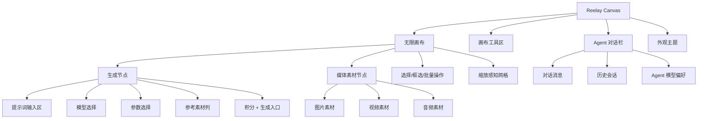
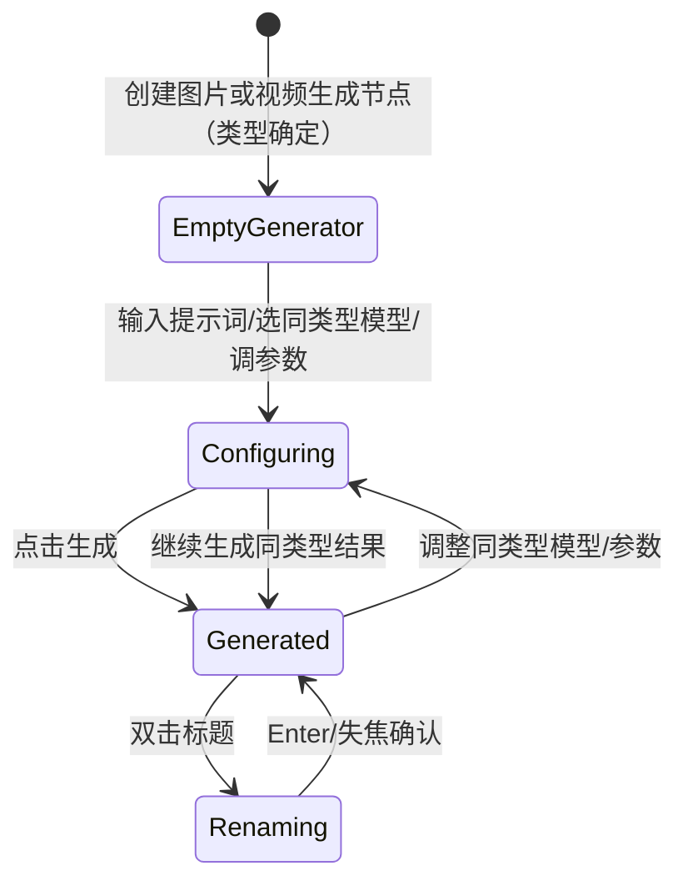

# Reelay Canvas 当前产品与实现说明

更新日期：2026-09-05

## 1. 产品定位

本项目是 Reelay 产品预演版，用于验证正式产品的前端交互、业务规则和状态变化，并沉淀可供正式前端开发参考的行为蓝本。画布把生成节点、参考素材、媒体结果和 Agent 协作放在同一块可缩放空间中，让用户用空间关系组织创作。

后端和第三方服务可以模拟；已纳入当前实现的交互仍需保持状态一致。本说明只记录已经实现的行为，长期定位、未定稿设计与当前产品优先级见 `product-expansion-plan.md`，不能把以下页面的暂时文案当作已确认的完整产品需求。

当前阶段的目标不是完成真实生成能力，而是验证：

- 生成节点在画布中的形态是否足够清晰。
- 图片、视频、音频素材是否能作为输入对象被组织。
- 生成节点与素材节点的信息层级是否符合创作平台的使用习惯。
- Agent 对话栏是否能作为画布旁的辅助创作入口。
- 浅色/深色模式下的视觉基调是否稳定。

## 2. 当前状态边界

这是一个本地可运行的产品原型：

- 没有真实 AIGC API。
- 没有生产账号生命周期、完整云端素材库或积分账本。本地已有个人 Media 与 Entity 的首个持久化切片；Folder、组织共享、平台审核与积分仍是原型边界。公网原型已通过 Vercel 与 Supabase 部署用于评审；私有 Supabase ObjectStore 配置与三主体 12 图迁移已完成，正式主域已通过资产 / 主体 HTTP 读取、鉴权、大小限制与三主体浏览器展示验收，不构成生产可用承诺。
- 本地主链路已经进入 React browser routes：访客主页 `/app`、登录弹窗 `/app/login`、`/app/w/:workspaceId`、`/app/w/:workspaceId/projects` 和受保护的画布宿主路由。页面通过 HTTP adapters 消费本地共享 API；静态登录 / 主页双轨已经删除，`index.html` 只保留为迁移期旧画布 iframe。
- 十个固定 `.test` 演示账号由服务端校验并使用 HttpOnly Cookie 维持独立会话；这只验证登录、路由保护、单组织成员关系和项目级访问控制，不是正式账号系统。组织角色固定为 `1` 名主账户、`2` 名管理员和 `7` 名成员。
- 账号版与免注册体验版使用同一品牌轮廓的静态 SVG Favicon，分别为炭黑底和紫色底；应用壳与画布入口按构建模式选用同一套图标，带内容哈希的产物避免旧缓存混淆，不再由画布启动脚本重绘覆盖。
- 用户、会话、唯一组织 Workspace、Project、项目成员关系、CanvasDocument、WorkspaceMediaAsset 元数据、个人 placement、ProjectAssetReference，以及个人根目录 Entity 的字段、有序 Media 引用和版本保存在 PostgreSQL；独立本地模式使用 filesystem ObjectStore，共享开发与 Vercel 入口使用私有 Supabase ObjectStore。最小链路已通过本地服务重启回读；公网已迁移至 `0013` 并完成私有桶与三主体 12 图写入，正式主域已验证三主体精确目录、12 图 HTTP 内容及个人主体页三张封面，内存 adapter 只用于快速契约测试和显式开发回退。
- 两台 Windows 的共享开发入口为 `dev:server:shared`：各自运行本地前端与 API，连接独立 Reelay_Dev 的 PostgreSQL 和私有 Storage，配置错误时拒绝启动。本机已迁移现有项目、画布、3 主体和 42 份素材并切换日常 API；家里电脑尚待接入验收。Git 同步代码，云库保存业务数据，不提供实时协同编辑或浏览器偏好同步；操作与迁移记录见 `cross-device-development.md`。
- 从受保护路由进入的旧画布会恢复多画布、节点、组、视口和模型参数；直接打开静态 `index.html` 仍是单次页面内存原型。
- 进入画布只注册个人素材与主体目录，不为整个资产库预读原图或探测媒体尺寸。资产库关闭时不生成隐藏的媒体预览；打开后按当前列表展示，实际使用素材或编辑时仍保留必要的尺寸读取。
- 同时进入的相同默认 API 读取共用进行中的网络请求，避免开发态重复挂载多读一遍画布和目录；结果完成后不缓存，再次进入仍读取服务端。登录、退出、保存等写入会隔开前后的读取，不复用写入前的进行中请求。
- 进入画布先请求文档，文档成功返回（包括尚无文档的空画布）后才并行请求个人素材、主体和项目资产目录；文档失败、已离开的路由或失效重试不启动目录读取。文档与 iframe 就绪后即可恢复编辑，不等待目录；目录随后补齐，加载中或失败有明确反馈，依赖目录的操作在对应目录就绪后启用。晚到的目录不会重置节点、任务、撤销或保存状态；旧 iframe 保留原握手兼容路径。
- 持久图片的资产卡片、主体封面与编辑器素材卡使用服务端按需生成的最长边 512px WebP 缩略图。画布图片节点按显示尺寸、缩放和设备像素密度选择静态缩略图或原图，放大自动升级，已加载的原图在本页保持清晰；更新图片来源不重建节点媒体。画布缩略图由服务端检查真实文件，动图保留原图播放；原始地址、尺寸、保存内容、大图编辑与下载不变。未知尺寸、外部和临时媒体保留原路径。视频与音频保留原有行为。
- 缩略图存入同一私有 ObjectStore，首次生成需要读取并验证源文件。原图和缩略图均采用私有条件缓存，每次读取与 304 命中前检查当前权限；原图通过不可变资产记录校验 ETag，重复读取无需重新下载完整对象，完整响应仍保留内容校验。
- 服务端复用已校验的缩略图内容，缓存最多 16 MiB / 256 条，闲置 5 分钟过期并按最近使用顺序淘汰；只保存派生图片，不缓存原图、身份、权限或失败。新进程、未命中或过期的图片仍需远端读取，每次 HTTP 请求继续检查当前权限。
- 主体编辑器右侧先显示该素材的小图，原图加载并完成解码后原位切换；原图失败保留小图。切换素材立即换成当前素材的预览，旧异步完成不能覆盖它。同素材的控件更新保留主预览及视频元素；主体悬停 / 固定详情继续使用小图，不因悬停预读原图。
- “生成”是模拟行为，用于验证生成后的媒体状态、标题和规格展示。

2026-09-07 首次资产发布后，[PR #18](https://github.com/Heo7n/reelay-canvas-prototype/pull/18) 已集成登录设计与项目导航加载修复。后续发布的构建源、部署 ID、promotion 与主域验收证据记录在对应 PR；不能由 `main` 推断线上版本。首次数据迁移与验收范围见 [公网预览记录](vercel-supabase-preview.md)。

这意味着当前项目更接近“可交互产品样机”，不是生产应用。

### 外部免注册体验

- 内部环境继续使用主账号和真实持久数据；外部体验由独立静态构建提供同一套主页、项目与画布，不提供登录或业务 API，不读取内部账号、会话和个人目录。
- 外部首次打开即以“体验访客”进入体验空间，提供四个示例项目及已选定的玄翎、幽影、白汐三主体，素材包含 12 图、3 段视频及 1 段音频。示例来自随代码发布的公开快照；不会实时跟随主账号修改。
- 项目、画布、主体及素材改名保存在当前页面的内存服务；SPA 内返回主页或切换项目仍保留，整页刷新重新构造初始快照。新建项目的深链接刷新后回到初始项目列表。不同标签页和访问者各自独立，退出体验也恢复初始状态。
- 本地选入的图片、视频和音频经宿主消息桥进入页面内存，不上传云端；单文件上限 4 MiB，累计临时文件上限 128 MiB，刷新释放。本页拥有 Blob URL，画布通过稳定素材引用在切换项目后恢复；真实持久文档的 URL 白名单不放宽。
- 页顶以低干扰提示说明“修改仅本次有效，刷新后重置”和生成 / 积分的演示范围；主题等设备偏好仍可保留。业务数据和创作提示词不写浏览器持久存储。
- 此入口不实现多人实时协作、云端上传、账号注册或测试作品留存；主体删除 / 移动等尚未实现的正式能力仍沿用现有边界。

### 2.1 登录流程原型

`/app` 是可浏览的访客主页，`/app/login` 在同一主页上打开账户密码登录弹窗；当前仍使用演示账号系统：

- 访客主页使用左侧导航和“展示轮播 → 新建项目”的主区域；左侧仅显示首页、使用帮助及顶部侧栏切换入口，此状态不读取组织、项目、成员或资产数据。右上显示黑底圆角的“注册/登录”合并按钮。展示区与登录后主页共用“场景构想 / 人物塑造 / 视觉探索”三张本地生成图及两行主题文案，具体编排见 2.2；不展示精选案例占位或未实现的 Agent 能力。已登录访问 `/app` 会进入所属组织主页。
- 点击右上登录或中央“新建项目”进入 `/app/login`，主页组件保持挂载；原生模态弹窗让背景不可操作，关闭按钮、遮罩或 `Escape` 返回访客主页，保留滚动位置，并把焦点还给原入口。直接打开登录地址也有完整的主页背景和关闭去处。登录弹窗打开期间，背景主页的展示轮播暂停。
- 使用明显虚构的 `.test` 演示账号并默认填充；每次打开弹窗时显示 3.8 秒的演示账号 Toast，不在表单下常驻提示。Toast 位于模态层内，不占布局或抢焦点；服务端校验固定演示密码并创建 HttpOnly 会话 Cookie。
- `/app/login?demo=admin` 预填既有管理员 `linjing@reelay.test`，关闭与重开登录保留该选择；缺省、未知或重复的 `demo` 参数回退主账号。不从 URL 读取账号或密码，不自动登录或切换已有会话；手工编辑和登录失败后的输入保留。
- 未登录访问工作空间或项目深链时进入带内部返回目标的登录弹窗；登录成功或已有共享会话时，仅接受当前账号所属 Workspace 下的内部目标，项目访问仍由受保护路由和 API 验证。外部或其他 Workspace 的返回地址回退到所属组织主页。
- 主页提供真实创作描述输入，空状态逐字演示适合图像 / 视频生成的示例，示例不是输入值。访客点击输入区“新建项目”先打开登录；正常登录后回到组织主页并恢复真实输入，由用户再次点击创建，不在登录成功时隐式创建项目。打开中央或右上登录前保存本标签临时草稿，其他标签已建立共享会话时也能直接恢复。已登录主页创建请求因会话过期失败时，草稿仅绑定原 Workspace 主页，续登或取消再登录仍保留输入；其他 Workspace 与受保护深链不接收该草稿。临时交接完成或取消后清理存储副本，当前输入保留在页面状态；体验版不使用该持久存储。
- 弹窗左侧使用三张独立生成的本地展示图（依次为想象世界、灵感展开、角色叙事，打开时默认展示想象世界），文件与最终提示词在 `assets/login/`；每 4.5 秒淡入淡出。底边横向铺满三段等宽细长轮播条，可点击选图；不显示播放图标。鼠标悬停或焦点进入媒体区时暂停，离开后重新计时；页面后台、减少动态效果以及宽度不超过 `720px` 时停止自动轮播。媒体区隐藏时只显示表单，不在窄屏顶部堆放大图。
- 桌面访客主页低优先级预加载登录首图，弹窗在完整图片解码前显示内联同图轻量预览，避免首次打开出现黑色空区。轮播仅在目标图片解码完成后切换，并保留上一张到切换完成；加载失败跳过该图，暂停时取消尚未完成的自动切换，手动选择以最后一次意图为准。
- 右侧品牌可见图形、欢迎标题与表单共用左对齐边界。注册入口保留但禁用，“暂未开放”只在悬停提示中出现。表单底部显示“继续即表示您同意 使用条款 和 隐私政策”；忘记密码、使用条款与隐私政策入口仍为不可操作的占位。短信验证、第三方登录与注册均未开放，不出现可提交的虚假验证码表单。
- 登录请求与跳转期间锁定重复提交和弹窗关闭；失败在表单内给出错误并保留输入。弹窗初始焦点直接进入账号框，不会因轮播先获焦而误停自动播放。桌面弹窗最大 `1248 × 800px`，与视口四周至少保留 `32px`，左右保持 `53:47`；表单维持原有宽度，在可用高度内垂直居中，矮视口只让右侧内容滚动。背景遮罩使用 `68%` 深色叠加 `6px` 模糊，关闭后恢复原页面；浅色 / 深色沿用 `reelay-theme-mode`。
- 退出账号返回访客主页，不自动再次打开登录弹窗。
- 正式账号、密码重置、风控和成员管理不得直接在固定演示账号上扩写；后续账户能力只进入 React 路由和明确的服务边界。

### 2.2 登录后主页原型

`/app/w/:workspaceId` 已实现为登录后创作主页，不是公开营销落地页。它当前包含：

- 首页、项目页与组织中心共用左侧导航，包含 Reelay 品牌、首页、项目、组织中心和使用帮助；组织中心位于项目入口下方，以组间距和细分隔线区分日常创作与组织管理。访客只显示首页与帮助；侧栏不放新建操作；项目入口使用叠放画框图标，避免与资产库的文件夹语义混淆。右上保留账户入口。桌面侧栏默认收起为 `64px`，展开宽 `200px`，用户主动选择保存在设备本地；收起时顶部显示品牌图形，悬停或键盘聚焦后显示展开图标，展开后的收起按钮在顶部品牌右侧，Logo 按实际墨迹裁切，与按钮共用垂直中心线；导航点击区高 `44px`。底部只保留使用帮助。不超过 `600px` 时固定使用 `60px` 图标导航，隐藏无效的展开按钮。首页、项目页与组织中心的侧栏、顶栏及内容区共用柔白底色和低强度细颗粒材质，侧栏保留 1px 低对比竖向分隔线，以表达持续导航区与内容区的功能边界；同色不取消区域边界，导航选中状态另用轻背景表达；项目卡片与浮层保留独立表面层级，深色沿用相同布局与细颗粒。此框架不包裹画布，画布仍保留完整编辑视口。顶部不单独暴露积分按钮，`3000 / 0` 模拟积分显示在账户面板中。
- 主区域按“三卡片轮播 → 创作输入 → 最近项目”排列：轮播、项目区与页脚共用最大 `1600px` 版心，居中输入区最大 `960px`，窄屏按可用空间收缩。桌面三张 `16:9` 卡片按 `30% / 36% / 30%` 分配宽度，两处间距均为 `2%`，垂直居中，以尺寸表达主次，移除斜切透视和重叠。容器不超过 `680px` 时以中心卡为主并露出两侧，不以最小高度拉伸图片。三卡每 `4` 秒沿连续轨道水平移动，使用 `500ms` 缓动及中心轻微放大；图片节点保持挂载与不透明，循环边界在屏外无动画归位。快速操作先完成当前物理步，再响应最后选择；键盘焦点在归位后保持同一图片。鼠标悬停、键盘焦点、后台、减少动态效果或登录弹窗打开时暂停；减少动态效果下手动选择立即切换。卡片、箭头、三段指示条与左右方向键仅切换展示，不注入需求或创建项目。
- 三张首页展示图依次为“场景构想 — 空间 · 光线 · 氛围”“人物塑造 — 神态 · 造型 · 叙事”“视觉探索 — 材质 · 色彩 · 构图”，首次进入以场景构想居中。图像分别呈现海岸建筑远景、人物中景及纸张 / 陶瓷 / 玻璃材质近景，以低饱和青绿、暖白与少量琥珀色统一；两行 HTML 文案共用字号、字重与间距，底部渐层保证可读性。新生成的三张 WebP 与最终提示词记录位于 `assets/home/carousel-v2.md`，仅表达创作方向，不声称真实客户案例或产品内生成成果。
- 轮播下方保留居中的“让想法，成为画面。”标题，桌面 `26px / 500`，窄屏 `22px`；下面是真实多行输入框与右下“新建项目”发送式按钮。空输入且未聚焦时，三句产品主视觉、角色肖像、镜头描述示例按逐字输入 `65ms`、停留 `1800ms`、删除 `30ms`、换句间隔 `450ms` 循环；进入输入区、真实内容非空时示例让位，后台 / 登录弹窗 / 提交期间暂停，减少动态效果显示静态提示。示例为辅助装饰，不写入 textarea、不提交、不作为动态朗读。输入最多 `600` 字，`Enter` 新建、`Shift + Enter` 换行，输入法组合期间不提交；空白输入创建空白个人项目，真实输入创建项目后带入一个待生成节点，不自动生成。项目创建成功后才发布绑定 Workspace / Project / Canvas 的一次交接，只有对应可写画布完成文档初始化后消费；内部与体验均通过宿主 context 传入，旧画布不读取全局 sessionStorage。路由提交及跳转期间锁定输入和所有新建入口，失败保留输入并允许重试。首页不展示未接入的模型、素材、语音或 Agent 策划能力。
- 访客与登录后主页共用底部平台信息区，与主内容对齐。桌面按品牌说明、平台协议、联系与帮助三列排列，窄屏顺序堆叠；页脚随文档流位于页面底部，不固定覆盖内容。品牌说明为“面向团队的 AI 图像与视频创作平台”，版权年份取当前年份；使用条款和隐私政策尚未接入，沿用登录弹窗的禁用入口。联系邮箱采用提供的 `customerservice@reelay.studio`，点击通过 `mailto:` 打开邮件客户端；使用帮助连接既有手册。项目库、画布与组织中心不添加此页脚。
- 最近项目右侧入口为“全部项目 >”，使用主文字色（浅色为近黑、深色为浅白）及向右小箭头；最近项目第一格固定为“新建项目”，后面最多三张当前账号可访问项目，按更新时间混排；桌面四列，依据内容区宽度降级为两列 / 一列。新建卡只打开空白个人项目，不携带上方输入区草稿。项目名称、封面标识与编辑时间来自现有项目数据。普通卡与新建卡共用 `16:9` 封面和最小 `64px` 信息区，不再套外层白色卡壳或用 min/max-height 改变封面比例。日期统一使用本地 `YYYY-MM-DD` 格式（例如 `2026-09-05`），协作项目在日期左侧以多人图标标识，同属次要信息行；保留键盘焦点与菜单反馈，不使用悬停抬升或封面缩放。
- `/app/w/:workspaceId/projects` 顶部采用两层标题区：上方“全部项目”一级标题，间隔20px后为工具栏，左侧“个人 / 协作”分段切换、右侧搜索；标题24px/550，窄屏20px并间隔16px。项目页顶部账户栏64px，内容上边距8px，标题从距页面顶端72px处开始，减少顶部留白；主页账户栏高度保持原布局。两类分别呈现同一组织内该类全部项目，不是三个平级 Tab；分段控件与搜索均为44px高，最大1600px版心及响应式外边距与主页统一，工具栏和项目网格左右对齐；不超过600px时按分类、搜索顺序分两行。当前不提供项目文件夹或新建文件夹入口。分类切换保留搜索内容，搜索只作用于当前类别；没有项目与搜索无结果分别展示对应空状态。网格最大 `1600px`，按可用宽度和 `250px` 最小卡宽自动排列；首格始终为“新建项目”，不在标题旁重复按钮，不添加返回或回收站入口。新建始终创建个人项目，协作分类下用次文案“创建个人项目”说明归属，筛选不改变创建语义；未设置或无法识别封面时使用统一的中性纸张 / 玻璃静物默认图，不再绘制空线框占位。
- 项目示例封面统一为无文字的 `1280 × 720` WebP，设计图与最终生成提示词见 `assets/home/project-covers-v2.md`。原有香水、科幻、角色、产品、教育五个封面 key 保持，新增品牌故事和个人概念两张；封面只表达示例设计方向，不代表既有画布内容自动改写。默认图同时适用于项目列表、最近项目与画布的项目入口，不依据项目 ID 或名称猜测主题。列表图片使用固定尺寸、异步解码和懒加载，标题与日期仍由 HTML 呈现；没有新增用户封面上传能力。
- 现有项目卡的名称右侧常显横向三点菜单，封面单独作为打开项目的入口；同一时间只展开一个项目菜单，点击外部、焦点移出或按 `Esc` 都会收起。`admin/edit` 可见重命名与修改封面，个人项目对当前创建者开放删除；协作项目仅项目级 `admin` 可执行删除，`edit` 会看到禁用态及权限提示，`view` 只可打开。只有个人项目的 `admin` 可见转为协作项目。移除快捷编辑笔；可编辑成员点击项目名称或菜单“重命名”后进入轻灰底原位输入，初始全选名称，Enter 或失焦保存，Esc 取消，输入法确认与未改名不提交。请求期间保持只读输入并拦截重复提交，只有保存成功才退出编辑，失败保留文字并就地显示可见错误，允许修改或 Enter 重试；键盘完成或取消后焦点回到名称。只读成员仍通过名称或封面打开项目。新建、重命名和删除写入 PostgreSQL；删除前必须二次确认，删除后项目立即从相关成员的列表和画布入口隐藏，但保留项目、成员关系与 CanvasDocument，等待后续回收站恢复。修改封面和转为协作项目仍是明确的未接入提示。
- 十个账号都属于 `星海视觉工作室`。个人项目只对创建者可见；协作项目只对显式加入的组织成员可见，项目角色为 `admin/edit/view`。组织 Membership 只证明账号属于组织，不能替代项目权限。浅色 / 深色仍是设备级偏好。
- 工作台顶部账户入口以紧凑的“组织标识 + 可截断组织名 + 个人头像”组合显示；hover 展开后显示当前登录账号与 `星海视觉工作室`。组织归属和积分入口使用两条等高的扁平导航行，不再包装成带大面积灰底的摘要卡：左侧分别显示组织名称和“我的积分”，右侧分别显示账号角色与 `3,000` 余额，并以一致的层级箭头表达可进入；“我的积分”明确表示当前登录成员可消费的个人积分账户，不代表组织总余额，入口也不再重复展示累计消耗。两行整行可点击、共享轻量 hover 和键盘焦点反馈；点击组织行进入当前 Workspace 的独立组织中心路由，点击积分行直接打开账号设置中的“我的积分”。画布 iframe 也从宿主上下文读取同一账号、组织和角色，不再把所有成员硬编码为主账户。
- “账号设置”在 React 宿主中以桌面弹出面板打开，包含“个人主页 / 我的积分”两栏，不包含订阅和设备管理。个人主页使用统一信息面：上方左右展示个人身份与组织归属，下方并排展示邮箱和手机；不显示演示态标签或重复登录标识。可选邮箱与手机在格式有效后自动保存，不提供显式保存按钮；格式无效或请求失败时保留当前输入并给出提示。联系资料不改变登录标识，也不会自动订阅报表；后续报表发送必须另设显式开关。“我的积分”仅汇总当前账号，默认先展示覆盖全部时间的“积分流水”，统一呈现组织发放、任务消耗与任务退款等获得或消耗记录；类型与自定义起止日期合并在一个极简筛选面板中，选择后即时生效，入口以数量角标提示正在生效的条件。任务流水沿用组织账本的追溯颗粒度，拆分展示时间、类型、项目、任务类型、模型、生成规格与积分变化，组织发放等不适用字段显示为空值。“用量分析”独立使用近 7 天、近 30 天或本月周期，按“分析概览—趋势图/日明细—消耗构成—消耗来源”组织；消耗构成归并为视频生成、图片生成和媒体处理，消耗来源可按项目或模型切换。工作台账户概览中的积分摘要可直接打开“我的积分”。当前个人积分页沿用可整体替换的确定性演示数据，不等同于真实账本；持久化账本接入后必须以真实余额和流水替换。旧画布中的账号设置入口通过 bridge 打开同一面板。
- 组织中心使用 `/app/w/:workspaceId/organization`、`/organization/credits` 与 `/organization/usage` 三个地址，由同一父级路由共享组织上下文；组织成员请求以未决结果返回，进入页面不等待成员响应，先显示现有工作区身份、页面标题与导航，成员区域显示静态骨架而非转圈。成员返回后呈现真实目录，不把加载中误显示为零成员。成员加载失败在内容区提供重试，侧栏和账户入口保持可用；会话失效或无权访问仍跳转登录或允许访问的工作区，离开页面后的晚到结果不触发陈旧跳转；主账户与管理员在横向导航切换“组织信息 / 积分管理 / 用量看板”时不重复请求会话、工作区与成员，直接访问或刷新任一地址时正常加载。普通成员仅显示组织信息栏目，查看成员名称、账号邮箱与组织角色，不可操作成员账号或角色；访问积分管理或用量看板地址会替换导航回组织信息。三页接入共享左侧导航，右上角继续显示“组织 + 个人”账户入口；移除原独立外框、第二套侧栏与重复品牌顶栏。页面采用与项目页一致的 64px 账户栏、24px/550 可见“组织中心”标题、最大 1600px 版心及响应式外边距，下方横向栏目以文字和底边细线表达选中状态。内部切换使用 replace 并保留可信来源，切换后内容回到顶部；仅来自当前 Workspace 精确画布地址时在标题右侧显示“返回画布”，保留原 query/hash。左侧与右上角组织入口在组织页内重入不会覆盖该来源；直接打开或来自主页 / 项目列表时不显示通用返回，通过全局导航离开。
  - 组织信息把精简组织资料和成员目录放在同一页；紧凑组织资料卡显示名称、成员数与当前账号的组织角色，移除没有真实数据依据的固定组织 ID；主账户可在卡片内预览修改组织头像和名称。成员列表作为页面主体，统一文字层级、行高、搜索和管理入口。主账户与管理员看到的成员管理列表来自服务端 Workspace Membership 投影，显示真实演示成员、账号邮箱与组织角色，不读取项目权限；成员 API 每次使用本次服务端会话查询得到的最新组织范围，成功路径直接读取目录，不重复查询组织和成员关系；组织外请求继续区分 403/404，未登录仍为 401，不缓存授权；主账户和管理员可从角色列打开独立选择浮层，主账户角色不可变，管理员也不能修改自身角色。主账户和管理员可打开非主账户成员的账号三点入口；紧凑浮层用于演示重置登录密码和停用 / 恢复账号，但当前登录账号只提供密码重置，不允许停用自身，管理员也不能操作主账户。停用状态只在当前页面生命周期内降低该成员行的视觉权重，不额外显示状态文字，刷新后恢复。普通成员看到的是只读“组织成员”目录，显示成员身份、账号邮箱和组织角色，但不显示角色编辑或账号管理入口。组织资料、角色和成员账号操作均不会修改共享组织、演示账号、会话或 Membership；系统不展示任何成员的现有密码。
  - 积分页以“组织积分账户”承载当前积分状态：左侧“积分余量”展示当前尚未消耗的 `100000` 积分，右侧“余量构成”按“未分配积分 `67000`、成员账户积分 `33000`”展示比例与静态构成。余额数字和构成区只负责展示；唯一的“积分变动记录”入口作为积分余量下方左对齐的明确操作块，默认打开入账记录。成员行“记录”打开独立的成员账户视图：标题区展示成员、账号和可用余额，上方约三成空间展示可独立滚动的额度发放 / 回收记录，下方约七成空间展示可独立滚动的任务消耗明细；成员上下文已明确，因此记录表不重复成员列。成员账户表按“成员、账号、角色、可用余额、操作”展示：成员、账号、角色和余额使用稳定紧凑的桌面列宽，账号过长时省略，可用余额只显示当前数字且左对齐；剩余横向空间留在数据区与操作区之间，操作标题与“调整 / 记录”按钮组共同贴齐表格右边界，按钮的提示和打开后的界面继续使用完整名称。不混入缺少时间口径的“最近变动”或“已消费”信息。“调整”打开锚定当前成员的紧凑表单：顶部展示成员、账号与当前余额，发放 / 回收使用分段切换，数量必须是受组织未分配余额或成员余额约束的正整数；回收支持一键填入全部余额，零余额时不可切换到回收，提交按钮使用明确的“确认发放 / 确认回收”。点击外部、取消或按 `Esc` 关闭。组织级积分变动记录使用宽度随桌面视口在约 `960px` 至 `1360px` 间扩展的右侧抽屉，固定标题与“入账记录 / 分配记录 / 消耗记录”页签，表格内容独立滚动且不依赖横向滚动。入账页不另设单项概览卡，表格标题栏右侧直接显示“共 x 笔、累计入账 x 积分”，并列出时间、类型、来源说明和入账积分；分配页同样不设横向指标卡，标题栏右侧直接汇总记录数、已发放和已回收积分。分配与消耗页不再单列“全部成员账户”说明；分配页固定展示全部成员流水，成员级过滤由外部“成员积分账户”各行的“记录”入口承担，标题栏右侧只保留统计；消耗页只在标题栏保留紧凑统计块与统一“筛选”入口，展开后按“成员、任务类型、模型”三项筛选，不再用独立成员选择器占据标题栏。分配类型使用无箭头的高识别文字状态块；额度变动只展示本次增减值，不重复展示变动后余额；有效期支持“永久、截至某日、起止时间范围”三种结构化口径；表格将“操作信息”拆为独立的“操作人、备注”两列。消耗页不重复余额概览，组织级按“时间、成员、项目、任务类型、模型、生成规格、消耗积分”展示，成员账户级省略成员列，不显示重复的结算状态。任务类型首版固定为“图片生成、图生视频、参考生视频”；生成规格以不可变的任务执行快照分别保存清晰度（含部分模型支持的 `4K`）、画面比例、图片数量或视频时长，表格组合为如“4K · 9:16 · 2 张”的紧凑文本。成员账户级消耗记录仅保留任务类型与模型筛选。组织级记录抽屉在三个记录页签同一行右侧提供共享时间范围与紧凑的“导出流水”入口，使关闭按钮保持为标题栏唯一的窗口级操作；共享时间范围单击后直接列出“全部时间 / 本月 / 近 3 个月 / 自定义”，不再嵌套第二级选择器，自定义项再展开起止日期；切换入账、分配和消耗页签时范围保持不变，并同步更新各页表格与统计。导出不再维护第二套日期状态：Excel 下载包含当前时间范围内入账、分配与消耗三个工作表的完整组织账户流水，CSV 仅下载当前时间范围内的当前页签及当前筛选结果；成员账户抽屉暂不展示组织级时间与导出入口。发放和回收当前只反馈“尚未开放，本次未执行”，不声称提交成功，也不改写余额或流水；抽屉不重复显示演示标签，但其中记录仍是可整体替换的确定性前端数据，不代表已经接入真实 `CreditLedger`。
  - 组织用量页仅对主账户与管理员开放，使用可整体替换的确定性前端演示数据。页面以“概览—用量分析—消耗来源”形成单一阅读路径：概览并列展示“可用积分 / 预计可用”和“今日已消耗 / 近 30 天日均”两组稳定指标；预计可用始终按近 30 天日均估算，不随下方统计范围跳变。页面保留更新时间、手动刷新与“导出报表”，不在界面重复强调演示数据身份。
  - 概览指标共用一体式卡片，卡片底部中央以叠在边界上的轻量箭头把手展开或收起“长期活动”，不为箭头额外增加一行高度；展开状态只属于当前一次用量页访问，切换到组织中心其他分栏后即重置为收起。长期活动固定观察近 365 天积分消耗，不跟随下方分析日期范围：每日视图使用日历热力图，每周视图使用按周聚合趋势线，累计视图使用累计消耗曲线并在悬停时同时显示当周新增与累计值；三种视图保持相同高度，展开区与概览共享外框，不再增加独立卡片层级，也不因悬停提示产生横向滚动条。
  - 用量分析默认使用近 7 天，可切换近 30 天或自定义日期范围。日期范围只在点击“应用”后生效，取消、点击外部或 Escape 不改变当前统计；自然日边界按组织时区 `Asia/Shanghai` 表达。近 7 天及不超过 7 天的自定义范围使用每日横向条形图并明确显示各日消耗；近 30 天使用每日堆叠柱形图、左侧纵轴和悬停明细，悬停时同时展示当日总消耗与三类构成，默认视口稳定展示最近约 15 天，其余日期横向浏览；自定义范围不超过 31 天按日、较长范围按周或月自适应聚合。
  - 消耗类型固定展示“视频生成 / 图片生成 / 媒体处理”三组。外层卡片只展示类型、积分与环形占比，不提前堆叠产出指标；点击卡片打开右侧明细抽屉，按模型及分辨率 / 质量等生成规格展示任务数、产出、积分与占比。当前演示层把 Agent 与增强处理归入“媒体处理”，这是展示口径，不等同于最终计费分类。确定性演示数据把常规工作日控制在每日约 `6500–9700` 积分、周日约 `5200–6400` 积分；周六以约 `2800–5200` 积分的低活跃为主，仅偶尔出现真实的无消耗日，不再机械地把每个周六归零。时间图纵轴按当前区间峰值生成带顶部余量的整洁上限，近 7 天与其他区间切换时保持分析面板高度稳定；不超过 31 天按日聚合，横轴以“月 / 日”显示并在数据较密时抽样标签，必要时提供轻量横向浏览而不压缩柱体；31–180 天按周聚合、更长范围按月聚合。时间图、类型统计、来源表与导出严格共用同一个已应用范围。
  - 消耗来源默认按项目展示，可切换按模型与按成员并搜索；项目表呈现项目、消耗积分、占比与产出规模，模型表呈现模型、类型、消耗积分、占比、调用次数与单次平均消耗，成员表呈现成员、消耗积分、占比、任务数与产出规模。完整来源项不被静默截断，列表过长时只在表格区域滚动。来源行可打开现有聚合详情抽屉，但任务级扣费、退款与成员流水仍统一由积分管理承接，不在用量页复制账本。
  - 在 `GenerationTask`、计费快照与不可变 `CreditLedger` 接入前，用量看板不得把演示记录描述为真实组织账本。生产形态下，余额、时间分布、类型与来源都应来自同一不可变流水的查询时刻聚合；内部积分分配不计入组织消耗，图表聚合可允许约 5 分钟延迟。组织中心横向导航承担当前分区名称，内容区保留隐藏的二级可访问标题，并在笔记本与宽屏下自适应扩展。
- 组织中心使用页面自然滚动，共享侧栏、账户顶栏与页面标题 / 横向栏目保持可见，移除原外层视口锁定与面板内第二套纵向滚动。成员与积分账户表在窄屏内横向滚动，避免管理操作被裁切；用量概览窄屏排列为两列，分析区改为单列，来源表保留自身滚动。记录抽屉与浮层继续使用原有独立滚动、焦点和关闭规则。
- 当前只以桌面浏览器为产品目标，支持键盘焦点和 `prefers-reduced-motion`；已有窄屏降级样式可保留作防御性布局，但不作为移动端产品承诺。主页主内容使用最大宽度和响应式边距，页脚在短页面贴近底部、长页面随文档自然滚动。

主页与画布的边界：

- 新主页和项目库位于 `src/pages`，共享项目卡、账户栏和主题位于 `src/shared`，数据只通过 `src/application` ports 与 `src/infrastructure/http` adapters 进入页面；不进入 `app.js` 或 `styles/app.css`。
- 主页创建项目后进入 `/app/w/:workspaceId/projects/:projectId/canvases/main`。宿主会先校验会话、工作空间和项目，再以 iframe 打开旧画布并通过一次 `canvas:ready` 握手发送版本化上下文与 CanvasDocument；旧画布按 `projectId + canvasId` 自动保存迁移快照。新项目尚无服务端文档时，纯浏览只把当前空画布登记为内存同步基线，不创建空的数据库记录；主页提示词形成的首个节点或后续真实用户修改才会写入 revision 1。
- 旧画布内部的“回到主页 / 全部项目 / 退出账号”以及项目切换 / 新建意图都通过 bridge 请求宿主处理；宿主在 dirty 与保存任务清空后进入 React 路由、创建真实项目或提交退出 action，不再依赖静态页面。
- 模拟积分仍没有共享账本；React 页面和旧画布刷新后都显示当前阶段的 `3000 / 0` 测试基线。
- 素材、模板、组织管理和更多能力入口只给出明确原型反馈，不伪装为已实现页面。

路由画布保存边界：

- `admin/edit` 可以保存，`view` 只能读取；服务端每次请求仍按 ProjectMembership 校验，前端只读标识不是授权依据。旧画布的只读模式禁用拖动、删除、新增、生成、重命名和参数修改，保留选择、平移缩放、预览与下载；加载失败时不挂载 iframe，并提供重试入口。
- 保存内容是 `schemaVersion = 1` 的迁移快照，使用逐字段 allow-list 保存内部画布、节点、组、视口和最近模型参数。账号、选择态、撤销栈、生成任务、积分和 Agent 对话不会写入；行为测试会执行真实序列化与恢复，并验证未知 / 恶意字段和不可恢复 URL 不会穿透边界。
- 当前旧画布内部仍可管理多个画布；迁移阶段把它们作为一个 bundle 存在路由的 `main` CanvasDocument 中，并不宣称已经拆成多条正式 Canvas 实体。
- 本地文件的 `blob:` 地址不会被伪持久化；刷新后只保留可恢复的节点结构，素材二进制仍等待 Asset / Blob 存储。
- 保存使用乐观 revision；发现其他窗口已先保存时停止自动覆盖并提示重新进入项目，不做静默的最后写入覆盖。
- 已软删除项目的详情与 CanvasDocument HTTP 访问立即返回不可用；若项目在已打开画布保存期间被删除，宿主会卸载 iframe 并阻止后续写入，不让用户继续编辑一个无法保存的项目。

## 3. 信息架构



## 4. 主画布设计

画布是产品的主工作区。当前实现包括：

- 初始空状态：中心显示低权重提示标记和“开始自由创作”引导，不作为主视觉或强按钮。
- 双击画布：打开只含“图片 / 视频 / 上传”三项的紧凑菜单；选择后才创建对应生成节点或打开本地文件选择器。“上传”以轻量分隔线与生成项区分。首项默认只呈现预览反馈，不代表已经选中；悬停时图标保持固定，仅文字区平滑上移并显示简短说明。
- 鼠标滚轮：在画布空白区平移画布；`Ctrl/Cmd + 滚轮` 以鼠标所在位置为缩放中心。
- 当鼠标位于项目导航、画布工具、模型或参数菜单、侧栏、素材架、媒体工具栏，以及按钮、滑杆和独立输入控件时，普通滚轮留给该功能区，不触发画布平移；`Ctrl/Cmd + 滚轮` 被拦截，既不缩放画布，也不泄漏为浏览器页面缩放。
- 生成节点编辑器的空白区域和提示词正文使用独立规则：空白、未聚焦正文及已聚焦但没有溢出内容的短文本允许普通滚轮连续平移画布；只有已聚焦且内容溢出的正文使用内部滚动，到达顶部或底部仍不带动画布。`Ctrl/Cmd + 滚轮` 在编辑器空白与正文中继续缩放画布，嵌套菜单、素材架和控件仍遵循功能区隔离。实际执行画布滚轮平移或缩放前会退出当前提示词编辑焦点。`Ctrl/Cmd + +/-/0` 不被画布全局接管。
- 空格拖拽：平移画布。
- 中键拖拽：平移画布。
- 中键或空格平移优先级高于节点拖拽，即使鼠标起点在媒体节点上也应移动画布。
- 空白拖拽：框选多个节点。双击空白创建节点时，鼠标落点锚定新节点媒体框中心；Prompt 区只从媒体框下方展开，不参与初始落点居中，因此展开高度和画布缩放不会把媒体框推离双击位置。
- 选中至少两个节点后，在选区附近显示多选工具栏，提供“新建主体 / 打组 / 保存到素材 / 下载”；框选拖动和批量连接期间隐藏工具栏，框选结束后恢复。新建主体使用与编辑器相同的主体卡图标，与其他操作用细线分隔；已有组的打组限制保持。工具栏避让视口边缘，窄窗口收起次要按钮的文字并保留可访问名称。
- 图片、视频和音频节点的媒体框在浅色与深色主题中统一使用 `22px` 世界尺寸圆角、`1.5px` 世界尺寸中性边线与无投影表面，内部媒体裁切跟随外框，边线与圆角一起随媒体缩放。深色媒体框与节点编辑器使用同一 `#1f1f1f` 表面。媒体类型由标题图标与内容表达；单选或框选后直接用单层、更清晰的中性边线替换默认边线，深色为 `#707070`、浅色为 `#999b9f`，不再叠加外圈或 halo。生成节点输入面板不额外高亮。
- 缩放感知网格：近景可见，远景淡出，分别适配浅色和深色模式。
- 左下角画布工具组按 `小地图 → 适应视图 → 整理画布 → 画布比例` 排列；“整理画布”使用布局网格图标，点击后预览整个画布的自动整理结果，并提供“还原 / 保留”，具体规则见第 5.1 节。内部画布、资产库、分享和个人入口已移入左侧中部的竖向浮动栏，快捷键入口位于个人菜单的“帮助中心”子层。
- 适应视图：有选中内容时优先适应选中内容；未选中时先判断全量内容是否可读，若节点被远距离孤立点拉散，则聚焦主内容簇并保持最低可读缩放，小地图继续表达远处内容位置。
- 画布比例：使用常驻小滑条直接调节，范围为 20% 到 200%，滑条左侧不再显示额外图标；hover、拖动滑条或滚轮缩放时，滑条右侧临时展开显示当前百分比，平时收起。
- 小地图：根据节点世界坐标生成缩略分布图，并显示当前视口矩形；拖动视口矩形或点击小地图区域可实时导航主画布。

设计意图：

- 网格是空间感辅助，不应该压过节点内容。
- 空状态是轻量引导，不作为品牌主视觉。
- 节点被点击时会提升层级，避免多个节点重叠时遮挡当前工作对象。
- 小地图是导航控件，不承担内容预览；它只表达空间位置、节点分布和当前可视区域。

## 5. 画布边缘工具区

画布壳层使用彼此独立的浮动区域，避免形成持续占宽的传统后台侧栏：

- 左上角是约 `248 × 38px` 的紧凑项目级导航，只承担返回主页、当前项目名和项目菜单。
- 左侧中部是约 `48px` 宽的稳定竖向胶囊栏，依次常显内部画布、资产库、分享和个人入口。四个入口使用约 `40px` 命中区，以略轻于两端横条的体量维持中轴层级，同时保留桌面端稳定点击区域。分享紧邻个人入口上方，不占据首项；它不再依赖 hover 展开，避免胶囊轮廓跳变并保持入口可发现。分享调用系统分享能力，缺少支持时复制当前项目链接。带自定义提示的入口只保留 `aria-label`，不再叠加浏览器原生 `title` 提示。
- 左下角是收起态约 `248 × 38px` 的圆角矩形视口工具条，与左上项目条等高；依次提供小地图、适应视图、整理画布和 20%–200% 缩放滑条。滚轮位于整个工具条及其空白内边距时都不会带动画布；项目条、资产面板和工具条共享 `8px` 外边距与 `4px` 面板沟槽，构成更紧凑且上下对称的左侧纵向基线。项目条与工具条仍保持等宽和稳定命中区，压缩量主要来自外部留白与容器内边距，使中央资产 / 主体工作面获得更多有效高度。
- 积分组件独立放在左侧胶囊栏外、个人头像下方，与竖栏左缘对齐并留 `6px` 间距；竖栏恢复四个入口，不在栏内添加积分分隔线。组件至少 `48px` 宽、`24px` 高，`14px` 青蓝棱镜图标与余额横排。默认无底色、边框或阴影，按下与键盘聚焦时显示淡蓝灰色的 `5px` 圆角背景。点击积分或通过键盘激活直接进入 React 账号设置的“我的积分”分栏；悬停或键盘聚焦显示精确可用余额。组件余额低于一万时显示不带千位分隔的整数，一万及以上用“万 / 亿”紧凑显示并截断尾数；完整数值及千位分隔保留在提示、可访问名称和个人菜单中。资产库展开时与左侧竖栏一起隐藏，不挤占资产面板。积分图标统一使用原有 `credit-prism.svg`，画布、个人菜单、节点 / Agent 费用及 React 共享积分图标一致。
- 右上角只常驻 Agent launcher；个人、积分和分享不再与 Agent 组成同一横向操作组。

个人菜单承载账号身份、“我的积分”、组织中心、主题、账号设置、帮助与退出，并以 `我的积分 → 组织中心` 作为前两项；组织中心在画布页不是当前选中项，默认背景透明，只在 hover、键盘聚焦或按下时显示反馈；退出账号使用与普通菜单项一致的中性色，不在菜单内预先使用危险红色。个人入口 hover 时只显示轻量文字提示，点击后才展开交互菜单；再次点击、点击菜单外部或按 Escape 关闭。菜单底部与整个左侧胶囊外框的底边对齐，而不是与内部个人头像圆圈对齐；左侧竖条到一级菜单、一级菜单到帮助子菜单、帮助子菜单到快捷键卡片的三个实际沟槽均为约 `7px`。个人入口的文字提示只在菜单关闭时出现，菜单展开后立即隐藏，避免与面板重叠。积分行显示当前可用余额并随本页模拟扣费更新；整行可点击，通过严格的 iframe bridge 直接打开 React 账号设置的“我的积分”分栏。个人按钮使用当前姓名生成可访问名称，并同步展开状态。帮助中心 hover 或键盘展开后，在主菜单右侧显示独立子菜单，不挤占主菜单内部空间；子菜单按“使用教程 / 反馈问题 / 快捷键”排列，底边与主菜单底边对齐。从“帮助中心”横向穿过视觉间隙进入子菜单时，命中通道与短暂关闭延迟共同保持菜单连续；只有移出完整帮助交互区后才收起。hover、键盘聚焦或点击第三项“快捷键”时，快捷键卡片在帮助子菜单下方展开，左边缘与个人一级菜单对齐，不再继续向右或向上级联；卡片作为一级菜单坐标系中的同级浮层实现，不依赖脆弱的固定反向偏移。桌面卡片约 `620px` 宽，按“画布操作 / 节点操作”双栏排列并以中央分隔线分组；快捷键入口未展开时显示向下箭头，展开后翻转向上，并同步真实 `aria-expanded` 状态。卡片不重复标题，桌面高度一次完整展示且不出现内部滚动条，并用统一的轻量组合键标签表达输入；分组标题只比条目高半级，不越过项目标题层级。清单内容必须对应当前运行代码，包括中键或空格配合拖动来移动视图、滚轮平移、`Ctrl/Cmd + 滚轮` 缩放、双击空白打开添加节点菜单、框选与追加多选、复制拖动、删除、撤销和分层关闭，不能把计划能力或过时绑定写入帮助。点击“使用教程”会打开线上手册，点击“反馈问题”会打开飞书反馈表。外观菜单项直接显示当前主题名称（浅色模式 / 深色模式），位于账号设置之前；点击整行即可在两种模式间切换，右侧切换胶囊平时隐藏，hover 到整行时轻量显示，点击切换时短暂增强并播放滑动反馈动画。

Agent 对话栏展开或调整尺寸时，不拖动左上、左侧和左下工具区。展开的 Agent 与资产面板解除纵向基线绑定，默认恢复为顶、右、底贴合视口的完整高度抽屉；只有左侧使用边界与投影区分画布，不在贴屏边缘保留会露缝的圆角。桌面端可分别拖动顶部或底部热区改变高度，至少保留 `420px` 可用高度；某一边脱离视口后只恢复该侧的边界与左侧圆角，双击对应热区或使用键盘 `Home` 可恢复贴边。该高度偏好只属于当前页面会话，不写入 CanvasDocument；窄屏仍强制全屏并隐藏无效调整器。生成节点不设置常驻添加按钮；用户通过双击画布打开“添加节点”菜单，明确选择图片生成、视频生成或上传，空状态只提供视觉提示。资产库展开后，左侧胶囊隐藏，项目栏与左下工具仍留在面板上下同一列；面板使用独立的“资产库 / 空间切换”头部，收起入口固定在面板右缘，与左侧资产库入口保持同一水平线，不复制项目导航。资产面板与上方项目栏、下方画布工具条均由共享尺寸变量保持约 `4px` 呼吸缝，三块既不相粘也不过度松散。数量统计继续位于面板底部；当前按桌面视口验收，历史窄屏规则仅作为防御性降级保留。
当前产品以桌面端创作工作流为目标，后续功能设计、视觉验收与回归测试均以桌面视口为主；已有窄屏降级样式可保留，但不再作为当前阶段的主动适配范围。

设计原则：

- 删除不暴露为常驻按钮，保持画布工具简洁。
- 个人入口承担轻量账户信息与积分感知；外观是账号菜单中的子层。

账号分栏 bridge 使用显式能力协商：新宿主在 `host:init` 提供 `accountSections`；新 iframe 只有看到该能力才为积分入口附加 `section`。缺少 capability 的旧宿主继续收到原始 v1 消息并降级打开默认个人页；旧 iframe 发来的无 `section` 消息由新宿主默认解释为 `profile`，不能在 v1 strict schema 上无协商扩字段。

项目、内部画布、画布更多操作与个人入口都维护 `aria-expanded / aria-controls`。键盘打开项目或画布菜单时焦点进入首个可用项，`Escape` 关闭当前层并回到触发器；画布行内改名完成或取消后回到对应画布行。个人菜单在焦点离开个人区域时收起，`Escape` 同样关闭并回到头像。Agent 的文字提示同时响应 hover 与键盘焦点。

资产面板与 Agent 同时打开时共享宽度约束，至少为中间画布保留 `280px` 可见走廊；在不足以容纳两侧最小宽度与该走廊的 `1156px` 以下视口，后打开的面板会收起另一侧，避免左右面板互相覆盖。两侧拖拽到最大宽度时也服从同一联合约束。

### 5.1 整理画布

- 点击左下“整理画布”直接预览整个当前画布的自动整理结果，不受节点选择或当前分组影响；按钮上方弹出紧凑圆角菜单，仅显示“是否保留此次整理结果？”与“还原 / 保留”，不提供范围、排列方式、节点计数或额外说明。空画布、单布局单元、只读或画布手势进行中不可执行。
- 自动整理按现有连线从左到右安排上游与下游；断开的流程分区排列，孤立节点按空间顺序排布，循环关系归入同层处理。布局使用媒体、标题与已展开工作区的实际尺寸，保留间隔，避免不同宽高或提示词面板互相覆盖。既有分组连同成员作为刚性整体移动，保留内部布局、组框尺寸和成员归属。
- 预览只投影显示位置，原始内容、保存快照和撤销记录保持不变。“还原”、Escape、Ctrl/Cmd + Z、再次点击入口、点击菜单外部或在菜单外滚动均取消预览；预览中的撤销键只取消此次整理，不消耗之前的历史。画布实例、节点身份、几何、组成员、连接或编辑权限变化时预览失效，选择变化本身不改变整理范围。
- “保留”再次核验当前内容后，将节点位置和组框几何作为一条字段命令提交，支持一次撤销；连线、素材、任务、积分和归属不变。无变化时提示已整齐，不新增撤销记录；异常分组关系不做部分移动。
- 预览期间保持视口，保留后定位到整理结果中心，并保留规划时的缩放，避免改变提示词的显示尺寸或突然拉远；需要总览可点击旁边“适应视图”。定位按当前资产库、Agent 所占空间计算，超出可用视口的内容仍可平移查看。所选节点的宫格 / 水平 / 垂直布局由多选 Toolbar 独立提供，见第 9 节。

## 6. 项目与画布导航

左上角显示紧凑项目导航，结构为：`返回主页 + 项目名 + 项目菜单`。项目名与内部画布不再挤在同一个横向控件内；内部画布入口位于左侧中部胶囊。

当前交互：

- React 工作台已经有真实 browser route identity；从主页或项目库打开项目时，会先验证当前会话能否访问对应 workspace / project，再进入 legacy canvas host。
- 该路由身份保护入口并传递上下文；旧画布会从当前项目的 CanvasDocument 恢复多画布 bundle，但其中的内部画布仍不是独立的服务端 Canvas 实体。
- 返回主页使用独立箭头，经宿主在保存收尾后执行 React 路由。项目 chevron 打开贴合左上项目导航的项目选择器：顶部可搜索，中部滚动展示宿主传入的当前账号授权项目及缩略图，当前项目以轻量背景和右侧勾选标记，底部固定“新建项目”。选择其他项目或新建项时，iframe 只发送明确意图；宿主先等待当前 CanvasDocument 保存收尾，再按授权投影切换到目标项目的 `main` 画布，或调用现有 workspace project action 创建真实项目。旧宿主缺少该能力时降级进入全部项目页，不在 iframe 内硬编码、创建或删除伪项目。
- 画布通用确认弹窗统一采用约 `420px` 宽、`20px` 内边距和 `16px` 圆角的主题表面；标题 `18px`，后果说明 `13px`，底部操作右对齐，按钮高至少 `32px`。取消使用中性浅底，删除 / 放弃修改使用淡红底与低饱和红字，常规确认使用中性色；不叠加警示图标、大胶囊按钮或模糊遮罩。长名称换行，小屏保留 `16px` 外边距，高度不足时内部滚动。标题说明动作，正文写清影响范围与能否撤销，按钮使用“删除画布 / 删除对话 / 删除素材 / 删除主体 / 删除文件夹 / 放弃修改”等明确动词；主体编辑的取消项为“继续编辑”，仍逐次确认。弹窗使用浏览器模态对话框并关联标题和后果说明：默认焦点进入取消项，只有单按钮提示才聚焦确认；Tab 不会离开弹窗，Escape / 遮罩点击取消，关闭后焦点返回原入口。
- 项目名默认是 `Untitled`；可写画布支持双击或键盘 `Enter / F2` 进入改名，`Enter` 提交、`Escape` 取消。编辑时只沿用项目名 hover 的浅色底框，不额外显示描边、下划线或阴影。当前 iframe 内的项目改名仍是页面级原型状态，不描述为服务端项目持久化。
- 画布名默认是 `画布 1`。画布入口只打开向右展开的画布菜单；重命名在菜单行内完成，支持 `Enter` 提交、`Escape` 取消和失焦提交，名称未变化时不产生文档脏保存。
- 画布菜单支持添加画布、切换画布、复制画布、删除画布。
- 复制画布会为画布、节点、组、节点内素材和生成结果重新分配标识并修正内部引用；副本不继承撤销历史，也不会复制仍在运行的生成或提示词优化任务。Alt 拖动复制节点同样从空闲态开始，源任务完成不会改变副本。
- 删除画布需要确认；至少保留一个画布。
- 每个画布在当前页面生命周期内维护独立的节点、组、视口位移、缩放、层级计数和撤销历史。
- 模拟生成任务记录项目、画布和节点归属以及启动时的参数快照；生成期间锁定该节点的生成输入，包括资产库选择、本地文件选择和拖放等外部素材入口，切换画布后仍按启动快照把结果写回发起任务的画布。生成与提示词优化均只接受活动画布内的实际节点，同一节点不能重复启动；陈旧回调不能写入同 ID 的替代节点。删除节点（含撤销创建）、删除画布、替换文档或项目上下文，以及访问失效时会取消相应任务；删除撤销恢复空闲节点，不恢复原任务。取消沿用当前内存 mock 的扣费结果，不增加退款规则。
- 资产库展开时保留左上项目级导航、隐藏左侧中部胶囊；资产库头部只提供资产库标题与空间切换，收起按钮固定在右缘，与左侧资产库入口保持同一水平线，不在管理素材时重复放置项目和内部画布菜单。关闭资产库后恢复左侧中部胶囊。

项目名重命名交互：

- 双击标题可改名。
- Enter 确认。
- Escape 取消。
- 空值会回退为 `Untitled`。

后续如果加入项目存储，项目名、画布名和多画布列表都应变成项目元数据的一部分。

### 6.1 资产库面板与画布关系

资产库现在直接进入独立的资产管理面板，不再先展示当前画布节点树，也不再通过书本图标进入第二层“全局库”。面板头部使用 `资产库 + 个人空间 / 组织空间 / 平台空间`；个人与组织空间以 `素材 / 主体` 分栏，平台空间则进入单一的 `灵感搜索`。

当前交互：

- 普通素材视图中的三个图标按钮整组与空间切换入口共用 `108px` 宽度，组内三项均分；两个图标按钮及包含文字的多选操作组保持各自尺寸。
- 头部空间入口与下方资产类型、搜索框共用 `14px` 左右留白，右边线对齐。平时只显示当前空间；鼠标在入口停留 `140ms` 后预展开个人 / 组织 / 平台菜单，点击目标即切换，离开整个入口和菜单 `180ms` 后收起，穿过菜单间隙保持打开。预展开后点击入口会保持展开；直接点击仍可开合，点击打开后不因鼠标离开而关闭。重复选择当前空间保留目录、搜索与选择。键盘方向键打开并导航菜单，Enter / Space 选择，Escape 只关闭当前菜单；触屏使用点击路径，面板关闭时清除菜单和待执行的展开。
- 右缘的收起按钮按左侧胶囊入口尺寸和间距保持同一水平线，固定位置不跟随光标；使用 `24 × 56px` 独立点击区和 `16px` 左向箭头，常态底色与面板一致，通过较长的纵向轮廓、细边框与清晰箭头形成面板自身的窄把手，不增加横向占用。悬停或键盘聚焦按钮、右缘调宽热区时加强，提示“收起资产库”；拖动调宽期间不额外强化收起按钮；按钮优先于调宽热区命中，使用普通点击光标，其余边缘继续支持调宽。收起后按钮随面板完全移出，焦点返回左侧资产库入口。`≤480px` 全屏降级时将同一按钮移至头部右侧，避免被视口裁切。
- 面板首选宽度为 `550px`，右边缘可用主指针拖拽或键盘方向键在 `380–780px` 间调整。键盘步进始终从当前实际宽度开始，separator 的当前值和有效上下限与画面同步；和 Agent 同开时可以临时压缩，但会保留用户最近选择的首选宽度，Agent 关闭后恢复该首选宽度。个人 / 组织空间的素材与主体分栏固定顶部目录命令行，只让下方卡片内容区独立滚动；平台空间没有目录行，搜索与命令组固定在顶部。
- 网格卡片固定为约 `164px`，拖动面板边缘只改变可用列数，不拉伸卡片：常规范围按 `2 → 3 → 4` 列在面板外宽约 `550px / 728px` 时重排。列数变化前保留稳定间距和左对齐，条目只换行或上移补位。右缘保留 `12px` 拖拽命中区，使用原生 `col-resize` 分栏光标；默认不额外绘制边线，悬停时显示上下各内缩 `10px` 的 `2px` 中性色边线，拖动或键盘聚焦时加强对比，离开后恢复，深浅主题一致。
- 面板收起时使用 `inert` 和 `aria-hidden` 退出键盘与读屏访问；如果焦点仍在面板内，关闭后会返回资产库入口。
- 历史窄屏规则会在极窄视口把资产库切成全屏面板并隔离背景焦点；该规则只用于避免界面失控，不代表当前阶段开发或验收移动端画布。
- 全屏窄屏降级不显示右缘宽度调整器，避免暴露无法改变全屏宽度的伪控件；回到桌面宽度后继续使用此前的首选宽度。
- 个人 / 组织空间的搜索范围是当前空间、当前分栏和当前目录，并按空间与分栏分别记住搜索和素材类型筛选。平台空间始终跨平台目录搜索全部 Media，只记住平台搜索词和素材类型筛选；切换上下文会清空多选，切到平台时同时退出目录上下文。
- 目录层级把默认目录计为第 1 层，其下最多创建 4 层自定义文件夹，总计不超过 5 层；每一级只展示直属子文件夹与当前目录条目，父级和同级目录通过顶部目录树切换。目录树弹层支持展开 / 收起分支、高亮当前目录，并在目标较多时只让树区域内部滚动。
- 点击目录栏中的新建按钮会立即创建不与同级冲突的默认名称，并在卡片内进入聚焦、全选的行内重命名；不依赖浏览器原生输入弹窗。
- 个人 / 组织空间底部数量只统计当前目录中的素材或主体；存在搜索或素材类型筛选时显示“当前结果 / 当前目录总数”。平台空间固定显示“共 x 个结果”。

## 7. 生成节点

用户描述中“图像节点/视频节点”在产品语言中统一称为“生成节点”；需要区分时称为“图片生成节点 / 视频生成节点”。节点在创建时即确定图片 / 视频类型，之后只允许在同一媒体类型内切换模型；CanvasDocument 与任务快照用 `mediaKind`（`image / video`）表达该类型，当前 legacy runtime 暂用内部 `mode` 适配。音频暂不作为独立生成节点类型，仍可作为上传、播放和编辑的画布素材，视频生成节点也可在综合参数中保存是否生成音频的开关状态。

### 7.1 初始状态

生成节点初始不显示媒体标题。原因是此时它还没有生成结果，显示“未命名图片”会让用户误以为已经存在一个输出媒体。

初始状态包含：

- 媒体预览框；空框中央使用清晰放大的媒体类型图标，图标视觉尺寸明显大于两侧连接端口并保持居中。
- 节点创建时确定的图片或视频类型。
- 选中媒体框并完成单击或拖动释放后显示的节点工作区；工作区包含参考素材、提示词输入区和底部参数栏。
- 视频节点参数栏包含模型、综合参数、提示词优化和高级设置；生成方式并入综合参数菜单的第一项。图片节点没有生成方式和提示词优化，保留模型、综合参数与高级设置的紧凑工具栏结构。
- 融合显示的积分 + 生成按钮。

### 7.2 模型选择

当前示例模型：

| 类型 | 模型 |
| --- | --- |
| 图片 | GPT Image 2、Seedream 5.0 Lite |
| 视频 | Seedance 2.5、Seedance 2.0、Seedance 2.0 Fast、Kling 3.0 |

模型选择逻辑：

- 双击画布或从连线末端创建节点时，用户先明确选择图片生成或视频生成；这个选择立即成为节点类型，不再等待首次生成结果后锁定，也不由上一次节点类型决定。
- 模型入口只展示与当前节点类型一致的模型，并严格使用上表的六项全局目录。图片节点只能在图片模型之间切换，视频节点只能在视频模型之间切换；跨类型创作必须新建对应类型的节点。已保存文档中的下线模型 ID 恢复时只会回退到相同媒体类型的新默认模型，不会跨图片 / 视频类型。
- 模型选择是底部参数栏中的独立弹层，触发器显示当前模型；弹层在原紧凑菜单基础上适度加宽以容纳说明，但模型字号、图标框和行高继续服从底部参数栏的密度体系。六个模型统一从全局目录读取 OpenAI、ByteDance 或 Kling 的本地品牌 SVG，并以普通 `` 加载本地资源，避免 `file://` 下外部 CSS mask 被浏览器阻止而使图标透明；目录中标记为单色的图标统一使用主题滤镜，浅色主题呈克制深灰，深色主题呈高对比浅色。具体版本继续由模型名称区分。底栏触发器使用无底色的紧凑品牌位，菜单使用略大的等宽图标列，名称从稳定的第二列起始线排版；说明只在内容列内以一行短句显示，统一使用 400 常规字重，悬停、聚焦和选中时均不加粗，不能推动图标或标题。当前模型的短句默认常显，并以轻底色和右侧勾选共同标识；其他模型仍在悬停或键盘聚焦时显示短句，便于快速比较且不增加行高。Agent 不再在顶部放置独立的线框立方体入口；其模型摘要与偏好入口收敛到底部一体式输入区。该入口在生成模式下选择唯一模型，在 Agent 模式下选择多个模型偏好；具体规则见第 10.5 节。
- 模型弹层相对自身触发器进行锚定，不通过固定的画布坐标摆放；具体定位遵循 7.4 的锚点重力和碰撞规则。
- 音频暂不提供独立生成模型，只作为素材类型或视频生成节点的综合参数存在。
- 模型、工作流、比例、时长、质量、分辨率、音频、输出格式和高级设置开关的离散修改进入字段级撤销；一次修改连同必要的参数归一化只形成一条记录。撤销只恢复本次改动的内容字段，比例变化所需的位置调整随同恢复，不替换节点对象，也不恢复无关的提示词、素材元数据、组归属或任务状态。生成期间锁定输入；提示词优化期间仍可修改原本可用的参数，但该节点的参数撤销须等待任务结束。

### 7.3 提示词输入区

- 视频节点的提示词优化完成后，撤销只恢复优化前的提示词文档和对应编辑历史，不恢复优化启动时的整节点快照；优化期间发生的节点移动、组归属及其他字段变化保持独立，任务完成仍写回原项目 / 画布 / 节点。优化保留引用块，只规范文字并补充本地引导。聚焦正文时由编辑器处理文本 / 引用的撤销，优化事务与画布撤销记录协调，不能重复回退同一次优化；优化后若用户另行编辑提示词，画布级的旧优化撤销会提示并跳过，保留新输入，且不阻塞更早的移动等撤销记录。
- 选中生成节点媒体框并在指针释放后，节点下方显示参考素材、提示词输入区和参数栏；按下与拖动过程中不提前展开。点击其他区域可以收回节点工作区。提示词输入区通常提示“描述你想生成的内容，或输入 @ 引用”；Seedance 2.5 根据当前模式显示模型目录中的灰色占位引导：全模态参考仅显示“基于图片、视频或音频参考生成新视频”；视频编辑提示修改 / 替换 / 增加 / 删除、时间戳局部编辑和额外参考图；视频延长提示向前 / 向后延长、续写及 4–30 秒续写时长。占位文字只在正文为空时显示，不成为提示词或使生成可用。切换模式、模型和撤销参数修改时更新占位属性，保留已有正文、同一输入框、选区、阅读位置和编辑器文字撤销。
- 展开工作区不会自动聚焦提示词。未聚焦正文显示普通指针，单击或通过键盘 Tab 聚焦后显示文本光标，保留光标定位、选区、换行、空格、方向键和文本自身的撤销。提示词优化期间继续显示忙碌光标。
- 提示词只有同时聚焦且内容超出输入区时，普通滚轮才用于内部滚动；即使已滚到顶部或底部，也不会转为画布平移。未聚焦正文、聚焦短文本和编辑器空白将普通滚轮交给画布，`Ctrl/Cmd + 滚轮` 在正文与空白中均用于画布缩放；嵌套按钮、菜单、素材架和滑杆继续保留本地滚轮行为。滚轮真正开始平移或缩放画布时会退出当前提示词焦点，保持节点展开和文本内容。
- 在提示词中按 Escape 优先关闭引用候选或预览；没有浮层时只退出编辑焦点，不收起节点、不重绘内容，也不新增保存或撤销操作。输入法正在组合文字时先由输入法处理 Escape。焦点退出后可以继续使用画布键盘操作。
- 同一节点持续展开时，高级设置开关、配置弹层及参数更新保留原提示词输入框与阅读位置；未改变的正文不重新赋值，保留选区和文本撤销。自适应高度通过不可交互的测量副本计算，不临时压缩正在阅读的输入框。未变化的媒体区域也保持原 DOM；切画布、替换节点对象或收起工作区后不复用旧输入框。
- 节点内部文字使用统一层级：提示词正文为主要阅读层，媒体名称和面板标题为标题层，模型、参数和数量为控件层，素材信息为标签层，规格与辅助说明为弱提示层；各层统一字号、行高和字重，placeholder 不再使用接近标题的粗重表现。
- 节点工作区使用 `248–320px` 的屏幕内容自适应高度和 `14px` 圆角，使用与 Agent 对话框一致的主题表面与轻边线；左上主体与参考素材入口和缩略图共用 `48 × 48px` 方格与 `8px` 间距，上下边缘对齐；入口采用 `8px` 圆角轻描边，内部图标保持 `20px`，两个入口之间不另加分隔线。空内容与短提示词使用默认高度，输入内容增加时编辑区逐行增高，主工具栏始终贴住编辑区底边。高级设置在同一卡片底部内联展开：图片与视频节点均增加 `118px`，长提示词达到内容高度上限时总高为 `438px`，不会压缩提示词或移动主工具栏在编辑区内的相对位置。
- 工作区按节点创建时确定的媒体类型使用固定屏幕宽度：视频 `800px`、图片 `850px`，不随画布倍率收缩或放大；媒体比例也不参与该宽度计算，因此切换横图、竖图或方图时不会改变输入区宽度。正文为 `14px`、`1.6` 行高，底栏控件文字为 `14px`，文字与控件保持屏幕阅读尺寸。
- 工作区仍水平居中锚定媒体框底边，两者的屏幕间距为 `12px × max(画布倍率, 1)`：`20%–100%` 时为 `12px`，`150%` 时为 `18px`，`200%` 时为 `24px`。编辑器与媒体工具栏的反向缩放随画布在同一帧更新，不再通过额外的缩放过渡或延迟补偿追赶画布。工作区只在由收起转为展开时播放 `120ms` 的透明度淡入；打开模型或参数、刷新参数内容时不重播工作区入场动画，系统减少动态效果时关闭淡入。
- 可用宽度扣除已展开的资产库与 Agent 后，再为工作区保留合计 `24px` 的边距；只有可用走廊不足时才限制编辑器宽度，并按实际容器宽度降低底栏密度、逐步省略模型装饰图标、参数次要摘要与模型文字，入口仍保留完整可访问名称。侧栏开关和宽度变化会同步工作区，并按新的文本换行重新测高；单独缩放画布不再触发编辑器宽度降级。
- 长提示词自动换行并驱动工作区增长；达到 `320px` 上限后停止增高，输入区提供内部滚动，普通滚轮按上述焦点规则分配。恢复或重新展开节点时由实际文本重新测量，不把可推导的输入高度写入画布文档。
- 生成节点仍保留 `705px` 世界尺寸容器作为旧文档 `x` 坐标的兼容锚点，编辑器密度变化不移动原有媒体；媒体仍沿用横图宽 `620px`、方图 `460px`、竖图高 `520px` 的世界尺寸规则，画布倍率范围仍为 `20%–200%`。节点视觉边界、多选、小地图与已有局部排列使用媒体和已展开工作区的实际可见范围，包含高级设置的动态高度；组归属和连接端口仍只依据媒体框。适应视图沿用媒体内容边界，暂不保证展开的编辑器完整进入视口。左下整理入口仅自动整理整个画布，多选与组 Toolbar 提供局部布局，按媒体、标题及已展开工作区的实际尺寸避让。

#### 7.3.1 提示词中的素材引用

生成节点和右侧对话框的生成模式共用结构化提示词编辑器。上方添加素材或建立连线提供可用输入，正文中的引用块指定某项输入的用途；没有写入正文的参考仍保留输入关系，重复引用同一项不会重复添加媒体。

- 输入 `@` 在插入点附近打开当前参考区的图片 / 视频 / 音频候选；继续输入原名称、类型或编号直接筛选，焦点留在正文。中文、英文、数字和引用块后均无需加空格，可连续引用或重复引用同一素材。裸 `name@` 优先打开引用菜单，完整邮箱地址或明确 URL 才抑制；粘贴的普通文字不会自动变成引用。此菜单不搜索整个资产库、主体、成员或其他画布。
- 参考区为空时，`@` 按普通文字输入，不弹出菜单或空状态提示；已打开菜单时参考素材被全部移除，菜单立即关闭。有素材但查询没有匹配时才显示“没有匹配的参考素材”。上 / 下方向键切换高亮候选，到边界停留；Enter 或点击行将当前 `@查询` 替换为完整引用块，随后继续输入。Escape 关闭并保留键入文字，Tab 关闭并正常移动焦点；菜单中的 Enter 不会误发送。中文输入法组合期间保留输入法的方向键与确认键，不触发引用选择或发送。
- 菜单使用产品共用的浮层表面、字体与选中态，每行显示小缩略图 / 类型图标、短编号和原名称。菜单在视口内避让，底部空间不足时向上打开，随输入滚动与节点缩放定位，不被输入区裁切；打开候选时不叠加第二个素材预览。
- 正文使用紧凑的「缩略图 / 类型图标 + 图片1、视频1、音频1」引用块，与正文基线对齐，不放常驻删除图标。编号按参考区顺序在每种媒体类型内分别计数，与上方小格一致，不将混合素材重新分组。块作为一个整体跨越、删除、复制和撤销，块内文字不能逐字修改；删除正文引用不删除上方素材。
- 引用绑定稳定的 `asset:<id>` 或 `connection:<id>`。重排只改变显示编号，不能改指另一素材；上游改名、替换当前输出时连线引用继续跟随该输入关系。删除素材、断线或输入暂不可用时正文保留明确的失效块，类型变化也会校验；失效引用阻止发送 / 生成，不扣积分，不按同名或同号素材自动补位。恢复原 key 后重新可用，重新添加的新 key 不继承旧绑定。
- 悬停或键盘选中引用块可查看完整图片、视频或音频预览，视频 / 音频由用户手动播放。预览与参考架共用媒体生命周期，关闭时释放播放器；行内块不接管素材排序、节点移动或正文方向键。切换作用域、移除输入、失去编辑权限或进入忙碌状态会关闭不再有效的选择流程，确认时再次核对当前文档、引用与权限。
- 同一输入作用域内复制 / 粘贴保留结构化引用；跨节点或跨对话粘贴降为普通文字并提示重新引用，不接收任意外部 HTML 或按「图片1」文字猜测身份。节点 / 画布复制则同步映射文档与参考顺序中的素材、连线 ID；未进入复制范围的连线保留失效绑定。普通文字粘贴不会自动打开引用菜单。

设计依据（2026-09-09）：[WAI-ARIA 候选列表键盘规则](https://www.w3.org/WAI/ARIA/apg/patterns/combobox/)、[ProseMirror 文档与事务](https://prosemirror.net/docs/guide/)，以及 [Tiptap Mention](https://tiptap.dev/docs/editor/extensions/nodes/mention) / [Suggestion](https://tiptap.dev/docs/editor/api/utilities/suggestion) 的身份与候选交互参照；实际实现使用 ProseMirror 最小内核。

### 7.4 参数

参数不再按媒体类型写死，而由每个模型的能力表动态提供。节点工作区底部保持一条内容驱动宽度的主工具栏：模型名和综合参数摘要按实际内容紧凑排列，模型后保留细分隔；入口默认透明，仅在悬停、键盘聚焦或激活时显示轻底色，剩余空间由右侧操作区前的弹性间隔吸收。模型和综合参数分别打开独立弹层；视频节点的提示词优化是一级即时动作，图片节点不显示该能力；高级设置是同一卡片的内联展开入口，不再形成“更多”二级菜单。

- 模型弹层只提供当前节点类型可用的模型。综合参数中的“模式”是模型能力项：Kling 3.0 使用多 workflow 选择；Seedance 2.5 使用独立的全模态参考任务类型选择；只有一个固定 workflow 的 Seedance 2.0 与 Seedance 2.0 Fast 不显示冗余的模式行。图片节点也不显示该项。
- 综合参数弹层集中显示模型实际支持的模式、比例、分辨率或画质、时长、音频和输出格式等能力项；收拢状态只汇总界面中有意义的模式和参数。可调时长统一使用细轨横向滑杆，右侧紧凑数值框实时显示秒数并支持直接输入；滑杆的原生最小值、轨道起点、数值框约束和无障碍最小值都使用模型声明的最低秒数，不保留 `0` 到最低值之间的无效区间。新节点及切换视频模型后使用该模型声明的默认时长，拖拽、点击轨道、键盘操作或数值输入都不能越界，模型能力保持 `1s` 步长；滑条不再呈现额外刻度区。Seedance 2.5 的视频编辑和视频延长面板都不显示时长标题、数值或滑条，收拢摘要也省略时长；视频编辑提交快照时仍按供应商契约使用请求时长 `-1`。弹层从综合参数入口上方展开并覆盖提示词工作区，不再向下增加节点外部显示范围；左缘与综合参数入口对齐。弹层底部在最后一组控件与轮廓线之间保留独立留白，外轮廓与激活的参数入口之间保持稳定的 `8px` 屏幕间距，不让底色或阴影互相覆盖。弹层定位使用不受入场动画影响的布局尺寸；打开或切换参数只更新浮层，不重播整个提示词工作区或参数弹层的入场位移动画。Seedance 2.5 的全模态参考菜单按“模式 / 比例 / 分辨率 / 时长 / 音频 / 输出格式”组织，视频编辑和视频延长则按“模式 / 比例 / 分辨率 / 音频 / 输出格式”组织，不由 CSS 写死能力值。
- Seedance 2.5 在全模态参考、视频编辑和视频延长之间切换时复用同一个综合参数弹层；变化的比例与时长内容连同弹层高度做短促、连续的淡入与尺寸过渡，不能把弹层直接替换成另一块静态内容，也不能重播整个弹层的入场动画。视频编辑与视频延长的可见参数详情完全一致，二者互切时详情保持静止，只让模式选中块连续滑动。快速连续切换从当前过渡状态继续到最新任务类型，不排队或闪回；系统减少动态效果时直接显示最终布局。
- 在综合参数中切换画面比例时，节点内容一次性记录最终比例和位置，呈现层复用同一个节点 DOM 并做短促布局过渡。媒体框底边中心保持固定，尺寸只向左、右、上三侧展开或收缩；下方提示词输入区、已展开参数弹层和高级设置不随比例上下跳动。已有连线、多选边界和小地图在过渡期间读取同一帧呈现几何；快速连续选择比例会从当前画面继续前往新目标，不排队或闪回。系统减少动态效果时直接采用最终布局，开始拖拽、框选或连接等画布手势前也会先结算到最终几何。
- 视频节点底栏右侧依次是提示词优化、高级设置和“积分 + 生成”，图片节点省略提示词优化。提示词优化不是可保存的开关：空提示词时不可用；点击后锁定本次输入并以旋转进度反馈处理状态，完成后把优化结果回填到输入区，结果进入当前画布的撤销栈并触发文档保存。切换画布不会把结果写入同 ID 的其他节点，删除节点、删除画布或重置项目会取消对应任务。当前原型使用约 `900ms` 的本地模拟处理验证完整交互，不宣称已经接入后端提示词优化服务。高级设置按钮只负责展开或收起卡片内区域。积分和发送保持一个复合按钮，与 Agent 对话框共用布局和图标样式：高 `32px`，左侧为 `14px` 积分图标和 `12px` 等宽数字，右侧为 `32px`、`9px` 圆角的发送块，二者间隔 `8px`；不绘制外围复合底座，只用发送块的主题对比色强调主操作。图标、数字与箭头沿同一水平中线排列，宽度随积分位数自然增长。两处使用同一细线向上箭头和主题变量，节点与 Agent 均显示本次预计消耗，个人菜单独立显示可用余额；禁用时保留积分可读性并弱化发送箭头。积分图标与工作台、账户和组织积分入口使用同一青蓝双锥资产。
- 图片与视频节点高级设置统一为“自动校验素材”和“定时任务”两项。校验默认关闭，唯一字段 `assetValidationEnabled` 保存到节点内容并进入撤销，保留已保存的校验值；原 AutoLink 入口和写入路径已移除，旧文档中的 AutoLink 字段读取时忽略。校验说明统一为“自动提交尚未审核的图片与视频素材”。当前只记录前端偏好，尚未接入审核服务。定时任务仍未实现，日历入口不可操作，说明为“可定时设置生成任务，到点自动执行”。名称旁的 `i` 提示支持悬停和键盘聚焦。
- 模型和综合参数两类弹层从各自触发器上方覆盖工作区并左对齐触发器，分别使用约 `320px / 348px` 的协调列宽，并在交叉轴内平移以避开视口边缘。定位前按扣除资产库与 Agent 后的可用边界限制最大宽度和高度，内容超高时在菜单内部滚动。两者统一使用不透明的 Popover 表面；深色主题也不得透出下方提示词、节点边线或画布内容。综合参数比模型菜单略宽，以容纳多列比例和滑杆，但继续保持同一圆角、字号与密度体系。弹层保持屏幕空间可读尺寸，不随画布缩放变成固定在世界坐标中的大层或小层。
- 同一节点同一时间只保留一个配置焦点：模型、综合参数或素材弹层打开时收起高级设置，高级设置展开时关闭已有弹层；切换入口时原弹层收起，点击外部或按 `Esc` 关闭当前弹层。
- 参数面板不显示冗余的“参数”总标题；比例使用方向图形与比例值组合呈现，分辨率和画质使用紧凑分段选择，时长使用滑杆与数值框组合。
- GPT Image 2 支持满足官方边长、像素量和长宽比约束的灵活尺寸；原型提供常用比例、`1K / 2K / 4K` 与低/中/高生成质量。
- Seedream 5.0 Lite 提供 `2K / 4K`。
- Seedance 2.5 的三个模式名称始终在各自分段内居中，不附带逐项问号或悬停位移动画；仅在“模式”标题旁放置一个轻量问号，节点和 Agent 参数菜单共用同一说明入口。悬停短暂停留、键盘聚焦或点击该入口时，在一个紧凑说明浮层中以三项“模式名 + 用法与时长”呈现：全模态参考生成 4–30 秒视频，可用图片 / 视频 / 音频参考，参考视频每段 2–30 秒且建议至少 4 秒；视频编辑上传 4–30 秒视频修改画面或声音，支持局部编辑并基本保持原时长；视频延长上传 2–30 秒视频向前 / 向后续写，可指定 4–30 秒续写时长。三项纵向排列，名称与其下方短说明共用左缘，用法与补充条件分行、各行使用完整宽度自然换行，便于扫读比较；帮助不切换模式，Escape 优先关闭说明并保留菜单。说明浮层与所属参数面板的屏幕外框等宽、左缘对齐，优先在面板上方保留 8px 间距；空间不足时向下避让，并保持视口 12px 边距，极窄或低矮视口限宽限高并允许内部滚动。节点与 Agent 均跟随父面板位置、尺寸和缩放更新，可从问号移入继续阅读；触发器关闭、移除或滚出可见区域时同步收起。文案来自模型目录，依据 [BytePlus Seedance 2.5 官方教程](https://docs.byteplus.com/en/docs/ModelArk/2607688) 与[官方提示词指南](https://docs.volcengine.com/docs/82379/2607689?lang=zh)（2026-09-08 核对）。供应商允许最多 10 段参考视频、合计不超过 30 秒；普通参考与延长单段输入下限为 2 秒，编辑为 4 秒。全模态对应的 auto 会自动判断意图，官方建议输入至少 4 秒以避免被识别为编辑后因时长不足失败，该建议不等同于普通参考的硬下限。生成 / 续写输出的 4–30 秒与上传视频时长分开表述；这里只补齐信息引导，不宣称新增了全部供应商素材数量 / 时长校验或真实 API 接入。
- Seedance 2.5 底层固定为全模态参考 workflow，界面三项实际映射 `omni_reference_task_type=auto / edit / extend`，依次显示为“全模态参考 / 视频编辑 / 视频延长”；供应商还接受显式 `reference`，当前三按钮界面不单列第四项。`edit` 与 `extend` 都要求至少一个真实参考视频并将比例锁定为 canonical `adaptive`（显示 `Auto`）；两种显式任务的比例区只显示一个占满整行的 `Auto`，并且都隐藏时长控件。三种任务类型切换时，参数面板以左下角为几何锚点连续改变高度；只有可见详情发生变化时才交叉过渡，`edit / extend` 互切时详情保持静止，模式选中块同步滑动；系统启用减少动态效果时直接更新但仍恢复按钮焦点。`edit` 还要求参考视频为 `4–30s`，生成请求仍使用时长 `-1`。默认 `auto` 仍由模型结合素材和提示词判断子任务，显式任务类型也不能替代模型的最终判断。原型在生成可用性与模拟任务快照处体现这些限制，但不宣称已经提交供应商 API。
- Seedance 2.5 的普通输出时长为 `4–30s`、逐秒可调，比例为 `Auto / 21:9 / 16:9 / 4:3 / 1:1 / 3:4 / 9:16`，分辨率显示为 `480P / 720P / 1080P`；新节点按参数稿默认选中 `全模态参考 · 16:9 · 480P · 10s`。该模型独有 `mp4 / mov` 输出格式选择，默认 `mp4`，并在全模态参考、视频编辑和视频延长三个界面模式中始终保留。Seedance 2.0 与 Seedance 2.0 Fast 均固定使用全能参考 workflow，参数区不显示模式选择；2.0 沿用三档分辨率，Fast 只有 `480P / 720P`，两者时长均为 `4–15s`、逐秒可调。
- Kling 3.0 提供文生视频、图生视频和首尾帧三种生成方式，比例为 `16:9 / 1:1 / 9:16`，分辨率显示为 `std (720p) / pro (1080p) / 4K`，时长为 `3–15s`、逐秒可调，新节点默认选中 `文生视频 · 16:9 · std (720p) · 4s`。分辨率显示文案由模型的 `qualityLabels` 提供，节点保存、参数归一化和计价仍使用 `480p / 720p / 1080p / 4K` 等 canonical value。
- 模型目录仍保留单次结果数量能力供参数归一化、计价和旧文档恢复使用；本轮精简后的底栏不再提供独立数量轮换按钮，节点使用当前模型归一化后的数量值。

完整能力表和来源见 `docs/model-catalog-notes.md`。

生成节点中的预计积分与生成按钮继续融合在同一个操作区。左侧栏下方的独立积分组件与个人菜单中的“我的积分”共用当前可用余额，随本页模拟扣费同步更新，均可直接打开 React 账号设置的积分分栏；余额更新不影响节点和 Agent 发送旁的单次消耗估算。当前测试原型只在单次页面生命周期内扣减可用积分并增加累计消耗，刷新页面后重置为 `3000 / 0`。

### 7.5 添加素材

生成节点输入面板左侧有相邻但语义独立的“添加主体”和“添加参考素材”入口；主体是素材的组织与选择范围，确认使用时展开为各项 Media，素材入口仍负责单个 Media。当前不在生成节点建立持续的 Entity 绑定，主体编辑只更新主体库投影，不回写已展开的节点输入。主体完整生命周期的确认规则见 `product-expansion-plan.md` 第 4.2 节；持久主体删除尚未实现。

“添加参考素材”当前支持三类入口：

- 从本地上传。
- 从资产库添加。
- 从画布中选择。

当前实现中：

- 本地上传会把素材加入生成节点上方素材列。
- 节点参考列使用 `48 × 48px` 方形缩略图、`8px` 间距，左上编号按照当前次序在图片、视频、音频各类型内分别计数，与提示词内「图片1 / 视频1 / 音频1」一致。直接添加和上游连线引用参与同一排序，名称从常驻卡片移到悬停预览与无障碍标签；连线引用仍用轻虚线边框区分。缩略图填满小格，悬停或键盘聚焦稍作停留后显示完整画幅预览，预览避让视口；视频 / 音频可手动播放，移出关闭后停止播放。
- 移除入口位于小格右上角并略向外偏，使用 `24px` 命中区中的 `18px` 中性深色圆片和细线 SVG X；两主题保持媒体上的可辨认对比，不以红色 hover 铺底。仅悬停、键盘焦点进入时显现，触屏保留可直接访问入口；素材架为按钮预留上方与末端空间，保持小格原基线，横向滚动不会裁掉按钮。移除命中不触发排序或预览，排序后焦点只回到素材架内同 key 小格，不跳到正文引用块。
- 可编辑且空闲时，参考小格显示抓手光标，拖动展示拖影和插入位置；素材列溢出时可在列内滚轮横向浏览、拖到边缘自动横滚，键盘聚焦离屏小格时只滚动素材列。松手才提交一次排序，取消 / Escape / 失焦 / 作用域变化不改内容；卡片聚焦后可用 `Alt + 左右方向键` 调序。普通点击定位和移除入口保留，空格 / 中键画布平移不被排序占用。只读、生成或提示词优化中可预览但不可排序。
- 排序仅修改节点 `referenceOrder` 字段并可撤销，保留节点、素材与提示词输入框身份、焦点、选区和阅读位置。显示顺序与生成参数快照使用同一投影；保存 / 恢复、节点复制及画布复制保留有效顺序并映射新引用 ID，已移除项跳过，新参考追加到现有顺序末尾。未曾排序的旧节点保持原默认展示次序。
- 从资产库添加会打开与左侧中部入口共用的资产库，进入当前空间的素材分栏和默认目录；从预览弹窗确认后加入当前生成节点的素材列。
- 从画布中选择当前仍是模拟素材，用于验证信息结构。
- 只有模型目录中 `brand: "seedance"` 的 Seedance 系列视频模型显示“添加主体”入口；图片模型和 Kling 不显示，也不为参考素材列保留空槽。入口使用专用的主体卡图标，打开标题为“选择主体”的近工作区尺度多选面板，只列出个人 / 组织空间主体，支持空间切换、宽搜索框和跨空间多选；卡片区独立滚动，底部计数与“取消 / 添加”固定。确认后按主体及其引用顺序把去重 Media 展开为现有参考素材；和目标节点中已有素材重复的条目会跳过，展开后的素材可独立删除和排序，不保留持续 Entity 绑定。一次有效确认只形成一条新增引用撤销记录；撤销只移除本次新增的引用，保留既有素材及其后续元数据、其他新增引用、节点位置、组归属和提示词，重复素材全部被跳过时不增加撤销。切换到不支持主体引用的模型只关闭入口与已开面板，不删除已经展开的参考素材。
- 添加素材菜单在提示词面板左侧外部展开，避免覆盖输入内容。
- 主体选择器绑定打开时的项目、画布与节点；切换所属画布 / 项目、目标节点失效、开始生成或提示词优化、失去写权限时关闭，确认前再次验证目标。空间切换、搜索、勾选与数据刷新在原面板内局部更新，保留遮罩、面板、控件及未变化的卡片与封面，不重复播放入场动画；跨空间保留搜索和已选主体，切到另一空间时仅将结果区回到顶部，重复点击当前空间不刷新或重置滚动。中文输入法组合及提交搜索始终保留原输入框、文本与光标，勾选时保留列表滚动和按钮焦点；取消或 Escape 关闭后只回焦同一作用域内仍存在的入口。
- 点击空白区域时，小菜单会收起。
- 点击生成节点媒体框时，按下与拖动过程中只更新选择和位置，不展开输入框或媒体工具栏；指针松开后再展开，因此普通单击和已完成的节点拖动都只在交互结束时显示对应面板。取消事件不展开，点击其他区域可收回。
- 单选图片 / 视频媒体节点在松开后显示自己的上方工具栏，多选时改用选区工具栏。鼠标 / 触摸的外部关闭判断使用指针按下时的原始命中位置，避免画布捕获指针后把随后 click 重定向到容器而立即关闭刚出现的工具栏；键盘在外部激活仍可关闭。

### 7.6 资产库

左侧中部胶囊中的资产库是当前画布使用和整理可复用媒体的入口。Media 上传已接入 `WorkspaceMediaAsset + personal placement + ProjectAssetReference + ObjectStore`；个人根目录 Entity 也已接入独立 repository、乐观版本和 iframe bridge。Folder、组织 / 平台 placement、共享与审核仍由无 DOM 页面内存 store 承载。

空间与分栏：

- `个人空间` 与 `组织空间` 在当前前端原型中可编辑；`平台空间` 是扁平的只读灵感搜索结果，只展示 Media，不显示目录、上传、新建、主体入口或单条修改菜单。平台结果仍可搜索、筛选、切换视图、预览和进入多选；多选只提供“添加到画布”和“保存到素材”。前者会从结构化 Media 投影创建真实画布节点；后者在后端受控 import、来源授权与个人 placement 写入命令落地前保持禁用，不能用页面内存 placement 冒充已保存。该差异只用于验证交互，不代表服务端组织权限已经完成。
- `素材` 存放图片、视频和音频；可按全部、图片、视频、音频筛选，并在网格与列表视图间切换。
- `主体` 分栏存放由若干素材组成的主体，不重复保存媒体内容。每个主体只保存去重、有序的 Media 引用；卡片只显示显式封面或首个可视 Media，不再用四宫格与数量角标重复表达内容。
- 主体与素材文件夹独立：创建主体不自动建立日期或同名文件夹，主体改名、增减素材不会移动原文件。个人 / 组织素材列表按素材创建时间最近优先；改名不影响排序，缺少时间的旧素材保留相对顺序。主体卡菜单的“查看关联素材”进入同空间素材 Tab，按主体引用顺序跨目录展示，保留搜索 / 类型筛选和可清除的“关联主体”条件；条件中的名称读取当前主体，失效主体显示不可用而不回退全库。清除条件返回原目录，切分栏 / 空间 / 显式目录或关闭库会清除条件；该视图不创建真实文件夹，主操作“返回”退出筛选后恢复上传。
- 同一 Media 可以通过 placement 出现在个人、组织或平台空间，空间共享不会克隆 Media 记录。文件夹也通过 placement 决定条目在对应空间中的目录位置；旧的按来源和类型派生重叠“虚拟文件夹”已经移除。
- 顶部分栏、搜索和目录命令行使用明确但克制的高度层级：分栏最高，搜索框略低，目录命令行再低约 `4px`。搜索获得焦点时只轻微调整边框颜色，不出现额外黑色外框或尺寸跳动。新建或重命名文件夹的行内输入使用单层浅色底与克制边界，不叠加浏览器式双重黑框。素材分栏的“上传”和多选态“操作”共用主按钮尺寸；主按钮右边缘与上方“素材”选中块右边缘对齐。“操作”使用带勾选项的批处理图标而不是普通列表图标，整块按钮打开批量菜单，不再叠加容易造成拥挤的下拉箭头；尚未选择任何条目时按钮保留位置并明确禁用，但仍沿用主按钮的深色身份，只降低整体强度，不切换成浅灰次级按钮。

创建与整理：

- 素材分栏的主操作是多文件上传，接受图片、视频和音频。在受保护的 React 画布宿主中，个人空间上传会创建带 checksum 的 upload intent，写入 ObjectStore，完成 WorkspaceMediaAsset 登记并幂等挂到当前项目。持久 placement 当前只是 personal root，UI 子目录尚不持久；宿主内非个人空间上传会明确拒绝，直接打开静态画布时才使用页面内存媒体。
- Vercel 同源代理上传仍限 `4 MiB`；超过代理上限的素材通过已鉴权 upload intent 获取只对应当前文件的 Supabase 签名 PUT，单文件最高 `50 MiB`，不携带账号 Cookie、不允许覆盖已有对象。finalize 核验真实文件字节、SHA-256 及元数据后才入库；重复 finalize 幂等。独立 filesystem API 仍为 `64 MiB`，共享开发的 Supabase API 与私有桶为 `50 MiB`。超限在申请 intent 时返回 `413 / asset_too_large`。音视频及超过 `4 MiB` 的原图由同源内容 API 鉴权后跳转 300 秒私有签名地址，Range 和大文件字节由 Storage 交付；小图缩略与原有缓存路径保留，桶保持私有，服务端密钥不进入客户端。
- “主体”分栏的“新建主体”进入独立编辑工作区；新建时标题固定为“新建主体”，编辑既有记录时标题跟随主体名称。左侧编辑栏跟随资产库的当前首选宽度；名称、描述、“添加素材”标题及其下由素材分类和“从素材库添加 / 上传”组成的工具行固定，只让工具行以下的素材卡片区独立滚动。编辑器包含该主体已添加素材的 `全部 / 图片 / 视频 / 音频` 四类筛选、从个人素材库添加、上传、单项预览与移除；只有图片可以设为封面。预览头部左侧以单行的媒体类型图标和文件名称标识当前素材；双击文件名称或按 `F2` 可原位重命名，输入只修改扩展名前的主文件名，扩展名固定保留，修改直接写回同一 WorkspaceMediaAsset，不在 Entity 内复制名称。右上角使用约 `80 × 30px` 的纯文字圆角按钮显示可执行的“设为封面”，已为封面时原位替换成同尺寸、非交互的“当前封面”状态；不使用旧书签图标。左侧对应素材卡片常显轻量“封面”标记。四类筛选只改变当前主体素材的显示，不是全局资产筛选；主体至少引用一个 Media 才能保存。
- 受保护宿主中的新建与编辑分别调用个人 Entity 的幂等创建和带 `expectedVersion` 的更新。新上传内容先走现有 Media 持久化链路，再由 Entity 保存资产 ID；上传成功但主体保存失败时 Media 仍留在个人素材库，不伪装成跨资源原子事务。版本冲突失败关闭并保留编辑草稿供用户处理。
- 画布多选“新建主体”打开同一编辑器，预填当前选中节点的可用素材：素材节点只取当前展示项，生成节点只取已完成结果，不把输入参考或历史结果自动加入。按节点从上到下、同行从左到右排序，再按稳定 Media 标识去重；支持图片、视频和音频，首张图片默认作为封面，没有图片时不强设封面。混合选择说明初始带入、合并与跳过数量；至少有一个可用素材即可创建，超过 100 个去重素材则明确要求减少选择，不静默截断。目录加载 / 不可用、只读、无有效素材等状态在工具栏解释原因。
- 个人目录已确认的素材直接复用。尚未入库的同源 Blob、图片 / 视频 / 音频 Data URL 以及受控同源 `/assets/` 媒体，可随草稿预览；仅在确认创建时读取原内容，核验类型、大小与 SHA-256，经既有 personal 上传链写入默认目录，再用返回的稳定 ID 创建主体并映射封面。创建页随当前草稿更新新增入库数量；未确认取消不触发入库，未入库素材的改名属于草稿。正常宿主上传画布原本就建立 personal placement，此路径不会重复上传它；新导入按真实内容去重，已有素材保持原目录，不建立文件夹或改写画布。未知跨域 URL、无个人目录归属的既有持久资产不自动复制，跳过原因明确；SVG 不在此自动导入范围。该能力只承接现有画布媒体，不代表正式 GenerationResult repository / 晋升命令已实现。
- 批次按顺序完成素材入库；入库成功但后续素材或主体保存失败时，已入库素材保留，草稿可重试。导入复用稳定幂等键及已确认的素材，未改动的主体创建请求重试复用同一幂等键；不把独立媒体与主体写入描述为跨资源原子事务。沿用现有上传大小和凭证有效期限制，项目 / 画布实例 / 权限变化后不继续后续写入。
- 多选创建默认保存到个人空间；名称仍需填写，可调整描述、素材及封面后确认创建。打开草稿不写主体、画布或撤销记录；未编辑时取消直接回到原选择和工具栏焦点，修改后沿用放弃确认，成功后进入个人主体库并定位新主体。创建不移动、打组或替换选中节点，也不建立持续绑定；项目 / 画布实例 / 写权限在提交前与异步完成后校验，旧上传或改名回调不污染新的编辑草稿。较矮的桌面窗口允许左侧表单滚动，保留素材可操作高度及固定的创建 / 取消区域。
- 默认目录计为第 1 层，未达到总计 5 层上限的可编辑目录可以继续创建子文件夹；文件夹与条目都支持行内重命名和同分栏移动。同一父目录内的文件夹名称必须唯一，领域模型会拒绝循环移动、跨空间 / 跨分栏移动、同级重名和移动后超过深度上限，不能由界面补偿非法目录状态。
- 文件夹操作使用可展开 / 收起的目录树弹层选择位置；当前目录保持高亮，目录较多时树列表独立滚动。个人空间的文件夹可以递归共享到组织空间，保持目录层级，并同时共享子树中的 placement；共享主体时仍会确保其引用的 Media 在组织空间可见，不复制 Media 或 Entity 记录。
- 卡片右上三点菜单显示于浏览器顶层，默认紧贴触发按钮右侧顶对齐展开，可超出资产库边界；仅在浏览器视口空间不足时翻到左侧或避让上下边缘。菜单宽度随内容收紧，文案保持单行，图标保持固定尺寸。滚动时跟随触发按钮，按钮移出素材列表可视区域或关闭资产库时收起。Media 仍使用移动、复制到组织空间、删除和适用时的审核原型；主体菜单按编辑、查看关联素材、重命名、移动、复制到组织空间、删除展示且不出现审核。当前持久 Entity 只执行编辑与版本化重命名；移动、组织复制和删除会明确拒绝，等对应 repository 命令落地后再接通，避免显示成功但刷新回滚。seed / 页面内存 placement 的旧交互不代表服务端能力。
- 多选只作用于当前筛选后可见的条目。浏览时悬停卡片或键盘焦点进入卡片，会露出左上角空复选框；点击勾选即选中该项并进入多选，不必先点工具栏入口，悬停本身不改变选择。多选期间各卡片勾选框常显，选中项显示带勾复选框；无悬停能力的触摸设备常显入口。网格与列表共用该规则，不开放只读空间中原本不支持的选择操作。命令组按 `全选 → 取消 → 筛选 → 视图` 排列，“取消”会明确退出多选并清空当前选择。切换空间、分栏、目录或搜索 / 筛选上下文也会清理不再可见的选择，避免跨上下文误操作。
- 资产列表按空间和条目身份复用卡片；画布选择、空白点击与无关刷新不重建列表，勾选、菜单和名称更新只修改相应内容区。未变化的视频 / 图片预览保持挂载与加载状态，避免视频重新加载闪白；列表滚动、仍存在控件的焦点与进行中的行内改名保持。
- 从已选素材卡片开始拖动时，按列表顺序携带当前可见的整组选中素材，拖动提示显示素材数量；拖未选卡片只携带该项。落到画布空白处后围绕落点排列为独立节点，落到可编辑的空闲生成器后整批追加参考素材，一次拖放只产生一条创建或新增引用撤销，撤销保留原有节点、原有素材及无关修改。拖放校验项目、画布、空间与素材可见性，失效批次整体拒绝；只读画布不能接收。平台多选“添加到画布”复用同一批量路径。
- 条目共享到组织空间只新增 organization placement；文件夹共享按子树递归创建组织空间目录与 placement，不复制底层 Media 或 Entity 记录。
- 删除需要确认；删除条目实际移除当前空间 placement，删除文件夹会递归移除该目录子树及其中的当前空间 placement。删除主体不会删除它引用的 Media；仍被当前空间主体引用的 Media 不能单独移除。当前没有回收站、恢复和永久删除链路。

预览与画布使用：

- 主体编辑器右侧的大图 / 视频预览按可用区域等比完整适配并居中，竖图、横图和窗口缩小时都不裁切；预览轨道由容器尺寸约束，不能被媒体的固有尺寸撑大。资产与编辑器的小卡片仍使用统一比例的封面缩略图，大图预览和放入画布使用完整原图。
- 主体编辑器左标题栏将主体图标与名称放在左侧，关闭按钮放在右端，长名称截断而不挤压关闭按钮；打开时焦点落在标题栏右侧关闭按钮，名称保持普通显示，用户主动点击后再编辑；必填校验失败仍定位名称输入。左标题使用标准 Lucide `square-user-round` 主体图标，右文件名按图片 / 视频 / 音频使用 `image / square-play / audio-lines`，两处统一 `18px`、`1.8px` 线宽，使用本地官方 SVG 路径。底部操作区高 `48px`，取消 / 保存按钮高 `32px`，不额外绘制上分割线，素材滚动区延伸至操作区上缘。
- 点击素材预览区会打开模态预览：图片显示大图，视频和音频提供原生播放控件。点击个人空间主体卡片图区直接进入主体编辑工作区；主体卡的使用预览提供按 Media 展开到画布的适配入口，每项创建独立素材节点并排列，不创建整体主体节点。此适配不代表正式 Node 级 Media 引用和持久化验收已经全部完成。
- 主体编辑器通过 X、取消、Escape 或成功保存返回时，保留实际面板完成约 `200ms` 退场：左栏原位淡出，与底下同位置恢复的主体库衔接，资产库不重复从左侧滑入；右预览在 `160ms` 内向右 `12px` 淡出，外壳背景同步消退，不缩放媒体。`≤720px` 上下排列时，预览改为向下 `8px`；减少动态效果直接切换。未保存的草稿先确认再退场，选择继续编辑保留当前画面；确认 / 退场期间阻止重复关闭和编辑，重新打开或销毁会取消旧动画并使旧回调失效。退场结束才释放画布交互，焦点返回库中的原主体入口，找不到时回到新建主体入口。
- 主体编辑器返回后，如果静止的光标恰好落在空间切换入口上，不自动触发悬停菜单；再次移动鼠标后恢复正常悬停，直接点击和键盘仍可打开。
- 素材预览可把 Media 添加到当前视口中心，或在由生成节点发起时引用到该节点；素材卡也可以直接拖到画布或生成节点。
- 主体使用详情的延迟打开和回焦均绑定当前项目、画布与库空间；关闭、切换或销毁后，旧回调不会重新打开详情。
- 主体悬停预览优先出现在来源卡片或列表行右侧，两者的水平中线按面板实际渲染高度对齐；靠近视口顶部、底部时将预览移回距边缘至少 `12px` 的可见范围，继续避让 Agent 与来源条目。网格和列表共用定位规则，窗口尺寸变化时重算；屏幕高度不足以容纳内容时，面板内部纵向滚动，描述与“添加到画布”仍可访问。滚动资产列表关闭未固定的预览，重新悬停时使用条目滚动后的实际位置。
- 双击卡片名称区域可快速重命名；个人持久 Entity 的快速重命名同样经过版本检查，不直接篡改页面投影。更多菜单提供与当前空间一致的单项操作，平台卡片没有修改菜单。
- 当前项目可列出 ProjectAssetReference 并通过受权限保护的内容地址读取媒体。画布节点消费时仍会建立 legacy 媒体投影，`workspaceAssetId` / `librarySourceId` 只是迁移期来源关系，还不是 Node 级正式引用。资产二进制、Entity、Folder、审核和 UI 选择状态都不写入 CanvasDocument；Entity 使用独立领域与 repository。

持久化边界：

- 组织 / 平台素材、主体、文件夹和 placement 仍来自确定性 seed。受保护宿主中的个人 Media 与个人根目录 Entity 来自服务端目录并可在本地 PostgreSQL 重启后恢复；目录整理、组织共享和审核仍只保存在页面运行内存中。平台内容只是只读 seed，不是已上线的公共目录服务。
- 本地 `db:seed` 会为 Hoo 的个人空间幂等创建 v4 演示夹具：使用用户提供的 12 张原图，组成“幽影”5 张、“白汐”3 张、“玄翎”4 张，并关联到“香水品牌 TVC”项目。每组首图为封面；幽影依次为主视觉、多视图、概念草图、链刃武器、能量护盾；白汐依次为肖像、三视图、装备；玄翎依次为主视觉、多视图、服装变体、装备。展示文件名采用“主体名_两位序号_用途”，仓库文件使用对应英文标识与同一序号；保留原始 PNG / JPEG 格式和尺寸。旧 v1–v3 案例只在完整指纹匹配时原位升级，保留已有 Entity ID；旧媒体仍被其他内容使用时保留其引用。源文件随仓库同步，首次本机初始化通过 `npm run db:setup` 重建 PostgreSQL 元数据与 filesystem ObjectStore；已有本机环境按夹具变更执行定向更新。
- 2026-09-07 首次公网资产迁移已将本机真实三主体和 12 张原图写入 Supabase，保留原 ID、微秒时间戳、封面、顺序与当前版本（玄翎 `v2`、幽影 `v4`、白汐 `v4`）。素材从既有 ObjectStore 读取后上传私有桶，全量 SHA-256 与字节范围读取通过；目录经冲突 / 幂等验证后以单事务导入，账号、会话、项目、画布与项目引用等保护表哈希保持不变。该次操作未运行标准 seed；候选部署已通过三主体精确目录和 12 图 HTTP 读取验收，候选地址的浏览器已登录 Hoo 并验证 12 素材、三主体封面和幽影的 5 图 / 描述 / 顺序，刷新后保持；正式主域切换后已通过同一组 HTTP 验证，Chrome 重新登录 Hoo 并在“香水品牌 TVC”既有画布的个人主体页显示玄翎、幽影、白汐三张正确封面。本次没有创建测试新素材或改变既有画布。
- `npm run db:seed:preview-assets` 是后续显式写入标准仓库夹具的入口，要求 preview 模式、专用写入开关、同一目标项目的迁移连接与私有 Storage 配置；其内部使用 `seedDemoAssetLibrary(..., { personalOnly: true })`。它只写 Hoo 个人库的 Media、placement 与三主体，不重跑账号 / 会话 / 项目 seed，不修改画布或项目引用，不自动迁移，也不覆盖指纹不匹配的用户编辑记录。普通 `db:seed` 在 preview 模式继续跳过媒体。此入口不是本地与公网双向同步，任一环境后续用户数据不会随 Git 或部署自动复制。
- 首个持久化切片将媒体所有权留在 WorkspaceMediaAsset，个人可见性由 personal placement 表达，项目复用由 ProjectAssetReference 表达。`0013` 以数据库约束保证个人主体引用的素材仍有同一用户的 personal placement。本地 PostgreSQL + filesystem ObjectStore 支持列表、内容读取与跨服务重启恢复；Vercel 已接入私有 Supabase ObjectStore 代码，桶需预先配置，缺失或公开时拒绝使用，不会回退到临时文件系统。公网已完成私有桶配置及真实目录迁移，正式主域的资产 / 主体 HTTP 读取及个人主体页展示已验收；未将新素材上传与项目挂载写入列为本次公网已实测。
- Entity 已有个人根目录 create / get / list / update repository；Folder repository、Entity 删除、organization placement、平台目录版本与导入策略、组织资产权限、Node 级引用、恢复和 GenerationResult 显式晋升仍未实现。私有 Supabase Storage adapter 的代码完成不代表上述领域能力也已完成。
- 完整资产中心仍应进入 React 工作台路由；当前切片只实现画布内高保真资产面板与可替换的领域模型。

### 7.7 生成后状态

点击生成后，节点进入真实媒体模拟生成流程：

- 提示词为空时，生成入口显示为不可用暗色状态，悬停提示“请输入提示词”，不弹出打断式提醒。
- 生成前检查可用积分是否足够。
- 模型参数或价格配置不完整时禁止单个 / 整组生成，不以 `0` 积分或默认价格静默执行。
- 开始生成时扣减可用积分，并增加累计消耗。
- 节点会短暂显示“生成中”状态。
- 生成任务按 `projectId / canvasId / nodeId / taskId` 定位，切换画布不会使任务停滞或完成到同 ID 的副本节点。
- 生成任务沿用节点创建时已经确定的 `mediaKind`，并把同一个 `mediaKind`、当次模型、生成方式和综合参数作为启动快照；任务结果类型必须与节点和快照一致，成功结果不会再次改变或重新锁定节点类型。
- 开始任务前解析并验证提示词文档与当时完整有序参考，冻结正文、引用关系、图片 / 视频 / 音频以及当时编号；后续编辑、调序或更换上游媒体不改写本次输入。界面的引用标签不是已接通供应商协议，节点当前仍使用原有模拟生成与演示积分规则。
- 新一次生成开始时会清空上一结果与标题，同时退休已被覆盖的标题字段撤销；若标题和模型参数属于同一条操作，只移除标题部分，仍保留模型参数撤销。即使生成因删除节点而取消，恢复节点后也不会被已经失效的旧标题历史阻塞。
- 成功生成是该节点输入撤销的提交边界：进一步清理该节点在本次结果之前的参数、提示词优化和主体新增引用撤销，保留其他节点的参数历史以及节点 / 组移动、建组、解组和局部排列历史。此后撤销布局或组关系不会覆盖刚完成的结果，也不会改变节点创建时确定的媒体类型；当前没有完整生成历史或结果版本撤销。
- 图片结果显示真实在线图片。
- 视频结果显示真实在线视频。
- 当前模拟素材来源：图片使用按节点 id 生成 seed 的在线图片，因此不同生成节点通常会得到不同图片且同一节点生成后保持稳定；视频当前使用固定公开样例素材，用于验证播放与媒体展示形态。
- 图片结果默认名：`Generated image`。
- 视频结果默认名：`Generated video`。
- 生成后才显示媒体标题。
- 标题可双击改名。
- 图片右上角显示生成分辨率，例如 `2048 x 1152`。
- 视频右上角显示画质，例如 `480p`。
- 单选已有内容的媒体节点时，在媒体框上方显示上下文编辑工具栏；空生成节点不显示。

### 7.8 媒体编辑工具栏

- 图片默认提供 HD 放大、裁剪、去背景、加入资产库；扩展菜单包含橡皮擦、调整和旋转。
- 视频默认提供画质增强、裁剪片段、提升帧率、加入资产库。
- 音频默认提供音质增强、裁剪片段、降噪、加入资产库。
- 下载始终位于工具栏右侧并使用图标表达。
- 默认使用图标工具栏，悬停查看操作名称；等宽图标按钮置于 `12px` 圆角矩形底板内，按钮圆角 `8px`，主题表面以细边框和短距浅阴影区分画布。常驻图标使用 Lucide 标准矢量路径，统一方形画框与描边，保留 HD 字母、裁剪边角、下载托盘和更多圆点的完整轮廓。编辑工具与“更多工具”为一组，固定显示的“加入资产库”和下载为另一组，中间以细分隔线区分。
- 工具栏在 `20%–200%` 画布缩放下使用精确反向补偿，保持约 `44px` 的屏幕高度、`36px` 按钮、`20px` 图标和 `12px / 600` 的标签文字；缩放补偿即时更新，不使用 transform 缓动或单独锁定合成层，避免连续缩放时临时变大变小。工具栏始终锚定媒体框上方；平移、滚轮滑动画布或移动节点时与节点同步移动，超出视口便自然裁切，不吸附视口顶部，也不重新推回可见区域。节点名称与规格仍随节点等比缩放，提示词框沿用独立尺寸规则。
- 工具栏只在单选并点击有内容的媒体框时出现；点击画布空白、其他面板或其他非媒体区域时收起。媒体、多选、分组及左下视口工具条共用表面和悬停、按下、展开、禁用与键盘焦点反馈；视口条保留 `38px / 32px` 紧凑密度。媒体工具条在 `≤640px` 时收敛到 `40px / 32px` 并隐藏标签，极窄状态允许换行。分组工具条空白不触发组拖动。
- 工具提示支持悬停与键盘焦点，短暂停留后出现；展开菜单时隐藏对应提示，不叠加原生 title。媒体更多、多选布局 / 下载、分组布局和整理菜单统一进入浏览器顶层，保持屏幕尺寸并避让视口，不被节点或组框遮挡；Escape 关闭后焦点返回当前有效入口，切换画布或入口离屏时关闭。遵循系统减少动态效果偏好。
- HD/画质/音质增强当前更新原型媒体状态；加入资产库和下载已具备实际交互，其余编辑项保留明确的服务接入入口。
- “自定义工具栏”支持固定或取消固定工具，并可选择是否显示工具名称；预览复用实际工具栏的分组与样式。设置保存在浏览器本地，已有的名称显示偏好仍然保留；没有设置时默认仅显示图标。



## 8. 媒体素材节点

媒体素材节点代表用户拖入画布的输入对象。本身不显示提示词输入面板，避免和生成节点混淆。

当前支持：

- 图片。
- 视频。
- 音频。

### 8.1 命名规则

本地拖入或上传的文件：

- 左上角显示类型图标 + 文件名。
- 顶部类型图标、名称与右侧规格随节点等比缩放，保持与媒体框的相对大小和上沿间距；不再单独做屏幕字号补偿。远景看整体结构，放大节点后阅读详情。
- 图片、视频素材和生成结果的名称与规格共用一条与媒体框等宽的信息栏；音频上方只显示图标与名称，时长在播放器内部显示。图标在布局中不被文字挤缩，名称在剩余空间内单行省略；规格最多占半行，不随画布缩放单独隐藏。悬停名称可查看完整名称和规格，改名后同步更新。提示词与工具栏继续使用各自独立的屏幕缩放补偿，分组标题的可读性规则也保持不变。
- 默认去掉文件扩展名作为显示名。
- 可双击改名。
- 改名只影响画布显示名，不改变原始文件名。
- 素材节点改名的撤销只恢复对应素材的显示名；生成结果改名的撤销只恢复节点标题。两者均保留节点对象、媒体对象和后续元数据，不回退位置、组关系、提示词或生成状态。

### 8.2 规格展示

图片素材：

- 按原始比例展示。
- 元数据加载后显示真实尺寸，例如 `1280 x 720`。

视频素材：

- 按视频原始比例展示。
- 显示视频封面/播放器。
- 元数据加载后显示真实尺寸。

音频素材：

- 使用 `5:2` 横向播放器卡片，沿用节点统一外框和文字主题变量；浅色底面从画布底色与界面表面派生，保持相同冷灰色相，深色沿用媒体底色。波形区仅用约 3% 的主题明度差区分底面，不加内层描边。播放线使用低饱和蓝色直线，无顶部圆头或气泡，悬停 / 拖动时由 2px 略增至 3px 并加强色彩；主播放按钮复用节点发送按钮的黑白配色。
- 时长从标题栏右上移入卡片左下，与当前播放时间组合为 `00:02 / 00:05`；当前时间稍深、总时长稍淡，使用等宽数字。底部播放 / 暂停按钮居中。超过一小时使用时分秒；未就绪显示已有时长或 `--:--` 并禁用不可执行的播放和定位。
- 波形保持稳定，已播 / 未播部分使用两级灰度，播放线跟随真实音频时间。当前波形仍为确定性示意，不表示真实解码振幅；不为绘制节点额外下载、解码整段音频。
- 不超过 60 秒的音频展示全段波形；超过 60 秒时展示 30 秒局部窗口，附带窗口起点 / 中点 / 终点时间及细窄全局定位条。定位条同时标出可见范围和整段播放位置，点击或拖动可跳到远处。播放线到局部窗口约 80% 时，波形向左滚动并保留前方空间；拖动播放线到窗口边缘时持续滚动定位，首尾停止。普通滚轮仍交给画布，不因悬停音频截住画布导航。
- 波形大面显示抓手光标，点击只选择节点，拖动只移动节点，不定位或暂停音频。只有拖动播放竖线才在局部波形中调整进度；竖线使用扩大命中区和 `col-resize` 左右调整光标，从实际抓取位置连续移动，不先跳到光标中心。仅按住竖线或轻微抖动不会启动边缘滚动；实际横向拖动后才允许边缘连续定位。长音频的细窄全局定位条仍为独立控件。
- 播放线可聚焦：左右键步进 1 秒，Shift + 左右键步进 5 秒，Home / End 到首尾，空格 / Enter 播放或暂停；键盘焦点以线条加粗和紧贴线身的浅色轮廓提示，不描整块波形。坐标按实际屏幕边界映射，缩放后定位保持准确。拖线时暂时暂停，正常松手恢复原播放状态；取消 / 失焦保持暂停。中键或预先按住空格仍平移画布；定位不移动节点、不写文档或撤销，只读画布仍可播放。自然结束保留终点，再次播放从头开始。
- 同一媒体内容未变化时，节点选择、移动、改名及周围工具栏更新保留播放器和已连接的祖先 DOM，不重置时间或打断播放；真正更换媒体来源时才替换播放器并释放旧资源。素材节点与生成节点共用既有增量视图更新边界。
- `canvas-audio-player.js` 独占播放器模板、委托事件、拖动与播放帧循环，入口仅负责接线和协调节点更新。暂停时不维持动画循环；切画布、删除或替换媒体节点时暂停并释放已移除的播放器资源，迟到的播放回调不能恢复旧节点。

## 9. 多选与批量操作

当前支持：

- 点击节点选择。
- Shift 点击追加/移除选择。
- 空白拖拽框选多个节点。
- 多节点一起移动。
- Alt 拖拽复制节点并保留内部参数，副本从空闲态开始，不继承源节点的运行任务或组归属；松手后按落点结算组关系，一次复制只形成一条创建撤销。取消拖动会移除本次副本并恢复原节点选择，不增加撤销；撤销已完成的复制会移除该批副本及其相关连接 / 成员引用，保留原本存在的组框，即使该组再次变空。
- 多选后显示由所选节点可见边界并集确定的共同包围面；四边直接贴合最外侧节点的对应边，不增加额外屏幕留白，节点之间的空白才作为共同空间。共同包围面拆成职责独立的两层：节点下方的选择面只绘制中性低亮度面材、稳定的 `1 CSS px` 收口边界和单层短距深度，节点上方的透明交互层只承载整体端口与命中矩形。两层复用同一个屏幕矩形，因此缩放时不会产生几何分离；节点会自然遮住与自身重合的选择面边缘，不再由完整亮线、内高光或多级扩散阴影压过节点。多选成员恢复普通节点结构边线，集合范围由下层选择面表达。共同包围面的圆角复用节点媒体框的主题规格并投影到当前屏幕倍率，不使用固定屏幕圆角，因此远景下四个角仍与外侧节点轮廓贴合。深色主题由明显但克制的冷灰面积差承担主要辨识，边界只负责收口；浅色主题使用轻微冷灰面积差并主动弱化常态边线，只有 hover 与按下时才提升一级，避免临时选择面被误读为持久组框。两套 token 分别定义而非简单反相。连接态只增强整体端口，不点亮整个选择面。共同空间中未被节点、工具条、整体连接端口、连线或持久组框占据的空白区域显示抓手并可整体拖动选中节点；按下后沿用节点拖动的 `4px` 阈值、组归属结算和单条撤销记录，取消事件恢复全部起始坐标。右侧框外中心只显示一个整体输出端口，多选期间所选节点自己的端口隐藏。点击“打组”生成的持久组框继续使用独立的组内留白规则，因此会比临时共同空间稍大。当选择集合精确等于单个持久组的全部成员时，持久组框是唯一空间边界，内层临时选择面及其空白拖动命中停用；节点批量工具栏和共同输出端口仍保持可用，不把节点选择强制转换为组选择。少选任一组员、跨组选取或加入组外节点后，临时选择面立即恢复。
- 共同包围框旁显示固定屏幕尺寸的上下文工具条，不额外显示已选节点数量。最左端是“布局”纯图标入口，图案为上方一个横矩形、下方两个小矩形；细分隔线之后依次为“新建主体、打组、添加到对话、保存到素材、下载”。只要选择中包含已有持久组成员，就隐藏打组，其余入口保持各自可用性。下载使用一个包含箭头的单一按钮，点击后展开“批量下载 / 打包下载”菜单；后者在当前静态原型中仍以逐个文件下载模拟。
- 多选布局菜单提供“宫格布局 / 水平布局 / 垂直布局”，只处理当前选择。精确选择单个分组全部成员时整理组内，按需扩大组框且不缩小手动留白；完整分组与其他节点混选时分组刚性移动。只选部分组员时禁用布局并提示“请选择完整分组后再布局”，不暗中移动未选成员。范围外节点保持原位并作为障碍避让；一次布局形成一条几何撤销。布局与下载菜单互斥，选择对象、画布或权限变化时关闭，执行前重新核验并规划。
- 批量保存到项目资产只保存已生成或已有媒体内容的节点；空生成节点不会被写入资产库。
- “添加到对话”把所选节点中的可用图片 / 视频 / 音频加入当前对话参考区并展开右侧栏；没有可用媒体时入口禁用，空生成节点不加入。沿用当前模式与草稿，不触发发送或扣费，不修改画布、连线或撤销；已有参考去重，优化进行中提示稍后添加。
- 创建组后生成可持久化的可视化空间容器，组框带标题、组级工具条以及独立于临时选择面的容器材质；默认、hover、选中分别使用低饱和填充、边界和标题层级表达状态，深浅主题各自定义适配值。所有状态保持稳定的 `1 CSS px` 边界，只改变对比与短距深度，不通过加粗边线、远距离发光或缩放框体表达选中。组名字号只略大于节点左上角名称。选中组框后在节点层上方提供四个固定 `26px` 屏幕命中区，只有鼠标进入对应角点附近或正在拖动该角时才显现圆角折线提示；四条普通边线不再承担不明确的缩放热区，避免靠边节点、节点端口和整组拖动互相抢事件。无 hover 的触摸设备上以较低透明度显示四角提示。标题与组级工具条以组框上边缘为锚点，并对画布缩放做有上下限的屏幕尺寸补偿，远景保持可读、近景不过度放大。宽度足够时两者保持紧凑同排，窄组或长组名发生碰撞时工具条自动上移一行。
- 点击组内节点时仍选中节点；点击组框空白区域时选中组并可直接拖动。每次按下都通过组 ID 读取当前组框和当前成员并冻结为本次操作快照，重绘或成员变化后不会继续使用旧组对象；快速拖放仍使用释放点完成最终位移，取消事件则恢复组框与成员起始位置且不写入撤销记录。
- 选中组框后显示“布局、整组执行、解组、下载”，并可拖动整组或从四个角手动拉伸组框。角点控制层位于节点上方，但只占角点附近的小命中区；组内节点主体优先处理自己的拖动，组框内部空白稳定处理整组拖动。
- 打组与解组各形成一条可撤销操作，同时提交组成员清单和节点归属；撤销时保持两边一致，不替换仍存在的节点。现有局部排列适配（所选节点或单组成员的网格、横排、竖排）同样一次只形成一条坐标撤销，后续单击置顶或拖动后再撤销不会因显示层级变化阻塞这条历史；左下整理入口按第 5.1 节保组规则独立提供全画布自动整理。
- 组框是独立的区域容器，不再自动按成员节点收缩。节点进入组框的主要覆盖区域会加入组，移到主要区域之外会移出组；加入与移出采用不同覆盖阈值，避免边界附近抖动。归属几何只取稳定的媒体主体，不包含随缩放反向补偿的 Prompt、Toolbar 或端口，因此展开状态和 `0.2–2×` 画布缩放不会改变归属判定。缩放组框结束后会重新结算当前成员和框内未分组节点，移动组框则只带动按下时冻结的当前成员，不会重新吸入沿途节点。
- 拖动与组框缩放期间保留位置预览，松手时统一提交成员归属；取消恢复本次起始位置和组框，既不结算新的成员也不增加撤销记录。组框边界查询与重绘只读取内容，不借渲染修复组关系或回写推导出的框尺寸。
- 组工具栏不提前显示预计积分；点击整组执行后才检查提示词、计算积分并在确认框中展示，已在生成的节点不会重复执行或计费，确认后只按实际成功启动的节点扣除积分。
- Delete/Backspace 删除选中节点；如果选中的是组框，则删除语义为解组。
- 仅删除组内部分节点时，保留组框、剩余成员及组的原有位置与尺寸；受影响组的成员全部删除后才移除该组。撤销删除会恢复节点、相关连接和原组成员清单，并保持组的原有顺序，不将剩余成员拆到组外。
- 删除完整组内容前会确认；键盘 Delete 作用于组框时会确认解组，工具栏解组按钮作为显式操作可直接执行。
- 删除后不显示撤销浮层；节点删除、节点 / 组移动、组框缩放、打组 / 解组、局部排列与整画布整理、Alt 复制、生成参数修改、媒体重命名和主体引用展开可通过 Ctrl+Z 撤销。项目重命名当前不进入画布级撤销历史；普通双击新建尚未统一登记创建撤销。

画布文档可保存节点之间的有向连接；恢复时只保留源节点和目标节点仍存在的有效连接。旧文档没有连接字段时按空连接恢复，连接所传递的媒体类型由当前源节点内容推导，不重复写入文档。

- 端口采用透明底的“圆形轮廓 + 放大加号”形态，使端口下方的连线仍然可见；其颜色接近选中边线但更弱，节点 hover 时不会抢过媒体内容。静止位置贴近媒体框左右边缘，节点被选中、指针进入媒体框或扩大的左右边缘交互区时才显现。端口使用画布世界尺寸，与媒体框按同一倍率缩放，在远景和近景中保持稳定的节点内视觉比例；外侧交互场保留屏幕空间下限，避免必须把光标精确压到小端口上。极低缩放时连线会弱化，生成节点从创建起同时提供左右端口。
- 有媒体内容的素材节点或生成节点可作为上游；生成节点左右边中心各有一个只位于媒体框外部的半椭圆端口交互场，不覆盖媒体框主体。十字光标、端口二维跟随与起拖命中共用该外层几何，矩形包围盒四角不产生虚假反馈；拖线时先在外层给出接近反馈，再进入内层半椭圆完成吸附，退出使用略大的同向半椭圆形成滞后。连线进行中，合法目标节点的整个媒体框主体同时作为完整连接接收面：进入主体后预览线临时投影到语义正确的一侧边缘，画布上层会按媒体框的屏幕矩形放置独立的约一像素边缘光层，不参与画布世界缩放。目标进入捕获状态时，连接侧先出现一次短促局部亮边，随后由更窄的亮头带着柔和尾迹沿圆角边缘向另一侧扫过；光窗宽度和节奏按媒体框当前屏幕宽度自适应，并根据实际窗口宽度计算完全位于框外的起止位置。未经过区域保持透明，完整穿越后保留短暂暗场，因此不会只在左右端口闪烁，也不会暴露完整矩形轨迹。动画只在目标激活期间运行，进入新目标或重新进入时从连接侧重启。深色主题使用高亮中性白边线，浅色主题使用高对比冷灰边线；两者都不通过加粗边框、框外光晕、压暗媒体内容、径向光斑、旋转光环或倾转节点表达。退出或松手后光层快速消隐，系统减少动态效果时只保留细静态边线。按下开始拉线后，起点端口立即隐藏，预览线直接从媒体框左右边中心出发；端口只承担发现和目标吸附反馈，落定后的实际连线回归媒体框边缘中心。右侧拖出建立下游，左侧拖出建立上游；主体重叠时优先命中视觉层级更高的合法节点，外侧相邻候选重叠时按稳定中心距离切换。拖入已有节点的有效外侧吸附场或媒体框主体都会建立连接；拖到画布空白处松开后，预览线冻结为一次性的待创建反馈，端口保持隐藏。线末端按菜单实际渲染尺寸和画布容器滚动偏移直接锚定到竖排创建菜单的上边或下边，并轻微压入边缘以避免缩放、字体渲染或内部滚动产生视觉缝隙和错位。该菜单与双击创建菜单复用图片、视频两种卡片及相同图标；确认、取消或点击外部后才提交或清除该线。
- 多选共同框的整体输出端口复用同一连接状态机，采用实心中性圆面、清晰描边与加号。可见圆面在 `20%–200%` 缩放下限制为 `32–40px` 屏幕尺寸，点击区至少 `44px`，中心距选择框边 `28–44px`，命中区与框边至少相隔 `6px`；节点自己的端口仍沿用世界尺寸。深浅主题分别提供常态、悬停、按下、焦点和连接态反馈，连线锚点仍是共同边界右侧中心，不因显示尺寸增强而偏移。起拖后端口跟随指针，所有选中节点的右侧连接线同时汇聚到落点；吸附已有生成节点时批量建立全部合法出边，落到空白处时多条预览线保持显示并打开共同下游创建菜单。选择图片或视频后只创建一个生成节点，并以一次批量连接提交把所有来源连入该节点。
- 下游提示词面板显示的是上游素材的实时画布引用，不复制媒体文件；上游媒体替换、重命名或切换后引用会同步更新，点击引用可定位上游，移除引用等同于断开连接。把连线落到已有节点只提交连接关系，不自动展开、置顶或选中被连接节点，也不改变其当前输入区、参数面板或高级设置状态；只有从空白连线并创建新节点时才展开新节点工作区。
- 连接使用与节点选择和端口协调的中性灰阶，不使用独立蓝色；普通连线保持低对比，hover 或节点相关连线会明显提高明度和线宽，连接自身选中态再提高一级，接近和吸附沿同一灰阶递进。远景只弱化普通连线，不削弱相关或选中连线。连接禁止自连、重复连接和环路；选中节点时保持上下游节点原有视觉层级，只强化当前节点及与其直接相关的连线，避免把关系高亮误读为多节点选中。连接完成后的第一帧即建立完整稳定连线，不从起点把线“画”到终点；稳定基础线上只叠加一次短促的整线提亮，并在本次手势的松手端出现确认脉冲，随后共同淡出。该反馈不沿贝塞尔曲线传播、不等待亮头到达，也不压暗基础线。快速连续创建互不打断；批量分支在同一帧确认，并按同批连接数量降低叠加亮度以保持克制。系统减少动态效果时不播放确认动画，直接进入稳定状态。动效参数、完成回收和安全到期共用同一时间模型，不由 CSS 与控制器分别计时。静止连线不持续运动。单条创建、批量创建和删除都通过同一原子 CanvasCommand 提交；批量连接只产生一条撤销记录，连接可单独选中、删除并通过撤销恢复。
- 节点拖动、组移动、框选、组缩放、连线预览与画布平移按浏览器显示帧合并视觉更新，松手时提交最终坐标，避免高轮询鼠标触发同一帧内的重复布局和连线计算。

后续建议：

- 组标题应支持重命名。
- 排序可继续扩展为等距、左/右/顶/底对齐和按类型排列。
- 撤销系统后续还需统一普通节点新建；整画布整理及持久生成历史、任务 / 结果版本撤销尚未实现；右侧页面内生成记录见 10.7。

## 10. Agent 对话栏

Agent 对话栏是画布右侧辅助创作入口。

收起状态下，Agent 面板退出键盘和读屏访问；从 launcher 打开时焦点进入输入框，从面板内收起时焦点返回 launcher。在 `480px` 及以下视口中，Agent 全屏打开时隔离画布、资产库和其他背景区域，但保持整个 Agent dock 可操作；收起或回到更宽视口后恢复背景访问。Agent 对话、输入配置和高级设置都只属于当前页面的本地会话，不写入 CanvasDocument。

### 10.1 收起状态

默认收起为右上角独立的 Agent 徽标；它是该角唯一常驻控件，不与分享、个人入口或积分组成同一操作组。徽标不支持拖动，点击后展开右侧完整对话栏。

交互：

- 悬停显示 `Reelay Agent`。
- 点击展开完整侧栏。

### 10.2 展开状态

展开后的面板由顶部对话栏、中间消息区域和底部一体式生成输入区组成。默认桌面宽度约 `560px`，仍可在联合画布走廊约束内调整；左缘调宽热区使用原生 `col-resize` 分栏光标，悬停显示上下各内缩 `10px` 的 `2px` 中性色边线，拖动时加强、离开后隐藏；默认高度贴合完整视口，顶部与底部可独立拖动或通过键盘调整，并始终保留输入区可用的最小面板高度。空对话不再重复放置大号品牌欢迎区，创作引导由底部输入框占位文案承担。

- 顶部左侧将当前对话名与下拉箭头组成历史会话按钮，菜单锚定标题下方；右侧仅保留新建对话和收起面板。新建使用“对话框 + 加号”，收起使用“竖线 + 向右箭头”。标题按钮同步展开状态，支持键盘打开与 Escape 回焦。
- 对话栏使用独立的控件尺寸变量：顶部操作、优化 / 设置和底栏控件为 `32px` 高、`8px` 圆角；添加入口为 `48 × 48px`，内部加号为 `20px`。主操作图标为 `18px`、线宽 `1.75`；右上优化 / 设置图形因 SVG 内部留白采用 `22px` 容器做视觉校准，点击区仍为 `32px`，与添加入口按中线对齐。模式等辅助图标为 `16px`，音频状态为 `14px`。底栏模式、模型和参数统一为 `13px / 500`，使用相同文字色。输入卡片内外采用 `12px` 基准间距，输入主体默认高 `240px`，支持顶部拖动调节，见 10.3。单次预计消耗以 `12px` 次要文字和 `14px` 积分图标展示，与 `32px` 发送块间隔 `8px`，不绘制包裹两者的底座；箭头使用主题对比色，禁用时降低箭头对比而保留积分可读性。两者仍属于一个发送按钮。图标按钮提供一致的键盘焦点反馈。
- 发送旁显示当前生成配置的单次预计消耗，直接复用节点 `getCost` 计价，模型、参数和草稿参考视频时长变化时实时更新；hover 与无障碍名称明确说明“本次预计消耗 … 积分”。Agent 自动规划未确定唯一模型，或视频编辑缺少原视频时长等不可计价状态显示“— / 本次消耗待估算”，不以余额或 `0` 冒充费用。个人菜单继续显示账户余额；余额变化不改写发送旁的费用。生成模式发送受理后按本次冻结费用模拟扣除，取消 / 失败退款见 10.7；普通 Agent 模式仍是本地示例消息，不计费、不执行生成编排。
- 中间内容区域可独立滚动；生成模式显示一条式生成记录，普通 Agent 模式保留原有角色消息。主动发送后定位底部；生成状态更新时保留用户阅读旧记录的位置，完成结果可用轻量入口定位。会话、记录与历史仍只存在当前页面，不连接真实会话或任务服务。
- 底部使用一张完整圆角卡片承载输入和生成配置，不再拆成普通文本框与零散图标。输入主体左上放置添加入口与参考素材架；仅生成模式在右上显示提示词优化和高级设置入口，Agent 模式隐藏两项并释放参考区空间，底栏连续展示模式、当前模式的模型、参数摘要、积分提示与发送动作。输入卡片沿用所在 Agent 侧栏的表面色，并以边框而不是另一块异色底面区分边界；默认桌面宽度完整展示模式、模型和参数，模型品牌图标始终保留，窄面板先省略参数工作流前缀，再把模式和模型折叠为仍有完整可访问名称的图标，最窄时才省略参数次要尾段，不通过横向滚动或半截省略号破坏输入区。
- 输入框支持 `Enter` 发送、`Shift + Enter` 换行；引用候选打开或中文输入法组合时 Enter 不发送。允许仅带参考素材发送，生成模式仍需通过当前模型的参考约束与费用校验；通过后创建页面内模拟任务，普通 Agent 模式继续追加本地角色消息。本地文件只保存在当前页面内存，不向服务端上传，不调用真实模型或产生供应商费用。

### 10.3 输入模式与本地动作

输入卡片顶边支持拖动调高低，由 `canvas-agent-composer-resize.js` 独占页面内高度偏好。输入主体默认 `240px`、常规范围 `208–420px`；会扣除面板标题、高级设置、边距，并优先为记录区保留约面板高度 20%（最多 160px）的空间。短面板的上下限随实际空间收敛，扩大窗口后恢复用户偏好；调高不重新挂载编辑器或改写提示词。顶部 separator 使用上下方向键每次调整 16px、Shift 配合调整 48px，Home / End 到可用边界，双击回默认，Escape / pointercancel 取消本次拖动并恢复原高度；收起面板时结束拖动。

输入区底栏的模式菜单只包含“生成模式 / Agent 模式”两项，并以当前项勾选、`aria-checked` 和触发器文字共同表达状态。两项分别使用 Lucide 官方 `sparkles` 星芒与 `workflow` 流程节点，触发器和下拉项保持一致；模型偏好使用 `layers-2` 集合图标，具体生成模型继续展示品牌图标。模式图形表达创作与任务编排，不限定图片或视频，也不使用机器人形象。

- 生成模式在图片与视频模型中单选，所选模型决定参数类型；底栏显示唯一当前模型与其参数，不再单独切换图片 / 视频生成模式。生成选择与 Agent 多模型偏好独立保存，切模式不互相添加或覆盖；选择模型本身只改变输入配置，发送后才创建 10.7 的页面内模拟任务，不改变已有画布节点类型。
- 综合参数摘要是可点击按钮，复用节点的参数模板、模型能力和归一规则，提供比例、分辨率 / 质量、时长滑杆与数值输入、音频、工作流 / 任务类型及输出格式等当前模型支持的选项；修改实时更新摘要。Seedance 2.5 编辑 / 延长时同样锁定 Auto 比例并隐藏时长；生成模式下，空白输入框与节点共用当前模型 / 模式的灰色占位引导，切换参数只更新占位文字，不修改用户正文；切回其他模型或 Agent 对话模式恢复通用占位。弹层从参数按钮上方打开，在面板边缘平移避让，内容过高时内部滚动。各模型参数只保存在当前页面的独立本地配置中，切回该模型可继续使用；不修改画布节点、撤销栈或 CanvasDocument，Agent 模式下禁用手动参数。参数按钮按内容宽度显示悬停 / 展开底色，剩余空间由独立弹性留白承接，发送按钮仍靠右。
- Agent 模式保留可编辑的独立多模型偏好池，至少保留一项，允许选择图片和视频模型；不宣称已经接入自动拆解、生成编排或后台托管服务。
- 生成与 Agent 两模式均可添加图片、视频和音频参考。左上加号打开“本地上传 / 从资产库添加 / 添加画布选中素材”菜单；未选择可用媒体节点时最后一项禁用。支持将本地文件或资产库中选中的素材批量拖入输入卡片，加入对话不会修改画布或扣积分；媒体拖放由输入卡片先于富文本编辑器接收，只加入参考区，不把拖放载荷中的素材 ID 或文件名插入 Prompt。普通文字拖放仍由编辑器处理。本地文件单个不超过 64 MiB，本页尚持有的本地文件合计不超过 128 MiB，超限或不支持的文件给出明确反馈。
- 草稿素材与加号同为 48px 方格、8px 间距，左上按图片 / 视频 / 音频分别编号，删除圆片、排序与预览沿用节点参考区规则。可拖动或用 Alt + 左右方向键排序，横向溢出在素材架内浏览。悬停或键盘聚焦可预览完整图片、带控件的视频和音频，预览避让视口；小格中的视频 / 音频仅绘制类型图标，预览时才创建播放器，不自动有声播放。图片优先使用已有缩略图，不额外请求原图测量尺寸；视频 / 音频只在时长未知时读取 metadata，用于预览与费用估算。
- 生成模式可用 `@` 引用当前对话参考区，输入、编号、失效、预览与复制规则见 7.3.1。切换至 Agent 模式保留已有引用块的编辑、删除及预览，但不打开新的 `@` 素材菜单；这不代表 Agent 全库或跨项目检索已经实现。
- 发送先解析并验证当前文档及有序素材，受理后才清空草稿；失效引用会提示并定位，校验失败不新增记录或画布内容。两种模式均保留冻结的 `promptDocument` 与 `referenceSnapshot`，后续草稿调序、修改来源不改变历史正文编号或媒体。生成模式以参考摘要及按需展开的素材横条展示已发送素材，见 10.7；普通 Agent 示例消息继续保留引用块和下方 48px 预览小格，旧消息兼容纯文本。输入草稿清空后已发送本地素材仍可查看；仅释放本模块创建的 Blob URL，移除草稿、删除会话与离开页面按实际所有权释放，不撤销资产库拥有的资源。
- 提示词和素材草稿按会话身份隔离，切模式保留，切会话恢复各自草稿；有草稿的“新对话”不作为新建时可复用的空会话。旧文件选择回调与拖放不能跨会话加入；优化期间锁定素材增删 / 排序，退出或完成后恢复。
- 提示词优化仅在生成模式显示，切入 Agent 模式会取消尚未完成的优化并收起高级设置，不覆写输入草稿。入口复用生成节点的同一图标、处理文案和忙碌反馈：输入为空时不可用，点击后短暂锁定输入和发送动作；优化保留引用块，只处理文字，并将结果作为一次可撤销的编辑器事务回填当前对话。它只处理页面内的会话草稿，不写入 CanvasDocument 或画布撤销栈、不扣积分，也不伪造后台优化服务。

### 10.4 历史会话

历史下拉包含：

- 当前会话。
- 示例历史记录，当前会话显示勾选。
- 顶部新建对话入口，与右上角按钮使用同一本地动作。

当前为页面内本地会话，支持改名、删除和新建；刷新后恢复演示夹具，不连接真实历史服务或写入 CanvasDocument。

- 默认仅以勾选标识当前会话，不显示选中底色；悬停或键盘聚焦行时显示浅底色及重命名、删除图标，当前行的勾选被两图标临时替代，移开并失焦后恢复。触屏保留可直接访问的操作。
- 重命名直接在行内编辑，不显示保存 / 取消图标；失焦或 Enter 保存、Escape 取消。空白名称保留原名，输入最多 80 字符，中文输入法确认不提前提交。改当前会话名称同步标题，不切换会话或中断提示词优化。
- 删除收起历史菜单并打开通用确认框，标题为“删除对话？”，正文展示具体对话名称并说明消息会被删除且无法撤销，确认按钮为“删除对话”。长名称完整换行。默认焦点在取消，Esc / 遮罩点击取消，关闭后焦点回到历史入口。确认期间背景不可操作。删除非当前项保持现有会话，删除当前项切至相邻记录，删完最后一项建立空白对话。切换当前会话会取消原会话的本地提示词优化。
- 两个新建入口使用同一动作：复用未改名的空白会话，或建立具有唯一 ID 的新会话，不固定跳转到已可能删除的示例 ID。
- 有生成记录的会话不作为空白会话复用；仍有排队 / 生成中任务时阻止删除整个会话，并提示等待完成或先取消，不能通过删除会话绕过任务取消窗口。
- 菜单不提供搜索框，顶部固定“新建对话”，下方留 8px 间距，只有历史记录列表滚动，列表最高 320px；打开时键盘焦点进入新建入口，不为当前历史行显示底色。
- 长名称在对话标题和历史行中单行省略，右侧箭头及操作按钮保留固定空间；悬停可查看完整名称。左上角项目名称同样限制在项目栏内并提供完整名称提示，编辑时可以查看和修改全部文字。

### 10.5 模型选择与偏好

模型入口位于一体式输入区底栏。`canvas-agent-models.js` 独占生成单选 ID、Agent 偏好集合、自动开关、模式和模型面板交互；两种用途不共享可变选中状态。

- 生成模式显示“选择模型”，点击任一图片或视频模型即设为唯一当前模型、更新对应参数、收起面板并回焦模型按钮；重复点击当前项不会取消选择。该模式不显示自动开关。
- Agent 模式显示“模型偏好”与自动开关；点击模型切换多选状态并保留面板、滚动位置和焦点，至少保留一个模型。自动偏好只在当前页面内保留，不执行自动生成。
- 面板约 340px 宽、最高 390px，并按输入区及 Agent 可用空间收敛；顶部标题和“图片 / 视频”分组定位栏固定，滚动区的小标题也简写为“图片 / 视频”。两组模型在同一连续列表中滚动，分类按钮定位对应分组，滚动同步分类状态。生成模式不额外显示“单选”提示，选择行为与勾选表达状态；每个模型的单行简介概括核心能力与辨识度，统一从模型目录读取；文案依据及模型能力与原型接入边界见 model-catalog-notes.md。
- 模型行约 54px，以品牌图标、名称、单行次要说明和选中勾组成，不再显示装饰时长徽标；长说明截断后可悬停查看完整内容。
- 点击面板外或按 Escape 收起；键盘打开聚焦当前项。切换模式后保留上次生成模型及 Agent 偏好，各模型参数仍分别记忆。
- 模型与参数菜单高于输入区参考素材架；Agent 底栏不再创建低于参考架的独立堆叠上下文，避免菜单文字被素材块穿透。该修正不改变参考素材架本身的排序 / 预览层级。
### 10.6 高级设置与弹层收口

高级设置在同一输入卡片的上方内联展开，先显示设置内容和分隔线，再显示输入主体与底栏；展开时卡片向上增长，不遮住底部发送动作。

- “定时任务”保留说明和日历图标，但入口为真实的 disabled 状态并标记 `aria-disabled="true"`；当前不能创建、保存或执行调度任务。
- “自动校验素材”默认关闭，是当前页面本地会话开关，说明为“自动提交尚未审核的图片与视频素材”；只保留演示偏好，刷新后恢复默认，不表示已接入审核服务。
- 历史、模式、模型和综合参数弹层的触发器分别维护 `aria-haspopup`、`aria-controls` 与 `aria-expanded`，模式项使用单选菜单语义。打开一个弹层时收起其他 Agent 弹层；点击完整 Agent 交互区外部或按 `Escape` 会关闭当前弹层并把焦点还给对应触发器。
- 收起整个 Agent 面板时会一并清理历史、模式、模型和综合参数弹层的可见状态与 ARIA 展开状态，再次打开不会恢复一个已经不可见的旧弹层。

### 10.7 生成模式的一条式记录与模拟任务

生成模式每次发送对应一条完整记录，上部保存本次输入，下部显示同一任务的状态与结果，不再追加“用户消息 + 已收到”的示例回复。普通 Agent 模式的角色消息与偏好保留原有行为，本切片不扩展 Agent 编排。生成记录及积分均为页面内模拟数据，刷新后清空本次任务、恢复测试积分 `3000 / 0`；没有持久任务、账本或真实模型调用。

- **输入与布局。** 一条记录上部为左侧参考摘要、右侧 Prompt 与其下方的单行参数，任务详情紧随参数，悬停 300ms 或键盘聚焦展开，快速经过不弹出，点击可固定并移入复制 TaskId；下部为靠左的状态 / 媒体结果和操作，不常显时间。输入摘要不使用独立底色、边框或阴影，也不保留卡片内边距；通过参考图、正文及参数组织输入。状态 / 结果独立置于摘要下方，间隔 12px；相邻生成记录之间以 54px 留白形成分组，不添加分隔线、整条底色或边框；参考摘要、结果与底部操作共用左边线。参考入口为横向封面，常规宽 112px、最小 68px 高、9px 圆角；统计直接叠放在图内底部，取消外部统计行。保留图标与等宽数字配对横排，仅显示非零类型；整组水平居中、类型之间固定间距，不均分拉散。统计采用白色图标与数字、局部底部深色渐变和轻微文字阴影，深浅主题一致，不为单项添加胶囊或边框；统计层不截获指针，整个封面共用原展开入口。封面优先首张图片，无图片时使用首个媒体；没有参考时正文与参数使用全宽。hover / 键盘聚焦 / 展开时整个参考入口在 160ms 内居中放大至 1.035 倍，封面轻微加深、统计随入口同步缩放，不挤动正文；移出并收起后恢复，减少动态效果时取消缩放。右侧 Prompt 与参数由同一个正文容器包裹，固定相隔 6px，共用左边线；Prompt 顶部与左侧封面顶部对齐，封面与正文 / 参数共享行高，统计叠放且不参与行高计算；封面以最小高度为基础，随最多三行正文及参数适度增高，参数底部不越过封面底部。短提示词自然贴顶，参数紧随正文，不拉开额外空档；没有参考时正文组合直接使用全宽。记录可用宽度不超过 480px 时，参考入口收为 96px 宽、最小 58px 高横向封面、图内 11px 统计，右列间距 8px；Prompt 最多两行、参数 12px / 20px。常规 Prompt 为 14px / 20px、最多三行，参数沿用输入栏字体家族与 13px 字号、22px 行高、常规字重和次级灰色。参数在桌面最窄侧栏仍保持一行，“任务详情”文字及其右侧 14px 信息图标始终完整显示，不按宽度隐藏；释放摘要原有内边距为参数留出空间。参数不重复素材数量，独立参数间使用紧凑细分隔；过长模型名省略并保留完整名称提示。小于 390px 的极窄记录仍不换行，允许参数区横向滚动。受理时冻结提示词文档、完整有序参考素材、分类编号、模型、参数、费用和 project / conversation / 发起 canvas 作用域，后续草稿不改历史。底部操作为 38px 细描边按钮，重新编辑浅蓝强调、次要操作中性色、删除展开后柔和玫瑰色，均使用标准线性图标。侧栏范围 480–880px、默认 560px，并受联合画布走廊约束；调宽保留媒体 DOM 和播放进度。
- **参考素材与 Prompt 阅读。** 参考入口 hover 80ms 后即展开上方素材横条，与 160ms 放大反馈重叠进行，不等待缩放结束；快速经过不闪出浮层。键盘聚焦或点击即时打开，点击可固定；正文完整阅读及行内素材预览仍保留 300ms 的阅读意图延迟。浮层带纯文字“参考素材 (数量)”标题，左侧无图标，首个缩略图与标题左对齐；前后翻页按钮并排位于右上角，与“参考素材”标题同行，素材行使用完整可用宽度，换页不改变左侧起点；不显示右上角收起 / 关闭按钮；支持原摘要再次点击、外部点击与 Escape 收起。只有 1–2 个参考素材时使用 112 × 84px 预览格、8px 间距，图片 / 视频按完整比例收纳，分类编号叠放在图块左下角；浮层移除固定最小宽度，单张和双张分别随实际内容收紧，不留下空格或分页占位。3 个及以上使用 64–80px 自适应小格、8px 间距，满页尽量使用消息区可用宽度，最多同时 10 个；图片居中裁剪铺满。所有图块的图片 / 视频 / 音频分类编号置于内部左下角，以白字和底部局部渐变保证可读性，取消独立编号行。所有数量共用同一套尺寸计算与翻页状态，不足一页时按内容收窄且无翻页按钮，分页时前后按钮始终在右侧固定位置显示，首页的上一页与末页的下一页使用置灰禁用态，不隐藏或交换可见箭头；禁用按钮不响应点击或悬停高亮；末页保持分页视窗宽度，只显示真实素材并靠左，不生成空白格、不拉伸小格。每条记录独立保留页码，调宽后定位到含原首项的有效页，全部可见时回到第一页。翻页保留同一浮层和导航按钮，只让当前素材页按方向横移约 180ms；快速连点中断旧动画，不重建已聚焦按钮。翻页交互先固定浮层并取消待关闭计时，键盘焦点保持在当前页或可用导航；减少动态效果时直接换页。横条支持纵向滚轮与横向触控板翻页，每次连续手势最多切一页，过滤惯性连跳；首尾页仍拦住滚动外溢，Ctrl/Cmd 缩放手势不接管。滚动会固定展示条；无分页时不触发翻页。点击横条素材打开页面全屏模态预览，图片 / 视频按原比例完整显示，音频提供独立播放器；原素材条及页码保留，关闭后回到对应素材；输入参考区（节点 / Agent）与已发送 Prompt 引用的图片 hover 预览只显示图片，移除可见名称及关闭按钮，保留图片替代文本和浮层可访问名称；图片最大 240 × 200px，受视口约束，按原比例缩放，浮层随实际图片尺寸收缩且仅留 6px 细边，不使用固定高度占位。图片载入后重新定位避免越界，移出 / 外部点击 / Escape 沿用原关闭规则。横条素材的全屏预览使用原生 dialog 顶层模态，支持关闭按钮、Escape 和点空白背景退出，提供加载 / 失败反馈，视频与音频使用原生播放控件且不自动播放。关闭释放媒体与监听，回焦原素材；切换会话、删除记录或关闭侧栏时静默销毁，不重开旧入口。消息行内及完整 Prompt 内的视频 / 音频小预览宽 280px、内边距 6px，去掉上方标题与关闭按钮，保留浮层可访问名称及媒体播放控件；媒体高度不超过 200px 与视口高度的 40%，沿用移出、外部点击与 Escape 关闭。已发送正文及完整 Prompt 浮层中的引用采用轻量气泡：17px 真实图片 / 视频缩略画面（音频用线性波形）、12px 分类编号、20px 行高、低饱和浅蓝底与内侧细线、6px 圆角，悬停略加深；引用与相邻正文之间在只读渲染中补一个普通空格，已有空格及换行不重复添加，连续引用间仅保留一个补充分隔，不修改任务中的原提示词；引用以编号文字建立行内基线，整块换行时无外侧缩进，缩略画面按文字基线对齐，图片 / 视频 / 音频均由冻结参考的稳定 key 判定；保留按稳定 key 打开预览的能力，输入编辑器的原子引用样式不受影响。素材横条与完整 Prompt 浮层优先在记录上方左对齐；消息内引用的媒体小预览以当前引用块为锚点水平居中，靠近消息左右边缘时平移避让，不固定贴在消息左侧。上方空间不足时向下显示，不挤动列表；指针及焦点可连续移入。Prompt 仅在超过当前两行或三行显示上限时打开完整面板，外框与消息内容区等宽并左右对齐，随侧栏调宽即时更新；正文最大高度为 560px 与视口高度 70% 中的较小值，短内容按需收缩，保留换行、引用和内部滚动；悬停可读、点击可固定，外部点击或 Escape 收起，关闭回焦不会再次弹出；完整 Prompt 内的引用支持悬停 300ms 或键盘聚焦打开独立媒体小预览，锚定实际引用块并沿消息边界避让；保留父阅读面板 DOM、内容和滚动位置。点击引用固定小预览及父阅读面板，指针可跨入小预览，离开后延迟 210ms 收起未固定子层。Escape 先关闭子预览并回焦引用，再关闭父阅读面板；滚动父提示词时关闭子预览，关闭父层、切换会话或删除记录时统一清理两层与媒体资源。隐藏或移出可视区时关闭失效预览；参考、Prompt、详情、独立媒体预览与删除展开互斥，完整 Prompt 内的媒体小预览作为唯一从属子层保留，文本与素材 URL 均通过既有转义 / 校验边界。 节点与 Agent 参考格及记录共用视频缩略组件：优先真实海报，无海报时只对进入可视范围的格子加载静音暂停帧，显示居中播放标志、不显示时长；Prompt 小气泡省略播放叠标。排序保留已加载 DOM，移除、翻页和页面退出释放，BFCache 返回可恢复。
- **状态与取消。** 记录在原位置经历排队、生成中、成功、失败或已取消；进行中显示状态文字与转圈，不编造百分比。取消按钮从受理起最多显示 7 秒，不显示倒计时，到期隐藏并保留底栏高度；服务同时校验截止时间，旧按钮或迟到事件不能取消。失败或取消后收起媒体占位，保留输入、参数和再次操作；失败显示“生成失败｜失败原因”，长原因允许换行。正常模拟约 700ms 进入生成中，发送后 11 秒完成；这些延迟不代表真实模型速度。
- **模拟积分。** 发送按冻结费用扣除一次；积分不足时不创建任务，并保留输入及素材。成功保留扣费，取消成功或失败退回该任务实际已扣金额，余额与本页已消耗同步更新；确认退款后记录显示“积分已返还”，并轻提示“已返还 … 积分”。状态进入终态后拒绝重复完成、重复取消与迟到回调，同一任务不重复退款。此规则属于右侧生成记录，未把原节点任务的取消语义改为退款。
- **再次操作。** “重新编辑 / 再次生成 / 定位结果 / 三点”在媒体下方靠左排列；成功记录始终显示定位入口，有画布结果时可用；尚未交付时置灰，预置案例提示“演示记录暂无画布节点”，其他未交付结果提示“生成结果尚未放入画布”，三点向其右侧横向展开“删除此记录”，原按钮位置保持。删除收起时不可聚焦；外部点击、焦点离开或 Escape 收起，Escape 回焦三点。“再次生成”使用原冻结输入创建新 TaskId 与新记录，重新按该次快照费用扣除，不覆盖旧结果。“重新编辑”恢复原提示词、参考 ID / 顺序、模型和参数；输入区已有正文或参考草稿时提示先保留或清空，不直接覆盖。进行中不提供再次操作或删除，终态记录删除不退成功费用、不删除已加入画布的节点。任务详情从参数右方直接打开，生成中也可查看；浮层锚定详情入口并受视口约束，展示带年份的发送 / 完成（取消）时间、耗时、费用与可复制 TaskId，任务完成时同步更新。复制使用标准线性图标，“反馈”与详情复制共用动作，复制成功后才显示“TaskId 已复制”。
- **结果与画布。** 模拟完成使用预置的同类型媒体，图片 / 视频保持原比例、靠左显示，各宽度下均以内容区的 78% 为上限，最多 560px、高度最多 340px；右侧保留连续留白；不裁剪或铺满整条记录。生成中按请求比例占位，完成后按实际媒体尺寸显示；底栏沿记录宽度排列，不随竖图缩成窄列。生成结果的视频使用独立轻量播放器：中央播放按钮、半透明底栏、真实时间与进度、静音切换及可用时的全屏；初始不自动播放且静音，右上只显示媒体实际解码的分辨率。控件跟随媒体尺寸响应，窄视频进度条转为上排，保留键盘跳转、加载与失败反馈。记录更新和侧栏调宽不重建播放器，隐藏只暂停，删除或切换记录作用域释放监听和媒体。参考中的音频有独立可播放预览，当前模型选择仍仅支持图片与视频生成。结果媒体不再叠加“添加到画布”和拖动抓手；成功终态自动创建一个素材节点，记录仍保留媒体预览。提交时捕获实际发起 CanvasRecord 身份、可见区域中心及参考来源节点；有来源时优先放到仍存在的参考节点区域右侧并顶对齐，碰撞时向下排列，无来源时在发送时可见区域中心附近寻找空白。间距默认 64 世界单位、最小避让 48，避免覆盖已有媒体及展开编辑器；不移动已有节点，不抢选中状态、焦点或视角。切换会话 / 模式 / 内部画布不改变结果归属，后台只修改原画布及其创建撤销栈，并显式触发保存；项目变化、画布删除 / 同 ID 替换、权限失效时不放入当前画布，结果保留在记录并轻提示。每次任务完成仅消费一次放置，不因重渲染、撤销 / 删除结果节点或权限恢复而补写；再次生成是新的任务，正常创建新的结果节点。创建继续复用 legacy `create` 撤销，尚未迁移为统一 CanvasCommand；撤销节点不删除任务或退款。 点击“定位结果”切换到原画布、选中原节点并适应当前可用区域；只读可浏览，原节点 / 画布删除或同 ID 替换、跨项目和访问失效时拒绝，不重新创建节点、不扣费、不写撤销。
- **阅读与生命周期。** 切会话只显示所属项目 / 会话记录并保留各会话阅读位置；同页其他会话任务可以完成。主动发送可滚到底部，读旧记录时的异步完成不强制跳底，而显示新的结果入口。状态变化只更新变化部分，已完成媒体保持；收起面板或切模式暂停播放、关闭浮层。普通页面退出释放任务 timer 和视图资源，BFCache 暂存只关闭交互、返回后继续使用原实例，不据此宣称关闭页面后仍有后台生成。
- **开发模拟入口。** Vite `serve` 的画布页面在生成模式顶部操作区显示默认收起的“生成模拟”，提供 5 个代表案例：纯文字方形图片、全模态横版视频、12 图多素材、单图竖版图片和单图竖版视频，覆盖 1:1 / 16:9 / 3:2 / 9:16。全模态示例含 7 张图片、1 段视频和1 段音频，9 个不同来源逐一引用；提示词包含双角色、连续分镜、装备与声音用途，不将同一音频重复计作独立参考。多素材从首句开始引用图片1至图片12，每个参考都有结构化引用；文案按参考用途组织，不以重复段落拉长。可查看说明并填入输入区；示例由独立数据与输入适配提供，不由控制面板修改 Prompt 或参考 DOM。已有草稿时先显示内联替换确认，默认焦点在“保留草稿”，确认后才替换。可指定下一次成功或失败及原因，正常发送后由统一模拟时钟完成，一次场景被消费后回到默认成功；不提供持续生成或手动结算入口。取消仍通过记录上的真实按钮及服务截止校验。本地开发、账号公网及免注册体验站首次进入可编辑、无草稿且无记录的生成会话时，自动导入全模态视频成功、竖版图片成功、多素材失败、视频取消四条历史展示示例，打开即可查看，阅读起点为首条。默认示例只初始化一次，不覆盖已有内容，不随新建会话重复填充；普通 Agent 模式不注入。示例为冻结终态快照，失败 / 取消展示历史退款，导入不执行模型任务、不调用当前账户扣退、不改变刷新基准 `3000 / 0`，不交付画布节点；编辑与再次生成复用正常动作，再次生成才实际模拟扣费及交付。示例不进入下一次模拟结果的消费判断。入口只调用任务能力，不直接修改记录 DOM 或积分；默认记录数据与初始化进入正式画布入口；开发工具插件不向正式构建注入控制面板脚本、样式或静态控件，不使用 Prompt 暗号或随机失败。

实现职责：`src/application/generation-task-service.js` 独占任务记录、冻结输入、状态转换、取消截止、扣退结算及结果关联；`src/infrastructure/generation/simulated-generation-executor.js` 只负责模拟时钟与执行信号；`canvas-generation-record-view.js` 与 `styles/canvas-generation-records.css` 管理记录增量显示、浮层、媒体生命周期及响应式表现；`canvas-generation-media.js` 与独立样式管理生成视频播放器、控件和释放；`canvas-agent-generation-controller.js` 负责发送、会话作用域、终态交付、记录动作与开发能力连接；`canvas-agent-result-placement.js` 独占发起画布身份、参考来源、空位规划和防重复放置；`src/dev/generation-simulator-plugin.ts` 及客户端负责仅开发环境的控制入口。`app.js` 只组装依赖并适配现有输入、计价、积分、几何与节点提交，不另建任务 timer、状态表或完整记录模板。文件拆分明确所有权，不等于已证明入口加载提速。

## 11. 主题系统

当前支持：

- 深色模式。
- 浅色模式。

主题数据存储在 `localStorage` 中；没有保存值时，登录页、主页和画布统一以浅色模式开始。

设计要点：

- 画布背景不使用纯黑/纯白，采用低饱和冷灰基底；项目条、左侧入口、视口工具条、资产库与 Agent 共享同一表面色阶，并通过明度与透明度区分层级，不各自硬编码成不同色相。
- 网格点根据主题调整颜色。
- 节点、Agent 面板、浮层、按钮都使用 CSS 变量适配主题。
- 节点与 Agent 的模型、综合参数菜单，以及 Agent 模式、双击添加节点、连线创建和素材添加菜单共用中性浮层色阶：浅色面板沿用输入框表面，分组与选中态依次略深；深色面板比输入框亮一级，分组和选中态保持轻微明度差，避免明显蓝灰色块。表面保持不透明，选中项保留轻细内边线和原有勾选标记，键盘焦点使用独立的较清晰轮廓。模型名统一为 `14px / 500`，辅助说明为 `12px / 400`；参数选项为 `13px` 常规字重，选中后轻微加重，分组标题为 `12px / 400`。滚动条使用细轨和主题灰阶；菜单定位、尺寸、内部滚动与模式切换动画保持。
- 个人菜单中的外观行只保留浅色 / 深色两态切换，不再提供跟随系统入口；旧的 `system` 本地值会在读取时解析为当前浅色或深色状态。
- 进入项目画布时以宿主上下文的主题初始化 iframe；画布切换主题通过校验来源与页面实例的 `canvas:theme-change` 消息同步到 React 宿主。积分 / 账号设置弹窗与画布使用同一主题，主题变化不重载画布、不改变内容或积分。设备偏好存储不可用时，本页的画布与宿主仍能同步切换。

## 12. 当前实现结构

```text
index.html
  定义迁移期旧画布的页面骨架、工具栏、画布层、Agent 对话栏、隐藏文件输入和脚本加载顺序；由 React CanvasHost 以 iframe 挂载。

styles.css
  作为样式入口，导入当前原型样式。

styles/app.css
  定义主题变量、画布视觉、节点样式、Agent 样式和一个基础窄屏降级规则；当前尚不构成完整移动端画布支持。

styles/canvas-chrome.css
  在不侵入组框与节点视觉规则的前提下定义画布壳层四区布局、悬浮材质、常显工具分组、资产面板头部和明暗主题覆盖。

app.js
  维护画布 UI/session 状态和 legacy runtime adapter，按签名复用节点 DOM，处理画布交互、文件拖拽、生成模拟、Agent 对话；不再保存活动画布内容的第二份镜像。

src/config/prototype-config.js
  保存模拟媒体、官方样例素材、媒体工具栏、布局常量、资产分类和 Agent 示例会话等静态原型配置。

data/model-catalog.js
  保存图片和视频生成模型、媒体处理 / Agent 服务、展示元数据、参数能力与确定性用量演示模板；`src/features/models` 只提供 React 可消费的类型化适配，不复制目录数据。

app-shell.html / vite.shell.config.ts / tsconfig.shell.json
  定义当前 `/app` 应用入口、Vite 构建 / 开发代理和严格 TypeScript 检查；开发服务器显式分流 `/app/*` 与旧 `/index.html`。

src/app / src/pages
  定义 browser route contract、登录 / 主页 / 项目库页面、route loaders / actions 和受保护的 legacy canvas 路由宿主；主要页面按 route 延迟加载，loader / action 仍保持稳定契约。

src/domain / src/application
  定义不依赖 React、DOM、HTTP 或持久化实现的 Session、Workspace、Membership、Project、CanvasDocument、WorkspaceMediaAsset 与 ProjectAssetReference 边界，并用 application error code 隔离传输错误。

src/infrastructure/http
  用 Zod 校验 HTTP DTO，并实现浏览器 Session gateway、Workspace / Project repositories 与 Media Asset repository；领域对象不直接依赖传输格式。

src/server
  定义 Fastify 本地共享 API、HttpOnly 演示会话、按 Session / Account / Workspace / Project / CanvasDocument / Asset 拆分的 capability ports 与 PostgreSQL adapter；资产元数据与对象内容分别交给 AssetStore 和 ObjectStore。路由只依赖最小能力组合，项目、画布和资产操作在 adapter 内按 actor scope 再次授权。内存 adapter 只保留作快速契约测试和显式开发回退。

src/features/models / src/features/usage
  以前端中立边界提供类型化模型目录适配、确定性演示用量 fixture 与分析纯函数；个人用量和组织用量不再互相依赖页面私有模块。

src/shared
  定义迁移页面共用的品牌、账户栏、项目卡、主题和短暂提示能力。

src/legacy-canvas
  定义多画布 runtime store、CanvasCommand executor 与内容字段 / 组关系契约、节点 task runner、主体使用控制器、版本化同源消息协议、旧画布隔离宿主、文档 codec 与 iframe 侧保存协调器；每次 iframe 页面实例用唯一 instance id 完成一次 ready 握手，消费 `host:init` 与 `host:document`，并回传保存请求。
```

每个 CanvasRecord 是节点、组、连接、视口、层级和撤销栈的唯一 runtime 权威；`canvas-runtime-store.js` 管理多画布集合与活动画布。`state.nodes / groups / connections / tx / ty / scale / zCounter / undoStack` 只是在迁移期间给现有 renderer 和手势控制器使用的活动画布访问门面，不保存副本。主要运行内容与会话状态的归属如下：

- 画布 session：`selectedIds`、`activeId`、`activeGroupId`、`activeConnectionId` 等瞬态选择和浮层状态；切换活动画布时会清空，不写入 CanvasDocument。
- 项目/画布：`projectName`；`canvases` 与 `activeCanvasId` 由 runtime store 持有并通过只读门面暴露。
- 生成默认值：`lastPreset`。
- 操作状态：`action`、`isSpaceDown`。
- 撤销：每个内部 CanvasRecord 持有上限为 50 条的混合 `undoStack`。CanvasCommand 覆盖连接、离散节点参数、生成结果命名、建组 / 解组、局部排列与整画布整理；旧移动 / 缩放记录的恢复通过同一组关系事务保持双向成员一致。字段命令提交前校验前置内容，整批失败时不修改内容、不新增撤销、不触发保存；提交与撤销保留仍存在的节点身份。项目重命名不写入该栈，生成成功时只清理第 7.7 节规定的本节点输入历史。
- 节点任务：`canvas-node-task-runner.js` 独占生成与提示词优化的运行记录、timer、取消和完成判定，不再由根 `state` 保存任务 Map。任务记录项目 / 画布 / 节点 / task 归属、启动时的实际节点身份以及不可变输入；`app.js` 保留模拟扣费、结果字段写入、撤销与保存适配。右侧生成模式使用 10.7 的独立任务 service / executor，不把节点 runner 当作会话任务存储。
- 提示词内容：节点沿用唯一 `prompt` 字段，兼容旧字符串及 `PromptDocument` v1 `{ version, content }`；文档片段只包含文本或带稳定 key、媒体类型、fallback 的引用。纯文本由共享模型派生，不另存一份可独立编辑的 `promptDoc` 或 HTML。文档沿用 20,000 个输入单位上限（每个引用块占一个单位），最多 2,048 个片段、512 个引用；codec、内容命令与服务端请求契约使用一致边界。服务端规范化同时保留有效 `referenceOrder`，仅接收当前节点的直接素材与入边 key，去重并过滤已不存在的关系；编辑、排序后的保存 / 恢复不丢结构或次序。
- 提示词编辑：`canvas-prompt-document.js` 独占归一化、分类编号、解析、复制映射与快照；`canvas-prompt-controller.js` 管理按节点 / 会话隔离的编辑器生命周期与历史；`src/prompt-editor/` 使用 ProseMirror 的文本、换行、原子引用及事务历史，候选和引用块样式位于 `styles/canvas-prompt-editor.css`。节点展开或 Agent 打开时才创建实际编辑器，关闭 / 切换时释放 DOM 并保留所属输入的页面内历史；外壳更新不重建持续使用中的编辑器，过时回调不跨作用域写入。
- 编辑内核加载：开发与静态预览均使用独立的本地编译产物，不依赖运行时 CDN；仅首次使用可见输入区时加载，后续复用。同轮产物约 221 KB，指 minify 后的原始 JavaScript 文件体积，并非 gzip 传输体积；画布主逻辑仍保留 legacy 入口，文件分离本身不等于整体首屏或画布已提速。
- 主体使用：`canvas-entity-use-controller.js` 独占选择器 / 详情状态、焦点、背景隔离与监听器生命周期；确认时仍按打开的项目 / 画布 / 节点重新验证，不使用全局浮层状态修复内容。
- 节点媒体类型：图片 / 视频类型在创建时确定，CanvasDocument 与任务快照以 `mediaKind` 为统一表达。当前 legacy 节点对象内部仍使用 `mode`；codec 将规范文档的 `mediaKind` 转为运行时适配值，保存时再输出 `mediaKind`，不维护两个可独立变化的类型。旧文档的 `mode / lockedMode / generatedAsset.type` 仅用于 v1 兼容读取；新文档不写节点 `mode / lockedMode`，首次生成成功不再写类型锁。正式 Node 对象的字段迁移尚未完成。
- 共享 API 的提示词引用契约：2026-09-09 增量兼容 `prompt: string | { version: 1, content }`。结构化内容只含 text 与 reference，引用保存稳定 `asset:<id>` / `connection:<id>`、媒体类型及 fallbackLabel；沿用 20,000 逻辑长度上限，引用原子计 1，并限制为 2,048 片段 / 512 引用。移除素材后的引用 key 不在持久化时清理或按同号重绑；`referenceOrder` 独立按节点当前素材及入站连线过滤、去重。GET 与 PUT 共用同一无 DOM 模型归一化，保持旧字符串兼容。当前工作区已完整接入共享引用编辑器与保存协议。
- Agent：`agentOpen`、`agentWidth`、`agentTopInset`、`agentBottomInset`；模型与模式状态由 `canvas-agent-models.js` 独占；会话集合、当前会话与行内编辑状态由 `canvas-agent-history.js` 独占；`canvas-agent-references.js` 独占会话参考草稿、元数据读取与 Blob 生命周期，`canvas-agent-composer-view.js` 独占添加菜单、输入区拖放、模式工具可见性和普通 Agent 示例消息渲染；草稿预览与排序复用 `canvas-reference-strip-controller.js`。生成模式记录由 10.7 的独立 view / controller 接入任务 service，不重复保存角色消息；尺寸偏好、模型配置和生成历史都是当前页面状态，不写入 CanvasDocument 或直接复制到正式 Conversation schema。
- 资产库 UI：`librarySection`、`librarySpace`、`libraryFolderId`、`librarySearch`、`libraryFilter`、`libraryDisplay`、多选 / 菜单 / 重命名 / 移动 / 预览状态，以及按空间与分栏记忆的搜索和筛选；个人 Media 与 Entity 由宿主 repository 投影进页面 store，Folder 和 organization / platform placement 仍由页面内存 store 持有。这些 UI 状态和资产实体都不写入 CanvasDocument。
- 主题：`themeMode`。

## 13. 工程质量评估

当前原型已经从纯静态样机进入“本地真实纵向链路”阶段：

- 提示词使用独立按需加载的 ProseMirror 内核，其余打开成本仍需按实际入口和请求测量。
- 交互逻辑集中，方便快速迭代。
- 样式使用 CSS 变量，浅深模式可维护。
- 节点数据模型已经区分生成节点和素材节点。
- 媒体比例、元数据、命名、选择、撤销等关键体验已经有基础。
- 节点渲染已避免每次清空整个媒体层，普通移动、选择和无关状态更新会复用已有 DOM。

但它还不符合生产级前端工程标准：

- 主要交互逻辑仍集中在 `app.js`，继续扩大后会难以维护。
- 画布主要样式仍集中在 `styles/app.css`；资产库面板与主体编辑工作区已分别拆到 `styles/canvas-asset-library.css`、`styles/canvas-entity-editor.css`，主体 draft / store / 纯视图及主体使用 controller 已独立，其余部分 legacy DOM 事件适配仍位于 `app.js`。
- 迁移页面已经按 route、共享 UI、application port、HTTP adapter 和 server 边界拆分；旧画布已提取 codec、连接 / 指针控制器、持久化协调器、多画布 runtime store、CanvasCommand executor、内容字段 / 组关系契约、节点 task runner 和主体使用 controller。连接、离散节点参数、生成结果命名、建组 / 解组、现有局部排列与整画布整理已进入原子命令；成员结算与旧移动撤销复用组关系事务，连接 renderer、组框边界查询和组框重绘不再修复内容。节点创建 / 删除及其余内容入口仍未全部迁移，不能据此称完整画布 command 系统已经完成。
- 主要 React 页面已经按 route 拆包，HTTP adapter 只向页面暴露 application error；构建主包不再把组织中心、账号用量和画布宿主全部提前加载。
- 旧画布已有 JavaScript、配置、CSS、HTML 检查以及序列化、只读和持久化状态机行为测试；React 壳已有 Vite 构建、严格 TypeScript 与 Vitest，统一入口为 `npm run check`。关键画布手势仍需浏览器运行验证。
- 暂无代码格式化、lint 和自动浏览器端到端测试；当前 React 主链路已完成两套隔离浏览器的人工验证，下一阶段应把稳定的登录、路由保护和组织共享流程固化为 E2E。
- 会话、账号联系资料、Workspace、Membership、Project、CanvasDocument、WorkspaceMediaAsset / personal placement / ProjectAssetReference，以及个人根目录 Entity 已通过 PostgreSQL 持久化；本地资产二进制使用 filesystem ObjectStore，私有 Supabase ObjectStore 配置与真实三主体 12 图迁移已完成，正式主域已通过 HTTP 读取、鉴权、大小限制和三主体浏览器展示验收。仓库与公网 schema 均已至 `0013`。可重复 migration、幂等写入、乐观版本和重启集成测试覆盖本地持久化边界。画布文档仍处于迁移桥阶段，Folder、组织资产、生成任务与积分仍只存在原型状态。
- migration checksum 统一按 LF 计算并由 `.gitattributes` 固定 SQL 换行，Windows / Linux worktree 不会因 CRLF 差异误报历史 migration 被改写。
- 演示会话 token 以摘要存库并具有过期 / 撤销状态，但十个固定账号、确定性 demo 密码散列和预置项目角色仍不是正式账号生命周期或完整权限管理系统。
- 全局可变状态仍缺少完整 action/store 边界；连接与上述节点 / 分组切片已共用原子命令和按画布隔离的混合撤销分派，节点删除、高频移动预览、主体增量引用撤销与素材命名等仍保留有界的 legacy adapter。
- React 壳已通过包管理器和构建流程使用 Lucide；旧静态画布使用 `app.js` 内的最小图标路径子集，不依赖境外 CDN 或完整 vendor 包。

## 14. 已知工程债务

- 主交互和样式仍集中在 `app.js` 与 `styles/app.css`，新页面不能继续进入这两个单体文件。
- Legacy canvas host 与旧画布已接通 `CanvasDocument` 加载 / 保存；iframe 侧保存协调器独占 baseline、dirty、debounce、单一 in-flight、revision、重试和错误降级状态，宿主按 iframe instance 与 route scope 拒绝重复 ready 和旧 scope 的异步保存回调。首次打开空画布不会制造空 `CanvasDocument`，首次真实修改才写 revision 1。浏览器强制终止仍不能保证异步 HTTP 完成，这是 Web 生命周期本身的边界，后续正式任务系统不能只依赖页面退出钩子。
- 首次以 `view` 权限加载时已经真正只读；如果一个正在生成的可编辑会话被服务端动态降级，完成回调的权限切换仍需在引入实时权限刷新时单独验证。
- CanvasDocument v1 在服务端与 legacy codec 共享 canonical allow-list 边界：不支持的版本会失败关闭，字段、数量与数值被收敛，持久媒体 URL 只保留经安全校验的 HTTP(S) 或相对地址。它仍是迁移快照，不应继续容纳生成历史、资产二进制、积分或账号运行态；新增字段必须先明确恢复语义并扩展行为测试。
- 当前节点任务与右侧生成任务均只存在页面内存中；右侧已实现一条式记录、7 秒取消入口和取消 / 失败模拟退款，节点任务仍沿用原有取消边界。两者都没有持久任务、供应商执行或正式积分账本，节点内多结果历史也尚未实现。
- 当前撤销仍不是完整 command 系统：连接、离散节点参数、生成结果命名、建组 / 解组、现有局部排列与整画布整理已进入带前置冲突检查、事务校验和 50 条上限的原子命令；节点删除、Alt 复制与 pointer 移动 / 缩放的历史格式仍沿用 legacy action，成员结算和恢复已通过组关系事务。普通双击新建尚未统一登记创建撤销，生成任务和结果版本撤销也未实现；后续节点命令继续使用内容字段白名单，不能恢复任务、临时 UI 或创建类型。项目重命名暂不支持撤销。
- 资产库已落地 WorkspaceMediaAsset、personal placement、ProjectAssetReference、ObjectStore 与个人根目录 Entity 的最小切片，但画布消费仍会创建 legacy 媒体投影。公网私有对象存储配置、对象与目录迁移已完成，正式主域 HTTP 读取与三主体浏览器展示已验收；Folder / organization placement、Entity 删除恢复、Node 级引用、回收站和 GenerationResult 晋升尚未落地。
- 完整演进顺序只在 `docs/product-expansion-plan.md` 维护，本说明不再保留第二套路线路。

## 15. 当前产品一句话

Reelay 当前是一个本地可运行的 AIGC 创作平台原型：十个演示账号通过受保护的 React 工作台进入同一组织，使用持久化的个人 / 协作项目和项目级 `admin/edit/view` 权限，再进入旧无限画布验证生成节点、媒体组织和 Agent 辅助；个人 Media、项目引用与个人根目录 Entity 可在本地持久恢复，但正式账号生命周期、完整画布模型、Folder / 组织资产、生成任务与积分仍未达到生产持久化标准。
