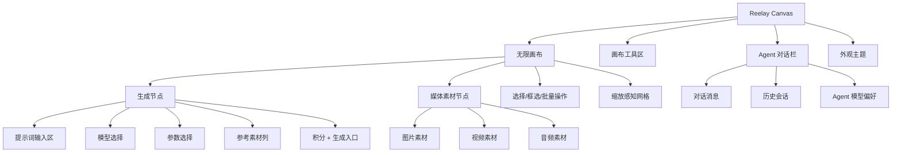
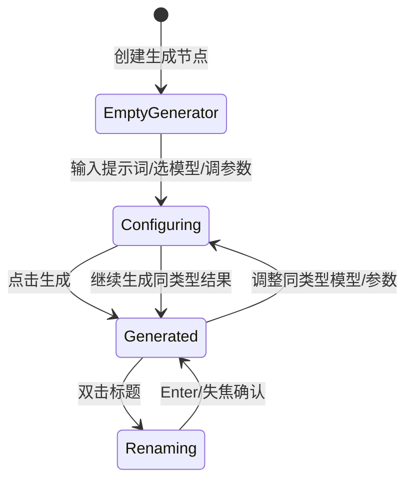

# Reelay Canvas 当前产品与实现说明

更新日期：2026-07-22

## 1. 产品定位

Reelay Canvas 是面向 AIGC 创作流程的无限画布原型。它不是传统表单式生成工具，而是把“生成节点、参考素材、媒体结果、Agent 协作”放在同一块可缩放画布中，让用户用空间关系组织创作。

当前阶段的目标不是完成真实生成能力，而是验证：

- 生成节点在画布中的形态是否足够清晰。
- 图片、视频、音频素材是否能作为输入对象被组织。
- 生成节点与素材节点的信息层级是否符合创作平台的使用习惯。
- Agent 对话栏是否能作为画布旁的辅助创作入口。
- 浅色/深色模式下的视觉基调是否稳定。

## 2. 当前状态边界

这是一个本地可运行的产品原型：

- 没有真实 AIGC API。
- 没有生产账号生命周期、云端素材库、积分账本或公开部署；项目元数据、演示会话与路由画布文档已持久化到本地 PostgreSQL。
- 本地主链路已经进入 React browser routes：`/app/login`、`/app/w/:workspaceId`、`/app/w/:workspaceId/projects` 和受保护的画布宿主路由。页面通过 HTTP adapters 消费本地共享 API；静态登录 / 主页双轨已经删除，`index.html` 只保留为迁移期旧画布 iframe。
- 五个固定 `.test` 演示账号由服务端校验并使用 HttpOnly Cookie 维持独立会话；这只验证登录、路由保护、单组织成员关系和项目级访问控制，不是正式账号系统。
- 用户、会话、唯一组织 Workspace、Project、项目成员关系与 CanvasDocument 保存在本地 PostgreSQL，服务重启后保留；内存 adapter 只用于快速契约测试。
- 从受保护路由进入的旧画布会恢复多画布、节点、组、视口和模型参数；直接打开静态 `index.html` 仍是单次页面内存原型。
- “生成”是模拟行为，用于验证生成后的媒体状态、标题和规格展示。

这意味着当前项目更接近“可交互产品样机”，不是生产应用。

### 2.1 登录流程原型

`/app/login` 是当前本地主链路的账户密码登录页，但不是已完成的生产账号系统：

- 使用明显虚构的 `.test` 演示账号并默认填充；服务端校验固定演示密码并创建 HttpOnly 会话 Cookie。
- 未登录访问工作空间或项目深链时会进入登录页；登录后只恢复当前账号有权访问的 `/app/w/...` 目标，外部或越权返回地址会回退到所属组织主页。
- 注册、忘记密码、短信验证和第三方登录均未接入；当前页面为验证完整登录版式而展示忘记密码、Google 登录、协议和注册入口，点击后只出现会自动消失的未接入提示。
- 左侧使用用户确认的白色环形空间与 Reelay 机器人视觉，右缘通过页面层的浅色渐变和细颗粒带过渡到登录栏，Logo 仍由真实页面元素呈现；浅色 / 深色沿用 `reelay-theme-mode`。
- 右侧按账户密码主流程展示登录、忘记密码、Google 登录、协议与注册入口；除账户密码演示提交外，其余入口当前只给出会自动消失的原型提示，不伪装为已接入能力。
- 正式账号、密码重置、风控和成员管理不得直接在固定演示账号上扩写；后续账户能力只进入 React 路由和明确的服务边界。

### 2.2 登录后主页原型

`/app/w/:workspaceId` 已实现为登录后创作主页，不是公开营销落地页。它当前包含：

- Reelay 品牌字标与头像账户入口；工作台顶部不再单独暴露积分按钮，`3000 / 0` 模拟积分显示在头像展开的账户面板中。
- 三张可切换的创作主题卡：AI 分镜与脚本协作、视频创作工作流、项目素材统一组织。
- 创作意图输入框与能力快捷项；提交非空意图后进入画布，并通过单次 `sessionStorage` 交接在当前画布中心创建已填写提示词的生成节点。
- 最近项目区固定以“新建项目”作为首张卡，后接四张从当前账号可访问工作空间按更新时间混排的项目，不在该区域再次分栏；协作项目在最近项目和项目库中都以右下角多人图标标识。项目卡文字固定为项目名称和最近编辑时间两行。
- `/app/w/:workspaceId/projects` 是常规全部项目路由，个人 / 协作项目标签在同一组织内按项目访问类型筛选，不再切换 Workspace，并支持本地搜索。两个分类都固定以“新建项目”作为首张卡，并混合本地演示封面和无缩略图的轻量语义卡。
- 鼠标进入现有项目卡或键盘焦点进入卡片时，封面右上角显示三点菜单；同一时间只展开一个项目菜单，点击外部、焦点移出或按 `Esc` 都会收起。`admin/edit` 可见重命名与修改封面，个人项目对当前创建者开放删除；协作项目仅项目级 `admin` 可执行删除，`edit` 会看到禁用态及权限提示，`view` 只可打开。只有个人项目的 `admin` 可见转为协作项目。信息区对可编辑成员显示快捷编辑笔。新建、重命名和删除写入 PostgreSQL；删除前必须二次确认，删除后项目立即从相关成员的列表和画布入口隐藏，但保留项目、成员关系与 CanvasDocument，等待后续回收站恢复。修改封面和转为协作项目仍是明确的未接入提示。
- 五个账号都属于 `星海视觉工作室`。个人项目只对创建者可见；协作项目只对显式加入的组织成员可见，项目角色为 `admin/edit/view`。组织 Membership 只证明账号属于组织，不能替代项目权限。浅色 / 深色仍是设备级偏好。
- 工作台顶部账户入口以紧凑的“组织标识 + 可截断组织名 + 个人头像”组合显示；hover 展开后显示当前登录账号与 `星海视觉工作室`。积分摘要与组织归属合并为同一账户概览块，共用底色与圆角，内部仅使用低对比度分隔线；组织行不再重复显示“所属组织”分组标题，直接展示账号角色（主账户 / 管理员 / 成员）。组织图标、名称、角色和末端层级箭头均保持稳定，不添加自定义 hover 动画、描边或文字提示；当前页面尚未实现时点击后给出轻量提示。画布 iframe 也从宿主上下文读取同一账号、组织和角色，不再把所有成员硬编码为主账户。
- “账号设置”在 React 宿主中以桌面弹出面板打开，包含“个人主页 / 积分记录 / 用量看板”三栏；不包含订阅和设备管理。个人主页展示固定演示身份、组织角色，并可选保存独立的联系邮箱与手机号码。联系资料不改变登录标识，也不会自动订阅报表；后续报表发送必须另设显式开关。积分记录和用量看板在真实账本与任务统计接入前只展示标明边界的空状态，不生成虚构流水。旧画布中的账号设置入口通过 bridge 打开同一面板。
- 当前只以桌面浏览器为产品目标，支持键盘焦点和 `prefers-reduced-motion`；已有窄屏降级样式可保留作防御性布局，但不作为移动端产品承诺。高度超过 `1050px` 的桌面视口会适度增加顶部留白、输入区高度和区块间距，普通笔记本高度保持紧凑节奏。

主页与画布的边界：

- 新主页和项目库位于 `src/pages`，共享项目卡、账户栏和主题位于 `src/shared`，数据只通过 `src/application` ports 与 `src/infrastructure/http` adapters 进入页面；不进入 `app.js` 或 `styles/app.css`。
- 主页创建项目后进入 `/app/w/:workspaceId/projects/:projectId/canvases/main`。宿主会先校验会话、工作空间和项目，再以 iframe 打开旧画布并通过一次 `canvas:ready` 握手发送版本化上下文与 CanvasDocument；旧画布按 `projectId + canvasId` 自动保存迁移快照。新项目尚无服务端文档时，主页提示词形成的首个节点会立即写入 revision 1，不需要等待用户再次操作。
- 旧画布内部的“回到主页 / 全部项目 / 退出账号”入口通过 bridge 请求宿主导航；宿主在 dirty 与保存任务清空后进入 React 路由或提交退出 action，不再依赖静态页面。
- 模拟积分仍没有共享账本；React 页面和旧画布刷新后都显示当前阶段的 `3000 / 0` 测试基线。
- 素材、模板、组织管理和更多能力入口只给出明确原型反馈，不伪装为已实现页面。

路由画布保存边界：

- `admin/edit` 可以保存，`view` 只能读取；服务端每次请求仍按 ProjectMembership 校验，前端只读标识不是授权依据。旧画布的只读模式禁用拖动、删除、新增、生成、重命名和参数修改，保留选择、平移缩放、预览与下载；加载失败时不挂载 iframe，并提供重试入口。
- 保存内容是 `schemaVersion = 1` 的迁移快照，使用逐字段 allow-list 保存内部画布、节点、组、视口和最近模型参数。账号、选择态、撤销栈、生成任务、积分和 Agent 对话不会写入；行为测试会执行真实序列化与恢复，并验证未知 / 恶意字段和不可恢复 URL 不会穿透边界。
- 当前旧画布内部仍可管理多个画布；迁移阶段把它们作为一个 bundle 存在路由的 `main` CanvasDocument 中，并不宣称已经拆成多条正式 Canvas 实体。
- 本地文件的 `blob:` 地址不会被伪持久化；刷新后只保留可恢复的节点结构，素材二进制仍等待 Asset / Blob 存储。
- 保存使用乐观 revision；发现其他窗口已先保存时停止自动覆盖并提示重新进入项目，不做静默的最后写入覆盖。
- 已软删除项目的详情与 CanvasDocument HTTP 访问立即返回不可用；若项目在已打开画布保存期间被删除，宿主会卸载 iframe 并阻止后续写入，不让用户继续编辑一个无法保存的项目。

## 3. 信息架构



## 4. 主画布设计

画布是产品的主工作区。当前实现包括：

- 初始空状态：中心显示低权重提示标记和创建引导，不作为主视觉或强按钮。
- 双击画布：创建生成节点。
- 鼠标滚轮：在画布空白区平移画布；`Ctrl/Cmd + 滚轮` 以鼠标所在位置为缩放中心。
- 当鼠标位于模型列表、参数面板、素材菜单、Agent 面板等功能区时，滚轮只作用于该功能区，不触发画布平移或缩放。
- 当鼠标位于 Logo、节点输入区、模型列表、媒体工具栏等功能区时，滚轮只作用于该功能区，不触发画布缩放或平移；浏览器原生页面缩放保持可用。`Ctrl/Cmd + +/-/0` 不再被画布全局接管。
- 空格拖拽：平移画布。
- 中键拖拽：平移画布。
- 中键或空格平移优先级高于节点拖拽，即使鼠标起点在媒体节点上也应移动画布。
- 空白拖拽：框选多个节点。
- 单选或框选节点后，节点媒体框外侧显示中性色选择轮廓与轻量 halo；图片/视频/音频本身的边框颜色只表达媒体类型，生成节点输入面板不额外高亮。
- 缩放感知网格：近景可见，远景淡出，分别适配浅色和深色模式。
- 左下角画布工具组：资产库入口独立保留，旁边的画布工具按 `小地图 → 适应视图 → 画布比例` 排列；快捷键入口已移入右上角个人菜单的二级小层级。
- 适应视图：有选中内容时优先适应选中内容；未选中时先判断全量内容是否可读，若节点被远距离孤立点拉散，则聚焦主内容簇并保持最低可读缩放，小地图继续表达远处内容位置。
- 画布比例：使用常驻小滑条直接调节，范围为 20% 到 200%，滑条左侧不再显示额外图标；hover、拖动滑条或滚轮缩放时，滑条右侧临时展开显示当前百分比，平时收起。
- 小地图：根据节点世界坐标生成缩略分布图，并显示当前视口矩形；拖动视口矩形或点击小地图区域可实时导航主画布。

设计意图：

- 网格是空间感辅助，不应该压过节点内容。
- 空状态是轻量引导，不作为品牌主视觉。
- 节点被点击时会提升层级，避免多个节点重叠时遮挡当前工作对象。
- 小地图是导航控件，不承担内容预览；它只表达空间位置、节点分布和当前可视区域。

## 5. 左下角工具区

左下角当前有一组贴边画布工具：

- 资产库：打开当前项目资产库，展开后可进入全局资产库。
- 画布工具：小地图、适应视图、画布比例。

快捷键说明放在右上角个人菜单的“帮助中心”子层中；“帮助中心”使用 hover intent 展开：鼠标进入帮助中心行时自动展开缩进子层，向下滑动到子层或“退出账号”路径时保持展开，不让退出账号位置因子层收起而跳动；只有鼠标向上越过帮助中心行或关闭个人菜单时才收起。帮助中心父级也支持键盘 Enter / Space 展开或收起。帮助中心父级使用问号语义图标；父级右侧箭头在收起时向右，展开时旋转为向下，表达当前层级状态。子层包含“快捷键”、“使用教程”和“反馈问题”，视觉上从属于帮助中心而不与主菜单同级。子层不使用左侧竖线，也不显示右侧展开/外链提示图标，避免轻量菜单内信息噪声过高。hover 到“快捷键”时再展开窄高型快捷键清单；清单不重复显示标题，仅保留语义标签，并与个人菜单保持可见间距，避免遮挡主菜单。点击“使用教程”会打开线上手册，点击“反馈问题”会打开飞书反馈表。外观菜单项直接显示当前主题名称（浅色模式 / 深色模式），点击整行即可在两种模式间切换；右侧切换胶囊平时隐藏，hover 到整行时轻量显示，点击切换时短暂增强并播放滑动反馈动画。

右上角包含：

- 分享：调用系统分享能力，缺少支持时复制当前项目链接。
- 个人与积分：可用积分显示在头像左侧，并与头像保持在同一绑定容器；积分徽标使用与工作台一致的 Sparkles 图标，不表达在线状态。当前积分只读展示，不响应点击或展开个人菜单；独立的积分明细与后续操作入口留待下一阶段设计。hover 头像仍预展开账户菜单。
- Agent：收起时固定显示在个人入口右侧，点击展开右侧对话栏。

Agent 对话栏展开或调整宽度时，右上角操作区按对话栏实际宽度平滑左移。生成节点不再设置常驻添加按钮；用户通过双击画布创建节点，空状态只提供视觉提示。资产库展开后，两组底部工具平移到面板右侧，保持入口与当前面板的空间关联。
资产库展开后的收起按钮位于面板左下角，数量统计位于右下角；当前按桌面视口验收，历史窄屏规则仅作为防御性降级保留。
当前产品以桌面端创作工作流为目标，后续功能设计、视觉验收与回归测试均以桌面视口为主；已有窄屏降级样式可保留，但不再作为当前阶段的主动适配范围。

设计原则：

- 删除不暴露为常驻按钮，保持画布工具简洁。
- 个人入口承担轻量账户信息与积分感知；外观是账号菜单中的子层。

## 6. 项目与画布导航

左上角显示紧凑项目导航，结构为：`Logo + 项目名 + 画布名`。

当前交互：

- React 工作台已经有真实 browser route identity；从主页或项目库打开项目时，会先验证当前会话能否访问对应 workspace / project，再进入 legacy canvas host。
- 该路由身份目前只保护入口和传递上下文，不会让旧画布自动加载同名项目内容；旧画布仍只有页面内存中的项目名、多画布和节点状态。
- 旧画布 Logo 按钮保留项目菜单：回到主页、全部项目和退出由宿主在保存收尾后执行 React 路由；创建 / 删除仍是画布内原型行为，不应描述为完整项目管理能力。
- 通用确认弹窗使用浏览器模态对话框：打开时焦点进入操作按钮，Tab 不会离开弹窗，Escape 可关闭，关闭后焦点返回原入口。
- 项目名默认是 `Untitled`，支持双击重命名。
- 画布名默认是 `画布 1`，支持双击重命名，也可在画布菜单中执行重命名。
- 画布菜单支持添加画布、切换画布、复制画布、删除画布。
- 复制画布会为画布、节点、组、节点内素材和生成结果重新分配标识并修正内部引用；副本不继承撤销历史，也不会复制仍在运行的生成任务。
- 删除画布需要确认；至少保留一个画布。
- 每个画布在当前页面生命周期内维护独立的节点、组、视口位移、缩放、层级计数和撤销历史。
- 模拟生成任务记录项目、画布和节点归属以及启动时的参数快照；生成期间锁定该节点的生成输入，包括资产库选择、本地文件选择和拖放等外部素材入口，切换画布后仍按启动快照把结果写回发起任务的画布。删除节点 / 画布或重置项目时会取消相应任务。
- 资产库展开时，画布自身左上角导航隐藏，只保留资产库面板顶部的同一套项目/画布导航，避免出现两个 Logo 和两组项目入口。

项目名重命名交互：

- 双击标题可改名。
- Enter 确认。
- Escape 取消。
- 空值会回退为 `Untitled`。

后续如果加入项目存储，项目名、画布名和多画布列表都应变成项目元数据的一部分。

### 6.1 资产库中的画布元素列表

资产库默认展开当前项目内容，不直接进入全局资产库。右侧书本图标切换到全局资产库；进入全局后，该按钮变为返回项目资产库。

当前交互：

- 面板右边缘可拖拽改变宽度，内部列表和卡片会根据宽度自适应列数与可读布局。
- 面板收起时使用 `inert` 和 `aria-hidden` 退出键盘与读屏访问；如果焦点仍在面板内，关闭后会返回资产库入口。
- 历史窄屏规则会在极窄视口把资产库切成全屏面板并隔离背景焦点；该规则保留用于避免界面失控，不代表当前阶段开发或验收移动端画布。桌面宽度下资产库和其他侧栏仍可并行操作。
- 顶部使用紧凑分段展示 `画布` 与 `资产` 两层，并显示各自数量。
- `画布` 标签展示当前画布中的节点和组，提供搜索和类型筛选。
- 组以树状层级显示，组内节点缩进显示；这比扁平列表更符合画布结构。
- 点击列表中的节点或组会定位主画布视图到对应位置，并同步选中目标。
- `资产` 标签展示当前项目沉淀资产，使用卡片网格展示，并按 `角色`、`场景`、`道具`、`素材` 四类筛选；该页不显示搜索入口，避免轻量项目侧栏变成完整资产管理页。
- 底部左侧以轻量文字显示当前数量统计。
- 全局资产库的 `个人空间`、`组织空间`、`官方空间` 三个入口显示在顶部同一分段区域，不再占用左侧竖向空间；内容区暂以空间说明和文件夹视图承载资产，文件夹内默认预览显示，并可切换为列表显示。

## 7. 生成节点

用户描述中“图像节点/视频节点”在产品语言中统一称为“生成节点”。它根据选定模型的类型呈现为图片或视频生成能力；音频暂不进入生成模型选择，只作为可上传、播放和编辑的画布素材。

### 7.1 初始状态

生成节点初始不显示媒体标题。原因是此时它还没有生成结果，显示“未命名图片”会让用户误以为已经存在一个输出媒体。

初始状态包含：

- 媒体预览框。
- 提示词输入面板。
- 添加素材入口。
- 模型选择。
- 参数选择。
- 生成数量。
- 积分 + 生成按钮。

### 7.2 模型选择

当前示例模型：

| 类型 | 模型 |
| --- | --- |
| 图片 | GPT Image 2、Nano Banana Pro、Nano Banana 2、Midjourney V8.1/V7、Niji 7、Seedream 5.0 Lite |
| 视频 | Seedance 2.0/Fast/Mini、Kling Video 3.0/Omni、Veo 3.1 |

模型选择逻辑：

- 不是先选择“图片/视频模式”，而是先选模型。
- 在节点尚未成功生成结果时，用户确认模型后，节点类型随模型类型变化。
- 第一次成功生成后，节点的图片 / 视频属性被锁定；仍可切换同类型模型和继续生成，但不能再选择另一种媒体类型的模型。跨类型创作应新建节点，避免一个节点未来的结果历史混入不同媒体结构。
- 新建节点默认沿用上一次生成节点的模式和参数，减少重复切换。
- 未锁定节点的图片、视频模型位于同一个连续滚动列表中，并用分组标题区分；锁定后保留两个类型标签作为状态提示，另一类型不可用，列表只展示当前类型模型，并显示“已生成图片/视频，此节点仅可继续使用图片/视频模型”。生成节点与 Agent 的模型选择入口统一使用线框立方体图标；展开后的具体模型仍显示各自的模型标识。
- 顶部分类栏用于快速定位；滚动进入新分组时，分类指示器会平滑滑动到对应类别。
- 面板标题简化为“模型”；分组标题随列表自然滚动，不做吸顶占位。
- 音频暂不提供生成模型，只作为可上传、播放和编辑的画布素材。

### 7.3 提示词输入区

- 点击右上角展开按钮只增加纵向空间，不改变输入区基础宽度，也不会推动媒体框横向位移。
- 长提示词自动换行并向下扩展；达到高度上限后，输入区内部滚动。
- 输入区打开时会根据画布比例做有限度的反向缩放补偿：画布缩小时输入区相对放大，画布放大时输入区相对收紧，保持文字可读性。
- 输入区屏幕宽度在远景和近景间平滑约束，远景不会缩成细条，近景不会跟随媒体无限放大。
- 补偿比例有上下限，不会变成脱离节点的固定屏幕面板。

### 7.4 参数

参数不再按媒体类型写死，而由每个模型的能力表动态提供：

- 参数面板不显示冗余的“参数”总标题；比例使用方向图形与比例值组合呈现，分辨率、画质和时长使用紧凑分段选择。
- 生成数量仍保留在提示词面板底部控制栏，不并入参数浮层。
- GPT Image 2 支持满足官方边长、像素量和长宽比约束的灵活尺寸；原型提供常用比例、`1K / 2K / 4K` 与低/中/高生成质量。
- Nano Banana 系列支持 `1K / 2K / 4K`；Midjourney V8.1 支持原生 `1K / 2K`；V7 与 Niji 7 只显示原生 `1K`。
- Seedance 2.0 提供 `720p / 1080p / 4K` 产品档位；Fast 与 Mini 提供 `480p / 720p`。
- Veo 3.1 的 `1080p / 4K` 只允许 8 秒，选择画质后时长会自动纠正。
- Veo 3.1 单次只允许生成 1 个结果；其他模型按能力提供 1x、2x 或 4x。

完整能力表和来源见 `docs/model-catalog-notes.md`。

积分显示与生成按钮融合在同一个操作区，避免把不可点击的积分做成独立按钮。
右上角头像左侧保留轻量只读积分显示，初始可用积分为 `3000`；点击积分不会展开个人菜单，个人菜单也不重复显示积分。当前测试原型只在单次页面生命周期内扣减可用积分并增加累计消耗，刷新页面后重置为 `3000 / 0`。

### 7.5 添加素材

生成节点输入面板内有“素材”入口。

当前支持三类入口：

- 从本地上传。
- 从资产库添加。
- 从画布中选择。

当前实现中：

- 本地上传会把素材加入生成节点上方素材列。
- 从资产库添加会打开与左下角资产库入口共用的项目素材面板；选择后加入当前生成节点的素材列。
- 从画布中选择当前仍是模拟素材，用于验证信息结构。
- 添加素材菜单在提示词面板左侧外部展开，避免覆盖输入内容。
- 点击空白区域时，小菜单会收起。
- 点击生成节点媒体框时，输入面板可展开；点击其他区域可收回。

### 7.6 资产库

左下角资产库是画布媒体输入与画布内容导航的统一入口。展开后默认是当前项目侧栏，而不是直接进入全局资产库。面板默认宽度加宽到更适合列表阅读的尺寸，并可通过右边缘拖拽调整。

当前项目侧栏包含：

- 画布：当前画布中的生成节点、素材节点和组框，提供搜索、类型筛选与点击定位，列表以组树表达层级。
- 资产：当前项目内沉淀的可复用素材，采用卡片网格并按角色、场景、道具、素材四类筛选；音频也作为可复用素材处理。

顶部右侧的书本图标是全局资产库入口。只有点击该图标时，面板才切换到全局资产库；进入全局后，该按钮变为返回当前项目资产库。

全局资产库空间说明：

- 个人资产：跨项目使用的个人全局资产。
- 官方公用库：当前提供公共音效样例。
- 组织空间：同一组织成员共享的资产。

通用能力：

- 支持在当前项目的画布与资产之间切换；打开生成节点的“从资产库添加”时默认进入当前项目资产。
- 只有点击书本图标才进入全局资产库；进入后可在顶部的个人空间、组织空间、官方空间之间切换。
- 支持搜索当前画布和当前全局资产空间；当前项目资产页保持轻量，不显示搜索入口。
- 资产库面板暂不提供上传素材按钮；素材进入仍通过画布本地拖入、生成节点素材入口或批量保存到项目资产完成。
- 画布页支持全部、生成、图片、视频、音频、组筛选；当前项目资产页支持角色、场景、道具、素材四类筛选；全局资产库暂不做类别筛选，改为按个人、组织、官方空间下的文件夹承载。
- 点击画布元素列表项会定位并选中对应节点或组框，用于在大画布中快速导航。
- 双击素材或点击素材右下角操作按钮，可把素材加入当前视口中心。
- 素材可以直接从面板拖到画布指定位置；拖到生成节点上时会成为该节点的参考素材。
- 从本地直接拖入画布或生成节点的媒体，也会同步登记到当前项目资产。
- 后续真实资产中心再接上传与全局空间保存；当前原型中的全局资产库只验证空间与文件夹浏览方式。
- 资产库当前保存在页面运行内存中；本地文件使用浏览器对象地址，刷新页面后不会保留，后续需要由真实上传与项目存储服务替换。

设计边界：

- 当前资产库是项目画布内的轻量投影，不承担完整资产中心的批量管理、详情检查器和引用关系管理。
- 当前界面中的“项目资产”仍是原型临时数组，不代表未来 Asset 的所有权。正式数据层采用 Workspace Asset + Project / Node AssetReference；GenerationResult 只有在用户或规则显式保存后才晋升为 Asset。
- 右侧空间继续保留给 Agent 对话栏；完整资产中心应在后续工作台页面中实现，当前书本图标只是原型中的全局库入口。

### 7.7 生成后状态

点击生成后，节点进入真实媒体模拟生成流程：

- 提示词为空时，生成入口显示为不可用暗色状态，悬停提示“请输入提示词”，不弹出打断式提醒。
- 生成前检查可用积分是否足够。
- 模型参数或价格配置不完整时禁止单个 / 整组生成，不以 `0` 积分或默认价格静默执行。
- 开始生成时扣减可用积分，并增加累计消耗。
- 节点会短暂显示“生成中”状态。
- 生成任务按 `projectId / canvasId / nodeId / taskId` 定位，切换画布不会使任务停滞或完成到同 ID 的副本节点。
- 首次成功结果按任务启动时的参数快照写入 `lockedMode`，从此成为节点级媒体类型契约；重新生成期间即使预览状态变化，也不会解除该契约。
- 成功生成是该节点生成参数的撤销提交边界：完成前积累的节点参数快照会被移除，避免 Ctrl+Z 用陈旧的空节点快照覆盖刚完成的结果或绕过类型锁。当前这不是完整生成历史或结果版本撤销。
- 图片结果显示真实在线图片。
- 视频结果显示真实在线视频。
- 当前模拟素材来源：图片使用按节点 id 生成 seed 的在线图片，因此不同生成节点通常会得到不同图片且同一节点生成后保持稳定；视频当前使用固定公开样例素材，用于验证播放与媒体展示形态。
- 图片结果默认名：`Generated image`。
- 视频结果默认名：`Generated video`。
- 生成后才显示媒体标题。
- 标题可双击改名。
- 图片右上角显示生成分辨率，例如 `2048 x 1152`。
- 视频右上角显示画质，例如 `480p`。
- 单选已有内容的媒体节点时，在媒体框上方显示上下文编辑工具栏；空生成节点不显示。

### 7.8 媒体编辑工具栏

- 图片默认提供 HD 放大、裁剪、去背景、加入资产库；扩展菜单包含橡皮擦、调整和旋转。
- 视频默认提供画质增强、裁剪片段、提升帧率、加入资产库。
- 音频默认提供音质增强、裁剪片段、降噪、加入资产库。
- 下载始终位于工具栏右侧并使用图标表达。
- 工具栏使用独立缩放补偿，在远景和近景下保持接近一致的屏幕可读尺寸；靠近视口顶部时自动下压到可见区域。
- 工具栏只在单选并点击有内容的媒体框时出现；点击画布空白、其他面板或其他非媒体区域时收起。工具栏本身不使用投影，避免在素材节点上形成额外阴影层。
- HD/画质/音质增强当前更新原型媒体状态；加入资产库和下载已具备实际交互，其余编辑项保留明确的服务接入入口。
- “自定义工具栏”支持固定或取消固定工具，并可选择是否显示工具名称；设置保存在浏览器本地。



## 8. 媒体素材节点

媒体素材节点代表用户拖入画布的输入对象。本身不显示提示词输入面板，避免和生成节点混淆。

当前支持：

- 图片。
- 视频。
- 音频。

### 8.1 命名规则

本地拖入或上传的文件：

- 左上角显示类型图标 + 文件名。
- 默认去掉文件扩展名作为显示名。
- 可双击改名。
- 改名只影响画布显示名，不改变原始文件名。

### 8.2 规格展示

图片素材：

- 按原始比例展示。
- 元数据加载后显示真实尺寸，例如 `1280 x 720`。

视频素材：

- 按视频原始比例展示。
- 显示视频封面/播放器。
- 元数据加载后显示真实尺寸。

音频素材：

- 不使用浏览器原生长条播放器作为主要视觉。
- 使用中心实时波形形式表达音频媒体。
- 播放时波形轨道会根据音频进度向左推进，固定播放头保持在中线。
- 底部中间提供播放/暂停按钮。
- 播放按钮下方提供类似视频播放器的进度条，便于长音频定位。
- 波形区域采用时间带拖拽：向左拖动波形表示跳过即将播放的内容，播放进度向右推进；向右拖动波形表示回退。
- 底部进度条采用播放器式定位：点击或拖动到某一位置时，直接跳转到对应播放进度。
- 播放时波形有轻微动态反馈。
- 元数据加载后可显示时长。

## 9. 多选与批量操作

当前支持：

- 点击节点选择。
- Shift 点击追加/移除选择。
- 空白拖拽框选多个节点。
- 多节点一起移动。
- Alt 拖拽复制节点，并保留内部参数。
- 多选后显示上下文工具条：选中数量、打组、整理布局、批量保存到项目资产、下载和删除。
- 布局支持宫格布局、水平布局、垂直布局。
- 整理布局和下载使用悬浮预览菜单；下载支持批量下载，打包下载在当前静态原型中以逐个文件下载模拟。
- 批量保存到项目资产只保存已生成或已有媒体内容的节点；空生成节点不会被写入资产库。
- 创建组后生成可视化组框，组框带标题、边界和组级工具条。
- 点击组内节点时仍选中节点；点击组框空白区域时选中组。
- 选中组框后可拖动整组、手动拉伸组框边界、解组、执行整组生成。
- 组框是独立容器，不再自动按成员节点收缩；节点拖入组框会加入组，拖出组框会移出组。
- 组工具栏不提前显示预计积分；点击整组执行后才检查提示词、计算积分并在确认框中展示，已在生成的节点不会重复执行或计费，确认后只按实际成功启动的节点扣除积分。
- Delete/Backspace 删除选中节点；如果选中的是组框，则删除语义为解组。
- 删除完整组内容前会确认；键盘 Delete 作用于组框时会确认解组，工具栏解组按钮作为显式操作可直接执行。
- 删除后显示轻量撤销提示；节点/组移动、组框缩放、生成参数修改和媒体重命名仍可通过 Ctrl+Z 撤销，但不主动弹出“已更新”类提示，避免高频编辑造成反馈噪声。项目重命名当前不进入画布级撤销历史。

后续建议：

- 组标题应支持重命名。
- 排序可继续扩展为等距、左/右/顶/底对齐和按类型排列。
- 撤销系统后续还需覆盖复制、建组、布局和生成任务。

## 10. Agent 对话栏

Agent 对话栏是画布右侧辅助创作入口。

收起状态下，Agent 面板退出键盘和读屏访问；从 launcher 打开时焦点进入输入框，从面板内关闭时焦点返回 launcher。在 `480px` 及以下视口中，Agent 全屏打开时隔离画布、资产库和其他背景区域，但保持整个 Agent dock 可操作；关闭或回到更宽视口后恢复背景访问。

### 10.1 收起状态

默认收起为右上角个人入口右侧的 Agent 徽标，和分享、个人入口形成同一操作组；徽标不支持拖动，点击后展开右侧完整对话栏。

交互：

- 悬停显示 `Reelay Agent`。
- 点击展开完整侧栏。

### 10.2 展开状态

包含：

- 顶部对话名。
- 新建对话按钮。
- 历史会话下拉。
- 关闭按钮。
- 中间消息区域。
- 底部输入框。
- Agent 模式按钮。
- 模型偏好按钮。
- 发送按钮。
- 输入框支持 Enter 发送、Shift + Enter 换行；消息区可滚动查看历史消息并在发送后滚动到底部。

### 10.3 历史会话

历史下拉包含：

- 搜索框。
- 当前会话。
- 示例历史记录。

当前只是本地静态示例，不连接真实历史数据。

### 10.4 模型偏好

Agent 输入框右侧有模型偏好图标。

打开后：

- 显示 Image / Video 两个分组。
- 模型是偏好池，可多选，不是单选当前模型。
- 点击模型只切换勾选状态，面板不会立即关闭。
- 顶部“模型偏好”、自动开关和分组栏固定不滚动；模型列表采用与生成节点一致的连续滚动面板，分组栏用于快速定位并随滚动位置更新当前类别。
- 点击面板外部时收起模型偏好面板。
- 悬停按钮可通过 title/aria-label 提示当前已选模型。

## 11. 主题系统

当前支持：

- 深色模式。
- 浅色模式。

主题数据存储在 `localStorage` 中；没有保存值时，登录页、主页和画布统一以浅色模式开始。

设计要点：

- 画布背景不使用纯黑/纯白，而是轻微渐变。
- 网格点根据主题调整颜色。
- 节点、Agent 面板、浮层、按钮都使用 CSS 变量适配主题。
- 个人菜单中的外观行只保留浅色 / 深色两态切换，不再提供跟随系统入口；旧的 `system` 本地值会在读取时解析为当前浅色或深色状态。

## 12. 当前实现结构

```text
index.html
  定义迁移期旧画布的页面骨架、工具栏、画布层、Agent 对话栏、隐藏文件输入和脚本加载顺序；由 React CanvasHost 以 iframe 挂载。

styles.css
  作为样式入口，导入当前原型样式。

styles/app.css
  定义主题变量、画布视觉、节点样式、Agent 样式和一个基础窄屏降级规则；当前尚不构成完整移动端画布支持。

app.js
  维护应用状态，按签名复用节点 DOM，处理画布交互、文件拖拽、生成模拟、Agent 对话。

src/config/prototype-config.js
  保存模拟媒体、官方样例素材、媒体工具栏、布局常量、资产分类和 Agent 示例会话等静态原型配置。

data/model-catalog.js
  保存图片和视频生成模型目录、展示元数据与参数能力表。

app-shell.html / vite.shell.config.ts / tsconfig.shell.json
  定义当前 `/app` 应用入口、Vite 构建 / 开发代理和严格 TypeScript 检查；开发服务器显式分流 `/app/*` 与旧 `/index.html`。

src/app / src/pages
  定义 browser route contract、登录 / 主页 / 项目库页面、route loaders / actions 和受保护的 legacy canvas 路由宿主。

src/domain / src/application
  定义不依赖 React、DOM 或持久化实现的 Session、Workspace、Membership、Project 与 CanvasDocument 边界。

src/infrastructure/http
  用 Zod 校验 HTTP DTO，并实现浏览器 Session gateway 与 Workspace / Project repositories；领域对象不直接依赖传输格式。

src/server
  定义 Fastify 本地共享 API、HttpOnly 演示会话、异步 collaboration store 边界与 PostgreSQL adapter；内存 adapter 只保留作快速契约测试和显式开发回退。

src/shared
  定义迁移页面共用的品牌、账户栏、项目卡、主题和短暂提示能力。

src/legacy-canvas
  定义版本化同源消息协议和旧画布隔离宿主；旧画布通过单一 ready 握手消费 `host:init` 与 `host:document`，并回传保存请求。
```

核心状态在 `state` 对象中：

- 画布：`tx`、`ty`、`scale`。
- 节点：`nodes`、`selectedIds`、`activeId`、`zCounter`。
- 项目/画布：`projectName`、`canvases`、`activeCanvasId`。
- 生成默认值：`lastPreset`。
- 操作状态：`action`、`isSpaceDown`。
- 撤销：当前活动画布映射到各 `CanvasDocument` 自己的 `undoStack`；项目重命名不写入该栈，生成中的节点不会被参数撤销恢复为陈旧任务状态，成功生成后会清理该节点在本次结果之前的参数快照。
- 生成任务：`generationTasks`，任务记录项目 / 画布 / 节点归属、启动参数快照和计价结果。
- 节点结果类型：生成节点的 `lockedMode` 在首次成功前为 `null`，成功后固定为 `image` 或 `video`；旧原型节点可从已有 `generatedAsset.type` 补齐该值。
- Agent：`agentOpen`、`agentWidth`、`activeConversationId`、`agentModelId`、`agentModelIds`；单双字段是当前兼容状态，不应直接复制到正式 Conversation schema。
- 资产库：`libraryView`、`librarySearch`、`libraryFilter`、`libraryScope`、`libraryCollapsedGroups`、`globalLibraryDisplay`。
- 主题：`themeMode`。

## 13. 工程质量评估

当前原型已经从纯静态样机进入“本地真实纵向链路”阶段：

- 没有引入复杂依赖，打开成本低。
- 交互逻辑集中，方便快速迭代。
- 样式使用 CSS 变量，浅深模式可维护。
- 节点数据模型已经区分生成节点和素材节点。
- 媒体比例、元数据、命名、选择、撤销等关键体验已经有基础。
- 节点渲染已避免每次清空整个媒体层，普通移动、选择和无关状态更新会复用已有 DOM。

但它还不符合生产级前端工程标准：

- 主要交互逻辑仍集中在 `app.js`，继续扩大后会难以维护。
- 当前完整样式仍集中在 `styles/app.css`，已经有入口层但还未按区域拆分。
- 迁移页面已经按 route、共享 UI、application port、HTTP adapter 和 server 边界拆分；旧画布仍缺少相同级别的模块边界。
- 旧画布已有 JavaScript、配置、CSS、HTML 检查以及序列化 / 只读行为测试；React 壳已有 Vite 构建、严格 TypeScript 与 Vitest，统一入口为 `npm run check`。关键画布手势仍需浏览器运行验证。
- 暂无代码格式化、lint 和自动浏览器端到端测试；当前 React 主链路已完成两套隔离浏览器的人工验证，下一阶段应把稳定的登录、路由保护和组织共享流程固化为 E2E。
- 会话、账号联系资料、Workspace、Membership、Project 与 CanvasDocument 已通过 PostgreSQL 持久化；项目软删除保留成员与画布数据，可重复 migration、幂等 demo seed 和重启集成测试覆盖这些边界。画布文档仍处于迁移桥阶段，资产、生成任务与积分仍只存在原型状态。
- 演示会话 token 以摘要存库并具有过期 / 撤销状态，但五个固定账号、确定性 demo 密码散列和预置项目角色仍不是正式账号生命周期或完整权限管理系统。
- 全局可变状态仍缺少统一 action/store 边界，撤销也还不是覆盖全部操作的命令系统。
- React 壳已通过包管理器和构建流程使用 Lucide；旧静态画布仍固定在 `vendor/lucide-1.25.0.min.js`，不依赖境外 CDN。

## 14. 已知工程债务

- 主交互和样式仍集中在 `app.js` 与 `styles/app.css`，新页面不能继续进入这两个单体文件。
- Legacy canvas host 与旧画布已接通 `CanvasDocument` 加载 / 保存，并修正空文档首写、重复初始化、后台生成完成和应用内导航前刷新保存。浏览器强制终止仍不能保证异步 HTTP 完成，这是 Web 生命周期本身的边界，后续正式任务系统不能只依赖页面退出钩子。
- 首次以 `view` 权限加载时已经真正只读；如果一个正在生成的可编辑会话被服务端动态降级，完成回调的权限切换仍需在引入实时权限刷新时单独验证。
- 当前 CanvasDocument allow-list 是迁移快照边界，不应继续容纳生成历史、资产二进制、积分或账号运行态；新增字段必须先明确恢复语义并扩展行为测试。
- 当前生成任务只存在页面内存中，虽已记录启动参数快照和节点级结果类型锁，但还没有持久化、节点内多结果历史、取消 UI 或失败退款。
- 当前撤销仍不是完整 command 系统，只覆盖部分画布操作；项目重命名暂不支持撤销。
- 资产仍以原型对象副本存在，Blob URL 生命周期和正式 AssetReference 尚未落地。
- 完整演进顺序只在 `docs/product-expansion-plan.md` 维护，本说明不再保留第二套路线路。

## 15. 当前产品一句话

Reelay 当前是一个本地可运行的 AIGC 创作平台原型：五个演示账号通过受保护的 React 工作台进入同一组织，使用持久化的个人 / 协作项目和项目级 `admin/edit/view` 权限，再进入旧无限画布验证生成节点、媒体组织和 Agent 辅助；正式账号生命周期、画布内容、资产、生成任务与积分仍未达到生产持久化标准。
