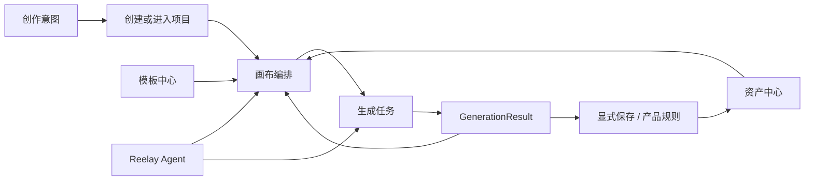
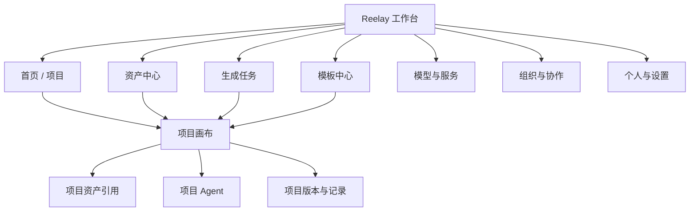
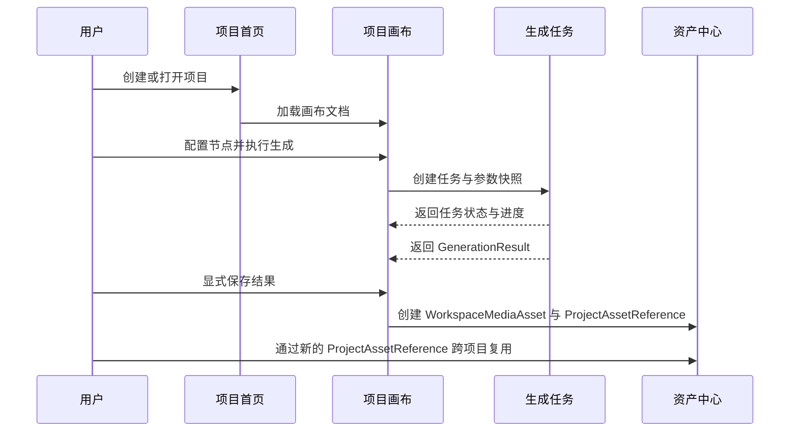

# Reelay 产品扩展规划

本文保留尚未完成的产品目标、已确认规则和待验证假设。已实现行为统一见 [当前产品规范](current-product-spec.md)，当前代码与发布状态见 [交接](agent-handoff.md)；下述页面结构是后续设计输入，不代表已实现或已排期。

## 1. 产品定位

本项目定位为 **Reelay 产品预演版**：提前构建和验证正式产品的页面结构、交互行为、业务规则、状态变化及异常恢复，供团队进行需求讨论与行为验收，并作为后续正式前端开发的产品行为蓝本。

核心原则是：**已确认的业务规则可执行，前端交互真实，后端服务可模拟。** 尚未接入的模型调用、支付、验证码和积分结算可以使用预置素材、模拟请求与可控制状态。现有共享会话、项目权限、PostgreSQL 与私有 ObjectStore 保留已验证能力，不因产品预演定位重写，也不因已有云服务而扩大生产化范围。正式授权、计费和幂等性由服务端承担，前端演示判断不能作为生产安全边界。

“完整产品体验”是逐步覆盖的目标，不代表当前所有页面或流程已经确定。每个功能应区分已确认规则、可逆设计假设和未实现能力；参考图、暂时文案和演示数据不能自动升级成产品需求。被选入当前切片的行为，应具备一致的前后状态、可解释的失败和可重复的演练方式；尚未确定的规则保留为待决事项，不由实现者静默补全。

已确认的后续方向包括主体与节点配合、项目生成历史、消息通知与必要配置、分享权限 / 申请加入闭环，以及两位成员以不同账号、不同浏览器真实同时编辑同一画布。页面内 Agent 模拟生成与画布整理已有实现，后续从现有行为继续，不重建另一套状态来源；剩余治理随产品切片推进，建议路线和阶段验收见 §8.1。

产品面向 B 端，访客主页与登录弹窗的当前行为见产品规范 §2.1。手机号 / 邮箱注册保留为后续方向；邀请码已明确用于注册资格，不能默认建立组织 Membership。邀请码的发放 / 次数 / 有效期、验证码、密码与账号关联等规则仍待确认，当前注册入口保持禁用。

蓝本应沉淀产品行为及验收场景，代码是否直接进入正式前端另行评估；画布库与组件实现属于可替换的技术选择。

Reelay 不应只是一块无限画布，也不应演变成把大量后台页面包在画布周围的重型工作台。

更合适的产品结构是：

- 工作台负责管理项目、资产、任务、模板和团队。
- 项目画布负责沉浸式创作、节点组织和 Agent 协作。
- 两种状态共享账号、积分、模型、生成任务和素材数据，但使用不同的信息密度与导航方式。

### 1.1 当前工作假设

以下是为了让基础开发可以前进而采用的可逆假设，不是不可更改的产品结论：

- 首期账号主要属于一个组织 Workspace；“个人 / 协作项目”是同一组织内的项目访问类型，不再为每个账号复制一套个人 Workspace。个人项目只对创建者可见，协作项目通过显式 ProjectMembership 分配成员与角色。
- 可跨项目复用的 WorkspaceMediaAsset 归 Workspace 所有，Project 使用 ProjectAssetReference，Node 后续也只保存显式稳定引用。尚未保存的生成结果仍是 GenerationResult，不会自动污染全局资产中心。
- 首期按 Reelay 统一提供模型服务设计，但 ProviderConnection 保留扩展边界；不在首期同时建设 BYOK 的密钥、配额和故障处理体系。
- 分享与协作继续建立在组织 Membership 和显式 ProjectMembership 之上。已有多账号项目访问基础；后续先完成授权与申请闭环，再进入真实双浏览器同时编辑。分享对象、外部成员范围和并发冲突策略仍须在相应切片确认。
- 页面与画布的技术边界沿用 [运行时 ADR](adr/0001-application-runtime-and-migration.md)。框架和画布库是可替换选择，产品扩展不以整体重写画布为前置条件。

任何一项假设改变时，都必须同时复核路由、权限、资产归属、计费和迁移策略。

核心价值链：

## 2. 产品信息架构

## 3. 导航策略

### 3.1 工作台模式

资产中心、生成任务等高信息密度管理页可以使用稳定的左侧主导航；登录后主页本身保持轻量创作入口，不为尚未实现的后台页面提前常驻完整侧栏：

- 首页 / 项目
- 资产中心
- 生成任务
- 模板中心
- 模型与服务
- 组织
- 底部：积分、通知、个人

管理页主导航保持窄而稳定，不使用大面积装饰；主页可以用项目封面与创作主题建立进入画布前的内容语境，但不做公开营销首页或作品社区。

### 3.2 画布模式

进入项目后使用沉浸式画布，不常驻完整工作台导航；现有工具位置与手势统一见产品规范。后续跨页面导航需定义视口、选中状态和未完成输入的恢复范围，不能把当前 CanvasDocument 保存视口等同于已经实现全部草稿恢复。

## 4. 页面规划

## 4.1 首页 / 项目

已有主页、项目库、访问控制、创建 / 改名和软删除行为见产品规范 §2。后续以继续最近工作、从模板新建、查找个人 / 团队项目和感知任务状态为目标：

- 项目复制、移动、归档，以及草稿、与我共享、已归档的检索范围；按需要补充列表视图。项目卡保留键盘进入，双击只作为增强入口。
- 回收站列表、恢复和永久删除。当前软删除只撤销访问并保留记录，恢复权限、保留周期与永久删除规则另行确定。
- 从实际画布生成项目封面；当前示例封面不能冒充用户画布内容。卡片按需求展示项目名、组织 / 访问类型、最近编辑、协作者与生成中 / 失败状态。
- 正在生成数量、可用积分、最近失败任务等轻量状态必须消费任务与账本来源，不能从节点单个当前结果反推。
- 工作区切换、通知和完整搜索随具体业务接入；主页保持轻量创作入口，不扩成宣传落地页。

## 4.2 资产中心

正式 React 资产中心、Folder / organization placement、Entity 删除恢复、组织权限和平台目录仍待实现。现有画布资产库、个人 Media / Entity 和私有对象存储行为见产品规范 §7.6；后续沿用这些领域边界。

### 页面目标

- 管理已经保存为 Workspace Media Asset 的图片、视频和音频；未晋升的 GenerationResult 只在任务或节点结果历史中管理。
- 管理只引用 Media、不重复保存媒体字段或二进制的 Entity 主体；直接创建主体时，新媒体必须先登记到 Media，再由 Entity 保存有序引用。
- 查看素材被哪些项目或节点引用。
- 批量整理、重命名、下载和删除。

### 页面结构

顶层空间与分栏：

- 个人空间与组织空间是 Workspace Asset 的不同可见 / 发布位置，不复制底层 Media；平台空间来自单独的只读目录，不能伪装为当前 Workspace 的可写资产。
- Media 素材与 Entity 主体库独立展示；Media 支持图片、视频、音频筛选，Entity 通过 Media 引用形成预览。

完整页面后续筛选：

- 全部。
- 图片。
- 视频。
- 音频。
- 收藏。
- 最近使用。
- 回收站。

顶部筛选：

- 来源：本地上传、由 GenerationResult 显式保存、团队共享。
- 所属项目。
- 创建者。
- 模型。
- 时间。
- 分辨率 / 时长。

主体：

- 网格视图用于视觉检索。
- 列表视图用于批量管理。
- 右侧检查器显示预览、元数据、引用关系和版本。

### 关键交互

- 拖入上传。
- 创建主体时，先完成 Media 上传与登记，再保存 Entity 的有序 Media 引用；两者是独立生命周期，主体保存失败不删除已经上传的 Media。删除 Entity 不删除 Media。
- 批量加入项目（创建 ProjectAssetReference，不复制 WorkspaceMediaAsset 所有权）。
- 打开素材所在画布并定位节点。
- 查看生成提示词和模型参数。
- 删除前检查引用关系。

### 画布大文件、剪辑与存储回收（后续）

实验分支已接入的上传格式、单文件策略和个人 / 组织容量见[资产库规范](current-product-spec.md#76-资产库)。资产库本地上传的 50 MiB 是入口规则，不是画布节点或未来剪辑成片的领域上限；当前传输实现仍有环境限制，不宣称已经支持 GB 级成片。

- 剪辑文档保存源媒体 ID / 版本、入出点、轨道、顺序、转场和音量等参数，不把视频字节嵌进 CanvasDocument；拖入多个素材只是引用。原文件与已保存导出结果计入所属个人或组织容量，播放代理、缩略图等系统缓存单独治理。
- 导出以异步渲染任务产生新版本的不可变媒体，先按任务归属预留输出容量，成功核验后转为已用并关联到发起画布。源文件不被覆写；取消、失败重试和跨画布回调必须遵守幂等与归属校验。估算不足时须重新取得容量，不能先突破配额再补记。
- 大文件需完整的分片 / 可恢复上传、流式哈希和校验、Range 播放、低码率代理及对象授权结束证明；现有浏览器和服务端整文件缓冲路径不直接提高到 GB 上限。传输成功不等于模型可直接接收，真实供应商接入时另按模型 / 渠道校验输入格式、数量、时长和分辨率；SVG 的栅格化也属于该适配阶段。
- 容量回收后续建立源文件管理和引用核验入口，覆盖项目、素材组、画布文档、撤销保留及正在运行任务。移除库条目不等于删除原文件；没有引用且越过保留期后，才可通过有确认的物理回收释放容量。
- 远端签名上传取消目前保守保留额度，直至能证明所有在途写入已经结束；不能仅凭 token 过期删除对象并释放。后续需要可撤销 / 有明确完成证明的上传通道，才能自动安全回收这些预留。历史未完成上传的远端授权情况未知，也不擅自释放。
- 退出或被移出旧 Workspace 后的个人预留需要账号归属级的清理授权；当前清理仍要求原 Workspace 的有效身份，不能把跨空间用量汇总理解成已经实现离组清理。迁移既有云端数据前先核对历史未完成对象的实际字节与授权状态。

### 主体的使用与生命周期

Entity 是素材的组织方式和选择范围，不是新的生成输入类型。使用主体时，确定本次选用的 Media 集合：加入生成节点后展开为独立素材引用或连接；添加到画布后创建独立素材节点，不创建整体主体节点，也不建立随 Entity 自动更新的绑定。

主体后续改名、修改描述 / 封面、增删或重排成员，以及删除主体，都不增删、重排或替换先前展开的输入、连接和画布节点。再次使用主体才读取其当前素材集合。移除某处输入只移除该处引用，不删除主体或全局 Media。

主体编辑与底层 Media 修改是不同操作。例如，在主体编辑器中重命名素材文件属于 Media 操作；底层素材被删除、权限被撤销或版本变化时如何处理既有使用，需在 Media 生命周期中另行明确，不能从“删除主体无联动”推导。模型容量不足、不支持类型、缺失素材，以及部分成功还是整体拒绝的处理保留为后续具体设计。

现有代码已有逐 Media 展开的适配，下一步优先核对其选择、独立操作、保存恢复与主体编辑后不联动的行为，补齐必要的 Media 引用边界；本节不代表持久 Entity 删除或完整 Node 级引用已经实现。

## 4.3 生成任务

已确认要提供项目生成历史；建议先完成项目内查询、结果复用与来源定位，再视需要扩展跨项目任务控制台，不能把跨项目大页面作为当前前置条件。

生成历史的生命周期独立于画布展示：以 GenerationTask / GenerationResult 为记录来源，不从当前节点的单个 `generatedAsset` 或页面内 runner 反推历史。重新生成、切换显示结果、移除节点与删除历史是不同动作；关闭页面后的任务行为、记录保留与删除规则仍待该切片确认。来源节点不存在时，历史仍需按选定规则展示结果或不可用原因，不能提供失效的定位成功反馈。画布版本 / 操作日志另行设计，不与生成历史混为一种记录。

### 页面目标

- 查看排队、运行、成功、失败和取消任务。
- 追踪积分消耗。
- 重试失败任务。
- 回到发起任务的节点。

### 信息结构

默认表格字段：

- 结果缩略图。
- 任务状态。
- 项目 / 节点。
- 模型。
- 类型。
- 参数摘要。
- 发起人。
- 创建时间。
- 耗时。
- 积分。

### 关键交互

- 按状态、项目、模型、创建者筛选。
- 批量取消排队任务。
- 失败任务查看错误原因并重试。
- 成功任务打开结果、加入资产库或定位画布节点。
- 任务详情展示输入、输出、参数快照和积分账目。

## 4.4 模板中心

模板不是静态截图，而是可实例化的画布结构。

### 模板类型

- 图片生成流程。
- 图生视频流程。
- 广告分镜。
- 商品图批量生成。
- 角色一致性。
- 音乐与声音设计。
- 团队自定义模板。

### 模板详情

- 实际画布预览。
- 节点数量和模型依赖。
- 所需输入素材。
- 预计生成步骤。
- 可替换模型。
- 创建项目按钮。

### 建议

首期只做官方模板和团队模板，不急于建设公开社区与点赞体系。

## 4.5 模型与服务

该页面承担模型目录、能力说明和供应商连接，不把所有设置塞进节点下拉菜单。

### 页面目标

- 查看当前可用模型。
- 理解模型能力、限制、价格和状态。
- 设置默认模型与禁用模型。
- 管理供应商连接。

### 模型信息

- 供应商。
- 输入 / 输出模态。
- 支持的比例、分辨率、时长。
- 参考素材上限。
- 是否原生音频。
- 预计速度。
- 积分计算规则。
- 服务状态。

### 设计建议

- 节点模型面板只负责快速选择。
- 模型中心负责完整比较和配置。
- 模型能力与成本继续以 `data/model-catalog.js` 为单一来源，不为新页面复制目录。

## 4.6 组织与协作

### 后续范围

现有组织中心、成员目录、演示用量与积分交互见产品规范 §2；它们不等于成员生命周期、真实账单或多人并发已经完成。组织 Membership 证明组织归属，ProjectMembership 决定项目读写，两者不能互相代替。

已确认的协作目标包含两个阶段：分享权限 / 申请加入的可执行闭环，以及最终两位成员在不同浏览器真实同时编辑同一画布。申请、批准和实际访问权限必须一致；在线状态、光标与选中态只是辅助体验，虚拟光标或预置远端动作不能替代真实并发验收。具体分享对象、组织外访问、申请处理人、冲突与撤销规则在进入相应阶段时复核，见第 8.1 节。

- 成员邀请、状态管理和成员生命周期；只读成员列表已经在组织中心首个切片中建立。
- 组织所有者 / 成员管理，以及项目 `admin/edit/view` 角色的配置界面和完整权限矩阵。
- 团队资产与积分使用概览。
- 项目成员的添加、移除和权限变更。
- 评论与 @ 提及。
- 在线状态与实时协作光标，以及真实多人内容编辑。
- 审批流程。
- 品牌资产与模型策略。

## 4.7 个人与设置

现有个人资料与积分面板见产品规范 §2。完整设置后续承载通知、默认项目 / 模型、快捷键、下载与隐私、连接服务和真实账单；外观沿用共享主题。头像菜单保留高频入口与摘要，复杂设置进入独立内容区域。

## 4.8 Agent 工作区

当前项目内 Agent 继续保留右侧栏。

生成模式的页面内任务、取消 / 退款演示和自动放入发起画布已见 [当前产品规范 10.7](current-product-spec.md#107-生成模式的一条式记录与模拟任务)，普通 Agent 工具编排尚未实现。

后续任务与集成边界：

- **持久任务与跨页面恢复。** 当前 service 只持有页面内任务；需要关闭页面后继续执行、多浏览器共享或持久历史时，再接任务 repository、服务端执行与账本。正式 Conversation / GenerationTask 需包含 workspace / project / conversation 及发起 canvas 归属，并由服务端核验 actor 与权限，不能把前端作用域判断视为授权。输入沿用不可变文档、模型参数与完整有序参考快照。
- **真实执行与取消。** 接真实 Provider 时替换模拟 executor，保留 application service 的任务身份与终态结算规则；真实取消窗口、受理确认、失败原因和退款资格须由任务服务权威状态确定，不能把前端 7 秒演示规则当作供应商保证。持久账本需提供扣费 / 退款幂等与余额一致性，届时替换页面刷新恢复 `3000 / 0` 的 mock 契约。
- **项目历史与结果身份。** 后续项目生成历史读取同一任务来源，持久 Result 与画布媒体引用建立稳定关系，不在对话、历史、画布各写一套任务 timer 或可独立修改的结果副本。当前自动放入发起画布复用 legacy 素材创建撤销；其迁入统一 CanvasCommand、结果晋升资产库与跨页面定位需要独立切片，不能描述为已经完成。
- **规模边界。** 后续任务 / 历史规模扩大时，根据入口体积、初始化耗时和媒体请求决定分页或按需加载；模块拆分与验证方式沿用[开发工作流](development-workflow.md)。

后续可增加独立 Agent 工作区，用于：

- 跨项目搜索。
- 批量创建项目。
- 整理资产。
- 查询生成任务。
- 根据目标实例化模板。

独立 Agent 不应替代画布，而是负责跨页面、跨项目的操作编排。

Agent 不直接调用页面 DOM 或原型事件函数。跨项目写操作必须通过 application service / command，经过权限检查、显式确认、幂等 command id、审计记录和可恢复策略；Conversation 必须记录 workspace / project scope 与可访问资源。

## 4.9 消息、配置与后台边界

已确认需要消息通知与必要配置，具体类型和管理角色随业务切片确定。通知消费任务、访问申请等对象的状态变化；已读 / 未读属于接收人的通知状态，批准 / 拒绝与权限变更必须提交给申请或授权服务。通知不是审批真相，重复打开或处理通知不能重复授权；原对象已处理、删除或失权时要反馈其当前状态。

“后台”按用途分开，不默认建设完整独立后台网站：

| 用途 | 建议边界 |
| --- | --- |
| 服务与数据层 | 复用已有共享服务；通过模拟执行和预置媒体实现一致状态，不要求真实模型调用 |
| 组织 / 项目管理 | 成员、项目权限和已确认的组织配置进入现有产品路由，保留各自权限边界 |
| 最小运营页 | 出现具体平台运营角色与公告、配置或审核任务后，只补所需入口；是否独立站点或部署届时决定 |
| 开发场景控制 | 提供开发专用的成功 / 失败 / 延迟、申请与权限变化等可重复场景；演练通过相同业务状态转换，不拼接互不相干的假成功消息 |

演练数据的恢复只作用于明确隔离的演示范围，不重置用户已有项目和素材。模型元数据仍集中于 `data/model-catalog.js`；通用配置平台、生产运营权限和真实计费不是模拟消息中心的前置条件。

## 4.10 提示词引用的后续接入

当前结构化引用与本地优化建议见 [当前产品规范 7.3.1](current-product-spec.md#731-提示词中的素材引用)、§10.3 和 [提示词优化开发说明](prompt-optimization-development.md)。本节只保留后续事项。

- **供应商适配。** 为真实 Provider 建立显式的 PromptDocument / 有序媒体转换，核对每个模型支持的媒体类型、数量、时长和引用语法；界面「图片1」不是所有模型通用协议。上传与可访问来源、模型校验和请求组装应在正式执行 adapter 中闭合，不能静默丢弃不支持的引用。
- **生成任务后续。** 右侧生成模式已冻结正文、完整参考、模型参数、费用与作用域，并接入一条式记录和页面内模拟任务；当前行为见产品规范 10.7。后续按 §4.8 接持久 GenerationTask、真实 Provider 与项目历史，不重建一套输入快照、计费或任务状态来源。普通 Agent 的工具调用与跨项目编排仍未实现。
- **服务端提示词优化。** 后续接入真实优化服务时，以稳定引用 ID 保护原子关系；提交结果前校验返回引用完整性及所属输入，失败保留原文，不根据显示编号重新绑定。
- **扩大引用范围。** 全库 / 跨项目搜索、文本素材以及跨输入作用域直接保留引用仍待设计。若后续开放，先明确访问权限、媒体加入关系、ID 映射及用户反馈，不能将普通粘贴文字或失效引用自动解释为另一个输入。
- **持续验证。** 将稳定的中文输入、键盘候选、引用撤销、跨会话恢复与保存链路逐步纳入真实浏览器自动化；随输入能力增长继续测量独立内核体积、首次挂载耗时和实际媒体请求，避免仅按文件拆分推断性能改善。

## 5. 核心数据对象

下表约束后续扩展时的数据归属，已有 repository 与迁移边界统一见产品规范 §12 和 ADR；列出对象不代表其完整生命周期已经实现。

| 对象 | 责任 |
| --- | --- |
| Workspace | 首期组织容器；承载组织成员与项目集合 |
| User | 用户资料与偏好 |
| Project | 项目元数据、Workspace 归属、个人 / 协作访问类型、封面与创建 / 更新审计 |
| ProjectMembership | 项目成员及 `admin/edit/view` 角色；是项目读写权限来源 |
| CanvasDocument | 画布视口、节点、组与版本；v1 由 canonical allow-list 与持久 URL 安全校验约束 |
| Node | 画布节点；GenerationNode 持有创建时确定且不可变的 `mediaKind` 与结果引用 |
| WorkspaceMediaAsset | Workspace 所有、可跨项目复用的持久 Media 对象；媒体二进制交给 ObjectStore |
| MediaAssetPlacement | 个人 / 组织空间的可见与发布位置；不复制 WorkspaceMediaAsset |
| Entity | 由去重、有序 Media 引用组成的组织与选择范围；使用时展开独立 Media，不把 Entity 生命周期绑定到已有节点，不复制媒体二进制 |
| ProjectAssetReference | Project 对 WorkspaceMediaAsset 的显式引用与必要版本信息；Node 级稳定引用仍待建立 |
| GenerationTask | 带 actor 与项目 / 画布 / 节点 scope、状态、参数 / 计价快照和幂等键的一次执行 |
| GenerationResult | 带不可变 `mediaKind` 的任务输出；默认不等于 WorkspaceMediaAsset |
| ModelDefinition | 模型能力、参数模式和计费规则 |
| CreditLedger | append-only 的预占、结算、释放 / 退款事实；余额是投影而不是第二真相 |
| Conversation | Agent 会话、Workspace / Project scope 与可访问资源 |
| Template | 可实例化的画布结构 |

### 5.1 生成节点与结果历史的类型契约

当前原型的新 CanvasDocument 快照和任务快照以 `mediaKind` 表达创建时确定的媒体类型；旧文档的 `mode / lockedMode` 由 v1 读取器兼容，legacy runtime 暂时仍用 `mode` 适配同一类型，不把它作为第二套可独立变化的类型。以下约束面向后续正式 Node / Task / Result 模型，不表示这些字段已经全部迁入当前运行时：

- 正式生成节点创建时必须原子写入非空、不可变的 `mediaKind`；完成正式 Node 迁移后，旧 `mode / lockedMode` 只在版本化读取器中兼容，不进入新的 Node schema 或作为独立运行时类型。
- `GenerationTask.parameterSnapshot.mediaKind` 必须等于节点 `mediaKind`；任务成功只追加 `GenerationResult` 并更新 `activeResultId`，不负责设置或重新锁定节点类型。
- 一个节点的全部 `GenerationResult.mediaKind` 必须与节点相同。跨图片 / 视频必须创建新节点，并通过稳定的结果或资产引用连接输入输出关系。
- 节点保存 `mediaKind`、`activeResultId` 与有序的 `generationResultIds`；任务状态、参数 / 计价快照和错误归 `GenerationTask`，媒体输出归 `GenerationResult`，可复用持久资产归 `WorkspaceMediaAsset`。
- 删除或切换结果、失败、取消、普通撤销都不得改变 `mediaKind`；复制任意生成节点都继承 `mediaKind`，但不复制或伪造任务与计费事件。
- 成功生成是普通参数撤销的版本边界。未来若支持“撤销生成”，它只通过显式命令变更 Node → GenerationResult 引用；已经执行的任务和 `CreditLedger` 历史不可重写，也不能因 UI 撤销静默退款。退款只能由失败、取消或服务端补偿规则以幂等账本事件产生。
- 一次任务可以产生多个结果，`count` 不应继续被压缩为单个 `generatedAsset`；参考素材快照也应保存稳定的 `AssetReference` 与必要版本信息，而不只是易失的内存 id。

## 6. 跨页面核心流程

### 6.1 从工作台到生成结果

### 6.2 从资产中心回到节点

资产详情需要展示引用项目。点击引用时：

1. 打开对应项目。
2. 恢复最近视口或定位目标节点。
3. 提升该节点层级并短暂强调。
4. 保留返回资产详情的浏览历史。

## 7. 设计系统

页面布局、主题、字体、间距、组件、浮层、动效与桌面验收基线统一见 [设计系统](design-system.md)。新切片复用该规范；已实现的特定交互语义仍以产品规范为准，本规划不维护第二套视觉规则。

## 8. 开发顺序与阶段验收

### 8.1 当前滚动路线

下表是建议依赖顺序，不是固定排期。已完成的壳迁移、基础资产、页面内模拟生成、画布整理和局部命令治理不再单独分期；剩余治理随具体产品切片推进。Agent 与历史共享任务边界，通知可以随首个任务或申请闭环落地。

| 阶段 | 进入时主动复核 | 本阶段最低验收 |
| --- | --- | --- |
| 主体库与节点配合 | Media 稳定引用、删除 / 失权 / 版本变化、模型类型与容量不匹配的处理 | 选择与展开顺序、去重、独立操作和保存恢复一致；主体后续编辑不联动既有使用；缺失或不可用素材有明确反馈 |
| 持久任务与项目生成历史 | 页面关闭、任务与重试身份、多结果、保留 / 删除与可见范围、积分口径 | 同一来源驱动 Agent、历史和画布引用；不重复执行 / 扣费；取消 / 失败、来源缺失与刷新行为均可验证 |
| 分享权限与申请加入 | 分享对象、授权角色、组织外访问、申请处理人、过期 / 撤销规则 | 不同账号完成申请、处理与访问变化；待处理 / 拒绝 / 重复处理 / 撤权均一致，复制地址不被当作自动授权 |
| 消息与最小配置 / 演练入口 | 第一类事件、接收人、已读语义、可处理动作；配置使用者及演示数据范围 | 同一业务事实驱动通知与目标页面，重复处理不重复执行业务；无权限 / 目标失效可解释；场景可重复且不污染用户数据 |
| 真实双浏览器同时编辑 | 代表性节点 / 组 / 连接操作、同对象冲突、个人撤销、断线恢复与权限变更；必要时重评画布交互层 | 两位成员以独立登录会话在不同浏览器编辑同一画布；验证不同对象并发、同对象冲突、远端删除、断线重连、撤权和本地撤销，按选定规则收敛；光标演示不能替代内容同步 |

仅在选择或推进新能力时读取本表；阶段澄清、局部治理与交接按[开发工作流](development-workflow.md)执行。已验证行为移入产品规范并移除对应待办；新证据推翻假设时修正本表，不让旧路线成为永久约束。

### 8.2 真实服务接入条件

- CanvasDocument bundle 逐步迁入正式 Canvas / Node 边界，并定义草稿恢复；已持久化能力不重建第二条实现路径。
- 生成任务与积分预占原子提交，成功结算一次，失败 / 取消释放或退款一次；重试身份与幂等规则先定义清楚，不能重复扣费。
- 接真实生成前建立 CreditLedger。组织月度额度、结转、成员 / 项目归集与管理员范围需先明确；当前演示余额、流水和统计不是真实账本。
- 结果先登记为 GenerationResult，再由明确规则晋升 WorkspaceMediaAsset。画布临时媒体导入能力不替代正式结果身份、来源与晋升命令；Folder、组织发布、Node 稳定引用、Entity 删除 / 恢复按各自切片补齐。
- 模板、模型服务、完整设置、评论 / 审批、项目版本与团队策略按价值和依赖选择，不要求一次完成全部后台页面。

## 9. 当前不建议立即开发

- 营销式首页。
- 公共作品社区。
- 复杂模板商城。
- 节点插件市场。
- 过早的移动端完整画布。
- 在没有任务和资产数据层前先做漂亮但孤立的统计大屏。

这些功能不是没有价值，而是当前无法增强“项目到生成结果再到复用”的主链路。

## 10. 需要验证或推翻的工作假设

§1.1 的组织容器、统一模型服务、资产所有权与结果晋升假设，以及 §4.4 的官方 / 团队模板范围，在相关功能进入时复核。尚待确认的重点是注册邀请码生命周期、Media 失效策略、持久任务 / 历史保留、真实积分口径、组织外分享与并发冲突规则，分别在对应章节集中处理，不一次展开全部问题。

调研、用户反馈或实现证据推翻假设时，先修订规则和数据模型，再继续编码；旧路线不作为永久约束。
