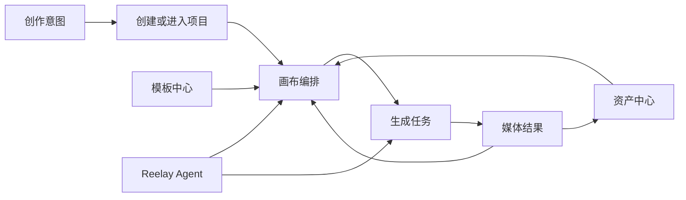
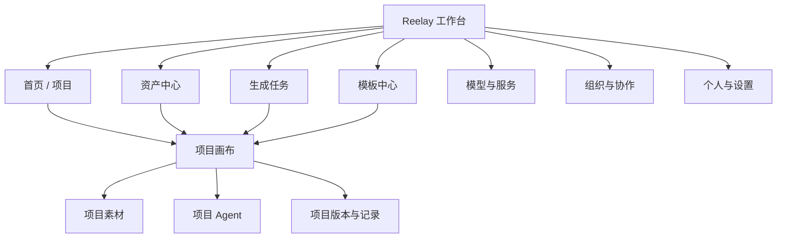
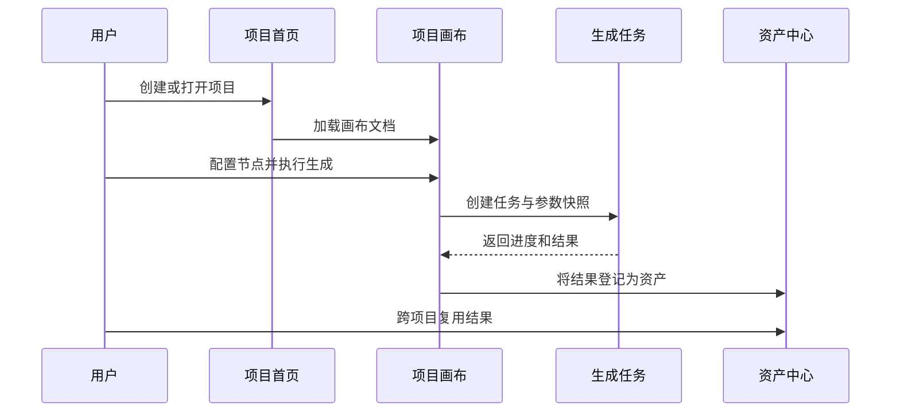

# Reelay 产品扩展规划

> 状态：规划稿，供评审使用。本文不代表这些页面已经进入开发。

## 1. 产品定位

Reelay 不应只是一块无限画布，也不应演变成把大量后台页面包在画布周围的重型工作台。

更合适的产品结构是：

- 工作台负责管理项目、资产、任务、模板和团队。
- 项目画布负责沉浸式创作、节点组织和 Agent 协作。
- 两种状态共享账号、积分、模型、生成任务和素材数据，但使用不同的信息密度与导航方式。

核心价值链：

## 2. 产品信息架构

## 3. 导航策略

### 3.1 工作台模式

工作台使用稳定的左侧主导航，适合高频切换与信息扫描：

- 首页 / 项目
- 资产中心
- 生成任务
- 模板中心
- 模型与服务
- 组织
- 底部：积分、通知、个人

主导航保持窄而稳定，不使用大面积装饰，不做营销首页。

### 3.2 画布模式

进入项目后切换到沉浸式画布：

- 左上角：返回工作台、项目路径、项目名称。
- 左侧：当前已有的画布工具栏。
- 右下角：Reelay Agent。
- 左下角：快捷键、小地图、缩放。
- 不常驻显示完整工作台导航，避免压缩画布空间。

返回工作台时保留当前项目的视口、选中状态和未完成输入。

## 4. 页面规划

## 4.1 首页 / 项目

这是登录后的默认页面，不是宣传落地页。

### 页面目标

- 快速继续最近工作。
- 新建项目或从模板开始。
- 找到团队项目与个人草稿。
- 感知正在运行或失败的生成任务。

### 页面结构

顶部：

- 工作区切换。
- 搜索。
- 新建项目。
- 通知。

主体：

- 最近编辑项目。
- 我创建的。
- 与我共享。
- 草稿。
- 已归档。

右侧或顶部轻量状态区：

- 正在生成的任务数量。
- 可用积分。
- 最近失败任务。

### 项目卡片信息

- 项目封面：从画布内容生成，不使用随机插画。
- 项目名。
- 所属组织或个人空间。
- 最近编辑时间。
- 协作者头像。
- 生成中 / 有失败任务等状态。

### 关键交互

- 双击项目进入画布。
- 卡片菜单支持重命名、复制、移动、归档、删除。
- 删除进入回收站，不直接永久删除。
- 支持列表与网格视图，但默认使用信息密度较高的网格。

## 4.2 资产中心

资产中心是跨项目复用的媒体管理页；画布左下角资产库是它在单项目中的轻量投影。

### 页面目标

- 管理图片、视频、音频和生成结果。
- 查看素材被哪些项目或节点引用。
- 批量整理、重命名、下载和删除。

### 页面结构

左侧筛选：

- 全部。
- 图片。
- 视频。
- 音频。
- 收藏。
- 最近使用。
- 回收站。

顶部筛选：

- 来源：本地上传、生成结果、团队共享。
- 所属项目。
- 创建者。
- 模型。
- 时间。
- 分辨率 / 时长。

主体：

- 网格视图用于视觉检索。
- 列表视图用于批量管理。
- 右侧检查器显示预览、元数据、引用关系和版本。

### 关键交互

- 拖入上传。
- 批量加入项目。
- 打开素材所在画布并定位节点。
- 查看生成提示词和模型参数。
- 删除前检查引用关系。

## 4.3 生成任务

生成任务页不是简单的历史图片流，而是跨项目的任务控制台。

### 页面目标

- 查看排队、运行、成功、失败和取消任务。
- 追踪积分消耗。
- 重试失败任务。
- 回到发起任务的节点。

### 信息结构

默认表格字段：

- 结果缩略图。
- 任务状态。
- 项目 / 节点。
- 模型。
- 类型。
- 参数摘要。
- 发起人。
- 创建时间。
- 耗时。
- 积分。

### 关键交互

- 按状态、项目、模型、创建者筛选。
- 批量取消排队任务。
- 失败任务查看错误原因并重试。
- 成功任务打开结果、加入资产库或定位画布节点。
- 任务详情展示输入、输出、参数快照和积分账目。

## 4.4 模板中心

模板不是静态截图，而是可实例化的画布结构。

### 模板类型

- 图片生成流程。
- 图生视频流程。
- 广告分镜。
- 商品图批量生成。
- 角色一致性。
- 音乐与声音设计。
- 团队自定义模板。

### 模板详情

- 实际画布预览。
- 节点数量和模型依赖。
- 所需输入素材。
- 预计生成步骤。
- 可替换模型。
- 创建项目按钮。

### 建议

首期只做官方模板和团队模板，不急于建设公开社区与点赞体系。

## 4.5 模型与服务

该页面承担模型目录、能力说明和供应商连接，不把所有设置塞进节点下拉菜单。

### 页面目标

- 查看当前可用模型。
- 理解模型能力、限制、价格和状态。
- 设置默认模型与禁用模型。
- 管理供应商连接。

### 模型信息

- 供应商。
- 输入 / 输出模态。
- 支持的比例、分辨率、时长。
- 参考素材上限。
- 是否原生音频。
- 预计速度。
- 积分计算规则。
- 服务状态。

### 设计建议

- 节点模型面板只负责快速选择。
- 模型中心负责完整比较和配置。
- 模型能力必须数据驱动，后续由 `ModelDefinition` 生成节点参数，而不是继续写死统一参数。

## 4.6 组织与协作

### 首期范围

- 成员列表。
- 邀请成员。
- 角色：所有者、管理员、编辑者、查看者。
- 团队项目。
- 团队资产。
- 积分使用概览。

### 后续范围

- 项目级权限。
- 评论与 @ 提及。
- 实时协作光标。
- 审批流程。
- 品牌资产与模型策略。

## 4.7 个人与设置

设置页承接当前头像菜单中无法展开的内容：

- 账号资料。
- 外观。
- 通知。
- 默认项目设置。
- 默认模型。
- 快捷键。
- 下载与隐私。
- 连接的模型服务。
- 积分与账单。

头像菜单只保留高频入口与摘要，不在浮层中继续叠加复杂设置。

## 4.8 Agent 工作区

当前项目内 Agent 继续保留右侧栏。

后续可增加独立 Agent 工作区，用于：

- 跨项目搜索。
- 批量创建项目。
- 整理资产。
- 查询生成任务。
- 根据目标实例化模板。

独立 Agent 不应替代画布，而是负责跨页面、跨项目的操作编排。

## 5. 核心数据对象

| 对象 | 责任 |
| --- | --- |
| Workspace | 个人或组织空间 |
| User | 用户资料与偏好 |
| Project | 项目元数据、成员、封面 |
| CanvasDocument | 画布视口、节点、组与版本 |
| Node | 生成节点或素材节点 |
| Asset | 可跨项目复用的媒体对象 |
| AssetReference | 素材与项目 / 节点的引用关系 |
| GenerationTask | 一次生成任务及状态 |
| GenerationResult | 任务输出，可转为 Asset |
| ModelDefinition | 模型能力、参数模式和计费规则 |
| CreditLedger | 积分增加、冻结、扣减和退回记录 |
| Conversation | Agent 会话与项目关联 |
| Template | 可实例化的画布结构 |

## 6. 跨页面核心流程

### 6.1 从工作台到生成结果

### 6.2 从资产中心回到节点

资产详情需要展示引用项目。点击引用时：

1. 打开对应项目。
2. 恢复最近视口或定位目标节点。
3. 提升该节点层级并短暂强调。
4. 保留返回资产详情的浏览历史。

## 7. 设计系统方向

- 工作台：安静、紧凑、适合扫描和批量操作。
- 画布：沉浸、低干扰、上下文工具浮层。
- 同一套颜色变量、间距、图标和浮层规则跨页面复用。
- 卡片只用于项目、资产、模板等重复对象，不把整页章节做成浮动卡片。
- 所有图标按钮提供 tooltip 和 `aria-label`。
- 删除、批量执行、积分扣减等高影响操作必须有清晰确认与可恢复机制。

## 8. 开发顺序

### Phase 0：产品基础

- 路由与应用壳。
- 数据模型和 schema 版本。
- 项目保存与加载。
- 资产持久化。
- 生成任务状态机。
- 通用通知、确认、菜单、对话框组件。

### Phase 1：核心工作台

- 首页 / 项目。
- 资产中心。
- 生成任务。
- 画布与这些页面的双向定位。

### Phase 2：复用与管理

- 模板中心。
- 模型与服务。
- 完整个人设置。
- 组织成员与基础权限。

### Phase 3：协作与规模化

- 实时协作。
- 评论与审批。
- 项目版本。
- 团队模型策略。
- 真实积分账本与账单。

## 9. 当前不建议立即开发

- 营销式首页。
- 公共作品社区。
- 复杂模板商城。
- 节点插件市场。
- 过早的移动端完整画布。
- 在没有任务和资产数据层前先做漂亮但孤立的统计大屏。

这些功能不是没有价值，而是当前无法增强“项目到生成结果再到复用”的主链路。

## 10. 待产品确认

1. 产品首先服务个人创作者，还是团队与商业制作？
2. 模型服务由 Reelay 统一提供，还是允许用户绑定自己的供应商账号？
3. 资产默认属于个人空间、组织空间，还是项目？
4. 生成结果是否自动进入资产中心？
5. 模板是否允许外部公开发布？
6. 首期是否需要真实多人协作，还是先做分享与只读权限？

上述答案会直接影响路由、权限、积分归属和数据模型，应在新页面编码前确认。
