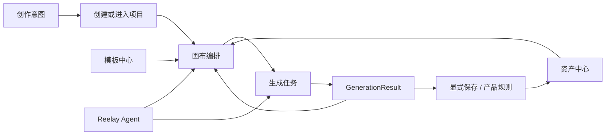
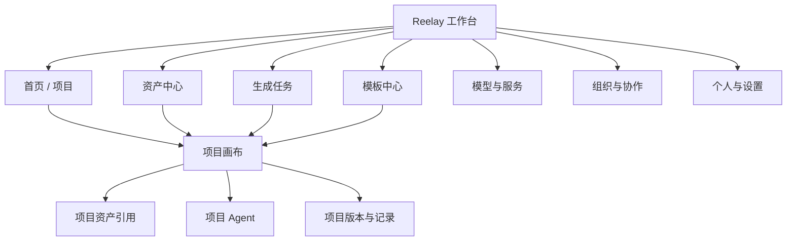

# Reelay 产品扩展规划

> 状态：规划稿，供评审使用。本文不代表这些页面已经进入开发。

## 1. 产品定位

Reelay 不应只是一块无限画布，也不应演变成把大量后台页面包在画布周围的重型工作台。

更合适的产品结构是：

- 工作台负责管理项目、资产、任务、模板和团队。
- 项目画布负责沉浸式创作、节点组织和 Agent 协作。
- 两种状态共享账号、积分、模型、生成任务和素材数据，但使用不同的信息密度与导航方式。

### 1.1 当前工作假设

以下是为了让基础开发可以前进而采用的可逆假设，不是不可更改的产品结论：

- 每个用户先拥有一个个人 Workspace；组织空间以后使用同一套归属模型扩展，避免把“个人版”写成另一套数据结构。
- 可跨项目复用的 Asset 归 Workspace 所有，Project 和 Node 只保存 AssetReference。尚未保存的生成结果仍是 GenerationResult，不会自动污染全局资产中心。
- 首期按 Reelay 统一提供模型服务设计，但 ProviderConnection 保留扩展边界；不在首期同时建设 BYOK 的密钥、配额和故障处理体系。
- 同一组织下的成员身份、Membership 和组织项目可见性先于外部分享与实时协作。首期先演示多个账号在同一组织范围内使用项目，不引入分享链接、实时光标和冲突合并。
- 前端框架不是产品架构本身。先定义 route contract、领域对象和存储接口；Phase 0B 暂按 `docs/adr/0001-application-runtime-and-migration.md` 采用 React + TypeScript + Vite + React Router，答案或运行证据反驳时重新评审。现有画布通过 adapter 接入，不因框架选择被整体重写。

任何一项假设改变时，都必须同时复核路由、权限、资产归属、计费和迁移策略。

核心价值链：

## 2. 产品信息架构

## 3. 导航策略

### 3.1 工作台模式

资产中心、生成任务等高信息密度管理页可以使用稳定的左侧主导航；登录后主页本身保持轻量创作入口，不为尚未实现的后台页面提前常驻完整侧栏：

- 首页 / 项目
- 资产中心
- 生成任务
- 模板中心
- 模型与服务
- 组织
- 底部：积分、通知、个人

管理页主导航保持窄而稳定，不使用大面积装饰；主页可以用项目封面与创作主题建立进入画布前的内容语境，但不做公开营销首页或作品社区。

### 3.2 画布模式

进入项目后切换到沉浸式画布：

- 左上角：返回工作台、项目路径、项目名称。
- 左侧：当前已有的画布工具栏。
- 右上角：分享、个人/积分、Reelay Agent。
- 左下角：资产库入口独立保留，画布工具为小地图、适应视图、画布比例；画布比例使用行内滑条，快捷键归入个人菜单的小层级。
- 不常驻显示完整工作台导航，避免压缩画布空间。

返回工作台时保留当前项目的视口、选中状态和未完成输入。

## 4. 页面规划

## 4.1 首页 / 项目

这是登录后的默认页面，不是宣传落地页。

> 当前状态：登录、主页和项目库已迁入 `/app` React 路由，通过 HTTP adapters 消费本地 Session / Workspace / Project API；两个固定演示账号可验证个人空间隔离和同组织项目共享。项目仍保存在服务端进程内，旧画布也尚未按项目加载 / 保存，因此这不是正式账号、持久化项目或生产协作。

### 页面目标

- 快速继续最近工作。
- 新建项目或从模板开始。
- 找到团队项目与个人草稿。
- 感知正在运行或失败的生成任务。

### 页面结构

顶部：

- 工作区切换。
- 搜索。
- 新建项目。
- 通知。

主体：

- 最近编辑项目。
- 我创建的。
- 与我共享。
- 草稿。
- 已归档。

右侧或顶部轻量状态区：

- 正在生成的任务数量。
- 可用积分。
- 最近失败任务。

### 项目卡片信息

- 项目封面：真实数据接入后从画布内容生成；在尚无项目持久化的高保真原型中，允许使用语义明确的本地 mock 封面，但必须标明原型状态且不能伪装成真实用户数据。
- 项目名。
- 所属组织或个人空间。
- 最近编辑时间。
- 协作者头像。
- 生成中 / 有失败任务等状态。

### 关键交互

- 单击项目卡或按 Enter 进入画布；双击只能作为桌面增强，不能是唯一入口。
- 卡片菜单支持重命名、复制、移动、归档、删除。
- 删除进入回收站，不直接永久删除。
- 支持列表与网格视图，但默认使用信息密度较高的网格。

## 4.2 资产中心

资产中心是跨项目复用的媒体管理页；画布左下角资产库是它在单项目中的轻量投影。

### 页面目标

- 管理图片、视频、音频和生成结果。
- 查看素材被哪些项目或节点引用。
- 批量整理、重命名、下载和删除。

### 页面结构

左侧筛选：

- 全部。
- 图片。
- 视频。
- 音频。
- 收藏。
- 最近使用。
- 回收站。

顶部筛选：

- 来源：本地上传、生成结果、团队共享。
- 所属项目。
- 创建者。
- 模型。
- 时间。
- 分辨率 / 时长。

主体：

- 网格视图用于视觉检索。
- 列表视图用于批量管理。
- 右侧检查器显示预览、元数据、引用关系和版本。

### 关键交互

- 拖入上传。
- 批量加入项目（创建 AssetReference，不复制 Asset 所有权）。
- 打开素材所在画布并定位节点。
- 查看生成提示词和模型参数。
- 删除前检查引用关系。

## 4.3 生成任务

生成任务页不是简单的历史图片流，而是跨项目的任务控制台。

### 页面目标

- 查看排队、运行、成功、失败和取消任务。
- 追踪积分消耗。
- 重试失败任务。
- 回到发起任务的节点。

### 信息结构

默认表格字段：

- 结果缩略图。
- 任务状态。
- 项目 / 节点。
- 模型。
- 类型。
- 参数摘要。
- 发起人。
- 创建时间。
- 耗时。
- 积分。

### 关键交互

- 按状态、项目、模型、创建者筛选。
- 批量取消排队任务。
- 失败任务查看错误原因并重试。
- 成功任务打开结果、加入资产库或定位画布节点。
- 任务详情展示输入、输出、参数快照和积分账目。

## 4.4 模板中心

模板不是静态截图，而是可实例化的画布结构。

### 模板类型

- 图片生成流程。
- 图生视频流程。
- 广告分镜。
- 商品图批量生成。
- 角色一致性。
- 音乐与声音设计。
- 团队自定义模板。

### 模板详情

- 实际画布预览。
- 节点数量和模型依赖。
- 所需输入素材。
- 预计生成步骤。
- 可替换模型。
- 创建项目按钮。

### 建议

首期只做官方模板和团队模板，不急于建设公开社区与点赞体系。

## 4.5 模型与服务

该页面承担模型目录、能力说明和供应商连接，不把所有设置塞进节点下拉菜单。

### 页面目标

- 查看当前可用模型。
- 理解模型能力、限制、价格和状态。
- 设置默认模型与禁用模型。
- 管理供应商连接。

### 模型信息

- 供应商。
- 输入 / 输出模态。
- 支持的比例、分辨率、时长。
- 参考素材上限。
- 是否原生音频。
- 预计速度。
- 积分计算规则。
- 服务状态。

### 设计建议

- 节点模型面板只负责快速选择。
- 模型中心负责完整比较和配置。
- 模型能力必须数据驱动，后续由 `ModelDefinition` 生成节点参数，而不是继续写死统一参数。

## 4.6 组织与协作

### 首期范围

- Phase 0B 只验证已有 Membership：两个演示账号以所有者 / 编辑者身份访问同一协作 Workspace，并共享团队项目。
- 不在这一阶段提供成员管理、邀请、角色配置、团队资产或积分管理 UI。

### Phase 2 及后续范围

- 成员列表与邀请成员。
- 所有者、管理员、编辑者、查看者等角色及明确的读写权限矩阵。
- 团队资产与积分使用概览。
- 项目级权限。
- 评论与 @ 提及。
- 实时协作光标。
- 审批流程。
- 品牌资产与模型策略。

## 4.7 个人与设置

设置页承接当前头像菜单中无法展开的内容：

- 账号资料。
- 外观。
- 通知。
- 默认项目设置。
- 默认模型。
- 快捷键。
- 下载与隐私。
- 连接的模型服务。
- 积分与账单。

头像菜单只保留高频入口与摘要，不在浮层中继续叠加复杂设置。

## 4.8 Agent 工作区

当前项目内 Agent 继续保留右侧栏。

后续可增加独立 Agent 工作区，用于：

- 跨项目搜索。
- 批量创建项目。
- 整理资产。
- 查询生成任务。
- 根据目标实例化模板。

独立 Agent 不应替代画布，而是负责跨页面、跨项目的操作编排。

Agent 不直接调用页面 DOM 或原型事件函数。跨项目写操作必须通过 application service / command，经过权限检查、显式确认、幂等 command id、审计记录和可恢复策略；Conversation 必须记录 workspace / project scope 与可访问资源。

## 5. 核心数据对象

| 对象 | 责任 |
| --- | --- |
| Workspace | 个人或组织空间 |
| User | 用户资料与偏好 |
| Project | 项目元数据、Workspace 归属、封面与创建 / 更新审计；项目级成员以后单独建模 |
| CanvasDocument | 画布视口、节点、组与版本 |
| Node | 生成节点或素材节点 |
| Asset | 可跨项目复用的媒体对象 |
| AssetReference | 素材与项目 / 节点的引用关系 |
| GenerationTask | 一次生成任务及状态 |
| GenerationResult | 任务输出，可转为 Asset |
| ModelDefinition | 模型能力、参数模式和计费规则 |
| CreditLedger | 积分增加、冻结、扣减和退回记录 |
| Conversation | Agent 会话、Workspace / Project scope 与可访问资源 |
| Template | 可实例化的画布结构 |

### 5.1 生成节点与结果历史的类型契约

当前原型已经用节点级 `lockedMode` 建立最小约束，但正式数据模型不应把单个 `generatedAsset` 扩写成一串松散对象。后续应保持以下边界：

- 生成节点在第一次成功前没有结果类型锁；任务成功后以不可变的 `GenerationTask.parameterSnapshot.mode` 原子写入节点类型锁。
- 一个节点的全部 `GenerationResult` 必须是同一媒体类型。跨图片 / 视频应创建新节点，并通过稳定的结果或资产引用连接输入输出关系。
- 节点只保存 `activeResultId` 与有序的 `generationResultIds`；任务状态、参数快照、计费和错误归 `GenerationTask`，媒体输出归 `GenerationResult`，可复用资产归 `Asset`。
- 删除当前结果、切换历史结果、失败、取消、复制节点或普通参数撤销都不能解除节点类型锁。复制已有结果的节点应继承类型锁，但不得伪造一次新任务或重复计费。
- 成功生成是普通参数撤销的版本边界。未来如果支持撤销生成，必须作为显式生成命令处理结果引用、任务状态和 `CreditLedger`，不能用整节点旧快照覆盖。
- 一次任务可以产生多个结果，`count` 不应继续被压缩为单个 `generatedAsset`；参考素材快照也应保存稳定的 `AssetReference` 与必要版本信息，而不只是易失的内存 id。

## 6. 跨页面核心流程

### 6.1 从工作台到生成结果

### 6.2 从资产中心回到节点

资产详情需要展示引用项目。点击引用时：

1. 打开对应项目。
2. 恢复最近视口或定位目标节点。
3. 提升该节点层级并短暂强调。
4. 保留返回资产详情的浏览历史。

## 7. 设计系统方向

- 工作台：安静、紧凑、适合扫描和批量操作。
- 画布：沉浸、低干扰、上下文工具浮层。
- 同一套颜色变量、间距、图标和浮层规则跨页面复用。
- 卡片只用于项目、资产、模板等重复对象，不把整页章节做成浮动卡片。
- 所有图标按钮提供 tooltip 和 `aria-label`。
- 删除、批量执行、积分扣减等高影响操作必须有清晰确认与可恢复机制。
- 延期的是完整移动端画布编辑，不是基础响应式和可访问性；工作台与抽屉至少要在 320 / 360 / 768px 下保持关键入口可达，并支持键盘焦点、触控目标和 reduced-motion。

## 8. 开发顺序

### Phase 0A：原型稳定化

- 修复生成任务、撤销历史、项目资产和模型参数的跨画布 / 跨项目边界。
- 为当前画布交互建立特征测试，清理确认不可达的旧代码和重复静态数据。
- 建立可复现的检查和回归测试入口；正式构建随 Phase 0B 的 runtime 决策落地。

### Phase 0B：可迁移基础

> 当前进度：已完成 runtime ADR、React + TypeScript + Vite 壳、browser route contract、首批 Session / Workspace / Membership / Project / CanvasDocument ports、类型安全的 HTTP adapters、Fastify 共享服务、登录 / 主页 / 项目库迁移和受保护的 legacy canvas host。Session、Workspace、Membership 与 Project 已切换到 PostgreSQL，具备带 checksum 的 migration、幂等 demo seed 和跨服务重启集成验证；内存 adapter 只保留作快速契约测试和显式回退。旧画布仍不消费项目上下文，也尚未持久化 CanvasDocument、资产、生成任务或积分账本。

- 按 `docs/adr/0001-application-runtime-and-migration.md` 建立正式 runtime、browser router、构建与测试壳；高保真静态入口在页面迁移完成前继续保留。现有画布始终作为受保护的 legacy host 接入，不整体重写。
- 定义数据模型、schema 版本和迁移机制。
- 优先建立 Session、Workspace、Membership、Project 和 CanvasDocument 的 repository / service 边界，让个人空间与组织空间都由显式 actor scope 驱动。
- 因为组织演示需要两个浏览器同时看到共享数据，Phase 0B 同步建立最小共享后端、服务端会话和开发数据库；IndexedDB 只承担本地草稿、缓存和离线恢复。
- 为 Asset、GenerationTask、GenerationResult 和 CreditLedger 先定义核心不变量；真实生成接入前再补足 repository 和事务边界。
- 本地草稿与 Blob 使用 IndexedDB；localStorage 仅保存主题等设备偏好。
- 建立通用通知、确认、菜单、对话框和焦点管理组件。

### Phase 0C：真实主链路

- 项目保存与加载。
- 资产持久化与显式 AssetReference。
- 生成任务状态机、参数快照、幂等扣费与失败退款。
- 真实生成结果先登记为 GenerationResult，由用户或产品规则显式提升为 Asset。

### Phase 1：核心工作台

- 首页 / 项目。
- 资产中心。
- 生成任务。
- 画布与这些页面的双向定位。

### Phase 2：复用与管理

- 模板中心。
- 模型与服务。
- 完整个人设置。
- 组织成员管理、邀请、细粒度权限与策略；基础 Membership 和组织项目可见性已经在 Phase 0B 建立。

### Phase 3：协作与规模化

- 实时协作。
- 评论与审批。
- 项目版本。
- 团队模型策略。
- 团队额度、用量归集与账单展示（真实积分账本必须在首次接入真实生成前已经存在）。

## 9. 当前不建议立即开发

- 营销式首页。
- 公共作品社区。
- 复杂模板商城。
- 节点插件市场。
- 过早的移动端完整画布。
- 在没有任务和资产数据层前先做漂亮但孤立的统计大屏。

这些功能不是没有价值，而是当前无法增强“项目到生成结果再到复用”的主链路。

## 10. 需要验证或推翻的工作假设

Phase 0B 可以按 1.1 节的可逆假设推进，但在进入相应产品功能前必须完成验证：

1. 个人创作者作为首期主用户；团队与商业制作复用 Workspace 模型扩展，而不是另起一套产品结构。
2. Reelay 统一提供模型服务；BYOK 只保留 ProviderConnection 边界，不在首期同时实现。
3. Asset 归 Workspace，Project / Node 保存 AssetReference；项目内的临时数组不是正式所有权模型。
4. GenerationResult 默认不自动进入资产中心，必须显式保存或经过可解释的产品规则晋升。
5. 模板首期仅限内部或私有复用，公开发布与市场化另行评估。
6. 组织成员身份与共享组织项目可见性先于外部分享和实时协作；分享链接、实时状态、冲突合并和审批留到主链路稳定后。

这些假设不是文档权威。调研、用户反馈或实现证据一旦反驳其中任意一项，应先修订路线和数据模型，再继续编码。
