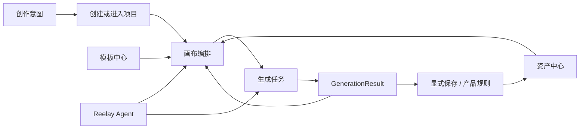
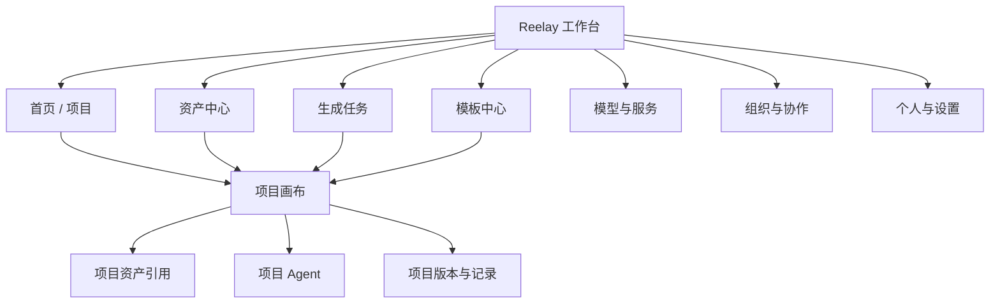
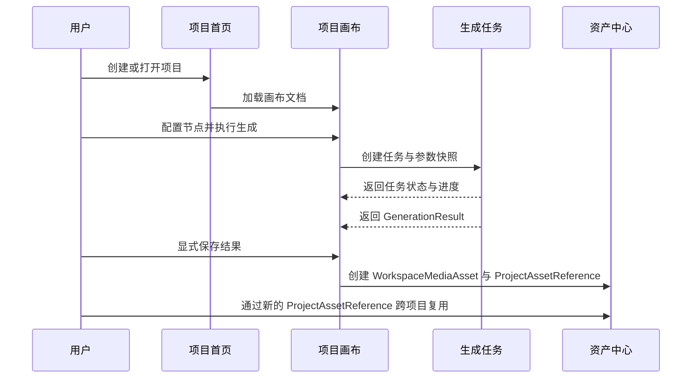

# Reelay 产品扩展规划

> 状态：规划稿，供评审使用。本文不代表这些页面已经进入开发。

## 1. 产品定位

本项目定位为 **Reelay 产品预演版**：提前构建和验证正式产品的页面结构、交互行为、业务规则、状态变化及异常恢复，供团队进行需求讨论与行为验收，并作为后续正式前端开发的产品行为蓝本。

核心原则是：**已确认的业务规则可执行，前端交互真实，后端服务可模拟。** 模型调用、云存储、支付、验证码发送和积分结算不要求接入真实服务；可以使用预置素材、模拟请求、可控制的任务状态和本地数据。现有共享会话、项目权限、PostgreSQL 与本地 ObjectStore 保留其已验证能力，不因定位澄清而重写，也不因已有这些服务而扩大生产化范围。正式系统的授权、计费和幂等性仍由服务端承担，不能将预演版的前端判断直接当作生产安全边界。

“完整产品体验”是逐步覆盖的目标，不代表当前所有页面或流程已经确定。每个功能应区分已确认规则、可逆设计假设和未实现能力；参考图、暂时文案和演示数据不能自动升级成产品需求。被选入当前切片的行为，应具备一致的前后状态、可解释的失败和可重复的演练方式；尚未确定的规则保留为待决事项，不由实现者静默补全。

2026-09-05 已确认的后续方向：主体库与节点配合、Agent 对话中的模拟生成、项目生成历史、画布整理、消息通知与必要配置，以及分享权限 / 申请加入闭环；协作最终必须支持两位成员以不同账号、不同浏览器真实同时编辑同一画布。它们是产品目标，不表示已经实现，也不自动确定全部规则或执行顺序。当前先开展下一批节点 / 分组基础治理，建议路线、阶段验收和进入阶段时的复核机制见第 8.1 节。

首页 / 登录的大规模重设计仍后置，首页的能力名称、入口组合与视觉层级尚未定稿。手机号 / 邮箱注册与邀请码是已确认的后续能力方向；邀请码用于产品准入还是组织成员邀请、是否必填，以及验证码、登录和账号关联的具体规则仍需在对应设计切片确认。旧登录草稿不替代这些需求。

蓝本应沉淀产品行为及验收场景，代码是否直接进入正式前端另行评估；画布库与组件实现属于可替换的技术选择。

Reelay 不应只是一块无限画布，也不应演变成把大量后台页面包在画布周围的重型工作台。

更合适的产品结构是：

- 工作台负责管理项目、资产、任务、模板和团队。
- 项目画布负责沉浸式创作、节点组织和 Agent 协作。
- 两种状态共享账号、积分、模型、生成任务和素材数据，但使用不同的信息密度与导航方式。

### 1.1 当前工作假设

以下是为了让基础开发可以前进而采用的可逆假设，不是不可更改的产品结论：

- 首期账号主要属于一个组织 Workspace；“个人 / 协作项目”是同一组织内的项目访问类型，不再为每个账号复制一套个人 Workspace。个人项目只对创建者可见，协作项目通过显式 ProjectMembership 分配成员与角色。
- 可跨项目复用的 WorkspaceMediaAsset 归 Workspace 所有，Project 使用 ProjectAssetReference，Node 后续也只保存显式稳定引用。尚未保存的生成结果仍是 GenerationResult，不会自动污染全局资产中心。
- 首期按 Reelay 统一提供模型服务设计，但 ProviderConnection 保留扩展边界；不在首期同时建设 BYOK 的密钥、配额和故障处理体系。
- 分享与协作继续建立在组织 Membership 和显式 ProjectMembership 之上。已有多账号项目访问基础；后续先完成授权与申请闭环，再进入真实双浏览器同时编辑。分享对象、外部成员范围和并发冲突策略仍须在相应切片确认。
- 前端框架不是产品架构本身。先定义 route contract、领域对象和存储接口；Phase 0B 暂按 `docs/adr/0001-application-runtime-and-migration.md` 采用 React + TypeScript + Vite + React Router，答案或运行证据反驳时重新评审。现有画布通过 adapter 接入，不因框架选择被整体重写。

任何一项假设改变时，都必须同时复核路由、权限、资产归属、计费和迁移策略。

核心价值链：

## 2. 产品信息架构

## 3. 导航策略

### 3.1 工作台模式

资产中心、生成任务等高信息密度管理页可以使用稳定的左侧主导航；登录后主页本身保持轻量创作入口，不为尚未实现的后台页面提前常驻完整侧栏：

- 首页 / 项目
- 资产中心
- 生成任务
- 模板中心
- 模型与服务
- 组织
- 底部：积分、通知、个人

管理页主导航保持窄而稳定，不使用大面积装饰；主页可以用项目封面与创作主题建立进入画布前的内容语境，但不做公开营销首页或作品社区。

### 3.2 画布模式

进入项目后切换到沉浸式画布：

- 左上角：返回工作台、项目路径、项目名称。
- 左侧：当前已有的画布工具栏。
- 右上角：分享、个人/积分、Reelay Agent。
- 左下角：资产库入口独立保留，画布工具为小地图、适应视图、画布比例；画布比例使用行内滑条，快捷键归入个人菜单的小层级。
- 不常驻显示完整工作台导航，避免压缩画布空间。

返回工作台时保留当前项目的视口、选中状态和未完成输入。

## 4. 页面规划

## 4.1 首页 / 项目

这是登录后的默认页面，不是宣传落地页。

> 当前状态：登录、主页和项目库已迁入 `/app` React 路由，通过 HTTP adapters 消费本地 Session / Workspace / Project API；十个固定演示账号属于同一组织，可验证个人项目隔离以及协作项目的 `admin/edit/view` 权限。用户、会话、项目元数据、成员关系、路由画布文档、WorkspaceMediaAsset / personal placement / ProjectAssetReference，以及个人根目录 Entity 已持久化到本地 PostgreSQL；本地资产内容由 filesystem ObjectStore 保留。旧画布通过受控迁移快照加载 / 保存，但 Folder、组织资产、生成任务、历史和积分账本仍未持久化，因此这仍不是正式账号或生产协作。

### 页面目标

- 快速继续最近工作。
- 新建项目或从模板开始。
- 找到团队项目与个人草稿。
- 感知正在运行或失败的生成任务。

### 页面结构

顶部：

- 工作区切换。
- 搜索。
- 新建项目。
- 通知。

主体：

- 最近编辑项目。
- 我创建的。
- 与我共享。
- 草稿。
- 已归档。

右侧或顶部轻量状态区：

- 正在生成的任务数量。
- 可用积分。
- 最近失败任务。

### 项目卡片信息

- 项目封面：真实数据接入后从画布内容生成；在尚无项目持久化的高保真原型中，允许使用语义明确的本地 mock 封面，但必须标明原型状态且不能伪装成真实用户数据。
- 项目名。
- 所属组织与个人 / 协作访问类型。
- 最近编辑时间。
- 协作者头像。
- 生成中 / 有失败任务等状态。

### 关键交互

- 单击项目卡或按 Enter 进入画布；双击只能作为桌面增强，不能是唯一入口。
- 卡片菜单支持重命名、复制、移动、归档、删除。
- 删除进入回收站，不直接永久删除。
- 当前已完成管理员二次确认与服务端软删除，项目、成员关系和画布文档仍保留；回收站列表、恢复和永久删除尚未实现，不能把“从项目列表移除”描述为完整回收站。
- 支持列表与网格视图，但默认使用信息密度较高的网格。

## 4.2 资产中心

资产中心是跨项目复用的 Media 与 Entity 管理页。画布内资产库已有高保真页面投影，并落地了个人 Media 上传、WorkspaceMediaAsset、personal placement、ProjectAssetReference，以及个人根目录 Entity 的 create / get / list / update、字段编辑、有序引用、封面和乐观版本切片。正式 React 资产中心、Folder / organization placement、Entity 删除恢复、组织权限、平台目录和公网对象存储仍属于本规划。

### 页面目标

- 管理已经保存为 Workspace Media Asset 的图片、视频和音频；未晋升的 GenerationResult 只在任务或节点结果历史中管理。
- 管理只引用 Media、不重复保存媒体字段或二进制的 Entity 主体；直接创建主体时，新媒体必须先登记到 Media，再由 Entity 保存有序引用。
- 查看素材被哪些项目或节点引用。
- 批量整理、重命名、下载和删除。

### 页面结构

顶层空间与分栏：

- 个人空间与组织空间是 Workspace Asset 的不同可见 / 发布位置，不复制底层 Media；平台空间来自单独的只读目录，不能伪装为当前 Workspace 的可写资产。
- Media 素材与 Entity 主体库独立展示；Media 支持图片、视频、音频筛选，Entity 通过 Media 引用形成预览。

完整页面后续筛选：

- 全部。
- 图片。
- 视频。
- 音频。
- 收藏。
- 最近使用。
- 回收站。

顶部筛选：

- 来源：本地上传、由 GenerationResult 显式保存、团队共享。
- 所属项目。
- 创建者。
- 模型。
- 时间。
- 分辨率 / 时长。

主体：

- 网格视图用于视觉检索。
- 列表视图用于批量管理。
- 右侧检查器显示预览、元数据、引用关系和版本。

### 关键交互

- 拖入上传。
- 创建主体时，先完成 Media 上传与登记，再保存 Entity 的有序 Media 引用；两者是独立生命周期，主体保存失败不删除已经上传的 Media。删除 Entity 不删除 Media。
- 批量加入项目（创建 ProjectAssetReference，不复制 WorkspaceMediaAsset 所有权）。
- 打开素材所在画布并定位节点。
- 查看生成提示词和模型参数。
- 删除前检查引用关系。

### 主体的使用与生命周期（2026-09-05 确认）

Entity 是素材的组织方式和选择范围，不是新的生成输入类型。使用主体时，确定本次选用的 Media 集合：加入生成节点后展开为独立素材引用或连接；添加到画布后创建独立素材节点，不创建整体主体节点，也不建立随 Entity 自动更新的绑定。

主体后续改名、修改描述 / 封面、增删或重排成员，以及删除主体，都不增删、重排或替换先前展开的输入、连接和画布节点。再次使用主体才读取其当前素材集合。移除某处输入只移除该处引用，不删除主体或全局 Media。

主体编辑与底层 Media 修改是不同操作。例如，在主体编辑器中重命名素材文件属于 Media 操作；底层素材被删除、权限被撤销或版本变化时如何处理既有使用，需在 Media 生命周期中另行明确，不能从“删除主体无联动”推导。模型容量不足、不支持类型、缺失素材，以及部分成功还是整体拒绝的处理保留为后续具体设计。

现有代码已有逐 Media 展开的适配，下一步优先核对其选择、独立操作、保存恢复与主体编辑后不联动的行为，补齐必要的 Media 引用边界；本节不代表持久 Entity 删除或完整 Node 级引用已经实现。

## 4.3 生成任务

已确认要提供项目生成历史；建议先完成项目内查询、结果复用与来源定位，再视需要扩展跨项目任务控制台，不能把跨项目大页面作为当前前置条件。

生成历史的生命周期独立于画布展示：以 GenerationTask / GenerationResult 为记录来源，不从当前节点的单个 `generatedAsset` 或页面内 runner 反推历史。重新生成、切换显示结果、移除节点与删除历史是不同动作；关闭页面后的任务行为、记录保留与删除规则仍待该切片确认。来源节点不存在时，历史仍需按选定规则展示结果或不可用原因，不能提供失效的定位成功反馈。画布版本 / 操作日志另行设计，不与生成历史混为一种记录。

### 页面目标

- 查看排队、运行、成功、失败和取消任务。
- 追踪积分消耗。
- 重试失败任务。
- 回到发起任务的节点。

### 信息结构

默认表格字段：

- 结果缩略图。
- 任务状态。
- 项目 / 节点。
- 模型。
- 类型。
- 参数摘要。
- 发起人。
- 创建时间。
- 耗时。
- 积分。

### 关键交互

- 按状态、项目、模型、创建者筛选。
- 批量取消排队任务。
- 失败任务查看错误原因并重试。
- 成功任务打开结果、加入资产库或定位画布节点。
- 任务详情展示输入、输出、参数快照和积分账目。

## 4.4 模板中心

模板不是静态截图，而是可实例化的画布结构。

### 模板类型

- 图片生成流程。
- 图生视频流程。
- 广告分镜。
- 商品图批量生成。
- 角色一致性。
- 音乐与声音设计。
- 团队自定义模板。

### 模板详情

- 实际画布预览。
- 节点数量和模型依赖。
- 所需输入素材。
- 预计生成步骤。
- 可替换模型。
- 创建项目按钮。

### 建议

首期只做官方模板和团队模板，不急于建设公开社区与点赞体系。

## 4.5 模型与服务

该页面承担模型目录、能力说明和供应商连接，不把所有设置塞进节点下拉菜单。

### 页面目标

- 查看当前可用模型。
- 理解模型能力、限制、价格和状态。
- 设置默认模型与禁用模型。
- 管理供应商连接。

### 模型信息

- 供应商。
- 输入 / 输出模态。
- 支持的比例、分辨率、时长。
- 参考素材上限。
- 是否原生音频。
- 预计速度。
- 积分计算规则。
- 服务状态。

### 设计建议

- 节点模型面板只负责快速选择。
- 模型中心负责完整比较和配置。
- 模型能力必须数据驱动，后续由 `ModelDefinition` 生成节点参数，而不是继续写死统一参数。

## 4.6 组织与协作

### 首期范围

- Phase 0B 以十个固定演示账号验证单组织 Membership、个人项目隔离和协作项目的 `admin/edit/view` 项目角色。
- 组织 Membership 只证明账号属于组织；项目列表、详情和修改必须继续由 ProjectMembership 在服务端过滤，不能用前端标签或组织角色代替。
- 组织中心的首个可见切片已经提前提供组织资料、服务端只读成员目录、积分原型口径和用量空状态；它不等于成员生命周期或真实账单已经完成。邀请、角色写入、凭证重置、外部分享、团队资产和真实积分账本仍不在当前基础切片中。

### Phase 2 及后续范围

已确认的协作目标包含两个阶段：分享权限 / 申请加入的可执行闭环，以及最终两位成员在不同浏览器真实同时编辑同一画布。申请、批准和实际访问权限必须一致；在线状态、光标与选中态只是辅助体验，虚拟光标或预置远端动作不能替代真实并发验收。具体分享对象、组织外访问、申请处理人、冲突与撤销规则在进入相应阶段时复核，见第 8.1 节。

- 成员邀请、状态管理和成员生命周期；只读成员列表已经在组织中心首个切片中建立。
- 组织所有者 / 成员管理，以及项目 `admin/edit/view` 角色的配置界面和完整权限矩阵。
- 团队资产与积分使用概览。
- 项目成员的添加、移除和权限变更。
- 评论与 @ 提及。
- 在线状态与实时协作光标，以及真实多人内容编辑。
- 审批流程。
- 品牌资产与模型策略。

## 4.7 个人与设置

设置页承接当前头像菜单中无法展开的内容：

- 账号资料。
- 外观。
- 通知。
- 默认项目设置。
- 默认模型。
- 快捷键。
- 下载与隐私。
- 连接的模型服务。
- 积分与账单。

头像菜单只保留高频入口与摘要，不在浮层中继续叠加复杂设置。

## 4.8 Agent 工作区

当前项目内 Agent 继续保留右侧栏。

已确认要让 Agent 对话支持模拟生成。建议首个执行切片限于当前项目，使对话中的任务卡、项目生成历史和画布使用同一份任务 / 结果记录，预置媒体与可控制的模拟执行即可。会话归属、是否先有节点、结果自动落画布还是由用户添加、修改已有内容的确认与撤销规则仍待定；不把当前页面内的节点 runner 当作完整会话或持久任务服务。

后续可增加独立 Agent 工作区，用于：

- 跨项目搜索。
- 批量创建项目。
- 整理资产。
- 查询生成任务。
- 根据目标实例化模板。

独立 Agent 不应替代画布，而是负责跨页面、跨项目的操作编排。

Agent 不直接调用页面 DOM 或原型事件函数。跨项目写操作必须通过 application service / command，经过权限检查、显式确认、幂等 command id、审计记录和可恢复策略；Conversation 必须记录 workspace / project scope 与可访问资源。

## 4.9 消息、配置与后台边界

已确认需要消息通知与必要配置，具体类型和管理角色随业务切片确定。通知消费任务、访问申请等对象的状态变化；已读 / 未读属于接收人的通知状态，批准 / 拒绝与权限变更必须提交给申请或授权服务。通知不是审批真相，重复打开或处理通知不能重复授权；原对象已处理、删除或失权时要反馈其当前状态。

“后台”按用途分开，不默认建设完整独立后台网站：

| 用途 | 建议边界 |
| --- | --- |
| 服务与数据层 | 复用已有共享服务；通过模拟执行和预置媒体实现一致状态，不要求真实模型调用 |
| 组织 / 项目管理 | 成员、项目权限和已确认的组织配置进入现有产品路由，保留各自权限边界 |
| 最小运营页 | 出现具体平台运营角色与公告、配置或审核任务后，只补所需入口；是否独立站点或部署届时决定 |
| 开发场景控制 | 提供开发专用的成功 / 失败 / 延迟、申请与权限变化等可重复场景；演练通过相同业务状态转换，不拼接互不相干的假成功消息 |

演练数据的恢复只作用于明确隔离的演示范围，不重置用户已有项目和素材。模型元数据仍集中于 `data/model-catalog.js`；通用配置平台、生产运营权限和真实计费不是模拟消息中心的前置条件。

## 5. 核心数据对象

| 对象 | 责任 |
| --- | --- |
| Workspace | 首期组织容器；承载组织成员与项目集合 |
| User | 用户资料与偏好 |
| Project | 项目元数据、Workspace 归属、个人 / 协作访问类型、封面与创建 / 更新审计 |
| ProjectMembership | 项目成员及 `admin/edit/view` 角色；是项目读写权限来源 |
| CanvasDocument | 画布视口、节点、组与版本；v1 由 canonical allow-list 与持久 URL 安全校验约束 |
| Node | 画布节点；GenerationNode 持有创建时确定且不可变的 `mediaKind` 与结果引用 |
| WorkspaceMediaAsset | Workspace 所有、可跨项目复用的持久 Media 对象；媒体二进制交给 ObjectStore |
| MediaAssetPlacement | 个人 / 组织空间的可见与发布位置；不复制 WorkspaceMediaAsset |
| Entity | 由去重、有序 Media 引用组成的组织与选择范围；使用时展开独立 Media，不把 Entity 生命周期绑定到已有节点，不复制媒体二进制 |
| ProjectAssetReference | Project 对 WorkspaceMediaAsset 的显式引用与必要版本信息；Node 级稳定引用仍待建立 |
| GenerationTask | 带 actor 与项目 / 画布 / 节点 scope、状态、参数 / 计价快照和幂等键的一次执行 |
| GenerationResult | 带不可变 `mediaKind` 的任务输出；默认不等于 WorkspaceMediaAsset |
| ModelDefinition | 模型能力、参数模式和计费规则 |
| CreditLedger | append-only 的预占、结算、释放 / 退款事实；余额是投影而不是第二真相 |
| Conversation | Agent 会话、Workspace / Project scope 与可访问资源 |
| Template | 可实例化的画布结构 |

### 5.1 生成节点与结果历史的类型契约

当前原型已经把旧 `mode / lockedMode` 收敛到 CanvasDocument v1 的兼容读取边界，新快照以节点级 `mediaKind` 表达唯一媒体类型。正式数据模型不应把单个 `generatedAsset` 扩写成一串松散对象，后续保持以下边界：

- 生成节点创建时必须原子写入非空、不可变的 `mediaKind`；旧 `mode / lockedMode` 只允许在版本化迁移适配器中读取，不能进入正常 runtime 或新 schema。
- `GenerationTask.parameterSnapshot.mediaKind` 必须等于节点 `mediaKind`；任务成功只追加 `GenerationResult` 并更新 `activeResultId`，不负责设置或重新锁定节点类型。
- 一个节点的全部 `GenerationResult.mediaKind` 必须与节点相同。跨图片 / 视频必须创建新节点，并通过稳定的结果或资产引用连接输入输出关系。
- 节点保存 `mediaKind`、`activeResultId` 与有序的 `generationResultIds`；任务状态、参数 / 计价快照和错误归 `GenerationTask`，媒体输出归 `GenerationResult`，可复用持久资产归 `WorkspaceMediaAsset`。
- 删除或切换结果、失败、取消、普通撤销都不得改变 `mediaKind`；复制任意生成节点都继承 `mediaKind`，但不复制或伪造任务与计费事件。
- 成功生成是普通参数撤销的版本边界。未来若支持“撤销生成”，它只通过显式命令变更 Node → GenerationResult 引用；已经执行的任务和 `CreditLedger` 历史不可重写，也不能因 UI 撤销静默退款。退款只能由失败、取消或服务端补偿规则以幂等账本事件产生。
- 一次任务可以产生多个结果，`count` 不应继续被压缩为单个 `generatedAsset`；参考素材快照也应保存稳定的 `AssetReference` 与必要版本信息，而不只是易失的内存 id。

## 6. 跨页面核心流程

### 6.1 从工作台到生成结果

### 6.2 从资产中心回到节点

资产详情需要展示引用项目。点击引用时：

1. 打开对应项目。
2. 恢复最近视口或定位目标节点。
3. 提升该节点层级并短暂强调。
4. 保留返回资产详情的浏览历史。

## 7. 设计系统方向

- 工作台：安静、紧凑、适合扫描和批量操作。
- 画布：沉浸、低干扰、上下文工具浮层。
- 同一套颜色变量、间距、图标和浮层规则跨页面复用。
- 卡片只用于项目、资产、模板等重复对象，不把整页章节做成浮动卡片。
- 所有图标按钮提供 tooltip 和 `aria-label`。
- 删除、批量执行、积分扣减等高影响操作必须有清晰确认与可恢复机制。
- 当前产品只面向桌面浏览器，功能设计与验收以 `1280×720` 及以上视口为基线，并优先检查常见 `1440×900` / `1920×1080` 桌面尺寸；保留必要的窄屏防御性布局、键盘焦点和 reduced-motion，但不为移动端或触控端新增产品分支。

## 8. 开发顺序与阶段验收

### 8.1 当前滚动路线（2026-09-05）

下表是建议的依赖顺序，不是必须一次完成的固定排期。已确认目标见第 1 节，已实现行为以 `current-product-spec.md` 和运行证据为准。节点 / 分组治理本批已收敛到选定入口；其余行定义后续切片入口，不表示整项已经开工。Agent 与历史共享任务边界，整理可独立穿插，通知随首个任务或申请闭环落地，不必等到真实并发阶段。

| 阶段 | 进入时主动复核 | 本阶段最低验收 |
| --- | --- | --- |
| 节点 / 分组基础治理（本批完成，后续按需治理） | 后续节点结构 / 稳定素材引用及剩余撤销入口按实际功能复核，不机械追求整文件拆完 | 离散参数、生成媒体命名、组事务与已有局部布局已接入；字段撤销保留任务身份与无关内容，Alt 复制可撤销 / 取消；普通新建与整画布整理未补齐，详见实现规范 |
| 主体库与节点配合 | Media 稳定引用、删除 / 失权 / 版本变化、模型类型与容量不匹配的处理 | 选择与展开顺序、去重、独立操作和保存恢复一致；主体后续编辑不联动既有使用；缺失或不可用素材有明确反馈 |
| 模拟任务与项目生成历史 | 页面关闭后的任务行为、任务与重试身份、多结果、保留 / 删除与可见范围、积分口径 | 重复触发不产生重复执行记录；再次生成保留或处理旧结果符合选定规则；结果可预览 / 复用，来源定位及来源缺失均可验证，刷新行为明确 |
| Agent 模拟生成 | 会话与项目范围、是否自动建节点、结果放入画布方式、批量写入确认 / 撤销 | 对话发起、任务状态、历史结果和画布引用一致；切换会话 / 画布不串写；取消、失败与重复操作按已确认规则演练 |
| 画布整理 | 选中内容 / 当前组 / 整画布的范围，分组与连线的保留方式 | 仅修改约定范围，节点 / 组关系保持；一次操作可按约定撤销，取消不残留临时位置，重复执行结果可解释 |
| 分享权限与申请加入 | 分享对象、授权角色、组织外访问、申请处理人、过期 / 撤销规则 | 不同账号完成申请、处理与访问变化；待处理 / 拒绝 / 重复处理 / 撤权均一致，复制地址不被当作自动授权 |
| 消息与最小配置 / 演练入口 | 第一类事件、接收人、已读语义、可处理动作；配置使用者及演示数据范围 | 同一业务事实驱动通知与目标页面，重复处理不重复执行业务；无权限 / 目标失效可解释；场景可重复且不污染用户数据 |
| 真实双浏览器同时编辑 | 代表性节点 / 组 / 连接操作、同对象冲突、个人撤销、断线恢复与权限变更；必要时重评画布交互层 | 两位成员以独立登录会话在不同浏览器编辑同一画布；验证不同对象并发、同对象冲突、远端删除、断线重连、撤权和本地撤销，按选定规则收敛；光标演示不能替代内容同步 |

阶段进入与交接规则：

1. 每次开始新切片或接手时主动查本表和交接，向用户简短重述该阶段目标、已有基础及本次需要定的规则，不依赖用户记得先前讨论；已确认事项不重复索要许可。
2. 先检查规则能否从现有决定推导。影响数据所有权、生命周期、权限或撤销且仍未明确的事项，在实现依赖部分前集中澄清；可逆细节注明假设后推进，不把整份待定清单一次交给用户。
3. 一旦引入跨页面任务、稳定 Media 引用、协作写入等新边界，主动复核当前架构是否足够，并说明需要哪项局部治理；不默认要求重写或继续全量拆文件。
4. 阶段结束只按已验证的行为更新实现规范，在交接留下完成范围、剩余规则和下一阶段入口。新反馈推翻假设时同步改本表及对应章节，避免旧路线成为永久约束。

### 8.2 原有能力分期索引

以下 Phase 保留整体能力分类与历史推进背景，不要求按编号全部完成后才能进入第 8.1 节的产品切片；真实生成 / 结算的要求仅在相应真实服务被选入范围时适用。

#### Phase 0A：原型稳定化

- 修复生成任务、撤销历史、项目资产和模型参数的跨画布 / 跨项目边界。
- 为当前画布交互建立特征测试，清理确认不可达的旧代码和重复静态数据。
- 建立可复现的检查和回归测试入口；正式构建随 Phase 0B 的 runtime 决策落地。

#### Phase 0B：可迁移基础

> 当前进度：已完成 runtime ADR、React + TypeScript + Vite 壳、browser route contract、Session / Workspace / Membership / Project / CanvasDocument ports、类型安全的 HTTP adapters、Fastify 共享服务、登录 / 主页 / 项目库迁移和受保护的 legacy canvas host。Session、账号联系资料、Workspace、Membership、Project 与 CanvasDocument 已切换到 PostgreSQL，具备带 checksum 的 migration、幂等 demo seed、乐观 revision、项目软删除和跨服务重启集成验证。CanvasDocument v1 现在通过 canonical allow-list 收敛字段、上限与媒体 URL，不支持的版本失败关闭；旧 `mode / lockedMode` 仅在 v1 读取边界迁移。资产切片已建立 WorkspaceMediaAsset、personal placement、ProjectAssetReference、ObjectStore 与个人根目录 Entity 边界，可在本地 PostgreSQL + filesystem ObjectStore 中完成 Media 上传 / 读取和 Entity 幂等创建、有序引用、版本更新与重启恢复。Folder、组织共享、Entity 删除恢复、平台审核、生成任务、生成历史和积分账本尚未持久化；积分余额、流水和用量分析仍是可整体替换的确定性前端演示数据，不是真实 `CreditLedger`。公网 Vercel 还没有私有 Supabase Storage adapter，本地 filesystem ObjectStore 不是 serverless 持久化方案。

- 按 `docs/adr/0001-application-runtime-and-migration.md` 建立正式 runtime、browser router、构建与测试壳；高保真静态入口在页面迁移完成前继续保留。现有画布始终作为受保护的 legacy host 接入，不整体重写。
- 定义数据模型、schema 版本和迁移机制。
- 优先建立 Session、Workspace、Membership、Project、ProjectMembership 和 CanvasDocument 的 repository / service 边界，让单组织容器和项目访问都由显式 actor scope 驱动。
- 因为组织演示需要多个浏览器账号看到各自有权访问的共享数据，Phase 0B 同步建立最小共享后端、服务端会话和开发数据库；IndexedDB 只承担本地草稿、缓存和离线恢复。
- 继续为 Folder、Entity 删除恢复、GenerationTask、GenerationResult 和 CreditLedger 定义核心不变量；WorkspaceMediaAsset 与个人根目录 Entity 已有首个 repository 边界，不把尚未落地的其他资产能力描述为完成。
- 本地草稿与 Blob 使用 IndexedDB；localStorage 仅保存主题等设备偏好。
- 建立通用通知、确认、菜单、对话框和焦点管理组件。

#### Phase 0C：真实主链路

- 把当前 legacy CanvasDocument bundle 逐步迁移为正式 Canvas / Node 数据边界，并补齐草稿恢复。
- 在已有 WorkspaceMediaAsset + personal placement + ProjectAssetReference + personal Entity 切片上继续补齐 Folder、organization placement、Entity 删除 / 恢复、Node 级稳定引用与 GenerationResult 晋升；公网部署改用私有对象存储，不复用本地 filesystem adapter。
- 生成任务与积分预占原子提交；成功只结算一次，失败 / 取消只释放或退款一次；重试复用幂等键且不得重复扣费。
- 真实生成结果先登记为 GenerationResult，由用户或产品规则显式提升为 WorkspaceMediaAsset。

#### Phase 1：核心工作台

- 首页 / 项目。
- 资产中心。
- 生成任务。
- 画布与这些页面的双向定位。

#### Phase 2：复用与管理

- 模板中心。
- 模型与服务。
- 完整个人设置。
- 组织成员管理、邀请、项目成员配置与权限策略；基础 Membership、ProjectMembership 和服务端访问隔离已经在 Phase 0B 建立。

#### Phase 3：协作与规模化

- 实时协作。
- 评论与审批。
- 项目版本。
- 团队模型策略。
- 团队额度、用量归集与账单展示；真实 `CreditLedger` 是首次接入真实生成的前置条件，不能推迟到本阶段才建立。

## 9. 当前不建议立即开发

- 营销式首页。
- 公共作品社区。
- 复杂模板商城。
- 节点插件市场。
- 过早的移动端完整画布。
- 在没有任务和资产数据层前先做漂亮但孤立的统计大屏。

这些功能不是没有价值，而是当前无法增强“项目到生成结果再到复用”的主链路。

## 10. 需要验证或推翻的工作假设

Phase 0B 可以按 1.1 节的可逆假设推进，但在进入相应产品功能前必须完成验证：

1. 首期账号主要属于一个组织；个人创作以组织内 private Project 表达，而不是为每个账号建立个人 Workspace。
2. Reelay 统一提供模型服务；BYOK 只保留 ProviderConnection 边界，不在首期同时实现。
3. WorkspaceMediaAsset 归 Workspace，Project 保存 ProjectAssetReference，Node 后续也只保存稳定引用；项目内的临时数组不是正式所有权模型。
4. GenerationResult 默认不自动进入资产中心，必须显式保存或经过可解释的产品规则晋升。
5. 模板首期仅限内部或私有复用，公开发布与市场化另行评估。
6. 分享申请与真实双浏览器同时编辑已是确认目标；其授权以组织成员身份与显式 ProjectMembership 为基础，分享对象、申请生命周期、并发冲突和个人撤销规则在对应阶段确认，不以演示光标替代真实协作。

这些假设不是文档权威。调研、用户反馈或实现证据一旦反驳其中任意一项，应先修订路线和数据模型，再继续编码。
