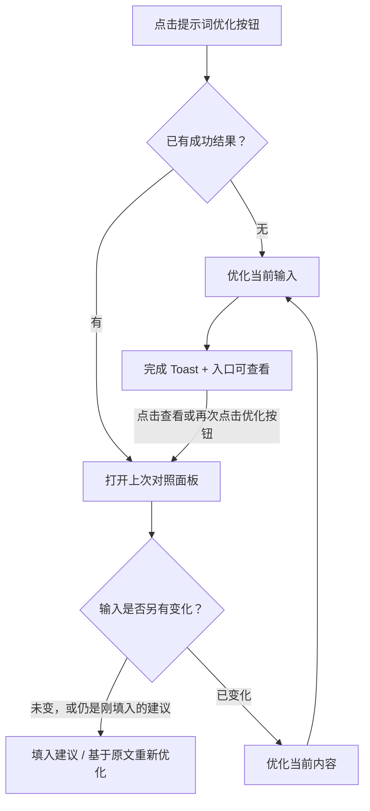

# 提示词优化 · 研发交接简版

> 优化只生成建议，点击「填入输入框」才修改 Prompt。已有结果时，入口负责查看；面板内的操作负责重新优化。

## 1. 节点与对话框：结果保留多久

| 用户操作 | 节点 | 对话框生成模式 |
| --- | --- | --- |
| 第一次点击优化 | 优化当前输入 | 优化当前输入 |
| 已优化成功，再点入口 | 打开上次对照面板 | 打开本轮上次对照面板 |
| 修改输入、模型、参考，或填入建议 | 保留结果，不自动再优化 | 保留结果，不自动再优化 |
| 发起生成成功受理 | 仍保留该节点结果 | 输入清空，开启新一轮；旧结果不带入 |
| 发送校验失败 | 保留结果 | 保留本轮输入与结果 |

**对话框以“任务受理、生成记录创建”为换轮时点，不等待媒体生成完成。** 此后取消或生成失败，都不恢复旧输入和旧优化结果。点击记录「重新编辑」只是将内容带回当前草稿，再按当前草稿规则优化。

切换会话、关闭面板不会开启新一轮，各会话独立保留。节点结果属于实际节点，不可因 ID 相同串到另一个节点。

## 2. 面板内的按钮规则

| 当前情况 | 显示与行为 |
| --- | --- |
| 输入未变 | 「填入输入框」应用右侧建议；「重新优化」基于本次原文生成新建议。 |
| 已填入，输入及建议均未另改 | 主按钮变为禁用的「已填入」；重新优化仍基于本次原文，避免不断扩写上次结果。 |
| 手动编辑右侧建议 | 恢复「填入输入框」，允许应用修改后的建议。 |
| 原输入、模型、参数或参考发生变化 | 主按钮改为「优化当前内容」，隐藏重复的「重新优化」。点击只发起优化，不直接覆盖输入。 |
| 手改建议尚未填入，又要重新优化 | 先内联确认是否替换手改内容；输入已变化时也需保护。已填入过的同一份手改建议不重复确认。 |
| 当前模型与旧结果不同 | 仅此时显示「上次优化使用：模型名」。 |

确认期间输入、建议或配置变化，旧确认失效。重试中及失败时保留上次成功的“原文 + 建议”，新成功后一起替换。

## 3. 界面与反馈

- **入口：** 处理中转圈、防重复点击，原输入仍可编辑。完成后保留柔和强调和未读点；查看后消除未读点。
- **完成 Toast：** 左侧绿色成功图标，文案「提示词已优化，可再次点击提示词优化按钮查看。」，右侧「查看」直接打开结果。约 7 秒消失，入口仍可查看；结果面板已打开时直接更新内容，不重复弹完成 Toast。
- **对照面板：** 左「优化前（原文）」只读，右「优化后」可编辑、可复制。桌面约 40% / 60% 分栏，窄屏切页签；长文分别滚动。标题 16px / 600、正文 14px，原文区轻底色。
- **引用：** 保留素材 key 与引用块，支持 hover 预览，不转成普通文字。
- **填入：** 只写 Prompt，不更换模型或参考、不自动发送。完成提示提供「撤销」；若已继续编辑或发送进入新一轮，旧撤销不可覆盖新内容。

图标复用 Lucide；浅深主题适配，减少动态效果时关闭入场动画。无内容且无旧结果时不能优化；有旧结果时空输入仍可查看，但不能发起处理。失效引用、目标失效时阻止相关处理或填入。

## 4. 优化配置

头部只保留方案下拉：**平台默认 / 当前模型的自定义方案 / + 自定义优化配置**。不展示所有模型的默认方案列表，不展示平台默认指令正文。

平台默认旁的 i 支持 hover、键盘聚焦及点击，提示为：

> 「平台默认」会随当前生成模型自动切换对应优化规则。

提示按内容宽度单行展示，窄屏空间不足才换行。

| 规则 | 说明 |
| --- | --- |
| 配置归属 | 按模型 ID 分组，不细分生成模式；节点和对话框共用。 |
| 切换模型 | 使用该模型保存的选择；未配置时使用平台默认。只影响下一次优化。 |
| 新建自定义 | 独立小面板填写名称、适配模型、指令（最多 2000 字符），初始为空。 |
| 保存与编辑 | 为当前模型新建后选用；为其他模型新建只保存，不切换模型或其已有选择。编辑现有方案时模型锁定。取消不保存。 |
| 请求隔离 | 发起时冻结输入、参考、模型与指令；之后改配置不影响进行中的请求或旧结果。 |

## 5. 实现边界与代码位置

当前仅支持 **Seedance 2.5 / 2.0 / 2.0 Fast**，节点及对话框生成模式共用；Agent 模式不展示。切到不支持的模型隐藏入口、关闭面板，但保留旧结果供切回查看。

当前为约 **1.8 秒本地模拟**，不调用真实 AI、不扣积分；自定义方案存本机，尚无账号云端同步。默认指令不展示于界面，但目前仍在前端模型目录中，不等同于服务端保密。

| 代码 | 职责 |
| --- | --- |
| `data/model-catalog.js` | 模型能力与平台默认指令 |
| `src/application/prompt-optimization-service.js` | 请求快照、处理状态、成功配对 |
| `src/application/prompt-optimization-preferences.js` | 按模型保存与选择方案 |
| `src/legacy-canvas/canvas-prompt-optimization-controller.js` | 节点 / 草稿归属、按钮规则、手改保护、填入与撤销 |
| `src/legacy-canvas/canvas-prompt-optimization-view.js`、`styles/canvas-prompt-optimization.css` | 对照面板、配置小面板、引用预览与反馈 |
| `app.js` | 提供输入适配，不继续堆叠优化业务逻辑 |

研发验收重点：旧结果可重开；填入后不递归扩写；手改未填入受保护；切模型配置与旧结果不混用；失败保留配对；发送失败不换轮、受理后取消不回退；旧回调与撤销不串节点或会话；引用身份不丢失。
